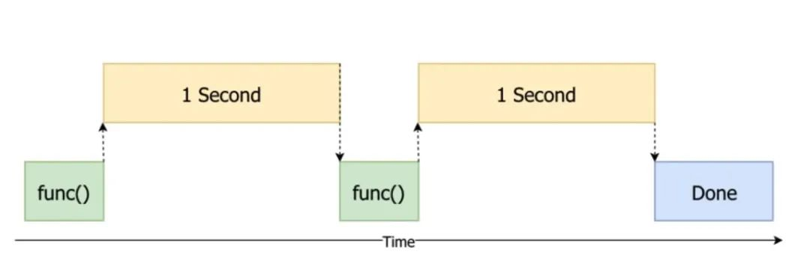
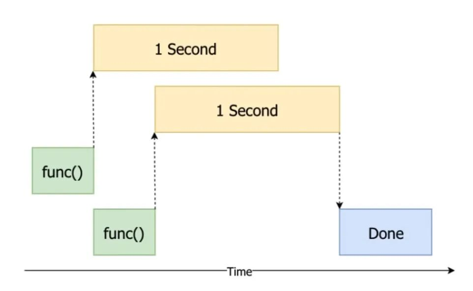
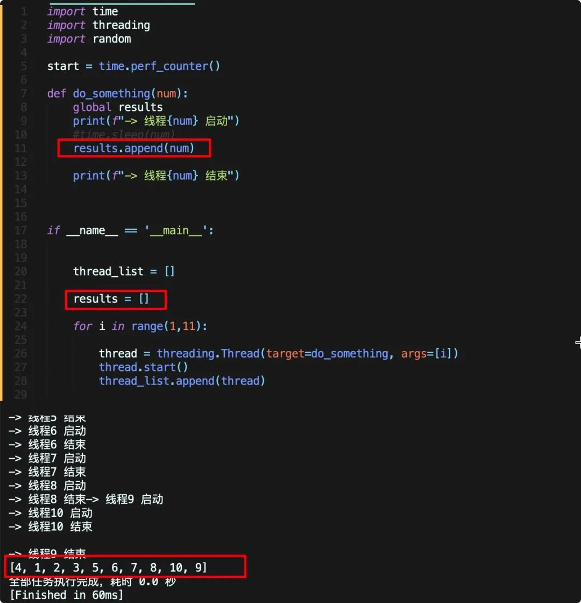
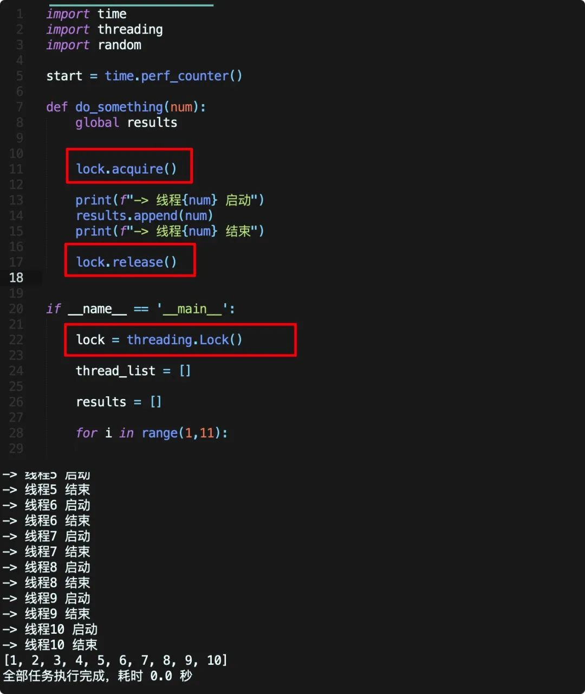
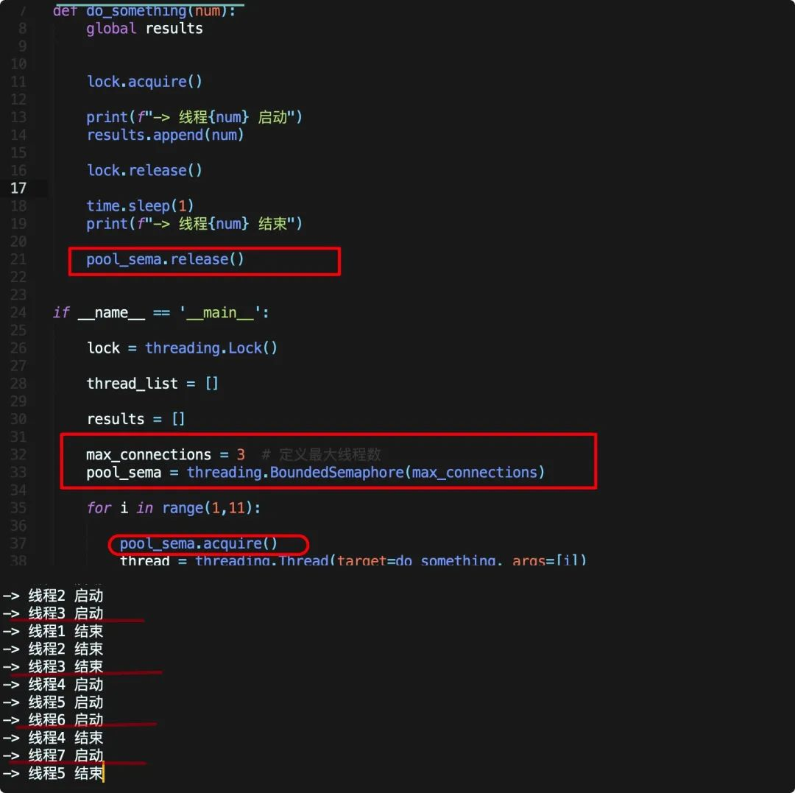

Python 多线程<br />在 Python 中，多线程最常见的一个场景就是爬虫，例如这样一个需求，有多个结构一样的页面需要爬取，例如下方的URL（豆瓣阿凡达影评，以10个为例）
```python
url_list = [
    'https://movie.douban.com/subject/1652587/reviews?sort=time&start=0',
    'https://movie.douban.com/subject/1652587/reviews?sort=time&start=20',
    'https://movie.douban.com/subject/1652587/reviews?sort=time&start=40',
    'https://movie.douban.com/subject/1652587/reviews?sort=time&start=60',
    'https://movie.douban.com/subject/1652587/reviews?sort=time&start=80',
    'https://movie.douban.com/subject/1652587/reviews?sort=time&start=100',
    'https://movie.douban.com/subject/1652587/reviews?sort=time&start=120',
    'https://movie.douban.com/subject/1652587/reviews?sort=time&start=140',
    'https://movie.douban.com/subject/1652587/reviews?sort=time&start=160',
    'https://movie.douban.com/subject/1652587/reviews?sort=time&start=180']
```
如果依次爬取，请求第一个页面——得到返回数据——解析数据——提取、存储数据——请求第二个页面，按照这样的思路，那么大量时间都会浪费在请求、返回数据上，如果在等待第一个页面返回数据时去请求第二个页面，就能有效的提高效率，多线程就可以实现这样的功能。<br />在Python中实现多线程的方法也很多，这里将基于 `threading` 模块一点一点介绍，注意本文不会太注重于多线程背后的技术概念（面试常问），仅希望用最少的话教会大家如何实现。当然会在最后介绍如何使用`threading`模块来解决上面的爬虫问题。
<a name="UfMsu"></a>
## `threading`基本使用
先从一个简单的例子开始，定义`do_something`函数，执行该函数需要消耗1秒
```python
import time

start = time.perf_counter()

def do_something():
    print("-> 线程启动")
    time.sleep(1)
    print("-> 线程结束")

do_something()

finish = time.perf_counter()

print(f"全部任务执行完成，耗时 {round(finish - start,2)} 秒")
```
上面的代码不难理解，执行`do_something`并计算耗时，结果很明显应该是1s
```
-> 线程启动
-> 线程结束
全部任务执行完成，耗时 1.01 秒
```
现在如果需要执行两次`do_something`，按照最基本的思路
```python
import time

start = time.perf_counter()


def do_something():
    print("-> 线程启动")
    time.sleep(1)
    print("-> 线程结束")


do_something()
do_something()

finish = time.perf_counter()

print(f"全部任务执行完成，耗时 {round(finish - start,2)} 秒")
```
执行上面代码结果也很容易猜到是2秒
```
-> 线程启动
-> 线程结束
-> 线程启动
-> 线程结束
全部任务执行完成，耗时 2.01 秒
```
这就是最常规的 同步 思路，在CPU执行第一个函数，也就是等待1s的时间内，什么也不干，等第一个函数执行完毕后再执行第二个函数<br /><br />很明显，这样让CPU干等着啥也不干并不是一个很好的选择，而多线程就是解决这一问题的方法之一，让CPU在等待某个任务完成时去执行更多的操作，将整个过程简化为下图流程，这样就能充分节省时间<br /><br />现在使用`threading`来通过多线程的方式实现上面的过程，非常简单，定义两个线程并依次启动即可👇
```python
import time
import threading

start = time.perf_counter()


def do_something():
    print("-> 线程启动")
    time.sleep(1)
    print("-> 线程结束")


thread1 = threading.Thread(target=do_something)
thread2 = threading.Thread(target=do_something)

thread1.start()
thread2.start()

finish = time.perf_counter()

print(f"全部任务执行完成，耗时 {round(finish - start,2)} 秒")
```
执行上面的代码，结果如下
```
-> 线程启动
-> 线程启动
全部任务执行完成，耗时 0.0 秒
-> 线程结束
-> 线程结束
```
可以看到，两个子线程确实同时启动，但是主线程并未等待两个子线程执行完毕就直接结束。<br />为了解决这个问题，可以使用`threading.join()`方法，意思是在子线程完成运行之前，这个子线程的父线程将一直被阻塞<br />换成人话就是让主线程挂起，等待所有子线程结束再执行，体现到代码上也很简单，只需要添加两行即可
```python
import time
import threading

start = time.perf_counter()


def do_something():
    print("-> 线程启动")
    time.sleep(1)
    print("-> 线程结束")


thread1 = threading.Thread(target=do_something)
thread2 = threading.Thread(target=do_something)

thread1.start() 
thread2.start()

thread1.join()
thread2.join()

finish = time.perf_counter()

print(f"全部任务执行完成，耗时 {round(finish - start,2)} 秒")
```
运行结果如下，全部代码在1秒内运行完毕
```
-> 线程启动
-> 线程启动
-> 线程结束
-> 线程结束
全部任务执行完成，耗时 1.01 秒
```
至此，就得到了第一个有效的多线程代码，也能大致明白`threading`的基本使用流程。
<a name="VxzKt"></a>
## 传递参数
现在来看看如何在多线程之间传递参数，升级代码：`do_something`函数来接受一个参数，控制他睡眠等待的时间
```python
def do_something(num):
    print(f"-> 线程{num} 启动，睡眠 {num} 秒")
    time.sleep(num)
    print(f"-> 线程{num} 结束")
```
在 `threading` 中，创建线程时可以使用 `args` 来传递参数，例如现在接收一个参数，则上一小节的代码可以如下修改
```python
import time
import threading

start = time.perf_counter()

def do_something(num):
    print(f"-> 线程{num} 启动，睡眠 {num} 秒")
    time.sleep(num)
    print(f"-> 线程{num} 结束")

thread1 = threading.Thread(target=do_something,args = [1])
thread2 = threading.Thread(target=do_something,args = [2])

thread1.start()
thread2.start()

thread1.join()
thread2.join()

finish = time.perf_counter()

print(f"全部任务执行完成，耗时 {round(finish - start,2)} 秒")
```
这段代码中，分别让两个线程等待1、2秒，运行结果显然应该是2秒
```
-> 线程1 启动，睡眠 1 秒
-> 线程2 启动，睡眠 2 秒
-> 线程1 结束
-> 线程2 结束
全部任务执行完成，耗时 2.01 秒
```
如果线程函数需要更多的参数，只需要依次向`args`中追加即可。
<a name="RIcrk"></a>
## 简化代码
上面的案例中，仅开启了两个线程，如果是更多个线程的话，再依次重复定义、启动就会显得十分繁琐，此时可以使用循环来处理。<br />例如开启10个线程，依次睡眠1-10秒，可以先创建一个 list 用于存储每个线程，接着利用循环依次创建线程，启动后追加到刚刚创建的 list 中，之后再依次等待每个线程执行完毕，代码如下
```python
import time
import threading

start = time.perf_counter()

def do_something(num):
    print(f"-> 线程{num} 启动，睡眠 {num} 秒")
    time.sleep(num)
    print(f"-> 线程{num} 结束")

thread_list = []

for i in range(1,11):

    thread = threading.Thread(target=do_something, args=[i])
    thread.start()
    thread_list.append(thread)

for t in thread_list:

    t.join()

finish = time.perf_counter()

print(f"全部任务执行完成，耗时 {round(finish - start,2)} 秒")
```
结果是显然的，虽然执行了十次`do_something`，每次用时1-10秒，但总耗时应该为10秒
```
-> 线程1 启动，睡眠 1 秒
-> 线程2 启动，睡眠 2 秒
-> 线程3 启动，睡眠 3 秒
-> 线程4 启动，睡眠 4 秒
-> 线程5 启动，睡眠 5 秒
-> 线程6 启动，睡眠 6 秒
-> 线程7 启动，睡眠 7 秒
-> 线程8 启动，睡眠 8 秒
-> 线程9 启动，睡眠 9 秒
-> 线程10 启动，睡眠 10 秒
-> 线程1 结束
-> 线程2 结束
-> 线程3 结束
-> 线程4 结束
-> 线程5 结束
-> 线程6 结束
-> 线程7 结束
-> 线程8 结束
-> 线程9 结束
-> 线程10 结束
全部任务执行完成，耗时 10.01 秒
```
<a name="v3C2B"></a>
## 共享变量锁的问题
现在应该已经了解 `threading` 最基本的用法，只需要将 `do_somthing` 函数进行修改即可，但是如果深入使用，还会有其他的问题出现，例如共享变量的问题，继续探讨。<br />多线程很常见的一个应用就是爬虫，回到开头的爬虫问题，如果希望爬取10个网页的评论，可能会先定一个空`dataframe`，然后使用多线程都往这个`dataframe`中写入数据，但由于多个线程同时操作这一个变量，可能会导致评论并不是按照顺序写入的。<br />例如第一个页面有10条评论，第一个线程写入了2条后，第二个线程将第二个页面的前两条写入，最终导致十个页面的评论是乱序存储！<br />把这个问题抽象出来，还是之前的代码，稍微修改一下<br /><br />先定义了一个空list，线程函数会将传入的数字添加到该list中，在未加锁的情况下，由于线程竞争，虽然线程是按照顺序开启，但是最终数字并不是按照顺序写入。<br />有没有办法解决呢？当然有，很自然的想法就是当第一个线程操作该变量时，其他线程等着，写完了再释放，这就是锁！<br />先看代码<br /><br />在上面的代码中，使用 `threding.Lock` 创建了一个线程锁，之后在线程函数操作 `result` 前，首先使用 `lock.acquire()` 加上锁，之后操作 `results` ，在修改完后使用 `lock.relese()` 释放，此时其他线程若想操作 `results` 则会阻塞，等该线程释放后才能拿走操作中，这样就保证了线程是“安全的”！<br />最基本的线程锁用法就如上面代码所示，定义锁 --> 上锁 --> 解锁，但是一定要注意，`lock.acquire()` 和 `lock.relese()`，如果加了锁但是没有释放，后面的线程将会全部阻塞！
<a name="UEqRO"></a>
## 限制线程数量
最后还有一个常见的问题，上面需要执行几次线程函数就开了几个线程，但是如果需要爬成千上万个网页，开这么多线程cpu一定不同意，代码也会在开启的线程达到一定数量后报错。<br />所以如何让程序只启动指定的线程数量，例如一次开五个线程，结束一个再添加一个，直到全部任务完成？<br />还是锁！在 `threading` 模块中有一个 `BoundedSemaphore`（信号量）类，可以给他一个初始的信号量（最大线程数），之后每次有线程获得信号量的时候（即 `acquire()` ）计数器－1，释放信号量时候(`release()`)计数器＋1，计数器为0的时候其它线程就被阻塞无法获得信号量。当计数器为设定好的上限的时候 `BoundedSemaphore` 就无法进行 `release()` 操作了。<br />体现到代码上则比较简单，还是基于上面的例子修改<br /><br />总共需要运行十次，定义最大线程数为3，并在线程启动前调用acquire方法增加一个计数，在线程最后释放。<br />此时程序一次只能启动三个线程，如图中所示，首先启动123，之后完成123，启动456，当第四个线程结束启动第七个线程······直到全部线程结束。<br />这里同时使用了上一节说的线程锁来保护变量，用 `BoundedSemaphore` 锁来控制最大线程数，在实际写代码时就需要小心检查锁是否正确释放，否则就会报错！
<a name="aKFMl"></a>
## 一个真实的多线程爬虫案例
至此，`threading` 模块最常见的用法就介绍完毕，现在回到本文一开始的问题，有多个（以十个为例）URL需要爬取，既然每个页面需要执行的操作一样，如果等待一个页面爬取完毕再爬第二页面就太浪费时间了。这时就可以仿照上面的思路去使用多线程加速。<br />只需要将上面的`do_something`函数修改为对也面的爬取操作，之后的创建启动线程操作不变即可，代码如下
```python
import time
import threading
import requests
import pandas as pd
from faker import Faker
from bs4 import BeautifulSoup


def craw_url(url):
    global df
    fake = Faker()
    headers = {'User-Agent': fake.user_agent()}
    r = requests.get(url, headers=headers)
    soup = BeautifulSoup(r.content, 'html.parser')
    review_list = soup.find_all(class_="main review-item")

    for i in range(len(review_list)):

        rank = review_list[i].select('span')[0].get('title')
        time1 = review_list[i].select('span')[1].get('content')
        title = review_list[i].select('h2>a')[0].text
        df = df.append({'时间': time1,
                        '评分': rank,
                        '标题': title, }, ignore_index=True)

    print("-> 爬取完成")


if __name__ == '__main__':

    start = time.perf_counter()
    df = pd.DataFrame(columns=['时间', '评分', '标题'])

    url_list = [
        'https://movie.douban.com/subject/1652587/reviews?sort=time&start=0',
        'https://movie.douban.com/subject/1652587/reviews?sort=time&start=20',
        'https://movie.douban.com/subject/1652587/reviews?sort=time&start=40',
        'https://movie.douban.com/subject/1652587/reviews?sort=time&start=60',
        'https://movie.douban.com/subject/1652587/reviews?sort=time&start=80',
        'https://movie.douban.com/subject/1652587/reviews?sort=time&start=100',
        'https://movie.douban.com/subject/1652587/reviews?sort=time&start=120',
        'https://movie.douban.com/subject/1652587/reviews?sort=time&start=140',
        'https://movie.douban.com/subject/1652587/reviews?sort=time&start=160',
        'https://movie.douban.com/subject/1652587/reviews?sort=time&start=180']
    thread_list = []
    for i in url_list:

        thread = threading.Thread(target=craw_url, args=[i])
        thread.start()
        thread_list.append(thread)

    for t in thread_list:

        t.join()

    finish = time.perf_counter()
    
    print(f"全部任务执行完成，耗时 {round(finish - start,2)} 秒")
```
执行这段代码，差不多仅用了1秒就将全部内容爬取并存储到 `dataframe` 中，比同步的代码块了近十倍！如果感兴趣的话可以自己尝试一下。<br />当然有关 Python 多线程还有很多饱受诟病的争议（GIL），多线程的实现方法也远不止 `threading` 模块，例如更常见的写法是通过 `concurrent.futures` 模块以及多进程、协程。
