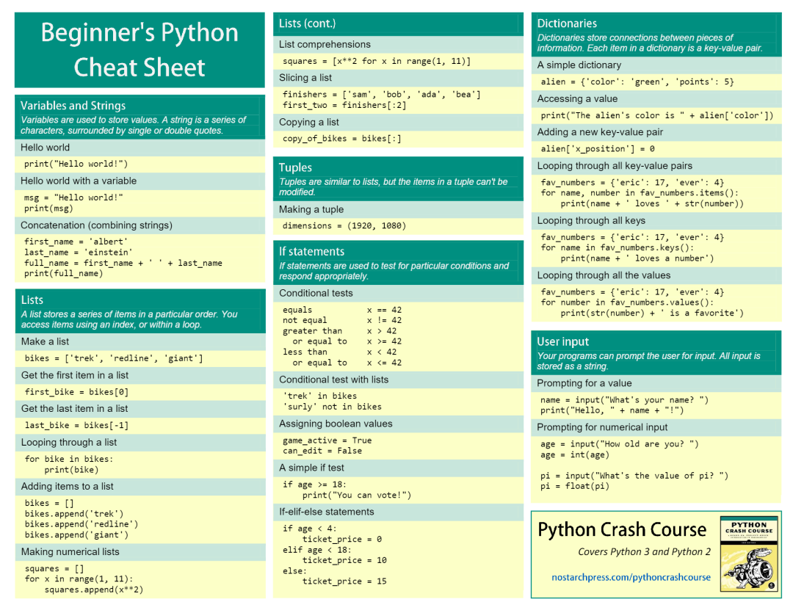

Python

## Python 基础

### Python basics
该速查表包含了所有的 Python 基本知识，从变量数据类型到列表字符串，从环境安装到常用库的使用，可以说面面俱到。 

### Beginner's Python
这个速查表也是为新学者精心准备的，而且更加注重实例。可以说跟着该速查表学习，掌握 Python 的基本用法是没什么问题的。 

### memento Python3
该速查表是专门针对 Python3 的知识总结，可以说是非常全面了。包含基本数据类型的使用，逻辑和数学运算，流程控制，文件IO等等  

## 数据科学

### Pandas basics
Pandas 作为数据科学领域最为著名的类库，其基础知识也是非常多的，该速查表整理总结了绝大多数常用的 Pandas 基础知识，太贴心了。 

### Pandas advance
学过 Pandas 基础之后，当然需要继续了解 Pandas 高阶操作了。该速查表涵盖了多种 Pandas 高级操作，包括透视表，分组，连接等等。 

### Numpy
Numpy 又是数据科学领域的另一大神器，而且也是众多 Python 类库的基础，所以掌握该库也是必须的。  数据导入 在数据科学当中，数据当然是基础了，那么导入数据也就是基础中的基础。 

## 工具

### Jupyter
Jupyter 作为 Python 领域非常著名的编程工具，具有所见即所得的强大效果，是众多 Python 从业者的心头好。 

## 附件
[Beginners-Python-Cheat-Sheet.pdf](https://www.yuque.com/attachments/yuque/0/2022/pdf/396745/1671412630350-f8763fb9-1c3b-4893-9cc2-b2775c1d0b33.pdf?_lake_card=%7B%22src%22%3A%22https%3A%2F%2Fwww.yuque.com%2Fattachments%2Fyuque%2F0%2F2022%2Fpdf%2F396745%2F1671412630350-f8763fb9-1c3b-4893-9cc2-b2775c1d0b33.pdf%22%2C%22name%22%3A%22Beginners-Python-Cheat-Sheet.pdf%22%2C%22size%22%3A1785862%2C%22type%22%3A%22application%2Fpdf%22%2C%22ext%22%3A%22pdf%22%2C%22source%22%3A%22%22%2C%22status%22%3A%22done%22%2C%22download%22%3Atrue%2C%22taskId%22%3A%22u647dc4ab-6bb4-43f9-9d2e-755481f3902%22%2C%22taskType%22%3A%22upload%22%2C%22__spacing%22%3A%22both%22%2C%22id%22%3A%22u6c7968a5%22%2C%22margin%22%3A%7B%22top%22%3Atrue%2C%22bottom%22%3Atrue%7D%2C%22card%22%3A%22file%22%7D) [import_data.pdf](https://www.yuque.com/attachments/yuque/0/2022/pdf/396745/1671412630321-4fde6c60-a68f-4f4e-b2d5-ec8bc035aee4.pdf?_lake_card=%7B%22src%22%3A%22https%3A%2F%2Fwww.yuque.com%2Fattachments%2Fyuque%2F0%2F2022%2Fpdf%2F396745%2F1671412630321-4fde6c60-a68f-4f4e-b2d5-ec8bc035aee4.pdf%22%2C%22name%22%3A%22import_data.pdf%22%2C%22size%22%3A138489%2C%22type%22%3A%22application%2Fpdf%22%2C%22ext%22%3A%22pdf%22%2C%22source%22%3A%22%22%2C%22status%22%3A%22done%22%2C%22download%22%3Atrue%2C%22taskId%22%3A%22u88eefb2b-7053-4246-b8bc-0b8b50cd6eb%22%2C%22taskType%22%3A%22upload%22%2C%22__spacing%22%3A%22both%22%2C%22id%22%3A%22u0a85cb11%22%2C%22margin%22%3A%7B%22top%22%3Atrue%2C%22bottom%22%3Atrue%7D%2C%22card%22%3A%22file%22%7D) [jupyter.pdf](https://www.yuque.com/attachments/yuque/0/2022/pdf/396745/1671412630329-37f465b5-b083-4813-964e-b375933c8210.pdf?_lake_card=%7B%22src%22%3A%22https%3A%2F%2Fwww.yuque.com%2Fattachments%2Fyuque%2F0%2F2022%2Fpdf%2F396745%2F1671412630329-37f465b5-b083-4813-964e-b375933c8210.pdf%22%2C%22name%22%3A%22jupyter.pdf%22%2C%22size%22%3A804299%2C%22type%22%3A%22application%2Fpdf%22%2C%22ext%22%3A%22pdf%22%2C%22source%22%3A%22%22%2C%22status%22%3A%22done%22%2C%22download%22%3Atrue%2C%22taskId%22%3A%22u5fdf0c41-c4e6-4071-853a-931a1e62925%22%2C%22taskType%22%3A%22upload%22%2C%22__spacing%22%3A%22both%22%2C%22id%22%3A%22u4644164d%22%2C%22margin%22%3A%7B%22top%22%3Atrue%2C%22bottom%22%3Atrue%7D%2C%22card%22%3A%22file%22%7D) [mementopython3-english.pdf](https://www.yuque.com/attachments/yuque/0/2022/pdf/396745/1671412630333-048c3b12-f0ea-49a9-93bc-a361d575c079.pdf?_lake_card=%7B%22src%22%3A%22https%3A%2F%2Fwww.yuque.com%2Fattachments%2Fyuque%2F0%2F2022%2Fpdf%2F396745%2F1671412630333-048c3b12-f0ea-49a9-93bc-a361d575c079.pdf%22%2C%22name%22%3A%22mementopython3-english.pdf%22%2C%22size%22%3A248523%2C%22type%22%3A%22application%2Fpdf%22%2C%22ext%22%3A%22pdf%22%2C%22source%22%3A%22%22%2C%22status%22%3A%22done%22%2C%22download%22%3Atrue%2C%22taskId%22%3A%22u6aabd2e1-d43e-442e-868c-35d9d3679a3%22%2C%22taskType%22%3A%22upload%22%2C%22__spacing%22%3A%22both%22%2C%22id%22%3A%22ud871ed8f%22%2C%22margin%22%3A%7B%22top%22%3Atrue%2C%22bottom%22%3Atrue%7D%2C%22card%22%3A%22file%22%7D) [numpy_basics.pdf](https://www.yuque.com/attachments/yuque/0/2022/pdf/396745/1671412630364-db8139b5-ef43-4824-ba05-64f2a9ab44e2.pdf?_lake_card=%7B%22src%22%3A%22https%3A%2F%2Fwww.yuque.com%2Fattachments%2Fyuque%2F0%2F2022%2Fpdf%2F396745%2F1671412630364-db8139b5-ef43-4824-ba05-64f2a9ab44e2.pdf%22%2C%22name%22%3A%22numpy_basics.pdf%22%2C%22size%22%3A665028%2C%22type%22%3A%22application%2Fpdf%22%2C%22ext%22%3A%22pdf%22%2C%22source%22%3A%22%22%2C%22status%22%3A%22done%22%2C%22download%22%3Atrue%2C%22taskId%22%3A%22u43306255-644c-45b9-9eed-e3b0a321c02%22%2C%22taskType%22%3A%22upload%22%2C%22__spacing%22%3A%22both%22%2C%22id%22%3A%22u5379c7a4%22%2C%22margin%22%3A%7B%22top%22%3Atrue%2C%22bottom%22%3Atrue%7D%2C%22card%22%3A%22file%22%7D) [pandas_advance.pdf](https://www.yuque.com/attachments/yuque/0/2022/pdf/396745/1671412630688-254d7df2-e0f1-480b-a4ff-88f78156855d.pdf?_lake_card=%7B%22src%22%3A%22https%3A%2F%2Fwww.yuque.com%2Fattachments%2Fyuque%2F0%2F2022%2Fpdf%2F396745%2F1671412630688-254d7df2-e0f1-480b-a4ff-88f78156855d.pdf%22%2C%22name%22%3A%22pandas_advance.pdf%22%2C%22size%22%3A190372%2C%22type%22%3A%22application%2Fpdf%22%2C%22ext%22%3A%22pdf%22%2C%22source%22%3A%22%22%2C%22status%22%3A%22done%22%2C%22download%22%3Atrue%2C%22taskId%22%3A%22u1ee47495-c40a-493e-978a-524cdb89ebe%22%2C%22taskType%22%3A%22upload%22%2C%22__spacing%22%3A%22both%22%2C%22id%22%3A%22uc26e2e8a%22%2C%22margin%22%3A%7B%22top%22%3Atrue%2C%22bottom%22%3Atrue%7D%2C%22card%22%3A%22file%22%7D) [pandas_basics.pdf](https://www.yuque.com/attachments/yuque/0/2022/pdf/396745/1671412630736-524f5783-c121-4d7e-b196-0efc8cafa319.pdf?_lake_card=%7B%22src%22%3A%22https%3A%2F%2Fwww.yuque.com%2Fattachments%2Fyuque%2F0%2F2022%2Fpdf%2F396745%2F1671412630736-524f5783-c121-4d7e-b196-0efc8cafa319.pdf%22%2C%22name%22%3A%22pandas_basics.pdf%22%2C%22size%22%3A699934%2C%22type%22%3A%22application%2Fpdf%22%2C%22ext%22%3A%22pdf%22%2C%22source%22%3A%22%22%2C%22status%22%3A%22done%22%2C%22download%22%3Atrue%2C%22taskId%22%3A%22ua9f34eac-d83b-4ab7-8c29-5bde57f39ca%22%2C%22taskType%22%3A%22upload%22%2C%22__spacing%22%3A%22both%22%2C%22id%22%3A%22ua886705b%22%2C%22margin%22%3A%7B%22top%22%3Atrue%2C%22bottom%22%3Atrue%7D%2C%22card%22%3A%22file%22%7D) [python_basics.pdf](https://www.yuque.com/attachments/yuque/0/2022/pdf/396745/1671412630752-563769c3-b34a-4f8e-9ad0-16de25ee4b93.pdf?_lake_card=%7B%22src%22%3A%22https%3A%2F%2Fwww.yuque.com%2Fattachments%2Fyuque%2F0%2F2022%2Fpdf%2F396745%2F1671412630752-563769c3-b34a-4f8e-9ad0-16de25ee4b93.pdf%22%2C%22name%22%3A%22python_basics.pdf%22%2C%22size%22%3A217418%2C%22type%22%3A%22application%2Fpdf%22%2C%22ext%22%3A%22pdf%22%2C%22source%22%3A%22%22%2C%22status%22%3A%22done%22%2C%22download%22%3Atrue%2C%22taskId%22%3A%22u96cad583-97c2-495e-846f-737d9be2df2%22%2C%22taskType%22%3A%22upload%22%2C%22__spacing%22%3A%22both%22%2C%22id%22%3A%22uda8d5a23%22%2C%22margin%22%3A%7B%22top%22%3Atrue%2C%22bottom%22%3Atrue%7D%2C%22card%22%3A%22file%22%7D)
