Python

## 数据科学

### 数据科学理论基础
该速查表包含了数据科学的相关理论基础，从概率论到统计学都很好的做了整理 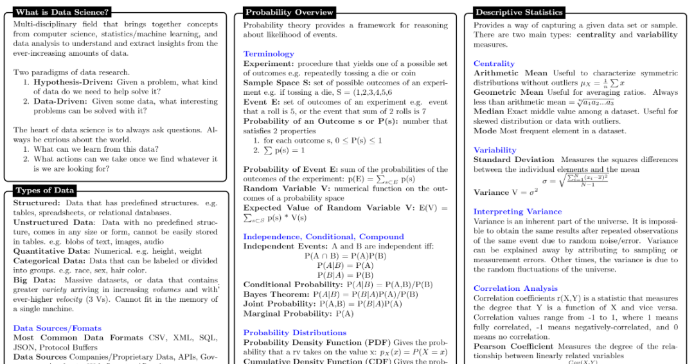

### Python 数据科学流程
这个速查表囊括了通过 Python 语言进行数据科学研究时的相关流程，还是非常全面的。 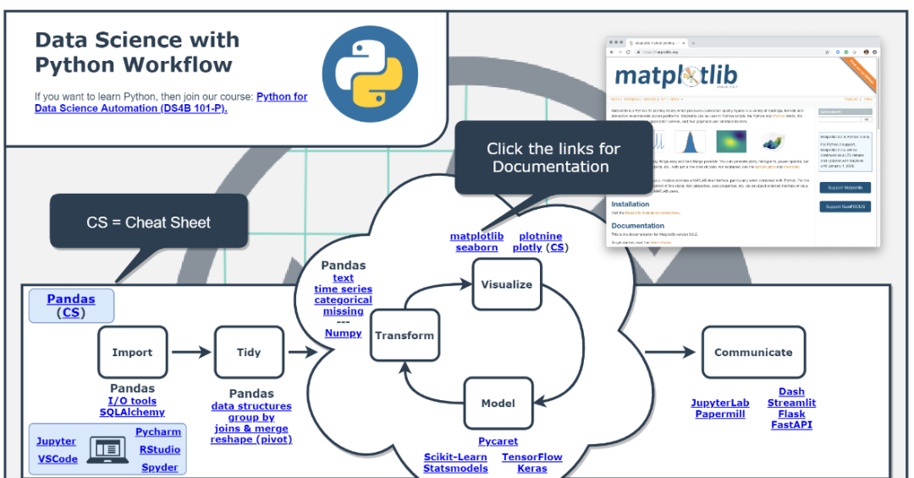 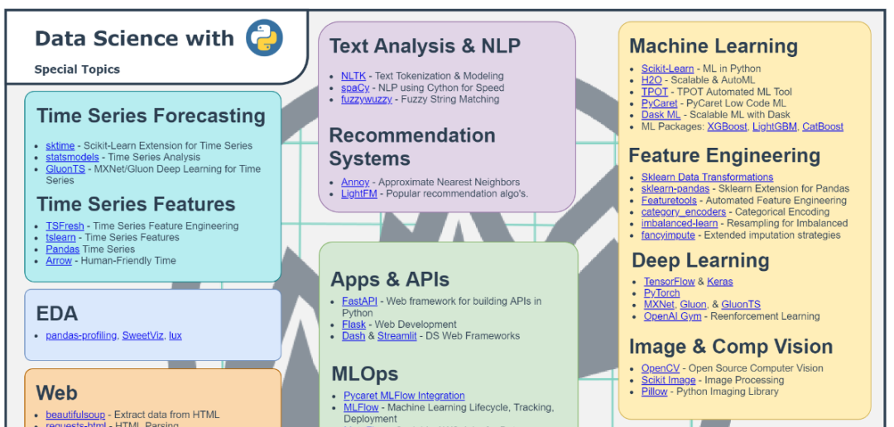

## 大数据

### pyspark rdd 基础
spark 基本已经成为了当今大数据研究的标准工具，而 pyspark 则是 spark 的 Python 实现，掌握该工具是十分必要的。 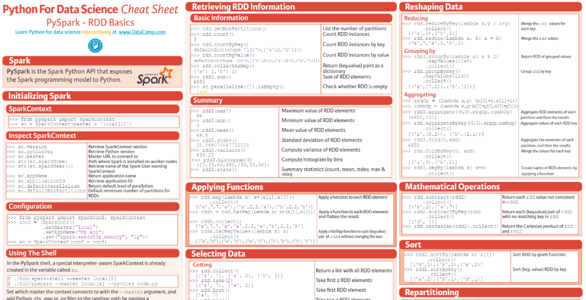

### pyspark SQL 基础
提到 spark，就离不开 SQL，该速查表整理了全面的 spark SQL 相关的知识。 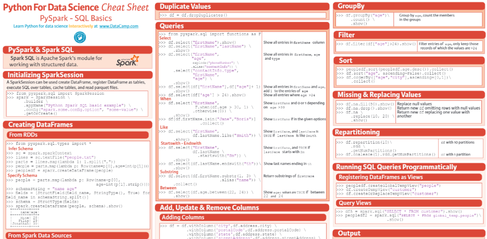

## 机器学习&深度学习

### Scikit-Learn
Scikit-Learn 是 Python 机器学习领域最为著名的工具库，可以说研究机器学习的人没有能够跳过 Scikit-Learn 工具的。 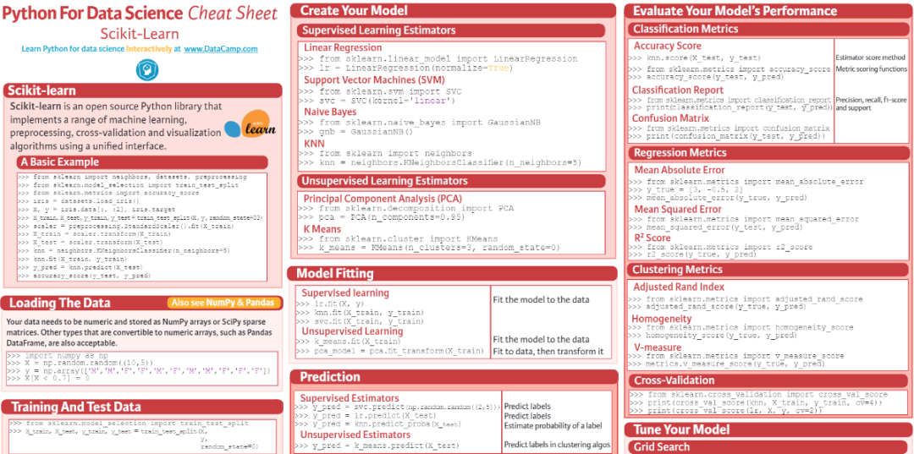

### 深度学习基础
深度学习也就是神经网络，虽然其结果是不可解释的，但是其理论基础还是很扎实的。 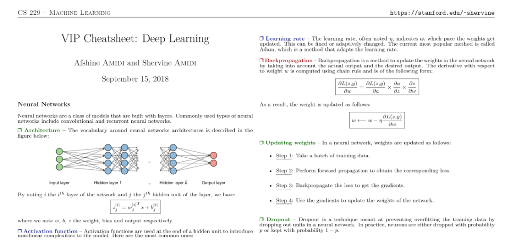

### keras
在深度学习领域，keras 也是如雷贯耳的存在，可以通过该速查表一窥 keras 工具的全貌。 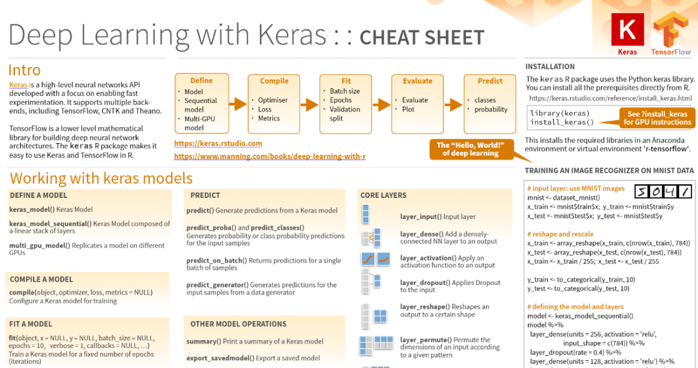

## 数据可视化

### matplotlib
说起 Python 的数据可视化，那 matplotlib 一定是绕不开的。 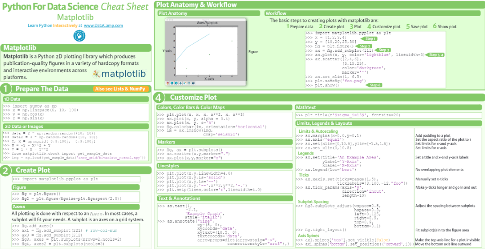

### seaborn
seaborn 可以说是 matplotlib 的高级封装，它使得 matplotlib 的众多 API 更加人性化。 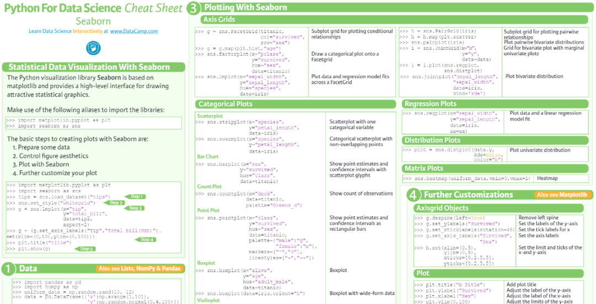

### bokeh
bokeh 是 Python 的另一个可视化神库，其强大的交互能力，迷倒了众多可视化爱好者。 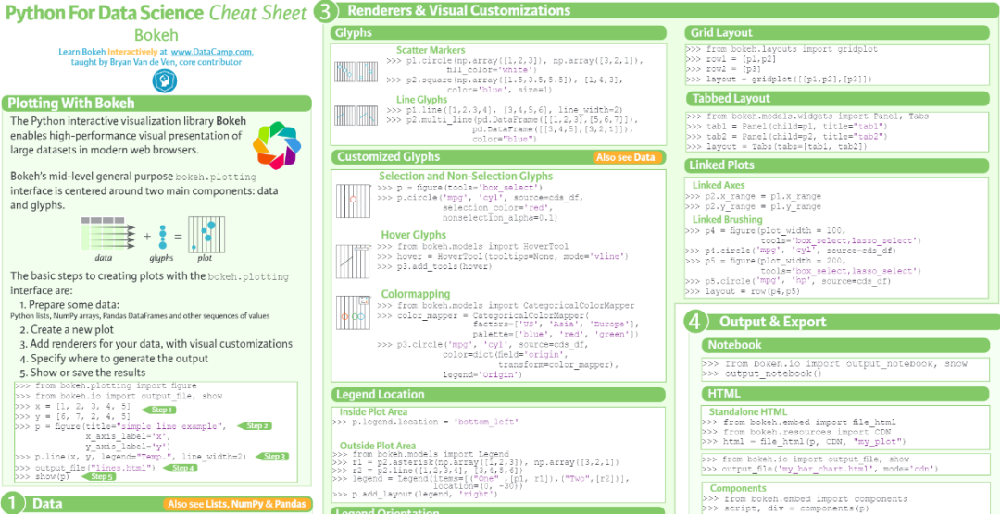

## 附件
[bokeh.pdf](https://www.yuque.com/attachments/yuque/0/2023/pdf/396745/1673225711399-022c0b1f-6292-4f23-82de-b41e1b7296f3.pdf?_lake_card=%7B%22src%22%3A%22https%3A%2F%2Fwww.yuque.com%2Fattachments%2Fyuque%2F0%2F2023%2Fpdf%2F396745%2F1673225711399-022c0b1f-6292-4f23-82de-b41e1b7296f3.pdf%22%2C%22name%22%3A%22bokeh.pdf%22%2C%22size%22%3A692452%2C%22type%22%3A%22application%2Fpdf%22%2C%22ext%22%3A%22pdf%22%2C%22source%22%3A%22%22%2C%22status%22%3A%22done%22%2C%22download%22%3Atrue%2C%22taskId%22%3A%22u06119a6d-a160-46af-b958-22f5b4a223e%22%2C%22taskType%22%3A%22upload%22%2C%22__spacing%22%3A%22both%22%2C%22id%22%3A%22ue205b5e1%22%2C%22margin%22%3A%7B%22top%22%3Atrue%2C%22bottom%22%3Atrue%7D%2C%22card%22%3A%22file%22%7D) [cheatsheet-deep-learning.pdf](https://www.yuque.com/attachments/yuque/0/2023/pdf/396745/1673225711403-718c9266-d682-46ec-90cb-21ec02b3f03c.pdf?_lake_card=%7B%22src%22%3A%22https%3A%2F%2Fwww.yuque.com%2Fattachments%2Fyuque%2F0%2F2023%2Fpdf%2F396745%2F1673225711403-718c9266-d682-46ec-90cb-21ec02b3f03c.pdf%22%2C%22name%22%3A%22cheatsheet-deep-learning.pdf%22%2C%22size%22%3A342937%2C%22type%22%3A%22application%2Fpdf%22%2C%22ext%22%3A%22pdf%22%2C%22source%22%3A%22%22%2C%22status%22%3A%22done%22%2C%22download%22%3Atrue%2C%22taskId%22%3A%22ufba7712f-def4-4561-8168-5de5bbe894c%22%2C%22taskType%22%3A%22upload%22%2C%22__spacing%22%3A%22both%22%2C%22id%22%3A%22uedd010b2%22%2C%22margin%22%3A%7B%22top%22%3Atrue%2C%22bottom%22%3Atrue%7D%2C%22card%22%3A%22file%22%7D) [Data_Science_With_Python_Workflow.pdf](https://www.yuque.com/attachments/yuque/0/2023/pdf/396745/1673225712475-fb941c3b-c1fb-4f5b-8589-3d20239c3fec.pdf?_lake_card=%7B%22src%22%3A%22https%3A%2F%2Fwww.yuque.com%2Fattachments%2Fyuque%2F0%2F2023%2Fpdf%2F396745%2F1673225712475-fb941c3b-c1fb-4f5b-8589-3d20239c3fec.pdf%22%2C%22name%22%3A%22Data_Science_With_Python_Workflow.pdf%22%2C%22size%22%3A1577108%2C%22type%22%3A%22application%2Fpdf%22%2C%22ext%22%3A%22pdf%22%2C%22source%22%3A%22%22%2C%22status%22%3A%22done%22%2C%22download%22%3Atrue%2C%22taskId%22%3A%22u8a24cdf7-7ca6-41a5-94ad-27456c804b5%22%2C%22taskType%22%3A%22upload%22%2C%22__spacing%22%3A%22both%22%2C%22id%22%3A%22ub381db00%22%2C%22margin%22%3A%7B%22top%22%3Atrue%2C%22bottom%22%3Atrue%7D%2C%22card%22%3A%22file%22%7D) [data-science-cheatsheet.pdf](https://www.yuque.com/attachments/yuque/0/2023/pdf/396745/1673225711425-72018227-fa96-47b2-a569-8eaeec85b741.pdf?_lake_card=%7B%22src%22%3A%22https%3A%2F%2Fwww.yuque.com%2Fattachments%2Fyuque%2F0%2F2023%2Fpdf%2F396745%2F1673225711425-72018227-fa96-47b2-a569-8eaeec85b741.pdf%22%2C%22name%22%3A%22data-science-cheatsheet.pdf%22%2C%22size%22%3A1106778%2C%22type%22%3A%22application%2Fpdf%22%2C%22ext%22%3A%22pdf%22%2C%22source%22%3A%22%22%2C%22status%22%3A%22done%22%2C%22download%22%3Atrue%2C%22taskId%22%3A%22u9691cafe-669d-4e41-ab64-937aba03ae8%22%2C%22taskType%22%3A%22upload%22%2C%22__spacing%22%3A%22both%22%2C%22id%22%3A%22u6f13b18f%22%2C%22margin%22%3A%7B%22top%22%3Atrue%2C%22bottom%22%3Atrue%7D%2C%22card%22%3A%22file%22%7D) [keras.pdf](https://www.yuque.com/attachments/yuque/0/2023/pdf/396745/1673225711443-a179c95c-ffc8-4c2a-8628-e5962c566fb6.pdf?_lake_card=%7B%22src%22%3A%22https%3A%2F%2Fwww.yuque.com%2Fattachments%2Fyuque%2F0%2F2023%2Fpdf%2F396745%2F1673225711443-a179c95c-ffc8-4c2a-8628-e5962c566fb6.pdf%22%2C%22name%22%3A%22keras.pdf%22%2C%22size%22%3A566593%2C%22type%22%3A%22application%2Fpdf%22%2C%22ext%22%3A%22pdf%22%2C%22source%22%3A%22%22%2C%22status%22%3A%22done%22%2C%22download%22%3Atrue%2C%22taskId%22%3A%22ue5ba3476-c0fe-4058-8c9d-f33ae09ccd9%22%2C%22taskType%22%3A%22upload%22%2C%22__spacing%22%3A%22both%22%2C%22id%22%3A%22u497686b8%22%2C%22margin%22%3A%7B%22top%22%3Atrue%2C%22bottom%22%3Atrue%7D%2C%22card%22%3A%22file%22%7D) [matplotlib.pdf](https://www.yuque.com/attachments/yuque/0/2023/pdf/396745/1673225711819-3ec99e78-4c59-4cea-9515-f7b5e845cd40.pdf?_lake_card=%7B%22src%22%3A%22https%3A%2F%2Fwww.yuque.com%2Fattachments%2Fyuque%2F0%2F2023%2Fpdf%2F396745%2F1673225711819-3ec99e78-4c59-4cea-9515-f7b5e845cd40.pdf%22%2C%22name%22%3A%22matplotlib.pdf%22%2C%22size%22%3A230092%2C%22type%22%3A%22application%2Fpdf%22%2C%22ext%22%3A%22pdf%22%2C%22source%22%3A%22%22%2C%22status%22%3A%22done%22%2C%22download%22%3Atrue%2C%22taskId%22%3A%22ubb878c74-02ed-473b-a53f-c7fd65a69c1%22%2C%22taskType%22%3A%22upload%22%2C%22__spacing%22%3A%22both%22%2C%22id%22%3A%22uef08d5cb%22%2C%22margin%22%3A%7B%22top%22%3Atrue%2C%22bottom%22%3Atrue%7D%2C%22card%22%3A%22file%22%7D) [pyspark_df.pdf](https://www.yuque.com/attachments/yuque/0/2023/pdf/396745/1673225711903-73350fc5-3c44-480f-8cdd-891d7f78599e.pdf?_lake_card=%7B%22src%22%3A%22https%3A%2F%2Fwww.yuque.com%2Fattachments%2Fyuque%2F0%2F2023%2Fpdf%2F396745%2F1673225711903-73350fc5-3c44-480f-8cdd-891d7f78599e.pdf%22%2C%22name%22%3A%22pyspark_df.pdf%22%2C%22size%22%3A694538%2C%22type%22%3A%22application%2Fpdf%22%2C%22ext%22%3A%22pdf%22%2C%22source%22%3A%22%22%2C%22status%22%3A%22done%22%2C%22download%22%3Atrue%2C%22taskId%22%3A%22ue5d959fa-177b-449d-a6f8-68b444a0e30%22%2C%22taskType%22%3A%22upload%22%2C%22__spacing%22%3A%22both%22%2C%22id%22%3A%22uc8af8bcf%22%2C%22margin%22%3A%7B%22top%22%3Atrue%2C%22bottom%22%3Atrue%7D%2C%22card%22%3A%22file%22%7D) [pyspark_rdd.pdf](https://www.yuque.com/attachments/yuque/0/2023/pdf/396745/1673225711935-91677059-1fb3-4630-b38b-35a68ece275e.pdf?_lake_card=%7B%22src%22%3A%22https%3A%2F%2Fwww.yuque.com%2Fattachments%2Fyuque%2F0%2F2023%2Fpdf%2F396745%2F1673225711935-91677059-1fb3-4630-b38b-35a68ece275e.pdf%22%2C%22name%22%3A%22pyspark_rdd.pdf%22%2C%22size%22%3A676800%2C%22type%22%3A%22application%2Fpdf%22%2C%22ext%22%3A%22pdf%22%2C%22source%22%3A%22%22%2C%22status%22%3A%22done%22%2C%22download%22%3Atrue%2C%22taskId%22%3A%22ubdd265e5-656c-48f7-80a9-cd8b9389e44%22%2C%22taskType%22%3A%22upload%22%2C%22__spacing%22%3A%22both%22%2C%22id%22%3A%22u8a44542e%22%2C%22margin%22%3A%7B%22top%22%3Atrue%2C%22bottom%22%3Atrue%7D%2C%22card%22%3A%22file%22%7D) [scikit-learn.pdf](https://www.yuque.com/attachments/yuque/0/2023/pdf/396745/1673225711931-b7ceacf0-fbad-455a-8e26-e2e6716097fb.pdf?_lake_card=%7B%22src%22%3A%22https%3A%2F%2Fwww.yuque.com%2Fattachments%2Fyuque%2F0%2F2023%2Fpdf%2F396745%2F1673225711931-b7ceacf0-fbad-455a-8e26-e2e6716097fb.pdf%22%2C%22name%22%3A%22scikit-learn.pdf%22%2C%22size%22%3A149176%2C%22type%22%3A%22application%2Fpdf%22%2C%22ext%22%3A%22pdf%22%2C%22source%22%3A%22%22%2C%22status%22%3A%22done%22%2C%22download%22%3Atrue%2C%22taskId%22%3A%22u3fb8cdab-8f16-43a1-be24-8d046775608%22%2C%22taskType%22%3A%22upload%22%2C%22__spacing%22%3A%22both%22%2C%22id%22%3A%22u736650f5%22%2C%22margin%22%3A%7B%22top%22%3Atrue%2C%22bottom%22%3Atrue%7D%2C%22card%22%3A%22file%22%7D) [seaborn.pdf](https://www.yuque.com/attachments/yuque/0/2023/pdf/396745/1673225712297-5505cb81-d8b3-4aea-b26d-61686e118efa.pdf?_lake_card=%7B%22src%22%3A%22https%3A%2F%2Fwww.yuque.com%2Fattachments%2Fyuque%2F0%2F2023%2Fpdf%2F396745%2F1673225712297-5505cb81-d8b3-4aea-b26d-61686e118efa.pdf%22%2C%22name%22%3A%22seaborn.pdf%22%2C%22size%22%3A638942%2C%22type%22%3A%22application%2Fpdf%22%2C%22ext%22%3A%22pdf%22%2C%22source%22%3A%22%22%2C%22status%22%3A%22done%22%2C%22download%22%3Atrue%2C%22taskId%22%3A%22ufea07cc9-9716-4c05-aef8-70ba5929b27%22%2C%22taskType%22%3A%22upload%22%2C%22__spacing%22%3A%22both%22%2C%22id%22%3A%22u4416d448%22%2C%22margin%22%3A%7B%22top%22%3Atrue%2C%22bottom%22%3Atrue%7D%2C%22card%22%3A%22file%22%7D)

### 打包下载
[速查表.zip](https://www.yuque.com/attachments/yuque/0/2023/zip/396745/1673225797013-2ae1329a-ba0d-46f4-828f-f39354b9d817.zip?_lake_card=%7B%22src%22%3A%22https%3A%2F%2Fwww.yuque.com%2Fattachments%2Fyuque%2F0%2F2023%2Fzip%2F396745%2F1673225797013-2ae1329a-ba0d-46f4-828f-f39354b9d817.zip%22%2C%22name%22%3A%22%E9%80%9F%E6%9F%A5%E8%A1%A8.zip%22%2C%22size%22%3A6140335%2C%22type%22%3A%22application%2Fx-zip-compressed%22%2C%22ext%22%3A%22zip%22%2C%22source%22%3A%22%22%2C%22status%22%3A%22done%22%2C%22download%22%3Atrue%2C%22taskId%22%3A%22u53934f27-62e6-4ef1-9646-cad5cca2588%22%2C%22taskType%22%3A%22upload%22%2C%22__spacing%22%3A%22both%22%2C%22id%22%3A%22u87f97878%22%2C%22margin%22%3A%7B%22top%22%3Atrue%2C%22bottom%22%3Atrue%7D%2C%22card%22%3A%22file%22%7D)
