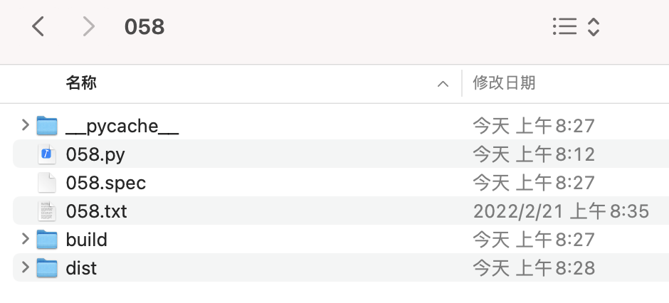
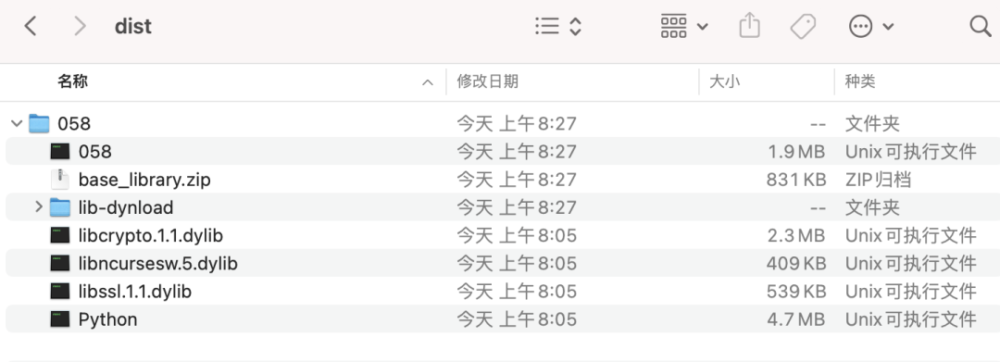
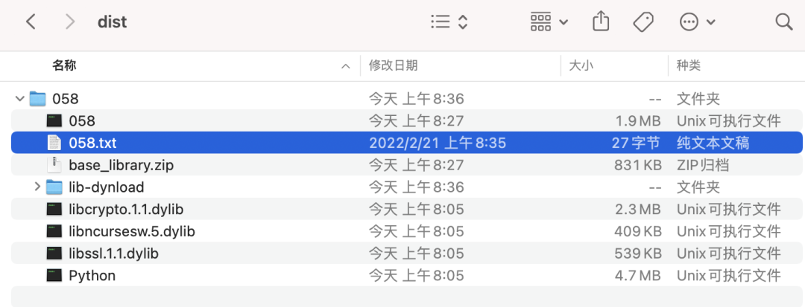
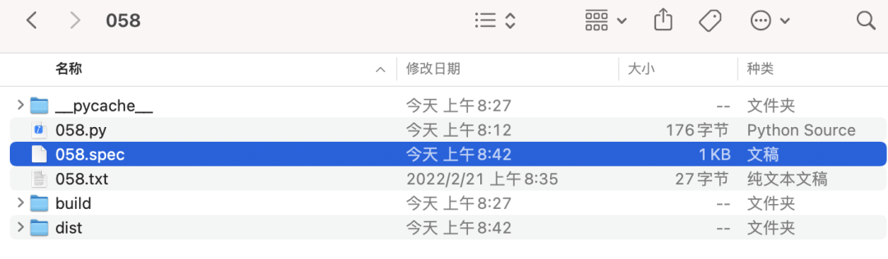

# Python Pyinstaller

[PyInstaller官方文档](https://pyinstaller.org/en/stable/requirements.html)

## Pyinstaller打包，解决图片、数据路径问题！
如果要把Python打包成一个可执行文件，或者一个文件夹，最常用的方式是pyinstaller。

使用方法很简单，但是很多人会碰到路径问题：如果代码中需要用到图片或数据文件，打包后执行会失败！


### 案例介绍
本例子将要打包如下文件结构：
```
--058
  --058.py
  --058.txt
```
文件夹058下有两个文件：058.py和058.txt。其中058.py源代码如下：
```python
import pathlib
folder = pathlib.Path(__file__).parent.resolve()
print(f'当前python文件所在目录：{folder}')

with open(f'{folder}/058.txt') as file:
    print(file.read())
```
也就是说058.py文件需要用到058.txt文件。直接运行，会打印出数据文件的内容：
```bash
当前python文件所在目录：/Users/fcant/git/wx_fcantcode/code/058
```
任务是：打包成一个exe文件，可以分发给没有Python，不懂Python的人使用。

以下例子用Mac做演示，在Windows或Linux下也是一样的。


### 安装pyinstaller
pyinstaller是一个Python的模块，先来安装它。

在命令行下运行：

```bash
python -m pip install pyinstaller
```
执行结果如下，安装成功：
```bash
fcant@fcantmacbook 058 % python -m pip install pyinstaller
Collecting pyinstaller
  Downloading pyinstaller-4.9-py3-none-macosx_10_13_universal2.whl (1.6 MB)
     |████████████████████████████████| 1.6 MB 152 kB/s 
Collecting pyinstaller-hooks-contrib>=2020.6
  Downloading pyinstaller_hooks_contrib-2022.2-py2.py3-none-any.whl (223 kB)
     |████████████████████████████████| 223 kB 117 kB/s 
Collecting macholib>=1.8
  Downloading macholib-1.15.2-py2.py3-none-any.whl (37 kB)
Requirement already satisfied: setuptools in /Library/Frameworks/Python.framework/Versions/3.10/lib/python3.10/site-packages (from pyinstaller) (57.4.0)
Collecting altgraph
  Downloading altgraph-0.17.2-py2.py3-none-any.whl (21 kB)
Installing collected packages: altgraph, pyinstaller-hooks-contrib, macholib, pyinstaller
Successfully installed altgraph-0.17.2 macholib-1.15.2 pyinstaller-4.9 pyinstaller-hooks-contrib-2022.2
WARNING: You are using pip version 21.2.3; however, version 22.0.3 is available.
You should consider upgrading via the '/Library/Frameworks/Python.framework/Versions/3.10/bin/python3 -m pip install --upgrade pip' command.
```
其中的WARNING无伤大雅，先不用管。


### 打包失败
现在来尝试打包。用pyinstaller的打包过程是很简单的。去到058所在的文件夹，运行如下命令：
```bash
pyinstaller 058.py
```
会发现058文件夹下多了很多内容：<br /><br />其中dist目录就是打包好的内容所在文件夹。dist是distribution的缩写，中文是发布的意思。

进去看看，会发现dist里面又有一个058文件夹，里面放着很多内容，包括了python解释器等。



理论上，把整个058文件夹发给别人。他们运行其中的058可执行文件（图中第一个)，就可以正确执行程序。现在双击一下058文件，得到的结果是：

```bash
fcant@fcantmacbook ~ % /Users/fcant/git/wx_fcantcode/code/058/dist/058/058 ; exit;
当前python文件所在目录：/Users/fcant/git/wx_fcantcode/code/058/dist/058
Traceback (most recent call last):
  File "058.py", line 5, in <module>
FileNotFoundError: [Errno 2] No such file or directory: '/Users/fcant/git/wx_fcantcode/code/058/dist/058/058.txt'
[8404] Failed to execute script '058' due to unhandled exception!
Saving session...
...copying shared history...
...saving history...truncating history files...
...completed.
```
运行失败了：FileNotFoundError，因为数据文件没有打包进去。


### 打包成功：`--add-data`选项
前面用了最简单的打包命令，它会把python程序打包进去，不会复制数据，当然会报错了。<br />实际上pyinstaller可以支持很多命令选项，现在重新打包一次，加一个选项：
```bash
pyinstaller --add-data "058.txt:." 058.py
```
这里添加了`--add-data "058.txt:."`。解释一下:

- `--add-data`表示后面要添加数据文件
- 058.txt是要添加的数据文件，它后面的冒号以及后面的点.表示把这个文件添加到当前目录下。
- 也就是说添加文件是成对出现，前面是要添加的文件，后面是添加的目标目录，中间用冒号隔开。
- 可以添加多个文件，用分号隔开。

运行上面命令，会发现dist目录下多了数据文件：<br />

然后去运行058可执行文件：

```bash
fcant@fcantmacbook ~ % /Users/fcant/git/wx_fcantcode/code/058/dist/058/058 ; exit;
当前python文件所在目录：/Users/fcant/git/wx_fcantcode/code/058/dist/058
Saving session...
...copying shared history...
...saving history...truncating history files...
...completed.
```
成功了！


### 打成独立的文件：`--onefile`
上面是打包成了一个文件夹，发送给别人还是有点麻烦的。也可以直接打包成一个单独的文件：
```bash
pyinstaller --add-data "058.txt:." --onefile 058.py
```
加了`--onefile`选项，表示打包成1个独立的文件。

运行后发现dist下面干净多了：


运行一下，也能成功执行：

```bash
fcant@fcantmacbook ~ % /Users/fcant/git/wx_fcantcode/code/058/dist/058 ; exit;
当前python文件所在目录：/private/var/folders/jw/ldvymnfj1zbbmngx3p8_zl_m0000gn/T/_MEIMaXGJM
Saving session...
...copying shared history...
...saving history...truncating history files...
...completed.
```


### 解决更复杂的问题之路
pyinstaller有很多选项，在解决问题的时候可能会碰到更复杂的问题。

这里先指明几个方向，更有效的研究：

- pyinstaller的官网上有很细致的讲解：[https://pyinstaller.readthedocs.io/en/stable/spec-files.html](https://pyinstaller.readthedocs.io/en/stable/spec-files.html)。英语不好也可以用谷歌翻译。
- pyinstaller打包的时候会首先生成一个spec文件，可以手工去修改这个文件，下次打包指定用这个文件。它的好处是：里面可以写更复杂的选项，也可以重录利用。

spec文件的内容例子：
```python
# -*- mode: python ; coding: utf-8 -*-


block_cipher = None


a = Analysis(['058.py'],
             pathex=[],
             binaries=[],
             datas=[('058.txt', '.')],
             hiddenimports=[],
             hookspath=[],
             hooksconfig={},
             runtime_hooks=[],
             excludes=[],
             win_no_prefer_redirects=False,
             win_private_assemblies=False,
             cipher=block_cipher,
             noarchive=False)
pyz = PYZ(a.pure, a.zipped_data,
             cipher=block_cipher)

exe = EXE(pyz,
          a.scripts, 
          [],
          exclude_binaries=True,
          name='058',
          debug=False,
          bootloader_ignore_signals=False,
          strip=False,
          upx=True,
          console=True,
          disable_windowed_traceback=False,
          target_arch=None,
          codesign_identity=None,
          entitlements_file=None )
coll = COLLECT(exe,
               a.binaries,
               a.zipfiles,
               a.datas, 
               strip=False,
               upx=True,
               upx_exclude=[],
               name='058')
```
