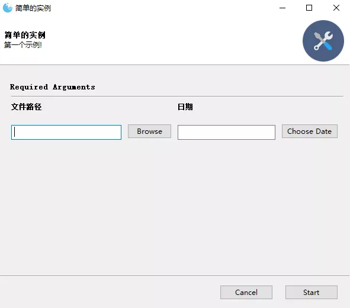
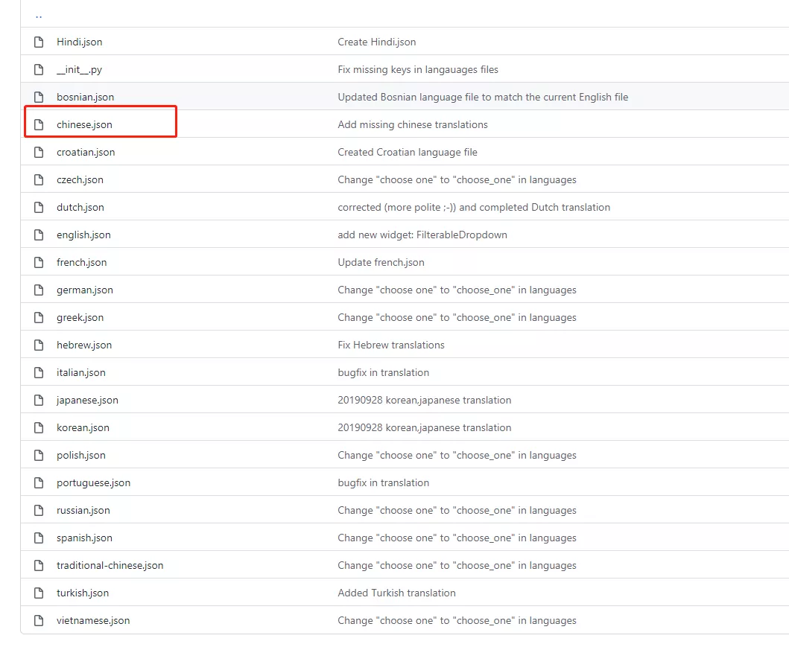
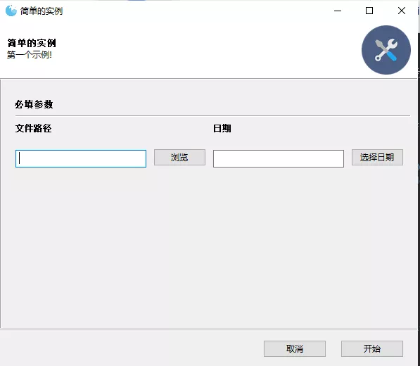
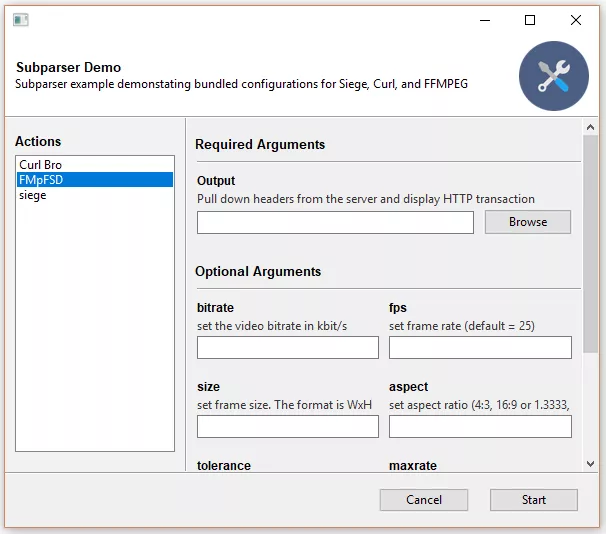
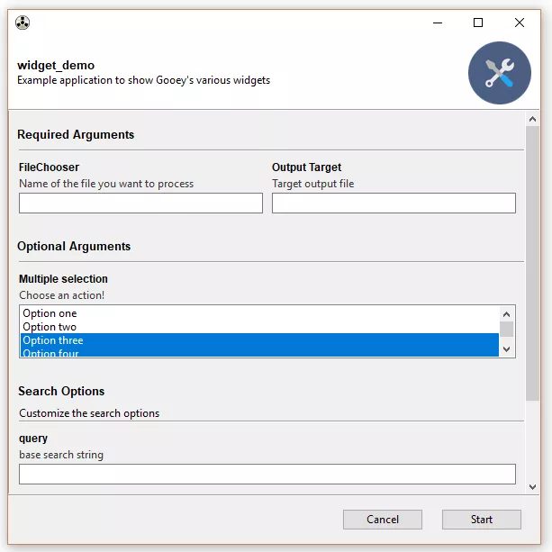
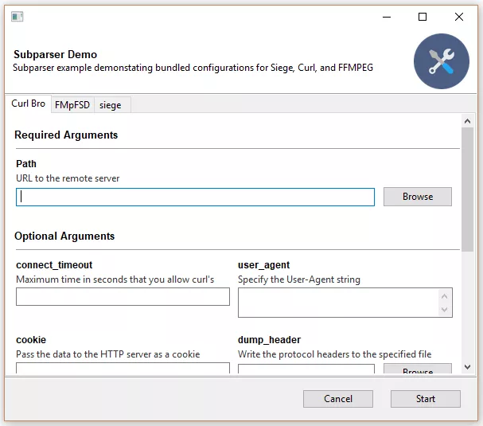
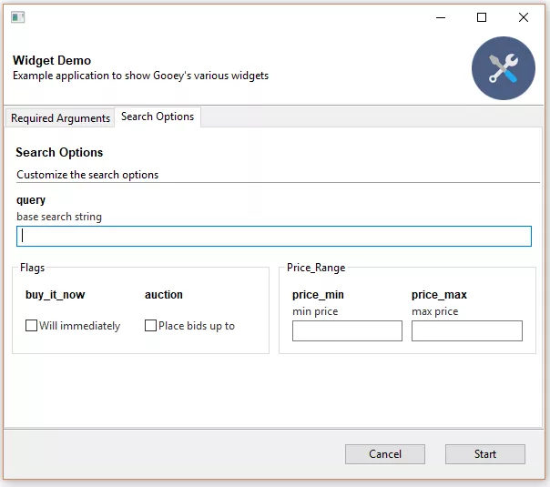
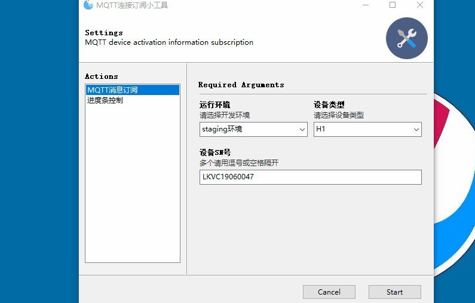
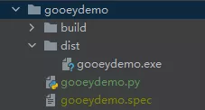

Python GUI<br />GUI是一个人机交互的界面，换句话说，它是人类与计算机交互的一种方法。GUI主要使用窗口，图标和菜单，也可以通过鼠标和键盘进行操作。<br />GUI库包含部件。部件是一系列图形控制元素的集合。在构建GUI程序时，通常使用层叠方式。众多图形控制元素直接叠加起来。<br />当使用python编写应用程序时，就必须使用GUI库来完成。对于Python GUI库，可以有很多的选择。<br />之前用的最多的是 Tkinter ，这个 GUI 库比较灵活，可以做出比较复杂的界面。但是在页面布局和控件使用上比较复杂，想画出一个好看的界面还是要花很多功夫的。<br />介绍一个 GUI 库 —— Gooey ，一行代码就可以快速生成 GUI 应用程序。<br />Github开源地址：[https://github.com/chriskiehl/Gooey](https://github.com/chriskiehl/Gooey)
<a name="Qms9C"></a>
### 安装
```bash
pip install Gooey
```
<a name="F33At"></a>
### 简单示例
官方示例源码：[https://github.com/chriskiehl/GooeyExamples](https://github.com/chriskiehl/GooeyExamples)
```python
from gooey import Gooey, GooeyParser


@Gooey(program_name="简单的实例")
def main():
    parser = GooeyParser(description="第一个示例!")
    parser.add_argument('文件路径', widget="FileChooser")      # 文件选择框
    parser.add_argument('日期', widget="DateChooser")          # 日期选择框
    args = parser.parse_args()                                 # 接收界面传递的参数
    print(args)


if   __name__ == '__main__':
    main()
```
这里看代码应该大致知道界面有些什么控件：文件选择框、日期选择框。<br />运行之后的效果如下：<br /><br />非常的简洁大方有木有！绝对拿得出手！
<a name="Nz3pt"></a>
### 组件
GUI 界面都是由一个个组件排列组成的，上面的例子中使用了 FileChooser 和 DateChooser 这两个组件，使用起来是不是很简单？来看看 Gooey 还有哪些组件。
```bash
| 控件名             | 控件类型  |
| --------          | -----:    |
| FileChooser       | 文件选择器 | 
| MultiFileChooser  | 文件多选器 | 
| DirChooser        | 目录选择器 |
| MultiDirChooser   | 目录多选器 |
| FileSaver         | 文件保存   |
| DateChooser       | 日期选择   |
| TextField         | 文本输入框 |
| Dropdown          | 下拉列表   |
| Counter           | 计数器     |
| CheckBox          | 复选框     |
| RadioGroup        | 单选框     |
```
这些组件基本上看名称就知道是什么样子的了，都是平时常用的页面组件。
<a name="UBYoJ"></a>
### 配置
配置参数主要是对Gooey界面做全局配置，配置方法如下：
```python
@Gooey(program_name='全局配置Demo')
def main():
    ...
```
这里就使用了 `program_name` 这个配置，主要是配置显示程序的名称。<br />除此之外，Gooey 还有好多其他的配置参数：

| 参数 | 类型 | 简介 |
| --- | --- | --- |
| advanced | Boolean | 切换显示全部设置还是仅仅是简化版本 |
| show_config | Boolean | 跳过所有配置并立即运行程序 |
| language | str | 指定从 gooey/languages 目录读取哪个语言包 |
| program_name | str | GUI 窗口显示的程序名。默认会显 `sys.argv[0]`。 |
| program_description | str | Settings 窗口顶栏显示的描述性文字。默认值从 `ArgumentParser` 中获取。 |
| default_size | tuple | 窗口默认大小，(600,400) |
| required_cols | int | 设置必选参数行数。 |
| optional_cols | int | 设置可选参数行数。 |
| dump_build_config | Boolean | 将设置以 JSON 格式保存在硬盘中以供编辑/重用。 |
| richtext_controls | Boolean | 打开/关闭控制台对终端控制序列的支持（对字体粗细和颜色的有限支持） |

比如上面的例子中除了自己设置的，其他的控件例如选择按钮、确定按钮等默认都是英文的，可以通过 language 参数来设置语言。语言包在 Gooey 的 GitHub 源码中有：<br /><br />使用语言配置：
```python
from gooey import Gooey, GooeyParser


@Gooey(program_name="简单的实例", language='chinese')
def main():
    parser = GooeyParser(description="第一个示例!")
    parser.add_argument('文件路径', widget="FileChooser")      # 文件选择框
    parser.add_argument('日期', widget="DateChooser")          # 日期选择框
    args = parser.parse_args()                                 # 接收界面传递的参数
    print(args)


if   __name__ == '__main__':
    main()
```
这里加了一个 language 参数，看看运行后效果：<br /><br />可以看到，界面上的文字都变成中文了。
<a name="E6ir9"></a>
### 结构布局
通过使用一些简单的自定义，可以使用Gooey实现相当灵活的布局。可以通过Gooey装饰器的各种参数来控制总体布局选项。
<a name="cZUaJ"></a>
#### `show_sidebar=True`

<a name="h2Z8R"></a>
#### `show_sidebar=False`

<a name="SaOjJ"></a>
#### `navigation='TABBED'`

<a name="udL0r"></a>
#### `tabbed_groups=True`

<a name="rsZ0m"></a>
### 实例
通过一个小栗子来看看运行的效果吧。
```python
from gooey import Gooey, GooeyParser


@Gooey(
    richtext_controls=True,                 # 打开终端对颜色支持
    program_name="MQTT连接订阅小工具",        # 程序名称
    encoding="utf-8",                       # 设置编码格式，打包的时候遇到问题
    progress_regex=r"^progress: (\d+)%$"    # 正则，用于模式化运行时进度信息
)
def main():
    settings_msg = 'MQTT device activation information subscription'
    parser = GooeyParser(description=settings_msg)

    subs = parser.add_subparsers(help='commands', dest='command')

    my_parser = subs.add_parser('MQTT消息订阅')
    my_parser.add_argument("connect", metavar='运行环境',help="请选择开发环境",choices=['dev环境','staging环境'], default='dev环境')
    my_parser.add_argument("device_type",metavar='设备类型',help="请选择设备类型",choices=['H1','H3'],default='H1')
    my_parser.add_argument("serialNumber", metavar='设备SN号',default='LKVC19060047',help='多个请用逗号或空格隔开')

    siege_parser = subs.add_parser('进度条控制')
    siege_parser.add_argument('num',help='请输入数字',default=100)

    args = parser.parse_args()
    print(args, flush=True)    # flush=True在打包的时候会用到


if __name__ == '__main__':
    main()
```
这个例子运行的效果如下：<br />
<a name="lRxVS"></a>
### 打包成应用程序
第一步，先安装打包库：
```bash
pip install pyinstaller
```
第二步，执行打包命令：
```bash
pyinstaller -F gooeydemo.py -w
```
等待执行完成，就可以在代码目录下看到这样的结构：<br /><br />exe 可执行文件就在 dist 文件夹下。
