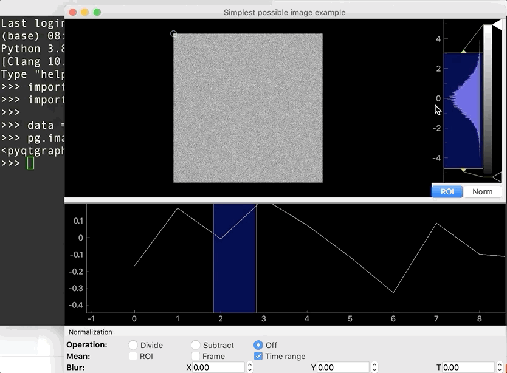
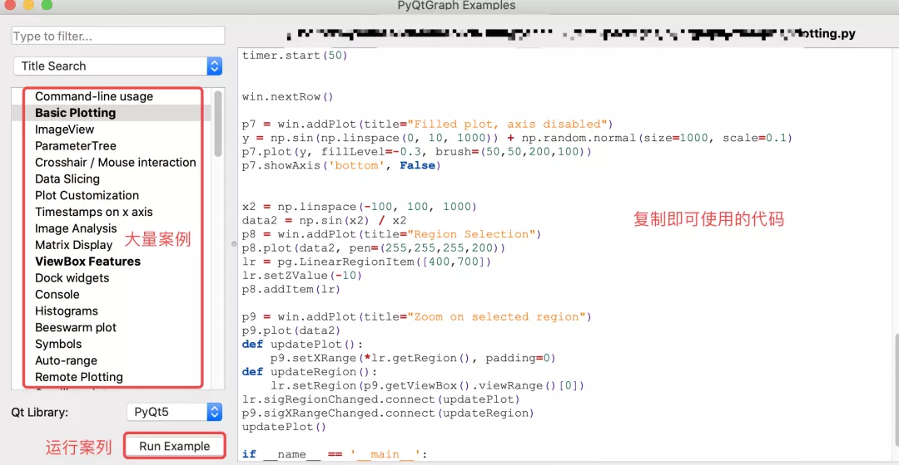
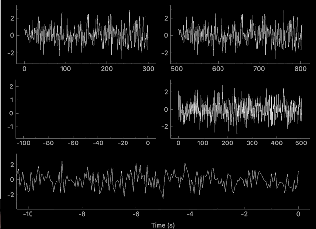
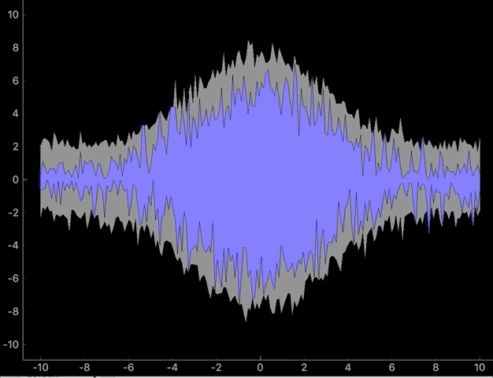
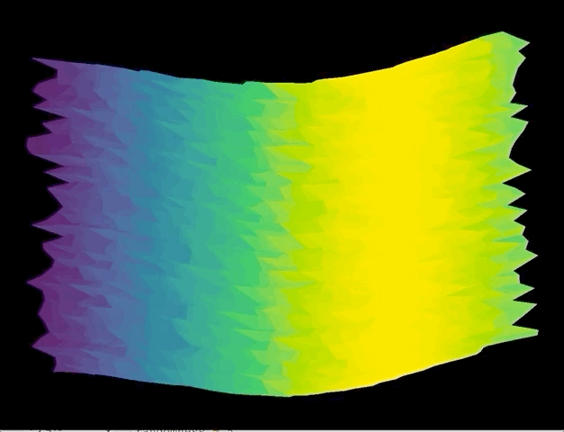
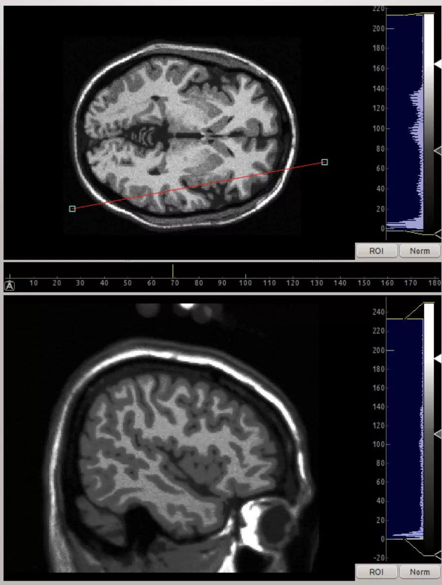
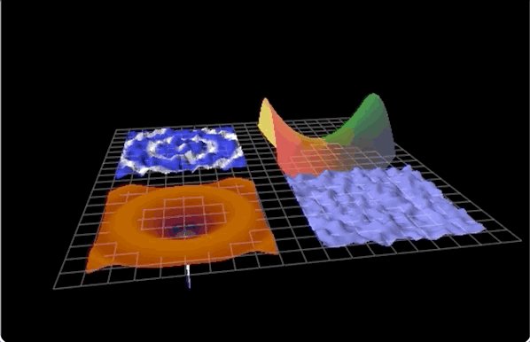
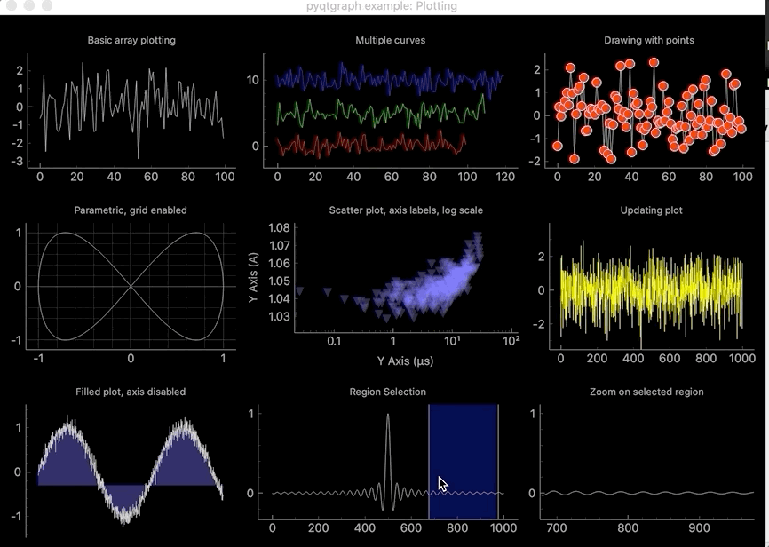
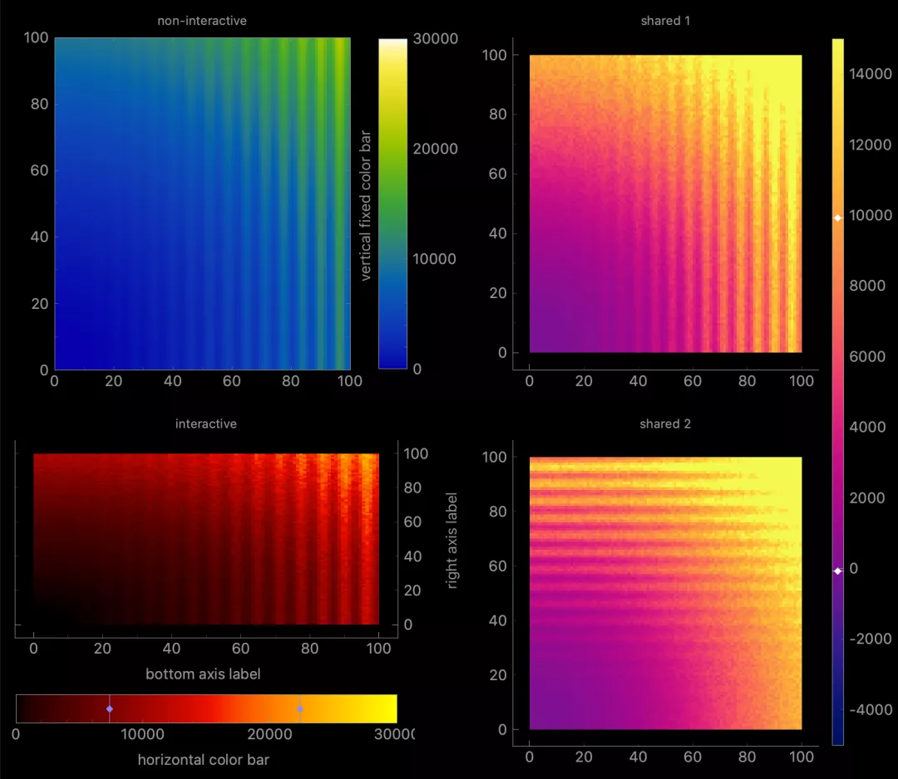
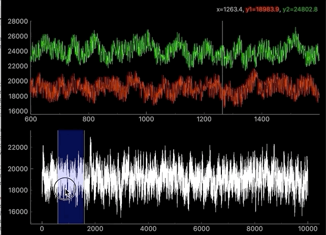

Python GUI


PyQtGraph主要使用领域：数学/科学/工程应用等；

PyQtGraph为PyQt5/PyQt6/PySide2等图形用户界面 (GUI) 开发框架的一款强大可视化工具，底层为NumPy (快速科学计算)、Qt的GraphicsView框架 (2D图形可视化)、OpenGL (3D图形可视化)；<br />相比于之前的工具，PyQtGraph在以下方面尤其出色：

- 界面修图 (点一点即可修改)；
- 快速成图 (底层为NumPy)；
- 实时绘制数据；
- 医学影像图展示 (如MRI)；
- 交互图快速制作 (数据选择、标记、小部件)；
- 对python/qt程序员更友好；
- 完美支持 Linux, Windows和OSX；
- 纯python编写，比pyqwt更易于移植等

---

<a name="uliA1"></a>
## 安装
```bash
pip install pyqtgraph -i https://pypi.tuna.tsinghua.edu.cn/simple
```
<a name="ka5no"></a>
## 使用方式

- 交互式shell里使用 (如python -i, ipython, etc)；
- 应用程序中直接弹出窗口使用；
- 以小部件的形式嵌入到在PyQt应用程序中使用；
- PyQt和PySide中使用等等。
<a name="F1jQ0"></a>
## 快速上手
以在command line里使用为例：
```python
import numpy as np
import pyqtgraph as pg

data = np.random.normal(size=(500,500))
pg.image(data, title="Simplest possible image example")
```
以上几行代码即可得到一个界面可修改的交互图：

---

<a name="y8JhE"></a>
## 齐全的demo
PyQtGraph提供了人性化的案例界面，非常有助于使用：
```python
import pyqtgraph.examples  
pyqtgraph.examples.run()
```

<a name="PoH2i"></a>
## 例子
<a name="ewiyw"></a>
### 实时绘图

<a name="fODsZ"></a>
### 音频信号
 
<a name="SwxMK"></a>
### 医学影像图
<a name="Tc7Gf"></a>
### 3D图

<a name="ZTXjH"></a>
### 2D图

<a name="kc2Nb"></a>
### 交互图形
<br />参考：[https://github.com/pyqtgraph/pyqtgraph](https://github.com/pyqtgraph/pyqtgraph)
