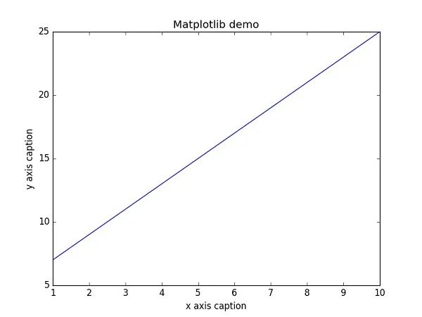

Python
<a name="xNQ6c"></a>
## 1、发送邮件
有几个模块用于访问互联网以及处理网络通信协议。其中最简单的两个是用于处理从 urls 接收的数据的 `urllib.request` 以及用于发送电子邮件的 smtplib：
```python
import smtplib
smtpObj = smtplib.SMTP( [host [, port [, local_hostname]]] )
```
参数说明：

- host：SMTP 服务器主机。可以指定主机的ip地址或者域名如：runoob.com，这个是可选参数。
- port：如果提供了 host 参数，需要指定 SMTP 服务使用的端口号，一般情况下 SMTP 端口号为25。
- local_hostname：如果 SMTP 在本机上，只需要指定服务器地址为 localhost 即可。

Python SMTP 对象使用 sendmail 方法发送邮件，语法如下：
```python
SMTP.sendmail(from_addr, to_addrs, msg[, mail_options, rcpt_options])
```
参数说明：

- from_addr：邮件发送者地址。
- to_addrs：字符串列表，邮件发送地址。
- msg：发送消息

案例：
```python
#!/usr/bin/python
# -*- coding: UTF-8 -*-

import smtplib
from email.mime.text import MIMEText
from email.header import Header

sender = 'from@runoob.com'
receivers = ['429267@qq.com']  # 接收邮件，可设置为你的QQ邮箱或者其他邮箱

# 三个参数：第一个为文本内容，第二个 plain 设置文本格式，第三个 utf-8 设置编码
message = MIMEText('Python 邮件发送测试...', 'plain', 'utf-8')
message['From'] = Header("西红柿大神", 'utf-8')   # 发送者
message['To'] =  Header("测试", 'utf-8')        # 接收者

subject = 'Python SMTP 邮件测试'
message['Subject'] = Header(subject, 'utf-8')


try:
    smtpObj = smtplib.SMTP('localhost')
    smtpObj.sendmail(sender, receivers, message.as_string())
    print "邮件发送成功"
except smtplib.SMTPException:
    print "Error: 无法发送邮件"
```
<a name="baq8z"></a>
## 2、操作数据库：MySQLdb
安装 MySQLdb<br />请访问：[http://sourceforge.net/projects/mysql-python](http://sourceforge.net/projects/mysql-python) <br />操作mysql查数据
```python
import MySQLdb

# 连接数据库　
conn = MySQLdb.connect(host='localhost',user='root',passwd='xxxx',db='test1')

# 获取cursor对象来进行操作
cursor = conn.cursor()

sql = "select * from world where someone like 'you' "

# 执行sql
cursor.execute(sql)
```
<a name="JkVVS"></a>
## 3、网络爬虫：requests
Requests 允许发送纯天然的 HTTP/1.1 请求，无需手工劳动。不需要手动为 URL 添加查询字串，也不需要对 POST 数据进行表单编码。Keep-alive 和 HTTP 连接池的功能是 100% 自动化的。<br />一个简单的爬虫样例：
```python
import requests
heads = {}
heads['User-Agent'] = 'Mozilla/5.0 ' \
                          '(Macintosh; U; Intel Mac OS X 10_6_8; en-us) AppleWebKit/534.50 ' \
                          '(KHTML, like Gecko) Version/5.1 Safari/534.50'

response = requests.get('http://www.baidu.com',headers=headers)
```
<a name="M5rGN"></a>
## 4、操作excel：pandas
```python
# -*- coding: utf-8 -*-
import xlrdimport xlwt
from datetime import date,datetime

def read_excel():
    # 打开文件
    workbook = xlrd.open_workbook(r'F:\demo.xlsx')
    # 获取所有sheet
    print workbook.sheet_names() # [u'sheet1', u'sheet2']
    sheet2_name = workbook.sheet_names()[1]

    # 根据sheet索引或者名称获取sheet内容
    sheet2 = workbook.sheet_by_index(1) # sheet索引从0开始
    sheet2 = workbook.sheet_by_name('sheet2')

    # sheet的名称，行数，列数
    print sheet2.name,sheet2.nrows,sheet2.ncols

    # 获取整行和整列的值（数组）
    rows = sheet2.row_values(3) # 获取第四行内容
    cols = sheet2.col_values(2) # 获取第三列内容
    print rows
    print cols

    # 获取单元格内容
    print sheet2.cell(1,0).value.encode('utf-8')
    print sheet2.cell_value(1,0).encode('utf-8')
    print sheet2.row(1)[0].value.encode('utf-8')

    # 获取单元格内容的数据类型
    print sheet2.cell(1,0).ctype

if __name__ == '__main__':
    read_excel()
```
<a name="y8cuy"></a>
## 5、操作系统接口
os模块提供了不少与操作系统相关联的函数。
```python
>>> import os>>> os.getcwd()      # 返回当前的工作目录'C:\\Python34'
>>> os.chdir('/server/accesslogs')   # 修改当前的工作目录
>>> os.system('mkdir today')   # 执行系统命令 mkdir 0
```
建议使用 "`import os`" 风格而非 "`from os import *`"。这样可以保证随操作系统不同而有所变化的 `os.open()` 不会覆盖内置函数 `open()`。<br />os常用命令

| 序号 | 方法 | 功能 |
| --- | --- | --- |
| 1 | `os.access(path, mode)` | 检验权限模式 |
| 2 | `os.chdir(path)` | 改变当前工作目录 |
| 3 | `os.chflags(path, flags)` | 设置路径的标记为数字标记。 |
| 4 | `os.chmod(path, mode)` | 更改权限 |
| 5 | `os.chown(path, uid, gid)` | 更改文件所有者 |
| 6 | `os.chroot(path)` | 改变当前进程的根目录 |
| 7 | `os.close(fd)` | 关闭文件描述符 fd |
| 8 | `os.closerange(fd_low, fd_high)` | 关闭所有文件描述符，从 fd_low (包含) 到 fd_high (不包含), 错误会忽略 |
| 9 | `os.dup(fd)` | 复制文件描述符 fd |
| 10 | `os.dup2(fd, fd2)` | 将一个文件描述符 fd 复制到另一个 fd2

 |

<a name="pWc3S"></a>
## 6、数据分析：numpy
NumPy 包含大量的各种数学运算的函数，包括三角函数，算术运算的函数，复数处理函数等。<br />NumPy 提供了多种排序的方法。这些排序函数实现不同的排序算法，每个排序算法的特征在于执行速度，最坏情况性能，所需的工作空间和算法的稳定性。下表显示了三种排序算法的比较。<br />三角函数<br />NumPy 提供了标准的三角函数：`sin()`、`cos()`、`tan()`。
```python
import numpy as np

a = np.array([0,30,45,60,90])
print ('不同角度的正弦值：')
# 通过乘 pi/180 转化为弧度  
print (np.sin(a*np.pi/180))
print ('\n')
print ('数组中角度的余弦值：')
print (np.cos(a*np.pi/180))
print ('\n')
print ('数组中角度的正切值：')
print (np.tan(a*np.pi/180))
```
<a name="GWJLp"></a>
## 7、数据画图分析：Matplotlib
```python
import numpy as np 
from matplotlib import pyplot as plt 

x = np.arange(1,11) 
y =  2  * x +  5 
plt.title("Matplotlib demo") 
plt.xlabel("x axis caption") 
plt.ylabel("y axis caption") 
plt.plot(x,y) 
plt.show()
```
以上实例中，`np.arange()` 函数创建 x 轴上的值。y 轴上的对应值存储在另一个数组对象 y 中。这些值使用 matplotlib 软件包的 pyplot 子模块的 plot() 函数绘制。<br />图形由 `show()` 函数显示。<br />
<a name="Sh59V"></a>
## 8、字符串正则匹配
`re`模块为高级字符串处理提供了正则表达式工具。可以说是爬虫必备，对于复杂的匹配和处理，正则表达式提供了简洁、优化的解决方案：如果只需要简单的功能，应该首先考虑字符串方法，因为它们非常简单，易于阅读和调试:
```python
>>> 'tea for too'.replace('too', 'two')'tea for two'
```
<a name="i1RvK"></a>
### `re.match`函数
`re.match` 尝试从字符串的起始位置匹配一个模式，如果不是起始位置匹配成功的话，match()就返回none。<br />函数语法：
```python
re.match(pattern, string, flags=0)
```
匹配成功`re.match`方法返回一个匹配的对象，否则返回None。<br />可以使用`group(num)` 或 `groups()` 匹配对象函数来获取匹配表达式。
<a name="XWZMB"></a>
## 9、游戏开发：pygame
Pygame是一组跨平台的Python模块, 用于创建视频游戏。它由旨在与Python编程语言一起使用的计算机图形和声音库组成。Pygame由Pete Shinners正式编写, 以取代PySDL。<br />Pygame适合于创建客户端应用程序, 这些应用程序可以包装在独立的可执行文件中。
```python
import pygame

pygame.init()
screen = pygame.display.set_mode((400, 500))
done = False

while not done:
    for event in pygame.event.get():
        if event.type == pygame.QUIT:
            done = True
    pygame.display.flip()
```
<a name="g2saa"></a>
## 10、数据压缩
以下模块直接支持通用的数据打包和压缩格式：zlib，gzip，bz2，zipfile，以及 tarfile。
```python
>>> import zlib
>>> s = b'witch which has which witches wrist watch'
>>> len(s)
41
>>> t = zlib.compress(s)
>>> len(t)
37
>>> zlib.decompress(t)
b'witch which has which witches wrist watch'
>>> zlib.crc32(s)
226805979
```
