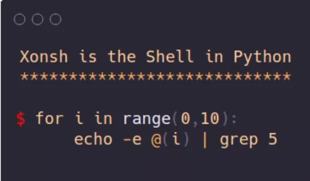
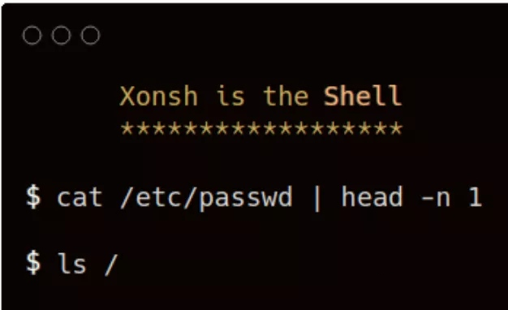
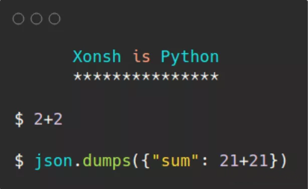
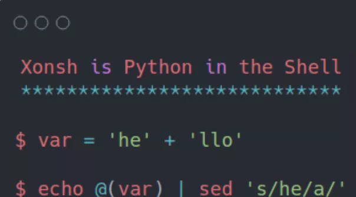

Python Shell 有时候会写一些 Bash 脚本，但是每次用循环的时候比较头疼，Shell 脚本的循环语法真的太难记了。 一般在这个时候就会想起 Python 的好，`for … range` 就跟说话一样，太友好了。 这里推荐的项目 Xonsh 就非常巧妙的解决了问题，它通过集合 Python 和 Shell 的优点，比如看下图。  看到上面的语法，真的极度舒适。 不过以上还只是 Xonsh 的其中一种用法，来分别介绍一下。 1、Xonsh 可以直接当 Shell 命令行使用  2、Xonsh 可以直接按 Python 的语法使用  3、Xonsh 可以在 Shell 中使用 Python 语法  看完是不是有点 Python 和 Shell 分不清了，但是真的好用。 除此之外，Xonsh 还提供其他的一些扩展功能！ 比如 Xontribs 提供了第三方的系统扩展、提供了丰富的接口来查询命令执行历史、提供了强大的命令行可配置的能力。 安装方法比较的简单，使用命令行：`python -m pip install xonsh` 即可。 更多项目详情请查看如下链接。 开源项目地址：[https://github.com/xonsh/xonsh](https://github.com/xonsh/xonsh)
