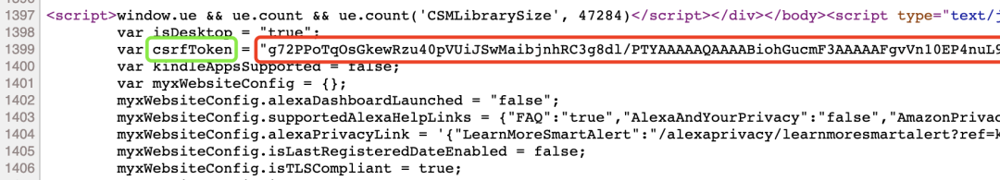
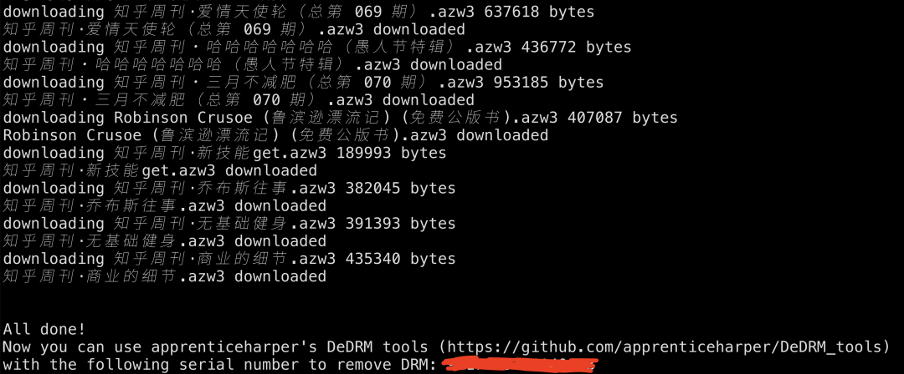
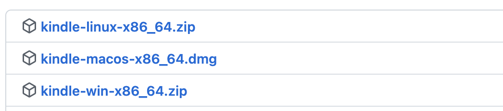
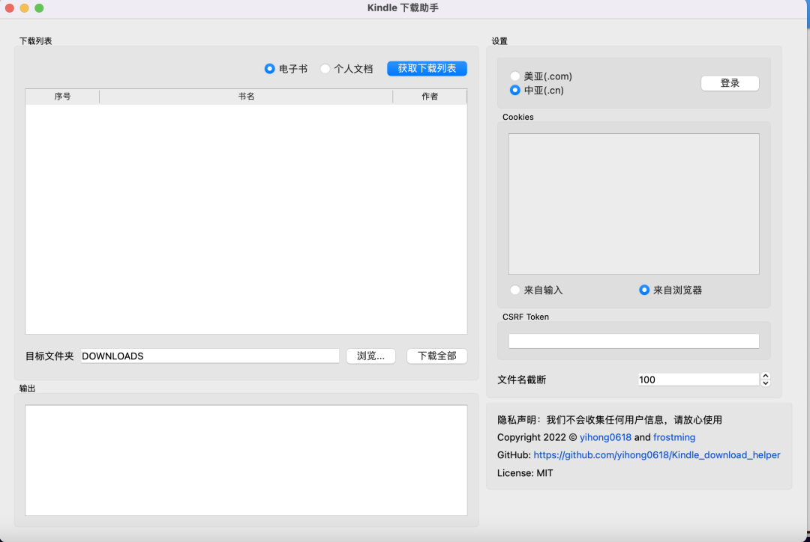

Python<br />有没有想过把亚马逊网站上的Kindle电子书下载到自己的电脑上？<br />分享一个可以实现这一目的项目。该项目用Python开发，简单、好用、开源。<br />下面分享下项目的使用。<br />首先，用git下载源码。<br />源码地址：[https://github.com/yihong0618/Kindle_download_helper](https://github.com/yihong0618/Kindle_download_helper)<br />然后，安装Python依赖
```bash
pip3 install -r requirements.txt
```
在浏览器访问amazon.cn网站，打开个人电子书页面（访问 [https://www.amazon.cn/hz/mycd/myx#/home/content/booksAll/dateDsc/](https://www.amazon.cn/hz/mycd/myx#/home/content/booksAll/dateDsc/)），查看网页源代码，找到csrfToken变量，复制变量值。<br />获取到csrfToken后，运行kindle.py文件，就可以下载电子书了
```bash
python3 kindle.py ${csrfToken} --cn
```
运行后，可以看到以下输出信息<br /><br />下载的电子书默认存放在项目根目录的DOWNLOADS中。是不是非常 easy !<br />整个项目的核心代码都在kindle.py源文件中，原理也很简单，通过构造url，模拟真实用户向网站发请求，获取电子书数据并下载。共 300 行代码，感兴趣的朋友可以阅读下。<br />上面是通过命令行的方式下载电子书，贴心的作者还开发了图形界面，同时支持Windows、Mac os和Linux三个系统。<br /><br />开发图形界面的框架是PySide6，它是Qt的Python版本。<br />在项目中对应的源码是kindle_download_helper.py，大家如果想运行它，需要提前安装依赖
```bash
pip install -r requirements_gui.txt
```
下面是Mac os版的图形界面<br /><br />界面干净整洁，操作起来比命令行更方便。
