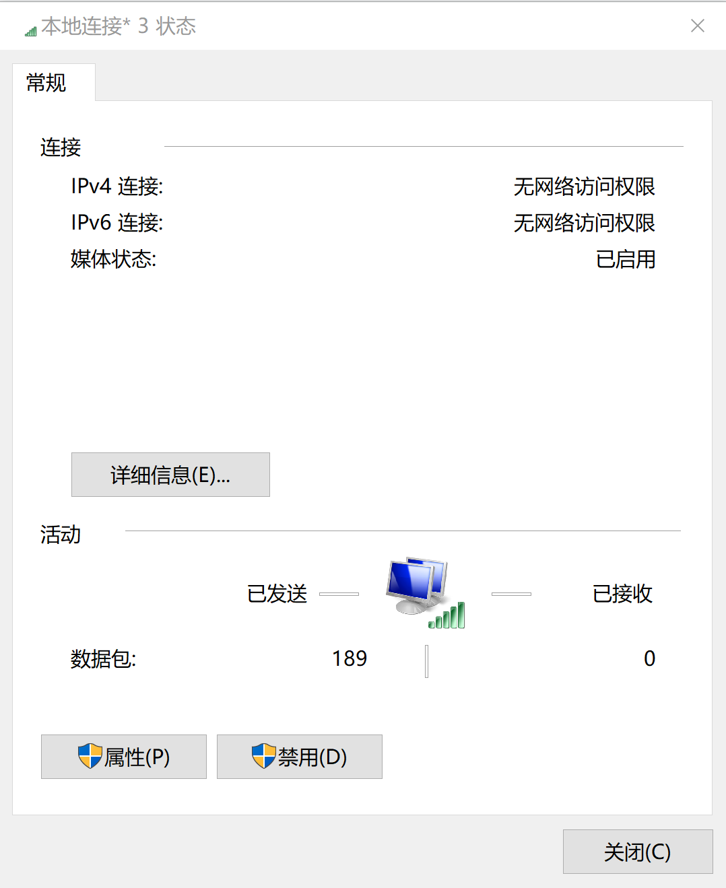
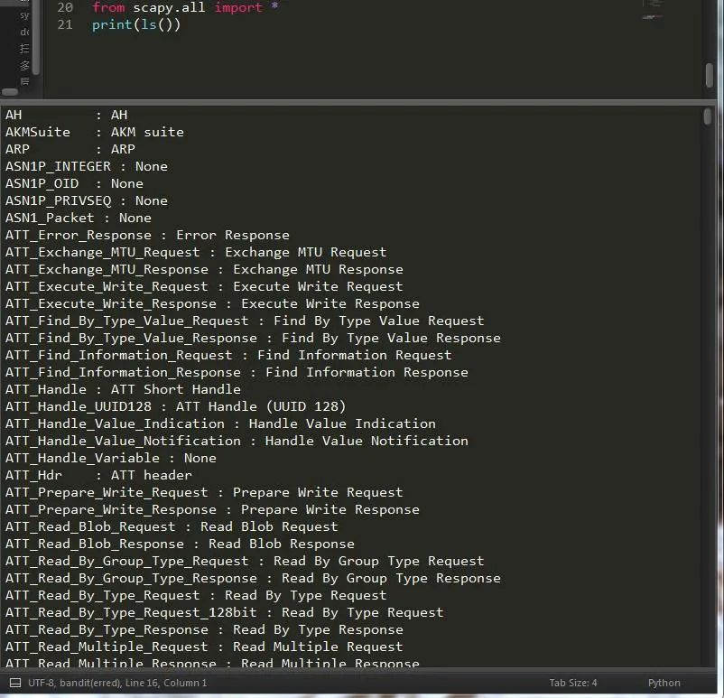
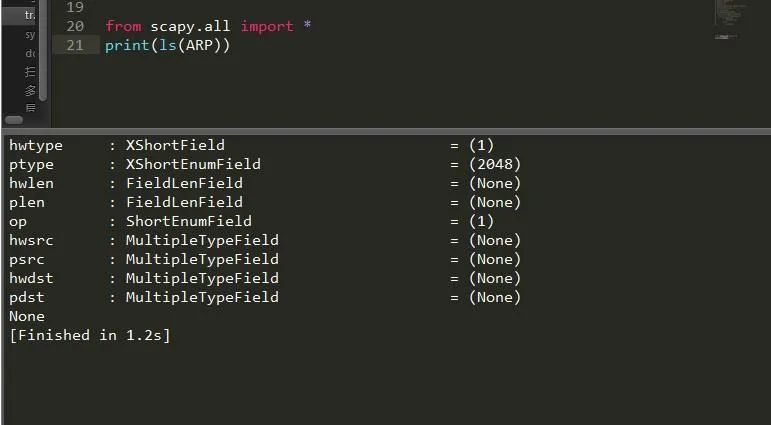
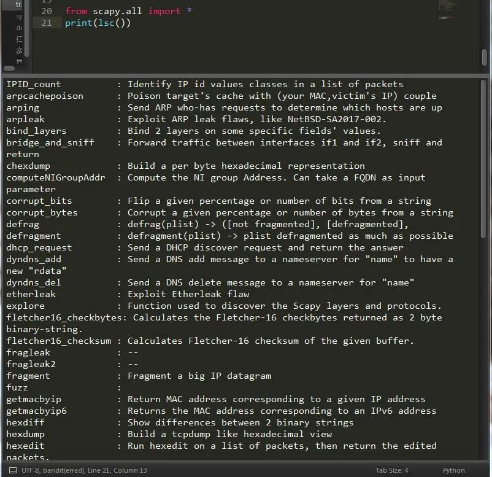

Python scapy
<a name="bUSQt"></a>
## 前言
众所周知，每天上网都会有很多数据包需要发送，然后处理在接受在发送，这样一个循环往复的过程<br /><br />这里就显示了很多数据包的发送接收数据。那么，什么是包呢？下面一起看看。<br />包（packet）是网络通信传输中的数据单位，一般称之为数据包，其主要由源地址，目标地址，净载数据组成。包括包头和包体，包头是固定长度，包体长度不变。简单了解下包的定义，下面来看看发包利器scapy的用法。
<a name="koABo"></a>
## 一、常用命令
1、`ls()`:显示所有支持的数据包对象，可带参数也可不带，参数可以是任意具体的包。<br /><br />可以看出，它包含了全部的内容，如果想详细查看某个模块中的内容，比如说想查看ARP ，tcp的话了，可以这样：<br /><br />在这里要告诉大家的是，必须要注意大小写，`ls(ARP)`这样才可以得出正确结果，`ls(arp)`是错误的。<br />2、`lsc()`：列出所有函数<br /><br />3、`hide_defaults()`：用来删除一些用户提供的那些和default value相同的项目
```python
a=IP()
print(a.hide_defaults())
```
4、`display()`：可以简单查看当前packet的各个参数的取值情况,
```python
a=IP()
a.display()
```
5.更多命令
```python
命令                                  作用show_interfaces()                  显示网卡信息
str(pkt)                            组装数据包
hexdump(pkt)                        十六进制转储
ls(pkt)                          显示出字段值的列表
pkt.summary()                        一行摘要
pkt.show()                      针对数据包的展开视图
pkt.show2()             显示聚合的数据包（例如，计算好了的校验和）
pkt.sprintf()                   用数据包字段填充格式字符串
pkt.decode_payload_as()         改变payload的decode方式
pkt.psdump()                绘制一个解释说明的PostScript图表
pkt.pdfdump()                   绘制一个解释说明的PDF
pkt.command()               返回可以生成数据包的Scapy命令
nsummary()                      同上，但规定了数据包数量
conversations()                     显示一个会话图表
filter()                    返回一个lambda过滤后的数据包列表
hexdump()                       返回所有数据包的一个hexdump
import_hexcap()                 将hexdump重新导入到Scapy中
hexraw()                    返回所有数据包Raw layer的hexdump
padding()                   返回一个带填充的数据包的hexdump
nzpadding()                 返回一个具有非零填充的数据包的hexdump
plot()                      规划一个应用到数据包列表的lambda函数
make table()                    根据lambda函数来显示表格
traceroute("baidu.com")     查看IP路径的traceroute功能
export_object()             数据包转换成base64编码的Python数据结构
import_object()                     可以将输出重新导入
save_session()                  保存所有的session变量
load_session()                  读取保存的session
fuzz()      更改一些默认的不被计算的值(比如校验和checksums),更改的值是随机的,但是是符合字段的值的。
```
<a name="tGalS"></a>
## 二、嗅探数据包
```python
from scapy.all import *
pkt = sniff(iface = "Realtek PCIe GBE Family Controller",count = 3 ,filter='tcp',prn = lambda x: x.sprintf('{IP:%IP.src%->%IP.dst%\n}{Raw:%Raw.load%\n}'))

filter:过滤条件
iface：网卡接口名称
count：数据包数量
prn:回调函数，通常与lambda搭配使用
sprintf()函数控制输入信息

抓取源地址为192.168.3.3的端口为80的tcp报文：
sniff(filter="ip src 192.168.3.3 and tcp and tcp port 80", prn=lambda x:x.summary())

抓取目的地址网段为192.168.3.3/24的报文：
sniff(filter="dst net 192.168", prn=lambda x:x.summary())

抓取非ICMP的报文：
sniff(filter="not icmp", prn=lambda x:x.summary())


将抓取到的报文的summary打印出来：
sniff(filter="icmp", prn=lambda x:x.summary(), count=10)

将所有IP报文的源地址打印出来：
sniff(filter="icmp", prn=lambda x:x[IP].src, count=10)
```
<a name="fUrum"></a>
## 三、构造数据包
```python
pkt= Ether()/IP(dst='192.168.1.2')/TCP(dport=80)
```
提到数据包，不得不说各个协议了，提到协议，又自然而然想到了osi七层模型。

| OSI七层网络模型 | TCP/IP四层概念模型 | 对应网络协议 |
| --- | --- | --- |
| 应用层（Application） | 应用层 | HTTP、TFTP, FTP, NFS, WAIS、SMTP |
| 表示层（Presentation） | 应用层 | Telnet, Rlogin, SNMP, Gopher |
| 会话层（Session） | 应用层 | SMTP, DNS |
| 传输层（Transport） | 传输层 | TCP, UDP |
| 网络层（Network） | 网络层 | IP, ICMP, ARP, RARP, AKP, UUCP |
| 数据链路层（Data Link） | 数据链路层 | FDDI, Ethernet, Arpanet, PDN, SLIP, PPP， |
| 物理层（Physical） | 数据链路层 | IEEE 802.1A, IEEE 802.2到IEEE 802.11 |

以上便是各个网络协议对应的osi模型，那么各个协议的用法是怎样的了，下面一起来看下。
<a name="rPJhH"></a>
## 四、各个协议用法
<a name="SirmE"></a>
### 1、构造一个 IP 包，并传入一些参数
```python
#构造一个 IP 包，并传入一些参数
pkt = IP(dst="192.168.1.2",ttl=10)
ls(pkt)  
version：版本号
ihl：头长度
tos：服务类型
len：IP数据包总长
id：标识符
flags：标记
flag：片偏移
ttl：生存时间
proto：协议类型
chksum：头部校验
src：源IP地址
dst：目的IP地址
options：可选项
```
<a name="imbe7"></a>
### 2、构造ARP包
```python
#构造ARP包
ARP(op=1, hwdst="ff:ff:ff:ff:ff:ff", pdst=ip_address)
#arp类的构造函数列表：
ls(ARP)
hwtype     : XShortField          = (1)  值为1表示以太网地址，其它还可能表示令牌环地址
ptype      : XShortEnumField      = (2048)  0x0800表示IP地址，其它还可能是ICMP/IGMP
hwlen      : ByteField            = (6)   ARP报文中，它的值为6
plen       : ByteField            = (4)  ARP报文中，它的值为4
op         : ShortEnumField       = (1) 取值为1或者2，代表ARP请求或者响应包。1.ARP请求，2.ARP应答，3.RARP请求，4.RARP应答
 
hwsrc      : ARPSourceMACField    = (None) 发送方Mac地址。
psrc       : SourceIPField        = (None) 发送方IP地址。
hwdst      : MACField             = ('00:00:00:00:00:00') 目标Mac地址。
pdst       : IPField              = ('0.0.0.0') 目标IP地址。
```
<a name="UFTyy"></a>
### 3、构造Ether
```python
#构造Ether
Ether(dst="ff:ff:ff:ff:ff:ff")
ls(Ether)
dst        : DestMACField         = (None) 目的MAC
src        : SourceMACField       = (None) 源MAC
type       : XShortEnumField      = (36864)
构造一个以太网数据包通常需要指定目标和源MAC地址，如果不指定，默认发出的就是广播包ff:ff:ff:ff:ff:ff
```
<a name="VbFfO"></a>
### 4、构造TCP包
```python
#构造TCP包
sport      : ShortEnumField                      = 20              (20) 目标端口
dport      : ShortEnumField                      = 80              (80)  源端口
seq        : IntField                            = 0               (0)
ack        : IntField                            = 0               (0)
dataofs    : BitField (4 bits)                   = None            (None)
reserved   : BitField (3 bits)                   = 0               (0)
flags      : FlagsField (9 bits)                 = <Flag 2 (S)>    (<Flag 2 (S)>)
window     : ShortField                          = 8192            (8192)
chksum     : XShortField                         = None            (None)
urgptr     : ShortField                          = 0               (0)
options    : TCPOptionsField                     = []              (b'')
```
<a name="RE1K6"></a>
## 五、发包，收包
可分为两种情况，用法如下：
<a name="iNtfy"></a>
### 1、只发不收
```python
send(pkt, inter=0, loop=0, count=1, iface=N) 
pkt:数据包
inter：发包间隔时间
count：发包数量
iface：网卡接口名称

send()，在第三层发包，没有接收功能；send(IP(dst="www.baidu.com",ttl=2)/ICMP())

sendp()，在第二层发包，没有接收功能。sr(Ether()/IP(dst="www.baidu.com"))
```
<a name="Tpy6T"></a>
### 2、发包且收包
```python
sr()和sr1()都是在第三层发包，sr1表示只接收第一个回复。

sr(IP(dst="www.baidu.com",ttl=(1,4))/TCP(dport=[21,23,80],flags="S")) 返回两个值

sr1(IP(dst="www.baidu.com",ttl=(1,4))/ICMP()) 

srloop(IP(dst="www.baidu.com",ttl=1)/ICMP()) #不停的ping百度

srloop(IP(dst="www.baidu.com",ttl=1)/ICMP(),inter=3,count=2) #每隔3秒ping一次，一共执行两次

#inter表示间隔，count记录次数

srp()和srp1()都是根据第二层发包，srp1表示只接收第一个回复
srp(Ether()/IP(dst="www.baidu.com"))
srp1(Ether()/IP(dst="www.baidu.com"))
```
<a name="JMXl7"></a>
## 六、SYN半开式扫描
当TCP链接指定端口时，flags参数设为S时则为半开式扫描，若此时该端口处于监听状态，返回syn/ack，否则返回rst/ack。
```python
sr1(IP(dst="192.168.1.2")/TCP(dport=80,flags="S"))
```
<a name="sdR89"></a>
## 七、数据包序列化，反序列化
序列化：将数据包对象保存为pcap文件<br />反序列化：读取pcap文件中的内容
```python
pkt= Ether()/IP(dst='192.168.1.2')/TCP(dport=80)
#将嗅探到的数据包内容写到pcap文件中 
wrpcap("hw.pcap",pkt)

#读取pcap文件。
read=rdpcap('hw.pcap')
print(read[1])#打印嗅探到的包的数据
```
<a name="NLmKY"></a>
## 八、数据包与字符串转换
更加直观清晰的分析数据。
```python
zfc= str(pkts[0]) 
z= Ether(zfc)
```
<a name="A5BDL"></a>
## 九、导入导出base64编码
为了方便对数据进行加密而发明的一种方式。
```python
export_object(str(pkts[0])) 导出数据包
new_Pkt = import_object() # 将上一步导出的字符串填入
```
<a name="MNZTv"></a>
## 十、离线数据包的解析
如果捕获到数据包，未联网的情况下如何解析呢？现在就可以使用离线数据包分析数据了：
```python
sniff(offline = "hw.pcap") # 离线数据包
```
