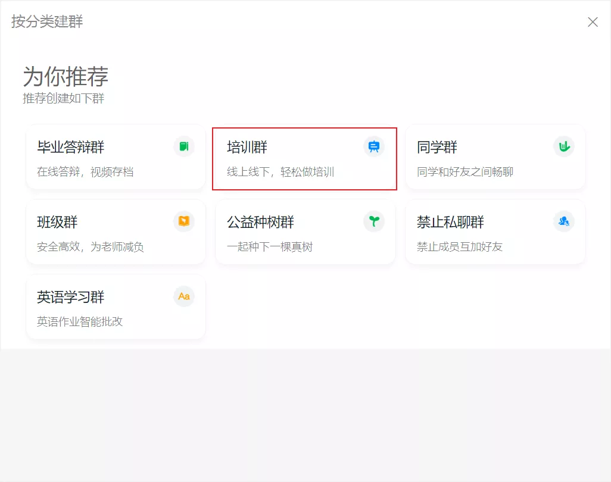
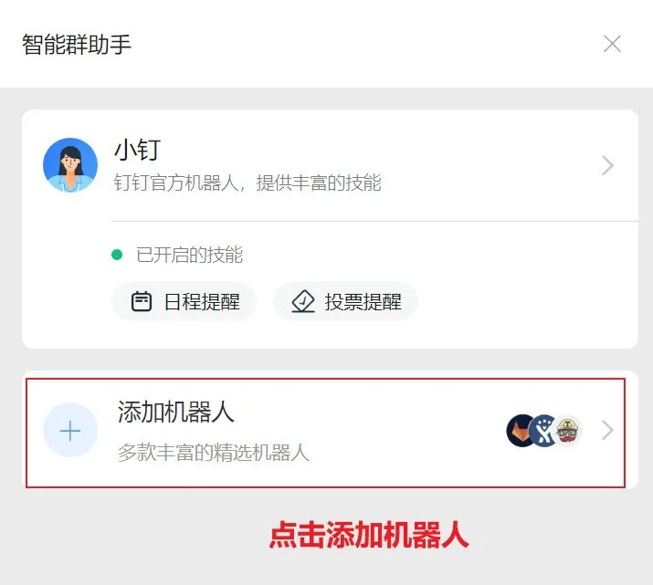
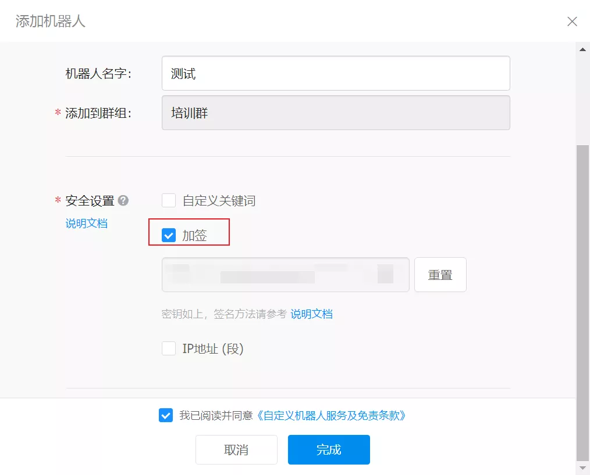
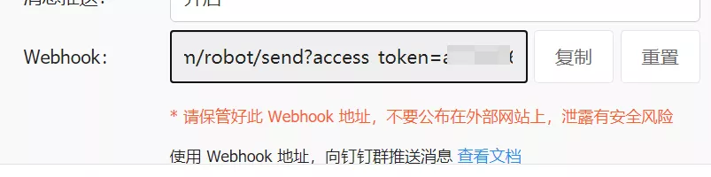
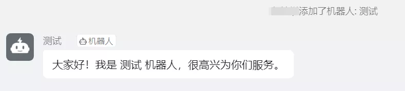
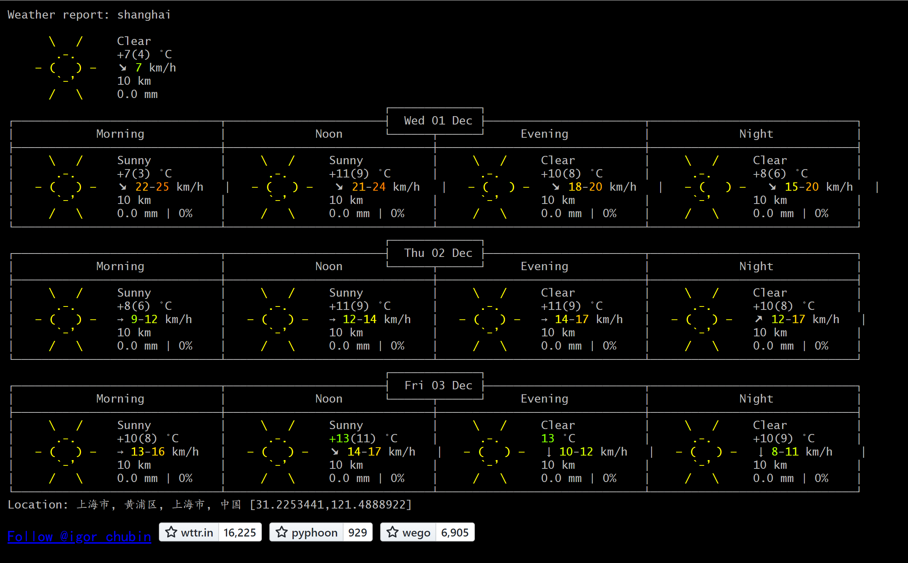
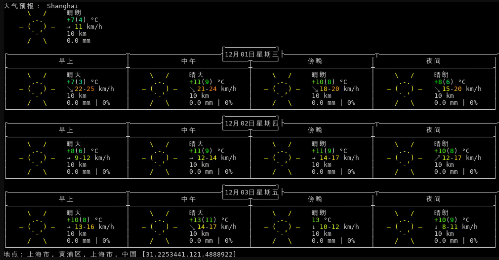
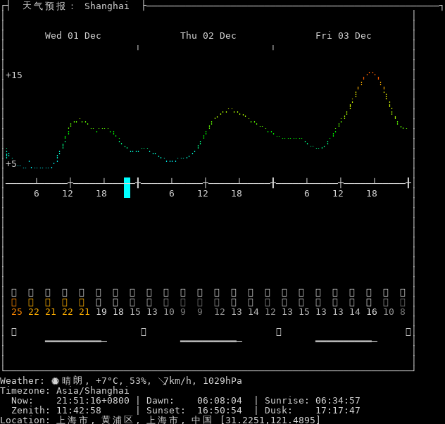
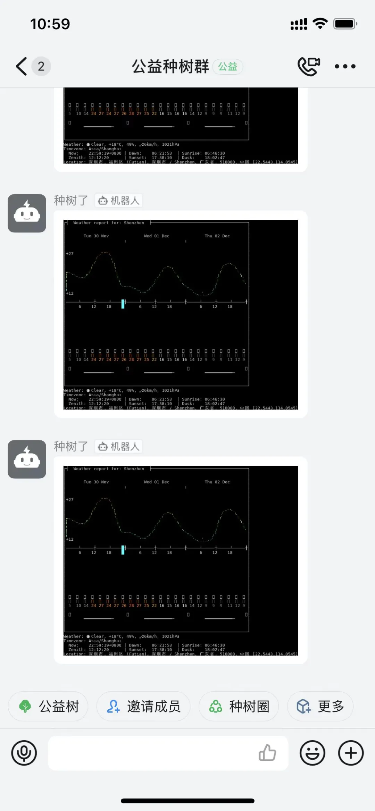

Python
<a name="rRcHI"></a>
## 创建一个钉钉机器人
1.1 打开钉钉软件，选择 "我", 再点击右上角+号，选择建场景群<br />1.2 这里可以选择任意一种群，这里选择了培训群<br /><br />1.3 群新建好后，点击右上角的齿轮—群设置，点击智能群助手。这里也可以修改群的名字，点击名字右边的铅笔就能修改群名。<br /><br />1.4 点击添加机器人<br /><br />1.5 点击右上角的+号<br />选择自定义<br />1.7 然后输入机器人名字，安全设置选择加签，这一字符串需要拷贝下来，发通知的时候就是我们的 SECRET KEY.<br /><br />1.8 点击完成后，会弹出创建成功的框框，请把这串webhook的链接拷贝下来，并将access_token参数复制下来，这一串 access_token 发送消息的时候也需要用到。<br /><br />机器人创建完毕后，会在群聊中出现，然后就可以开始编写通知代码了。<br />
<a name="QJlBl"></a>
## Python 钉钉机器人通知代码
通过往 [https://oapi.dingtalk.com/robot/send](https://oapi.dingtalk.com/robot/send) 地址发送 POST 请求的方式就能够利用钉钉自定义机器人发送消息。钉钉机器人支持两种消息内容：

1. 纯文本信息
2. Markdown信息

简单来讲，如果消息只有文本内容，就用第一种。如果消息内含图片和自定义格式，就用第二种。<br />纯文本消息，内容需要包含以下3种参数，并带2个内容体：<br />参数列表：

1. access_token: 创建成功后返回的webhook链接里就有这个参数。
2. sign: 就是选择加签安全设置中返回的SECRET。
3. timestamp: 当前时间戳。

内容体包含：

1. msgtype: 消息内容 text/markdown
2. text: 文本内容

代码如下，非常简单：
```python
import json
import hashlib
import base64
import hmac
import os
import time
import requests
from urllib.parse import quote_plus


class Messenger:
    def __init__(self, token=os.getenv("DD_ACCESS_TOKEN"), secret=os.getenv("DD_SECRET")):
        self.timestamp = str(round(time.time() * 1000))
        self.URL = "https://oapi.dingtalk.com/robot/send"
        self.headers = {'Content-Type': 'application/json'}
        secret = secret
        secret_enc = secret.encode('utf-8')
        string_to_sign = '{}\n{}'.format(self.timestamp, secret)
        string_to_sign_enc = string_to_sign.encode('utf-8')
        hmac_code = hmac.new(secret_enc, string_to_sign_enc, digestmod=hashlib.sha256).digest()
        self.sign = quote_plus(base64.b64encode(hmac_code))
        self.params = {'access_token': token, "sign": self.sign}

    def send_text(self, content):
        """
        发送文本
        @param content: str, 文本内容
        """
        data = {"msgtype": "text", "text": {"content": content}}
        self.params["timestamp"] = self.timestamp
        return requests.post(
            url=self.URL,
            data=json.dumps(data),
            params=self.params,
            headers=self.headers
        )
```
使用的时候，请注意token和secret既可以通过环境变量配置，也可以直接传入给Messenger：
```python
if __name__ == "__main__":
    m = Messenger(
        token="你的token",
        secret="你的secret"
    )
    m.send_text("测试一下，今天天气不错")
```
然后运行这个脚本，就能获取消息通知。<br />如果只需要文本通知，那么到这里就已经实现了，如果还需要发送图文消息或更多自定义内容体，请继续看。
<a name="UlTSg"></a>
## 钉钉机器人支持Markdown
为了支持发送图片消息和自定义的文字格式，需要配置更多的参数：
```python
def send_md(self, title, content):
    """
    发送Markdown文本
    @param title: str, 标题
    @param content: str, 文本内容
    """
    data = {"msgtype": "markdown", "markdown": {"title": title, "text": content}}
    self.params["timestamp"] = self.timestamp
    return requests.post(
        url=self.URL,
        data=json.dumps(data),
        params=self.params,
        headers=self.headers
    )
```
msgtype参数改为markdown，并配置markdown的参数，包括：

1. title: 标题
2. content: markdown内容

这样，就能支持发送markdown消息了，试一下：
```python
import json
import hashlib
import base64
import hmac
import os
import time
import requests
from urllib.parse import quote_plus


class Messenger:
    def __init__(self, token=os.getenv("DD_ACCESS_TOKEN"), secret=os.getenv("DD_SECRET")):
        self.timestamp = str(round(time.time() * 1000))
        self.URL = "https://oapi.dingtalk.com/robot/send"
        self.headers = {'Content-Type': 'application/json'}
        secret = secret
        secret_enc = secret.encode('utf-8')
        string_to_sign = '{}\n{}'.format(self.timestamp, secret)
        string_to_sign_enc = string_to_sign.encode('utf-8')
        hmac_code = hmac.new(secret_enc, string_to_sign_enc, digestmod=hashlib.sha256).digest()
        self.sign = quote_plus(base64.b64encode(hmac_code))
        self.params = {'access_token': token, "sign": self.sign}

    def send_text(self, content):
        """
        发送文本
        @param content: str, 文本内容
        """
        data = {"msgtype": "text", "text": {"content": content}}
        self.params["timestamp"] = self.timestamp
        return requests.post(
            url=self.URL,
            data=json.dumps(data),
            params=self.params,
            headers=self.headers
        )

def send_md(self, title, content):
    """
    发送Markdown文本
    @param title: str, 标题
    @param content: str, 文本内容
    """
    data = {"msgtype": "markdown", "markdown": {"title": title, "text": content}}
    self.params["timestamp"] = self.timestamp
    return requests.post(
        url=self.URL,
        data=json.dumps(data),
        params=self.params,
        headers=self.headers
    )


if __name__ == "__main__":
    markdown_text = "\n".join(open("md_test.md", encoding="utf-8").readlines())
    m = Messenger(
        token="你的token",
        secret="你的secret"
    )
    m.send_text("测试一下，今天天气不错")
    m.send_md("测试Markdown", markdown_text)
```
<a name="ejusF"></a>
## 请求天气接口
有一个网站服务叫做：wttr.in 提供了非常方便的天气接口，比如：<br />[https://wttr.in/Shenzhen?&lang=cn](https://wttr.in/Shenzhen?&lang=cn)<br />效果如下：<br /><br />可以通过这个API，获得全天的天气预报。<br />它支持很多形式，比如单行输出：
```bash
$ curl wttr.in/Nuremberg?format=3
Nuremberg: 🌦 +11⁰C
```
或者一次处理所有城市的这些查询：
```bash
$ curl -s 'wttr.in/{Nuremberg,Hamburg,Berlin}?format=3'
Nuremberg: 🌦 +11⁰C
Hamburg: 🌦 +8⁰C
Berlin: 🌦 +8⁰C
```
<br />如果希望让刚刚的未来三天天气预报输出成为图片格式，它也能实现：
```bash
curl 'https://wttr.in/Shanghai.png'
```
<br />不仅如此，它还支持分时天气预报：<br />[https://v2d.wttr.in/Shanghai.png](https://v2d.wttr.in/Shanghai.png)<br /><br />这一张图就是要自动通知的天气预报，把这种图嵌入到钉钉通知中。
<a name="aj9tq"></a>
## 钉钉通知天气预报
使用钉钉通知机器人，7行代码就能搞定这个需求:
```python
import datetime
from notice import Messenger
m = Messenger(
    token="你的token",
    secret="你的secret"
)
m.send_md(f"天气预报-{datetime.datetime.today()}", "")
```
增加这7行代码，只需要修改 token 和 secret 就能发送天气预报。<br />注意，请求的链接里拿的还是ShenZhen的天气预报，可以改成自己所在的城市，也可以自定义任何自己喜欢的图表。效果如下：<br /><br />然后为了实现每天的定时发送，只需要把代码放到服务器上，使用crontab配置定时任务即可：
```bash
# 输入 crontab -e 增加下面这一行，每天早上8:00运行通知脚本
0 8 * * * python /data/dd_notice/weather_notice.py
```
