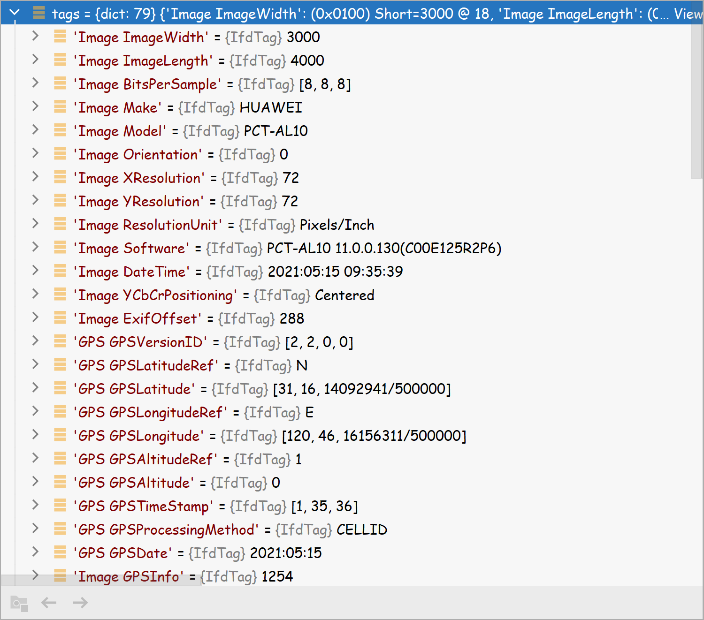

Python<br />这里使用Python 的第三方库 `exifread`。
```bash
pip3 install exifread
```
这个库的强大之处就是它可以直接读取照片信息。主要是使用这个方法：
```bash
tags = exifread.process_file(f)
```
运行一下，可以看到照片里面包含的很详细的信息，有很多：<br />
<a name="XnXI3"></a>
### 具体实现程序
```bash
def extract_image(pic_path):
    GPS = {}
    date = ''
    with open(pic_path, 'rb') as f:
        tags = exifread.process_file(f)
        for tag, value in tags.items():
            # 纬度
            if re.match('GPS GPSLatitudeRef', tag):
                GPS['GPSLatitudeRef'] = str(value)
            # 经度
            elif re.match('GPS GPSLongitudeRef', tag):
                GPS['GPSLongitudeRef'] = str(value)
            # 海拔
            elif re.match('GPS GPSAltitudeRef', tag):
                GPS['GPSAltitudeRef'] = str(value)
            elif re.match('GPS GPSLatitude', tag):
                try:
                    match_result = re.match('\[(\w*),(\w*),(\w.*)/(\w.*)\]', str(value)).groups()
                    GPS['GPSLatitude'] = int(match_result[0]), int(match_result[1]), int(match_result[2])
                except:
                    deg, min, sec = [x.replace(' ', '') for x in str(value)[1:-1].split(',')]
                    GPS['GPSLatitude'] = convert_coor(deg, min, sec)
            elif re.match('GPS GPSLongitude', tag):
                try:
                    match_result = re.match('\[(\w*),(\w*),(\w.*)/(\w.*)\]', str(value)).groups()
                    GPS['GPSLongitude'] = int(match_result[0]), int(match_result[1]), int(match_result[2])
                except:
                    deg, min, sec = [x.replace(' ', '') for x in str(value)[1:-1].split(',')]
                    GPS['GPSLongitude'] = convert_coor(deg, min, sec)
            elif re.match('GPS GPSAltitude', tag):
                GPS['GPSAltitude'] = str(value)
            elif re.match('.*Date.*', tag):
                date = str(value)
    return {'GPS_information': GPS, 'date_information': date}
```
从这里面，就可以获取到照片拍摄的地点的经纬度，这样虽然说可以粗略地看出是在哪一块。并不能看到具体的位置信息，如果想看到位置信息，那么第一种方法可以百度查找经纬度，百度有提供坐标反解成地点的功能。<br />百度有开发者接口，可以注册一个，成为百度地图开发者，然后就可以调用 API 来反解坐标了。<br />具体的代码如下：
<a name="EVBHX"></a>
### 通过baidu Map的API将GPS信息转换成地址
```bash
def find_address_from_bd(GPS):
    secret_key = 'wLyevcXk5QY36hTKmvV5350F'
    if not GPS['GPS_information']:
        return '该照片无GPS信息'
    lat, lng = GPS['GPS_information']['GPSLatitude'], GPS['GPS_information']['GPSLongitude']
    baidu_map_api = "http://api.map.baidu.com/geocoder/v2/?ak={0}&callback=renderReverse&location={1},{2}s&output=json&pois=0".format(
        secret_key, lat, lng)
    response = requests.get(baidu_map_api)
    content = response.text.replace("renderReverse&&renderReverse(", "")[:-1]
    baidu_map_address = json.loads(content)
    formatted_address = baidu_map_address["result"]["formatted_address"]
    province = baidu_map_address["result"]["addressComponent"]["province"]
    city = baidu_map_address["result"]["addressComponent"]["city"]
    district = baidu_map_address["result"]["addressComponent"]["district"]
    location = baidu_map_address["result"]["sematic_description"]
    return formatted_address, province, city, district, location
```
这里面需要将百度地图开发者的 secret_key 放进去就可以。<br />来看看程序运行的结果：
```bash
{'GPS_information': {'GPSLatitudeRef': 'N', 'GPSLatitude': 31.274496078333332, 'GPSLongitudeRef': 'E', 'GPSLongitude': 120.775642395, 'GPSAltitudeRef': '1', 'GPSAltitude': '0'}, 'date_information': '2021:05:15 09:35:39'}
拍摄时间：2021:05:15 09:35:39
照片拍摄地址:('江苏省苏州市吴中区新庆路', '江苏省', '苏州市', '吴中区', '鄂田村西143米')
```
<a name="aAodG"></a>
### 完整代码
```bash
"""根据图片获取位置信息"""
import exifread
import re
import requests
import json


# 转换经纬度格式
def convert_coor(*arg):
    return float(arg[0]) + ((float(arg[1]) + (float(arg[2].split('/')[0]) / float(arg[2].split('/')[-1]) / 60)) / 60)


# 读取照片的GPS经纬度信息
def extract_image(pic_path):
    GPS = {}
    date = ''
    with open(pic_path, 'rb') as f:
        tags = exifread.process_file(f)
        for tag, value in tags.items():
            # 纬度
            if re.match('GPS GPSLatitudeRef', tag):
                GPS['GPSLatitudeRef'] = str(value)
            # 经度
            elif re.match('GPS GPSLongitudeRef', tag):
                GPS['GPSLongitudeRef'] = str(value)
            # 海拔
            elif re.match('GPS GPSAltitudeRef', tag):
                GPS['GPSAltitudeRef'] = str(value)
            elif re.match('GPS GPSLatitude', tag):
                try:
                    match_result = re.match('\[(\w*),(\w*),(\w.*)/(\w.*)\]', str(value)).groups()
                    GPS['GPSLatitude'] = int(match_result[0]), int(match_result[1]), int(match_result[2])
                except:
                    deg, min, sec = [x.replace(' ', '') for x in str(value)[1:-1].split(',')]
                    GPS['GPSLatitude'] = convert_coor(deg, min, sec)
            elif re.match('GPS GPSLongitude', tag):
                try:
                    match_result = re.match('\[(\w*),(\w*),(\w.*)/(\w.*)\]', str(value)).groups()
                    GPS['GPSLongitude'] = int(match_result[0]), int(match_result[1]), int(match_result[2])
                except:
                    deg, min, sec = [x.replace(' ', '') for x in str(value)[1:-1].split(',')]
                    GPS['GPSLongitude'] = convert_coor(deg, min, sec)
            elif re.match('GPS GPSAltitude', tag):
                GPS['GPSAltitude'] = str(value)
            elif re.match('.*Date.*', tag):
                date = str(value)
    return {'GPS_information': GPS, 'date_information': date}


# 通过baidu Map的API将GPS信息转换成地址
def find_address_from_bd(GPS):
    secret_key = 'wLyevcXk5QY36hTKmvV5350F'
    if not GPS['GPS_information']:
        return '该照片无GPS信息'
    lat, lng = GPS['GPS_information']['GPSLatitude'], GPS['GPS_information']['GPSLongitude']
    baidu_map_api = "http://api.map.baidu.com/geocoder/v2/?ak={0}&callback=renderReverse&location={1},{2}s&output=json&pois=0".format(
        secret_key, lat, lng)
    response = requests.get(baidu_map_api)
    content = response.text.replace("renderReverse&&renderReverse(", "")[:-1]
    baidu_map_address = json.loads(content)
    formatted_address = baidu_map_address["result"]["formatted_address"]
    province = baidu_map_address["result"]["addressComponent"]["province"]
    city = baidu_map_address["result"]["addressComponent"]["city"]
    district = baidu_map_address["result"]["addressComponent"]["district"]
    location = baidu_map_address["result"]["sematic_description"]
    return formatted_address, province, city, district, location


if __name__ == '__main__':
    gpsinfo = extract_image(pic_path="D:\LinkSpace\Picture\Saved Pictures\img\\IMG_20210515_093536.jpg")
    address = find_address_from_bd(GPS=gpsinfo)
    print(gpsinfo)
    print("拍摄时间：" + gpsinfo.get("date_information"))
    print('照片拍摄地址:' + str(address))

```
