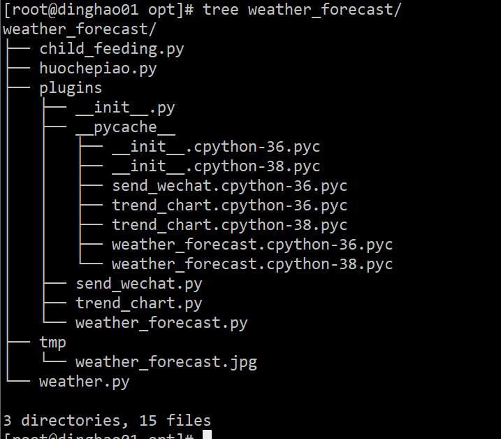

Python<br />**Python 脚本部分实例：**企业微信告警、FTP 客户端、SSH 客户端、Saltstack 客户端、vCenter 客户端、获取域名 ssl 证书过期时间、发送今天的天气预报以及未来的天气趋势图；
<a name="JnKy1"></a>
### 企业微信告警
此脚本通过企业微信应用，进行微信告警，可用于 Zabbix 监控。
```python
# -*- coding: utf-8 -*-
import requests
import json
class DLF:
    def __init__(self, corpid, corpsecret):
        self.url = "https://qyapi.weixin.qq.com/cgi-bin"
        self.corpid = corpid
        self.corpsecret = corpsecret
        self._token = self._get_token()
    def _get_token(self):
        '''
        获取企业微信API接口的access_token
        :return:
        '''
        token_url = self.url + "/gettoken?corpid=%s&corpsecret=%s" %(self.corpid, self.corpsecret)
        try:
            res = requests.get(token_url).json()
            token = res['access_token']
            return token
        except Exception as e:
            return str(e)
    def _get_media_id(self, file_obj):
        get_media_url = self.url + "/media/upload?access_token={}&type=file".format(self._token)
        data = {"media": file_obj}
        try:
            res = requests.post(url=get_media_url, files=data)
            media_id = res.json()['media_id']
            return media_id
        except Exception as e:
            return str(e)
    def send_text(self, agentid, content, touser=None, toparty=None):
        send_msg_url = self.url + "/message/send?access_token=%s" % (self._token)
        send_data = {
            "touser": touser,
            "toparty": toparty,
            "msgtype": "text",
            "agentid": agentid,
            "text": {
                "content": content
            }
        }
        try:
            res = requests.post(send_msg_url, data=json.dumps(send_data))
        except Exception as e:
            return str(e)
    def send_image(self, agentid, file_obj, touser=None, toparty=None):
        media_id = self._get_media_id(file_obj)
        send_msg_url = self.url + "/message/send?access_token=%s" % (self._token)
        send_data = {
            "touser": touser,
            "toparty": toparty,
            "msgtype": "image",
            "agentid": agentid,
            "image": {
                "media_id": media_id
           }
        }
        try:
            res = requests.post(send_msg_url, data=json.dumps(send_data))
        except Exception as e:
            return str(e)
```
<a name="jB2JE"></a>
### FTP 客户端
通过 ftplib 模块操作 ftp 服务器，进行上传下载等操作。
```python
# -*- coding: utf-8 -*-
from ftplib import FTP
from os import path
import copy
class FTPClient:
    def __init__(self, host, user, passwd, port=21):
        self.host = host
        self.user = user
        self.passwd = passwd
        self.port = port
        self.res = {'status': True, 'msg': None}
        self._ftp = None
        self._login()
    def _login(self):
        '''
        登录FTP服务器
        :return: 连接或登录出现异常时返回错误信息
        '''
        try:
            self._ftp = FTP()
            self._ftp.connect(self.host, self.port, timeout=30)
            self._ftp.login(self.user, self.passwd)
        except Exception as e:
            return e
    def upload(self, localpath, remotepath=None):
        '''
        上传ftp文件
        :param localpath: local file path
        :param remotepath: remote file path
        :return:
        '''
        if not localpath: return 'Please select a local file. '
        # 读取本地文件
        # fp = open(localpath, 'rb')
        # 如果未传递远程文件路径，则上传到当前目录，文件名称同本地文件
        if not remotepath:
            remotepath = path.basename(localpath)
        # 上传文件
        self._ftp.storbinary('STOR ' + remotepath, localpath)
        # fp.close()
    def download(self, remotepath, localpath=None):
        '''
        localpath
        :param localpath: local file path
        :param remotepath: remote file path
        :return:
        '''
        if not remotepath: return 'Please select a remote file. '
        # 如果未传递本地文件路径，则下载到当前目录，文件名称同远程文件
        if not localpath:
            localpath = path.basename(remotepath)
        # 如果localpath是目录的话就和remotepath的basename拼接
        if path.isdir(localpath):
            localpath = path.join(localpath, path.basename(remotepath))
        # 写入本地文件
        fp = open(localpath, 'wb')
        # 下载文件
        self._ftp.retrbinary('RETR ' + remotepath, fp.write)
        fp.close()
    def nlst(self, dir='/'):
        '''
        查看目录下的内容
        :return: 以列表形式返回目录下的所有内容
        '''
        files_list = self._ftp.nlst(dir)
        return files_list
    def rmd(self, dir=None):
        '''
        删除目录
        :param dir: 目录名称
        :return: 执行结果
        '''
        if not dir: return 'Please input dirname'
        res = copy.deepcopy(self.res)
        try:
            del_d = self._ftp.rmd(dir)
            res['msg'] = del_d
        except Exception as e:
            res['status'] = False
            res['msg'] = str(e)
        return res
    def mkd(self, dir=None):
        '''
        创建目录
        :param dir: 目录名称
        :return: 执行结果
        '''
        if not dir: return 'Please input dirname'
        res = copy.deepcopy(self.res)
        try:
            mkd_d = self._ftp.mkd(dir)
            res['msg'] = mkd_d
        except Exception as e:
            res['status'] = False
            res['msg'] = str(e)
        return res
    def del_file(self, filename=None):
        '''
        删除文件
        :param filename: 文件名称
        :return: 执行结果
        '''
        if not filename: return 'Please input filename'
        res = copy.deepcopy(self.res)
        try:
            del_f = self._ftp.delete(filename)
            res['msg'] = del_f
        except Exception as e:
            res['status'] = False
            res['msg'] = str(e)
        return res
    def get_file_size(self, filenames=[]):
        '''
        获取文件大小,单位是字节
        判断文件类型
        :param filename: 文件名称
        :return: 执行结果
        '''
        if not filenames: return {'msg': 'This is an empty directory'}
        res_l = []
        for file in filenames:
            res_d = {}
            # 如果是目录或者文件不存在就会报错
            try:
                size = self._ftp.size(file)
                type = 'f'
            except:
                # 如果是路径的话size显示 - , file末尾加/ （/dir/）
                size = '-'
                type = 'd'
                file = file + '/'
            res_d['filename'] = file
            res_d['size'] = size
            res_d['type'] = type
            res_l.append(res_d)
        return res_l
    def rename(self, old_name=None, new_name=None):
        '''
        重命名
        :param old_name: 旧的文件或者目录名称
        :param new_name: 新的文件或者目录名称
        :return: 执行结果
        '''
        if not old_name or not new_name: return 'Please input old_name and new_name'
        res = copy.deepcopy(self.res)
        try:
            rename_f = self._ftp.rename(old_name, new_name)
            res['msg'] = rename_f
        except Exception as e:
            res['status'] = False
            res['msg'] = str(e)
        return res
    def close(self):
        '''
        退出ftp连接
        :return:
        '''
        try:
            # 向服务器发送quit命令
            self._ftp.quit()
        except Exception:
            return 'No response from server'
        finally:
            # 客户端单方面关闭连接
            self._ftp.close()
```
<a name="a4A12"></a>
### SSH 客户端
此脚本仅用于通过 **key** 连接，如需要密码连接，简单修改下即可。
```python
# -*- coding: utf-8 -*-
import paramiko
class SSHClient:
    def __init__(self, host, port, user, pkey):
        self.ssh_host = host
        self.ssh_port = port
        self.ssh_user = user
        self.private_key = paramiko.RSAKey.from_private_key_file(pkey)
        self.ssh = None
        self._connect()
    def _connect(self):
        self.ssh = paramiko.SSHClient()
        self.ssh.set_missing_host_key_policy(paramiko.AutoAddPolicy())
        try:
            self.ssh.connect(hostname=self.ssh_host, port=self.ssh_port, username=self.ssh_user, pkey=self.private_key, timeout=10)
        except:
            return 'ssh connect fail'
    def execute_command(self, command):
        stdin, stdout, stderr = self.ssh.exec_command(command)
        out = stdout.read()
        err = stderr.read()
        return out, err
    def close(self):
        self.ssh.close()
```
<a name="nu1O3"></a>
### Saltstack 客户端
通过 api 对 Saltstack 服务端进行操作，执行命令。
```python
#!/usr/bin/env python
# -*- coding:utf-8 -*-
import requests
import json
import copy
class SaltApi:
    """
    定义salt api接口的类
    初始化获得token
    """
    def __init__(self):
        self.url = "http://172.85.10.21:8000/"
        self.username = "saltapi"
        self.password = "saltapi"
        self.headers = {"Content-type": "application/json"}
        self.params = {'client': 'local', 'fun': None, 'tgt': None, 'arg': None}
        self.login_url = self.url + "login"
        self.login_params = {'username': self.username, 'password': self.password, 'eauth': 'pam'}
        self.token = self.get_data(self.login_url, self.login_params)['token']
        self.headers['X-Auth-Token'] = self.token
    def get_data(self, url, params):
        '''
        请求url获取数据
        :param url: 请求的url地址
        :param params: 传递给url的参数
        :return: 请求的结果
        '''
        send_data = json.dumps(params)
        request = requests.post(url, data=send_data, headers=self.headers)
        response = request.json()
        result = dict(response)
        return result['return'][0]
    def get_auth_keys(self):
        '''
        获取所有已经认证的key
        :return:
        '''
        data = copy.deepcopy(self.params)
        data['client'] = 'wheel'
        data['fun'] = 'key.list_all'
        result = self.get_data(self.url, data)
        try:
            return result['data']['return']['minions']
        except Exception as e:
            return str(e)
    def get_grains(self, tgt, arg='id'):
        """
        获取系统基础信息
        :tgt: 目标主机
        :return:
        """
        data = copy.deepcopy(self.params)
        if tgt:
            data['tgt'] = tgt
        else:
            data['tgt'] = '*'
        data['fun'] = 'grains.item'
        data['arg'] = arg
        result = self.get_data(self.url, data)
        return result
    def execute_command(self, tgt, fun='cmd.run', arg=None, tgt_type='list', salt_async=False):
        """
        执行saltstack 模块命令，类似于salt '*' cmd.run 'command'
        :param tgt: 目标主机
        :param fun: 模块方法 可为空
        :param arg: 传递参数 可为空
        :return: 执行结果
        """
        data = copy.deepcopy(self.params)
        if not tgt: return {'status': False, 'msg': 'target host not exist'}
        if not arg:
            data.pop('arg')
        else:
            data['arg'] = arg
        if tgt != '*':
            data['tgt_type'] = tgt_type
        if salt_async: data['client'] = 'local_async'
        data['fun'] = fun
        data['tgt'] = tgt
        result = self.get_data(self.url, data)
        return result
    def jobs(self, fun='detail', jid=None):
        """
        任务
        :param fun: active, detail
        :param jod: Job ID
        :return: 任务执行结果
        """
        data = {'client': 'runner'}
        data['fun'] = fun
        if fun == 'detail':
            if not jid: return {'success': False, 'msg': 'job id is none'}
            data['fun'] = 'jobs.lookup_jid'
            data['jid'] = jid
        else:
            return {'success': False, 'msg': 'fun is active or detail'}
        result = self.get_data(self.url, data)
        return result
```
<a name="gJxcG"></a>
### vCenter 客户端
通过官方 SDK 对 vCenter 进行日常操作，此脚本用于 cmdb 平台的，自动获取主机信息，存入数据库。
```python
from pyVim.connect import SmartConnect, Disconnect, SmartConnectNoSSL
from pyVmomi import vim
from asset import models
import atexit
class Vmware:
    def __init__(self, ip, user, password, port, idc, vcenter_id):
        self.ip = ip
        self.user = user
        self.password = password
        self.port = port
        self.idc_id = idc
        self.vcenter_id = vcenter_id
    def get_obj(self, content, vimtype, name=None):
        '''
        列表返回,name 可以指定匹配的对象
        '''
        container = content.viewManager.CreateContainerView(content.rootFolder, vimtype, True)
        obj = [ view for view in container.view ]
        return obj
    def get_esxi_info(self):
        # 宿主机信息
        esxi_host = {}
        res = {"connect_status": True, "msg": None}
        try:
            # connect this thing
            si = SmartConnectNoSSL(host=self.ip, user=self.user, pwd=self.password, port=self.port, connectionPoolTimeout=60)
        except Exception as e:
            res['connect_status'] = False
            try:
                res['msg'] = ("%s Caught vmodl fault : " + e.msg) % (self.ip)
            except Exception as e:
                res['msg'] = '%s: connection error' % (self.ip)
            return res
        # disconnect this thing
        atexit.register(Disconnect, si)
        content = si.RetrieveContent()
        esxi_obj = self.get_obj(content, [vim.HostSystem])
        for esxi in esxi_obj:
            esxi_host[esxi.name] = {}
            esxi_host[esxi.name]['idc_id'] = self.idc_id
            esxi_host[esxi.name]['vcenter_id'] = self.vcenter_id
            esxi_host[esxi.name]['server_ip'] = esxi.name
            esxi_host[esxi.name]['manufacturer'] = esxi.summary.hardware.vendor
            esxi_host[esxi.name]['server_model'] = esxi.summary.hardware.model
            for i in esxi.summary.hardware.otherIdentifyingInfo:
                if isinstance(i, vim.host.SystemIdentificationInfo):
                    esxi_host[esxi.name]['server_sn'] = i.identifierValue
            # 系统名称
            esxi_host[esxi.name]['system_name'] = esxi.summary.config.product.fullName
            # cpu总核数
            esxi_cpu_total = esxi.summary.hardware.numCpuThreads
            # 内存总量 GB
            esxi_memory_total = esxi.summary.hardware.memorySize / 1024 / 1024 / 1024
            # 获取硬盘总量 GB
            esxi_disk_total = 0
            for ds in esxi.datastore:
                esxi_disk_total += ds.summary.capacity / 1024 / 1024 / 1024
            # 默认配置4核8G100G，根据这个配置计算剩余可分配虚拟机
            default_configure = {
                'cpu': 4,
                'memory': 8,
                'disk': 100
            }
            esxi_host[esxi.name]['vm_host'] = []
            vm_usage_total_cpu = 0
            vm_usage_total_memory = 0
            vm_usage_total_disk = 0
            # 虚拟机信息
            for vm in esxi.vm:
                host_info = {}
                host_info['vm_name'] = vm.name
                host_info['power_status'] = vm.runtime.powerState
                host_info['cpu_total_kernel'] = str(vm.config.hardware.numCPU) + '核'
                host_info['memory_total'] = str(vm.config.hardware.memoryMB) + 'MB'
                host_info['system_info'] = vm.config.guestFullName
                disk_info = ''
                disk_total = 0
                for d in vm.config.hardware.device:
                    if isinstance(d, vim.vm.device.VirtualDisk):
                        disk_total += d.capacityInKB / 1024 / 1024
                        disk_info += d.deviceInfo.label + ": " +  str((d.capacityInKB) / 1024 / 1024) + ' GB' + ','
                host_info['disk_info'] = disk_info
                esxi_host[esxi.name]['vm_host'].append(host_info)
                # 计算当前宿主机可用容量：总量 - 已分配的
                if host_info['power_status'] == 'poweredOn':
                    vm_usage_total_cpu += vm.config.hardware.numCPU
                    vm_usage_total_disk += disk_total
                    vm_usage_total_memory += (vm.config.hardware.memoryMB / 1024)
            esxi_cpu_free = esxi_cpu_total - vm_usage_total_cpu
            esxi_memory_free = esxi_memory_total - vm_usage_total_memory
            esxi_disk_free = esxi_disk_total - vm_usage_total_disk
            esxi_host[esxi.name]['cpu_info'] = 'Total: %d核, Free: %d核' % (esxi_cpu_total, esxi_cpu_free)
            esxi_host[esxi.name]['memory_info'] = 'Total: %dGB, Free: %dGB' % (esxi_memory_total, esxi_memory_free)
            esxi_host[esxi.name]['disk_info'] = 'Total: %dGB, Free: %dGB' % (esxi_disk_total, esxi_disk_free)
            # 计算cpu 内存 磁盘按照默认资源分配的最小值，即为当前可分配资源
            if esxi_cpu_free < 4 or esxi_memory_free < 8 or esxi_disk_free < 100:
                free_allocation_vm_host = 0
            else:
                free_allocation_vm_host = int(min(
                    [
                        esxi_cpu_free / default_configure['cpu'],
                        esxi_memory_free / default_configure['memory'],
                        esxi_disk_free / default_configure['disk']
                    ]
                ))
            esxi_host[esxi.name]['free_allocation_vm_host'] = free_allocation_vm_host
        esxi_host['connect_status'] = True
        return esxi_host
    def write_to_db(self):
        esxi_host = self.get_esxi_info()
        # 连接失败
        if not esxi_host['connect_status']:
            return esxi_host
        del esxi_host['connect_status']
        for machine_ip in esxi_host:
            # 物理机信息
            esxi_host_dict = esxi_host[machine_ip]
            # 虚拟机信息
            virtual_host = esxi_host[machine_ip]['vm_host']
            del esxi_host[machine_ip]['vm_host']
            obj = models.EsxiHost.objects.create(**esxi_host_dict)
            obj.save()
            for host_info in virtual_host:
                host_info['management_host_id'] = obj.id
                obj2 = models.virtualHost.objects.create(**host_info)
                obj2.save()
```
<a name="spDkJ"></a>
### 获取域名 ssl 证书过期时间
用于 zabbix 告警
```python
import re
import sys
import time
import subprocess
from datetime import datetime
from io import StringIO
def main(domain):
    f = StringIO()
    comm = f"curl -Ivs https://{domain} --connect-timeout 10"
    result = subprocess.getstatusoutput(comm)
    f.write(result[1])
    try:
        m = re.search('start date: (.*?)\n.*?expire date: (.*?)\n.*?common name: (.*?)\n.*?issuer: CN=(.*?)\n', f.getvalue(), re.S)
        start_date = m.group(1)
        expire_date = m.group(2)
        common_name = m.group(3)
        issuer = m.group(4)
    except Exception as e:
        return 999999999
    # time 字符串转时间数组
    start_date = time.strptime(start_date, "%b %d %H:%M:%S %Y GMT")
    start_date_st = time.strftime("%Y-%m-%d %H:%M:%S", start_date)
    # datetime 字符串转时间数组
    expire_date = datetime.strptime(expire_date, "%b %d %H:%M:%S %Y GMT")
    expire_date_st = datetime.strftime(expire_date,"%Y-%m-%d %H:%M:%S")
    # 剩余天数
    remaining = (expire_date-datetime.now()).days
    return remaining 
if __name__ == "__main__":
    domain = sys.argv[1] 
    remaining_days = main(domain)
    print(remaining_days)
```
<a name="rZNkc"></a>
### 发送今天的天气预报以及未来的天气趋势图
<br />通过企业微信进行通知的
```python
# -*- coding: utf-8 -*-
import requests
import json
import datetime
def weather(city):
    url = "http://wthrcdn.etouch.cn/weather_mini?city=%s" % city
    try:
        data = requests.get(url).json()['data']
        city = data['city']
        ganmao = data['ganmao']
        today_weather = data['forecast'][0]
        res = "今天是{}\n今天天气概况\n城市: {:<10}\n时间: {:<10}\n高温: {:<10}\n低温: {:<10}\n风力: {:<10}\n风向: {:<10}\n天气: {:<10}\n\n稍后会发送近期温度趋势图，请注意查看。\
            ".format(
            ganmao,
            city,
            datetime.datetime.now().strftime('%Y-%m-%d'),
            today_weather['high'].split()[1],
            today_weather['low'].split()[1],
            today_weather['fengli'].split('[')[2].split(']')[0],
            today_weather['fengxiang'],today_weather['type'],
        )
        return {"source_data": data, "res": res}
    except Exception as e:
        return str(e)
    ```
    + 获取天气预报趋势图
    ```python
    # -*- coding: utf-8 -*-
    import matplotlib.pyplot as plt
    import re
    import datetime
    def Future_weather_states(forecast, save_path, day_num=5):
        '''
        展示未来的天气预报趋势图
        :param forecast: 天气预报预测的数据
        :param day_num: 未来几天
        :return: 趋势图
        '''
        future_forecast = forecast
        dict={}
        for i in range(day_num):
            data = []
            date = future_forecast[i]["date"]
            date = int(re.findall("\d+",date)[0])
            data.append(int(re.findall("\d+", future_forecast[i]["high"])[0]))
            data.append(int(re.findall("\d+", future_forecast[i]["low"])[0]))
            data.append(future_forecast[i]["type"])
            dict[date] = data
            data_list = sorted(dict.items())
            date=[]
            high_temperature = []
            low_temperature = []
            for each in data_list:
                date.append(each[0])
                high_temperature.append(each[1][0])
                low_temperature.append(each[1][1])
                fig = plt.plot(date,high_temperature,"r",date,low_temperature,"b")
                current_date = datetime.datetime.now().strftime('%Y-%m')
                plt.rcParams['font.sans-serif'] = ['SimHei']
                plt.rcParams['axes.unicode_minus'] = False
                plt.xlabel(current_date)
                plt.ylabel("℃")
                plt.legend(["高温", "低温"])
                plt.xticks(date)
                plt.title("最近几天温度变化趋势")
                plt.savefig(save_path)
                ```
                + 发送到企业微信
                ```python
                # -*- coding: utf-8 -*-
                import requests
                import json
                class DLF:
                    def __init__(self, corpid, corpsecret):
                        self.url = "https://qyapi.weixin.qq.com/cgi-bin"
                        self.corpid = corpid
                        self.corpsecret = corpsecret
                        self._token = self._get_token()
                        def _get_token(self):
                            '''
            获取企业微信API接口的access_token
            :return:
            '''
                            token_url = self.url + "/gettoken?corpid=%s&corpsecret=%s" %(self.corpid, self.corpsecret)
                            try:
                                res = requests.get(token_url).json()
                                token = res['access_token']
                                return token
                            except Exception as e:
                                return str(e)
                            def _get_media_id(self, file_obj):
                                get_media_url = self.url + "/media/upload?access_token={}&type=file".format(self._token)
                                data = {"media": file_obj}
                                try:
                                    res = requests.post(url=get_media_url, files=data)
                                    media_id = res.json()['media_id']
                                    return media_id
                                except Exception as e:
                                    return str(e)
                                def send_text(self, agentid, content, touser=None, toparty=None):
                                    send_msg_url = self.url + "/message/send?access_token=%s" % (self._token)
                                    send_data = {
                                        "touser": touser,
                                        "toparty": toparty,
                                        "msgtype": "text",
                                        "agentid": agentid,
                                        "text": {
                                            "content": content
                                        }
                                    }
                                    try:
                                        res = requests.post(send_msg_url, data=json.dumps(send_data))
                                        except Exception as e:
                                            return str(e)
                                        def send_image(self, agentid, file_obj, touser=None, toparty=None):
                                            media_id = self._get_media_id(file_obj)
                                            send_msg_url = self.url + "/message/send?access_token=%s" % (self._token)
                                            send_data = {
                                                "touser": touser,
                                                "toparty": toparty,
                                                "msgtype": "image",
                                                "agentid": agentid,
                                                "image": {
                                                    "media_id": media_id
                                                }
                                            }
                                            try:
                                                res = requests.post(send_msg_url, data=json.dumps(send_data))
                                                except Exception as e:
                                                    return str(e)
                                                + main脚本
                                                # -*- coding: utf-8 -*-
                                                from plugins.weather_forecast import weather
                                                from plugins.trend_chart import Future_weather_states
                                                from plugins.send_wechat import DLF
                                                import os
                                                # 企业微信相关信息
                                                corpid = "xxx"
                                                corpsecret = "xxx"
                                                agentid = "xxx"
                                                # 天气预报趋势图保存路径
                                                _path = os.path.dirname(os.path.abspath(__file__))
                                                save_path = os.path.join(_path ,'./tmp/weather_forecast.jpg')
                                                # 获取天气预报信息
                                                content = weather("大兴")
                                                # 发送文字消息
                                                dlf = DLF(corpid, corpsecret)
                                                dlf.send_text(agentid=agentid, content=content['res'], toparty='1')
                                                # 生成天气预报趋势图
                                                Future_weather_states(content['source_data']['forecast'], save_path)
                                                # 发送图片消息
                                                file_obj = open(save_path, 'rb')
                                                dlf.send_image(agentid=agentid, toparty='1', file_obj=file_obj)
```
