Python 调试<br />Birdseye是一个Python调试器，它在函数调用中记录表达式的值，并在函数退出后轻松查看它们，例如：<br />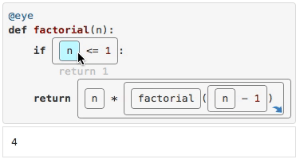<br />无论如何运行或编辑代码，都可以使用Birdseye。只需要安装好依赖：
```bash
pip install birdseye
```
并在代码函数上方添加 `@eye` 装饰器（如上动图所示），即可根据需要运行函数，并在浏览器中查看结果。<br />它还可以与一些常用工具集成在一起，如 Pycharm 和 Vscode，以提供更流畅的体验，后续会介绍如何将其与这些工具结合使用。<br />它不仅仅能够单步执行，还能在循环迭代中来回移动，并查看所选表达式的值如何变化：<br />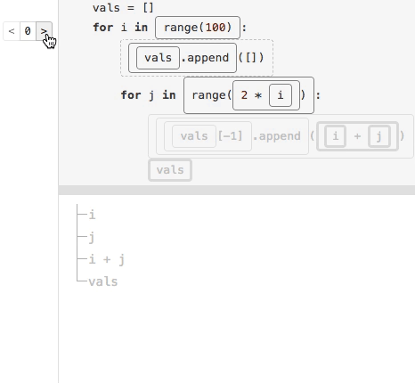<br />通过 birdseye 能很容易地知道哪些表达式引发了异常：<br />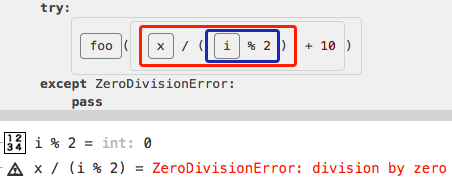<br />也能够展开具体的数据结构和对象以查看其内容:<br />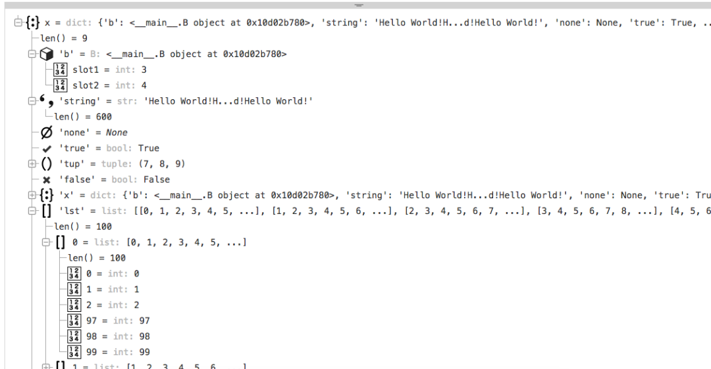<br />调用会按功能组织（文件组织）并进行时间排序进行显示，一目了然地看到发生了什么：<br />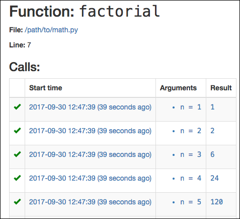
<a name="e2yuL"></a>
## 1、快速上手
首先，使用 pip 安装 birdseye ：
```bash
pip install birdseye
```
然后，对需要进行调试的函数使用eye装饰器：
```python
from birdseye import eye

@eye
def foo():
```
在调用该函数完成后，在终端运行命令打开Birdseye的Web服务：
```python
python -m birdseye
```
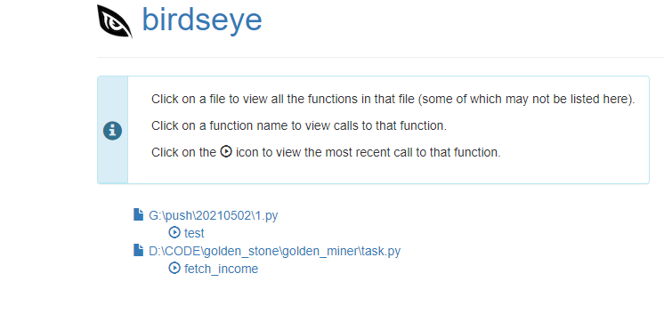<br />在浏览器打开http://localhost:7777 就能看到需要调试的函数执行流程了。点击下图的按钮即可跳转到最新的函数调用。<br />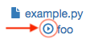
<a name="ZOE5m"></a>
## 2、在Pycharm中集成调试
在 Pycharm 的 Settings 中，点击 Plugins 插件市场搜索 birdseye 点击 install 安装。<br />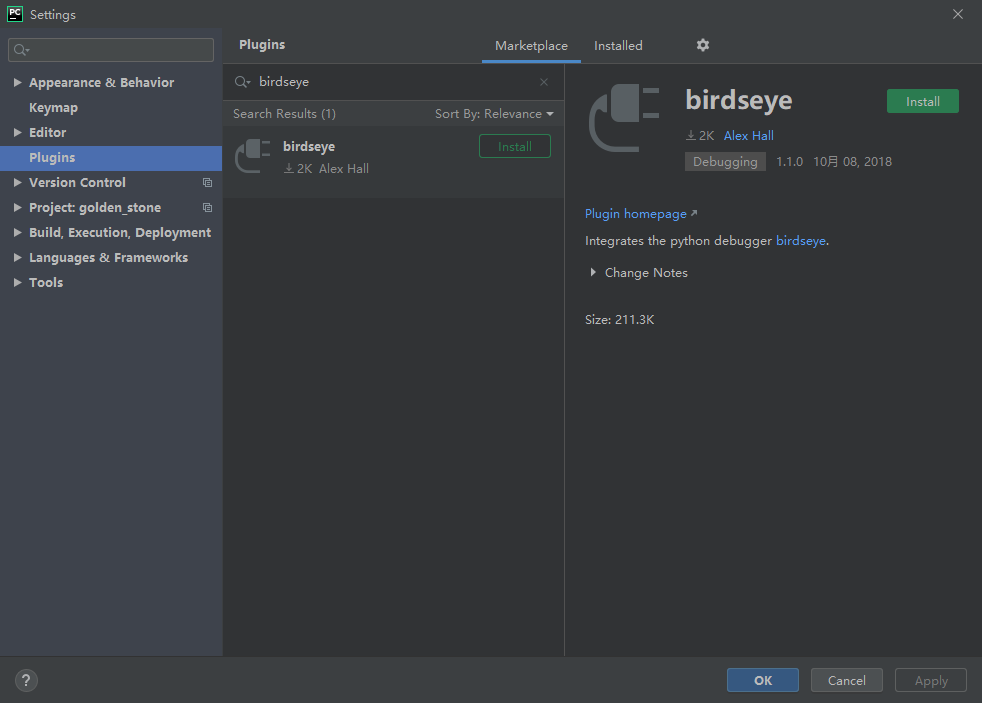<br />安装完成后重启Pycharm，就可以在 Pycharm 中使用 birdseye了：<br />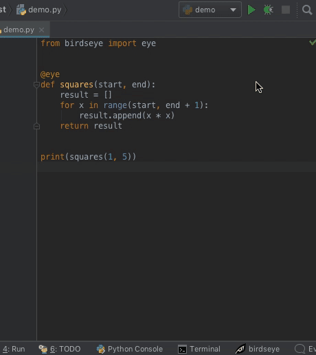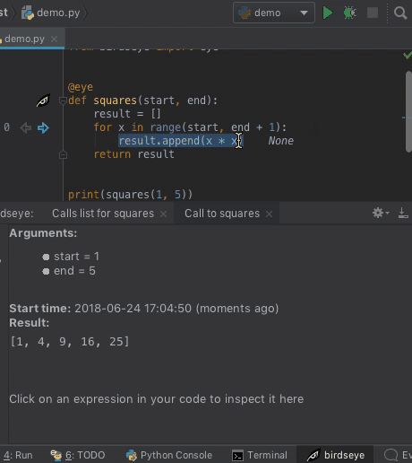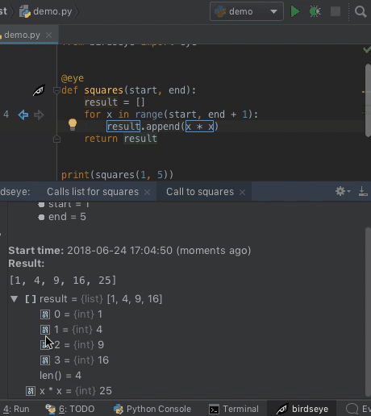<br />默认情况下，该插件还可以自动运行Birdseye服务器，因此就不需要输入 `python -m birdseye` 那行命令了。
<a name="N7BwV"></a>
## 3、在VSCode中集成调试
在VSCode中继承调试Birdseye也非常方便，点击左侧的扩展商店，在弹出框中输入搜索 birdseye，并点击 install 安装：<br />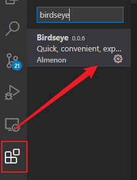<br />安装完成后，点击 F1 输入Birdseye，就能显示调试界面：<br />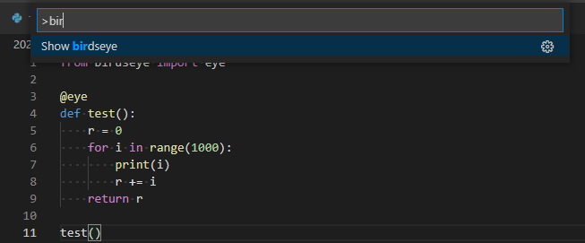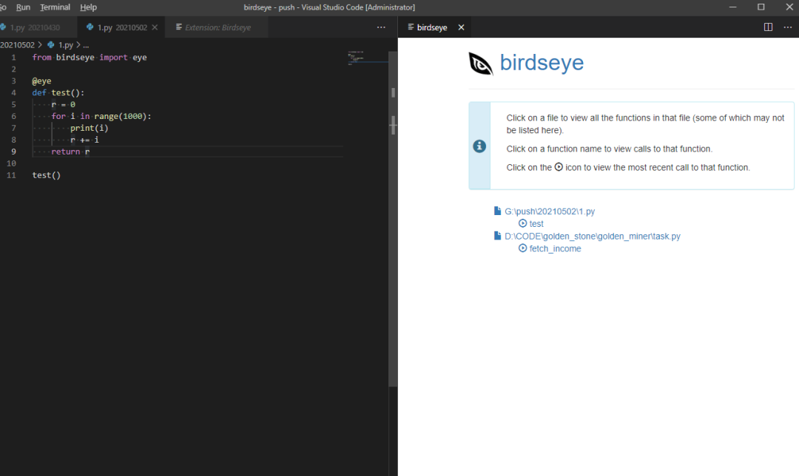<br />如果无法正常显示右侧调试界面，并提示未安装birdseye，但实际上已经安装成功了，这一般是路径错误导致的，请在扩展设置中手动更改Python路径为安装了Birdseye的Python。<br />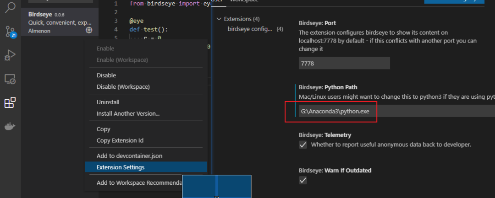
<a name="En195"></a>
## 4、美中不足
Birdseye 是一个非常强大的调试工具，这还是有缺点可以改善的：
<a name="bV6bR"></a>
### 1.为了防止堆栈过大，每个迭代它最多只保留6个(前三、末三)元素：
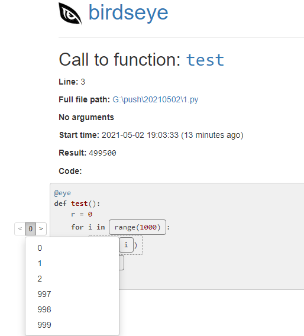<br />因此如果想看一些特殊元素值的执行情况，它可能不会如你所愿。<br />不过，不需要担心某些分支调试不到，因为 birdseye 有个保险机制：如果一个表达式仅在某种特定情况下会被执行，那么执行时的元素也会被加入到可调试元素中。
<a name="Fqhi5"></a>
### 2.由于需要记录堆栈，程序会大大减慢速度，因此它绝对不适合上到生产环境。
<a name="vved1"></a>
### 3.每个函数调用Birdseye 都需要收集许多数据，对于某些极其复杂的函数调用，可能会引发内存问题。
如果不担心这三个缺点，而且希望能快速方便地看到函数中不同分支的执行情况，那么Birdseye就是不二之选。
