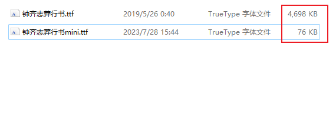
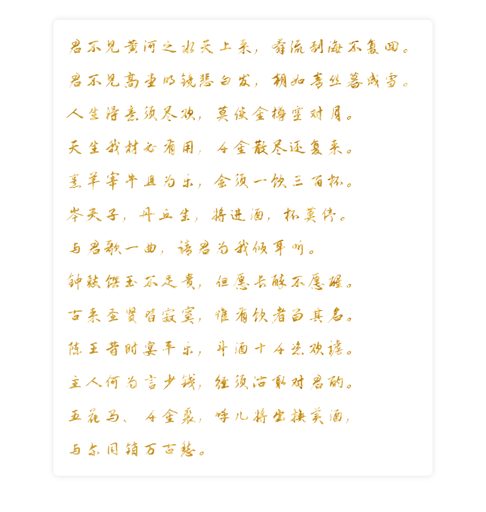

Python<br />日常进行数据可视化、web应用开发等场景中，经常会用到一些特殊的非系统自带字体，尤其是中文字体，由于包含的字符数量众多，因此体积一般都比较大，这在进行数据可视化读取字体文件，或是网页应用中通过网络加载字体文件时，就会带来更多的耗时。<br />完全可以针对字体文件运用“按需引入”的思想，从原始的体积较大的全量字体文件中，根据实际使用到的文字范围，进行子集的提取，从而大幅度提升效率。<br />可以利用Python中的fonttools库来快捷实现此项需求，它由谷歌开源，自带了若干实用的字体处理相关命令行工具，使用`pip install fonttools`安装完成后，只需要按照下列格式执行命令行工具pyftsubset即可：
```bash
pyftsubset 原始字体文件路径 --text=需要保留的字符 --output-file=输出子集字体文件路径
```
而当需要进行保留的字符众多时，则可以通过书写Python脚本的方式，批量拼接命令行进行模拟执行：
```python
import os
import re

# 读入目标文本内容
with open('./将进酒.txt', encoding='utf-8') as t:
    source_content = t.read()

# 模拟执行pyftsubset命令生成字体子集
os.system(
    'pyftsubset 钟齐志莽行书.ttf --text={} --output-file=钟齐志莽行书mini.ttf'.format(
        # 去除空白字符后去重
        ''.join(set(re.sub('\s', '', source_content)))
    )
)
```
通过上面的示例代码，从本地原体积为4698kb的字体文件中，提取出大小仅有76kb的目标子集字体文件：<br /><br />在此基础上，就可以在项目中**「大幅度」**优化外部字体的使用效率😉，譬如下面的示例dash应用：<br />
