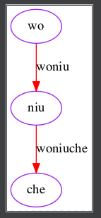
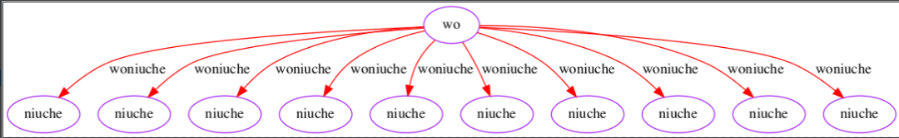
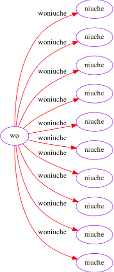
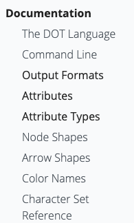

Python graphviz
<a name="YzFew"></a>
## 安装
```bash
pip install graphviz
```
或者 anaconda下
```bash
conda install graphviz
```
<a name="rtZ5y"></a>
## code
<a name="qxnvp"></a>
### 简单example说明
```python
from graphviz import Digraph

dot = Digraph(name="MyPicture", comment="the test", format="png")


dot.node(name='a', label='wo', color='purple')
dot.node(name='b', label='niu', color='purple')
dot.node(name='c', label='che', color='purple')

dot.edge('a', 'b', label='woniu', color='red')
dot.edge('b', 'c', label='woniuche', color='red')

dot.render('checheche', view=False)
```
其中label就是显示的标签 node是点， edge是链接node的线，name是本身一个node的标志可以理解为id，所以edge在连接的时候主要是以name为标准，结合代码和结果一看便知。<br />reader里面的view如果为true，则会自动把图像显示出来，否则就是保存，不会实时预览。<br />最终生成两个文件<br /><br /><br />还有个没有后缀的文件，是dot的原始文件<br />里面是这样的，这种语法是dot语法，具体看文档 [http://www.graphviz.org/doc/info/lang.html](http://www.graphviz.org/doc/info/lang.html)
```python
// the test
digraph MyPicture {
    a [label=wo color=purple]
    b [label=niu color=purple]
    c [label=che color=purple]
    a -> b [label=woniu color=red]
    b -> c [label=woniuche color=red]
}
```
<a name="mWfeW"></a>
### 如果子节点太多了
比如这种就很影响美观，需要转90度 添加 `dot.graph_attr['rankdir'] = 'LR'`
```python
from graphviz import Digraph

dot = Digraph(name="MyPicture", comment="the test", format="png")

dot.graph_attr['rankdir'] = 'LR'
dot.node(name='a', label='wo', color='purple')

for i in range(10):
    dot.node(name='{}'.format(str(i)), label='niuche', color='purple')
    dot.edge('a', '{}'.format(str(i)), label='woniuche', color='red')

dot.render('checheche', view=False)
```

<a name="q5c4i"></a>
## 出现问题`CalledProcessError: Command ‘[‘dot‘, ‘-Tpdf‘, ‘-O‘,`
因为diagraph在用的时候不光是python环境下要有，所运行的环境下也要有，所以在linux下也要装一下，对应的windows下也要装<br />不要忘记装完之后添加环境变量这种常规操作。

- linux下：`sudo apt-get install graphviz`
1. 首先安装graphviz
2. 添加path
3. 之后输入cmd进行启动
<a name="YvacT"></a>
## dot语法
[http://www.graphviz.org/doc/info/lang.html](http://www.graphviz.org/doc/info/lang.html)<br />这个实现画图的工具还是很强大的<br />可以看下文档<br /><br />里面对与颜色 node点和arrow箭头等等都有很多类型可以选择。<br />也可以画各种各样的图。<br />[https://graphviz.org/gallery/](https://graphviz.org/gallery/) 这里有很多例子和对应的语法结构，可以参考。
