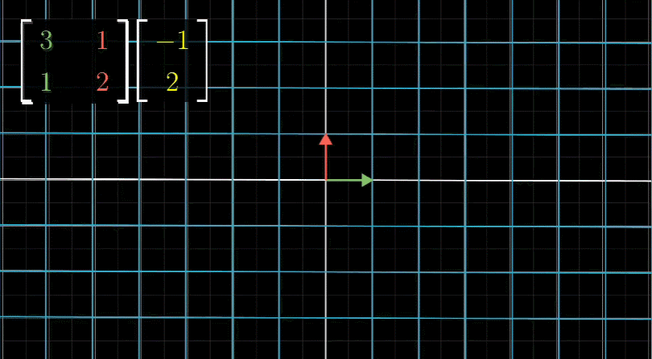
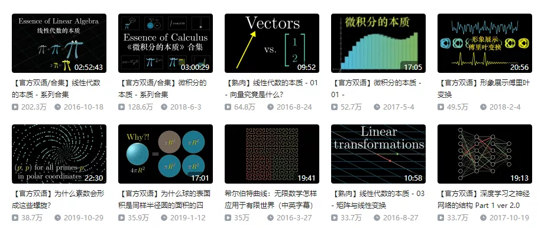
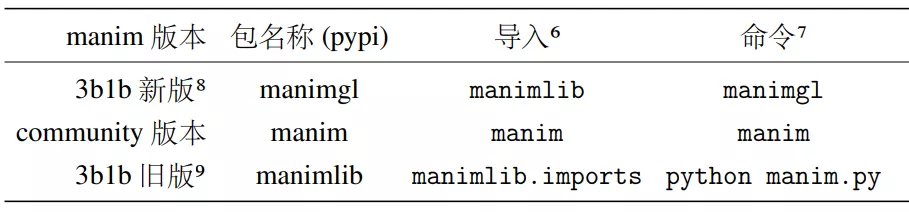
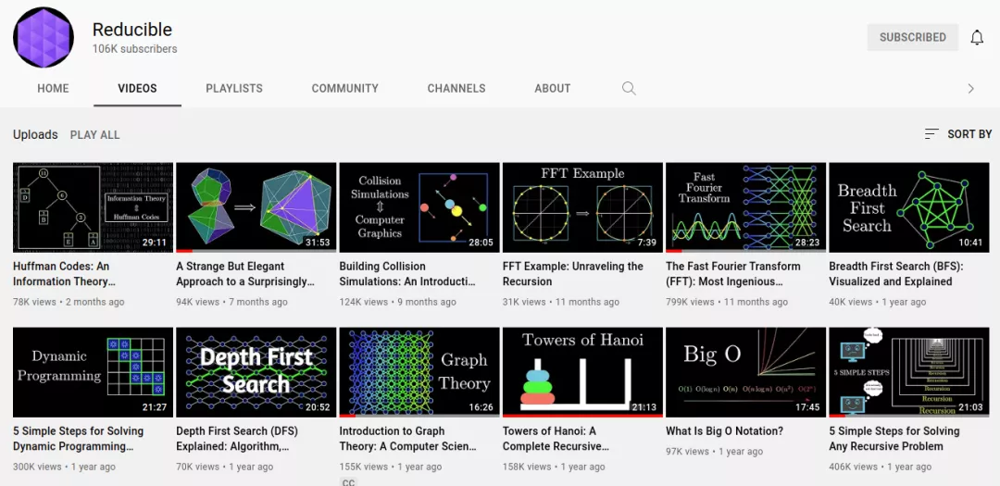

Python
<a name="pTHxr"></a>
## 简介
manim是斯坦福大学数学系小哥Grant Sanderson开源的数学仿真模拟python库，并用于YouTube 频道3Blue1Brown，来解说高等数学。<br />manim是一个非常优秀的数学动画制作引擎，先来两个GIF感受一下 manim 的魅力：<br /><br />很多同学应该在 B 站看过3b1b的视频，最经典的就是线性代数的本质系列。
<a name="gpo98"></a>
## 版本说明
manim 初学者可能会有些许困惑，网上的代码、文档、教程等差异太大，不知道该跟着那个学习。<br />目前manim有三个版本：<br /><br />3b1b 旧版：3blue1brown 自己维护的版本，使用 Cairo 作为后端。<br />3b1b 新版：3blue1brown 自己维护的版本，使用 OpenGL 和 moderngl 来进行 GPU 渲染，优点是速度快。<br />manim 社区版：manim 旧版的衍生，更新更活跃，有很好的文档和社区支持。<br />这里直接学习了新版。
<a name="Zt04X"></a>
## manimgl 环境搭建
manimgl 这个版本的安装特别简单
<a name="gNVq4"></a>
### 1、安装配置FFmpeg和LaTex
FFmpeg：[https://ffmpeg.org/download.html](https://ffmpeg.org/download.html)下载安装即可，把安装路径添加到环境变量即可<br />LaTex：[https://mirror.ctan.org/systems/texlive/tlnet/install-tl-windows.exe](https://mirror.ctan.org/systems/texlive/tlnet/install-tl-windows.exe) 更简单，一路下一步即可。
<a name="ZXcCC"></a>
### 2、创建虚拟环境
```bash
conda create -n manim python=3.8
conda activate manim
```
<a name="QI9GO"></a>
### 3、安装manimgl包
```bash
pip install manimgl
```
也可以clone最新的源码进行安装
```bash
git clone https://github.com/3b1b/manim.git
cd manim
pip install -e .
```
这样还能测试一下是否安装成功了。
```bash
manimgl example_scenes.py OpeningManimExample
```
<a name="rvWaR"></a>
## 学习资源
官方文档：[https://3b1b.github.io/manim](https://3b1b.github.io/manim)<br />中文文档：[https://docs.manim.org.cn/](https://docs.manim.org.cn/)<br />3b1b 视频源码：[https://github.com/3b1b/videos](https://github.com/3b1b/videos)<br />manim 源码：[https://github.com/3b1b/manim](https://github.com/3b1b/manim)<br />可以先看中/英文文档，然后就动手制作自己的动画。有空可以看看3b1b的视频（结合源码）,如另有余力，如果能为manim贡献代码就更好了。<br /><br />最近在youtube上看到了一个用 manim 制作了数据结构与算法的视频，就挺强的。<br /><br />视频源码：[https://github.com/nipunramk/Reducible](https://github.com/nipunramk/Reducible)
