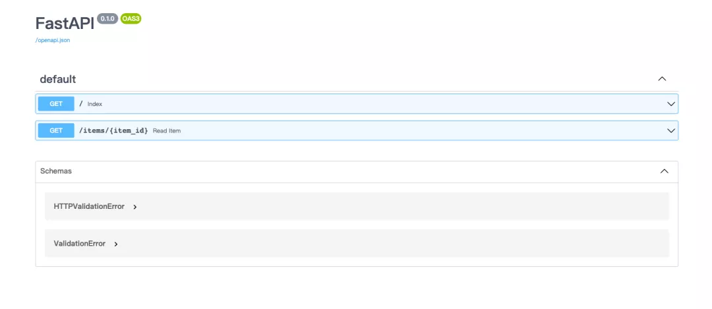
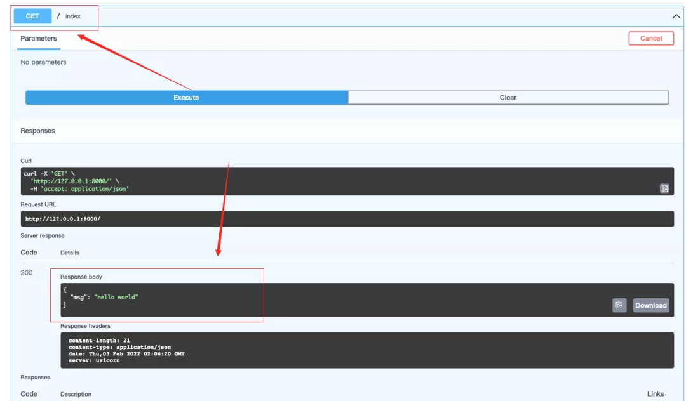
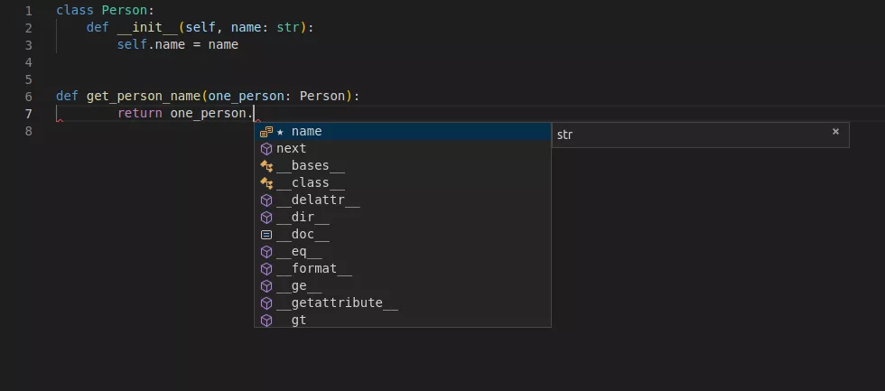
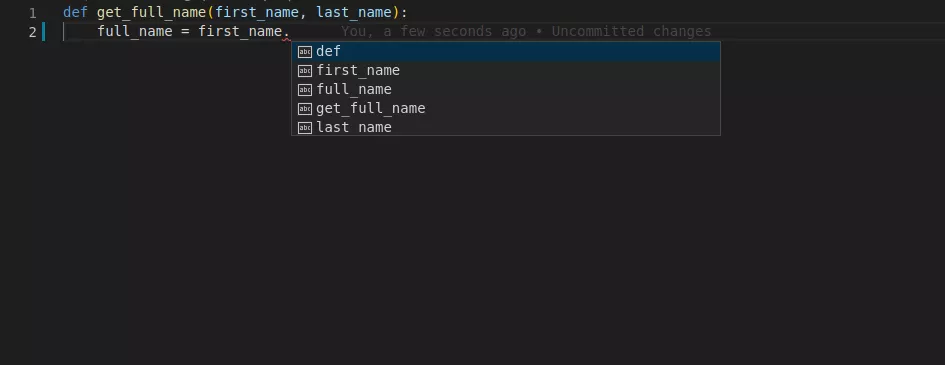

Python Web FastAPI
<a name="xNOuH"></a>
## 安装fastapi以及ASGI（ASGI是WSGI的升级版，支持异步调用）
```bash
pip install fastapi
pip install uvicorn
```
安装完毕之后，创建一个main.py ，然后粘贴下面的代码跑一下：
```python
from fastapi import FastAPI
app = FastAPI()
@app.get("/")
def index():
    return {"msg": "hello world"}

@app.get("/items/{item_id}")
def read_item(item_id: int, keyword: str):
    return {"item_id": item_id, "keyword": keyword}
```
<a name="wZ1IT"></a>
## 运行
如何运行呢？<br />直接 `python main.py` ？<br />不是的，上面已经安装了uvicorn，就直接用它来运行
```bash
$ uvicorn main:app --reload --port 8000
$ curl http://127.0.0.1:8000
$ curl http://127.0.0.1:8000/items/1?keyword=book
```
介绍一下上面几个命令行的意思。<br />首先第一个 `uvicorn main:app --reload --port 8000`<br />其中的main 指的是文件名，app指的是在代码中`FastAPI()`这个类赋予的变量名，例如在上面`app = FastAPI()`，所以这里就是app。`--reload`是热部署的意思，热部署就是指改动代码服务器会自动更新代码文件然后重新运行。`--port`指接口服务提供在那个端口。<br />其次curl ，可以理解为是一个请求web资源的命令行。<br />最后，运行完成，可以看到输出了一个json类型字符串<br /><br />当然也可以在浏览器中访问。
<a name="cl9Ck"></a>
## openAPI支持
fastapi是一个符合OpenAPI 和 JSON Schema的框架。所以fastapi也支持了API文档的自动生成，这一点对程序员来说真的是非常非常的舒服。如何访问呢？<br />http://127.0.0.1:8000/docs 在后面加个docs就行了<br /><br />http://127.0.0.1:8000/redoc<br />这样也能访问，只不过是换了一个api文档<br /><br />可以理解为它是一个api管理和调试的工具箱。编写的api接口都能够通过它来进行管理和调试。<br />例如下面，可以直接调用之前写的/ 接口。<br />
<a name="An8mY"></a>
## 新玩法的引入
上面写的代码跟大家平时写的有一点点不同：
```python
@app.get("/items/{item_id}")
def read_item(item_id: int, keyword: str):
    return {"item_id": item_id, "keyword": keyword}
```
主要是在这一行 `def read_item(item_id: int, keyword: str):`<br />因为fastapi是一个比较年轻的api框架，创立于2018年12月，距今不到两年。<br />所以也引入了Python3.6+中比较新的类型提示功能。其实就是使用了`pydantic`这个库实现的。<br />这里引入官网的几张图来给大家直观的看看<br /><br /><br />可以通过声明变量的类型，编辑器和一些工具能提供更好的支持。引入这个的目的也是为了fastapi中的fast，让开发更加快！在官网中也说了高效编码：提高功能开发速度约 200％ 至 300％。
