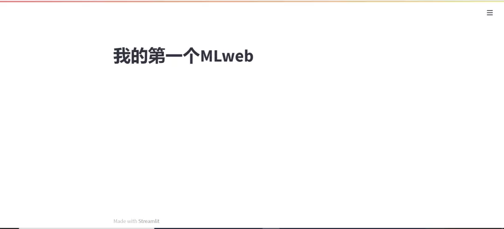
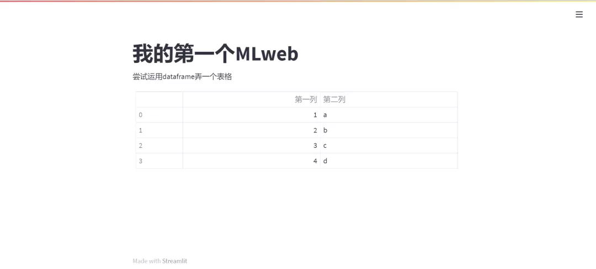
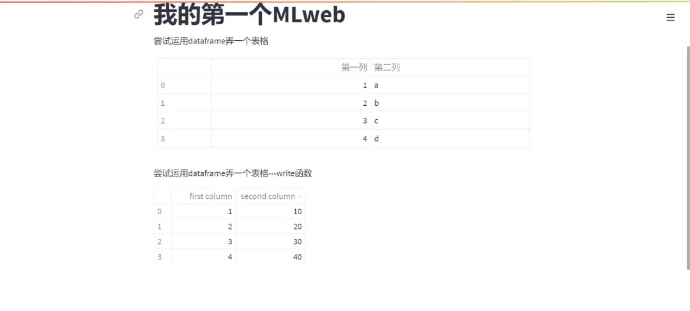
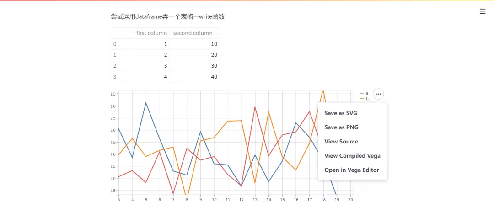
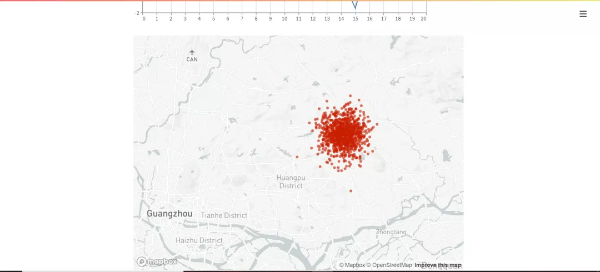

Python PythonWeb<br />Steamlit可以快速利用简单的代码快速布局自己想要的web界面！
<a name="AbHNh"></a>
## 一、安装与运行
安装之前，需要将 Python 的版本升级到3.7或以上，同时设置好环境变量。<br />在 Windows 或 macOS 中都可以使用pip进行安装
```python
pip install streamlit
```
在终端输出完毕后，可以执行streamlit hello来检验，如果出现新的网页界面，则说明安装成功。<br />并且之后利用Streamlit写的程序，需要通过运行`streamlit run {你的py文件}`来实现。
<a name="tK7OR"></a>
## 二、常用命令
接下来了解 Streamlit 的一些常用命令。首先引入相关库
```python
import streamlit as st
import numpy as np
import pandas as pd
import time
```
构建 MLweb 的标识题目，可以利用`st.title()`函数创建一个标题。
```python
st.title('我的第一个MLweb')
```
保存这个py文件，命名为test.py，利用第一部分讲解如何运行代码，在命令窗口输入`streamlit run test.py`。<br />注意，这里直接用 streamlit 是已经调好了环境变量，如果不想调的，打开 streamlit 的源程序文件，将streamlit的exe文件调用即可。<br />正常运行下会弹出一个 localhost网页，效果如下<br />
<a name="njHCD"></a>
### 输入文字
如果需要输入文字，可以用`st.text_input()`函数
<a name="pj4bn"></a>
### 构建MLWeb表格
机器学习里面必须要做的是查看数据的类型，维度等具体特征。比如总是用到`df.head()`，那么在MLweb里面怎么实现？<br />有几个方法：`st.table()`，`st.dataframe()`，`st.write()`。<br />其中`st.write()`是常见的表格函数，`st.write()`被称为streamlit库的瑞士军刀，图像、文本、表格都可以用它来实现，至于三者有什么区别呢？

- `st.write()`：交互式表格，不可修改
- `st.table()`：静态表格
- `st.dataframe()`：返回一个可以使用和修改的对象，可以向其中添加数据或替换数据.

代码如下
```python
st.write("尝试运用dataframe弄一个表格")
df = pd.DataFrame({
    '第一列':[1,2,3,4],
    '第二列':['a','b','c','d']})
st.table(df)
st.write("尝试运用dataframe弄一个表格---write函数")
st.write(pd.DataFrame({
    'first column': [1, 2, 3, 4],
    'second column': [10, 20, 30, 40]
}))
```
效果如图：<br /><br />利用write函数则效果如下<br />
<a name="FbYnW"></a>
## 可视化
机器学习挖掘数据的过程中可视化同样占据了举足轻重的地位，这里使用`st.line_chart()`函数
```python
chart_data = pd.DataFrame(
     np.random.randn(20, 3),
     columns=['a', 'b', 'c'])

st.line_chart(chart_data)
```
效果如下：<br />可以看到，streamlit给了方便的功能：下载或查看构建的图片，甚至可以查看图片的源代码！
<a name="XfsoE"></a>
## 地图
streamlit里面有一个它时常拿来当门面的图，就是旧金山的地图，或许利用Flask在创建地图，读取坐标点，个性化地图，显示在web端这些步骤花费大量时间。<br />而在这里，需要提供坐标点构成的数据框，并用`st.map()`函数即可，这里用广东广州的坐标点(不太精准)来画图<br />代码如下：
```python
map_data = pd.DataFrame(
    np.random.randn(1000, 2) / [50, 50] + [23.26, 113.57],  #N,W
    columns=['lat', 'lon'])
st.map(map_data)
```
效果图如下
<a name="KbqFb"></a>
## 实战
最后来实现一个简单股票查询系统。基本想法如下<br />输入：用户写入股票代码，起始时间，结束时间。<br />输出：股票交易数据表，股票ma线可视化。<br />首先引入包
```python
import streamlit as st
import pandas as pd
import numpy as np
import tushare as ts
```
接下来设置标题与可写入文本,这里的文本是在web端输入的，用到`st.text_input()`函数
```python
st.title('股票查询系统')
code = st.text_input('你的股票名称：',help = 'code：股票代码，即6位数字代码，或者指数代码（sh=上证指数 sz=深圳成指 hs300=沪深300指数 sz50=上证50 zxb=中小板 cyb=创业板）')
start_time = st.text_input('起始时间：')
stop_time = st.text_input('结束时间：')
```
注意：这里的日期时间默认以年-月-日格式输入，同时在股票名称旁边加入一个辅助帮助说明。<br />现在进行股票名称获取，用tushare库作为股票交易数据获取，注意需要tushare的pro接口的api才能通过股票代码获取股票公司名称
```python
def get_name(stoke_code):
    pro=ts.pro_api()
    dat = pro.query('stock_basic', fields='symbol,name')                
    company_name = list(dat.loc[dat['symbol'] == stoke_code].name)[0] 
    return company_name
```
接着对股票交易数据显示，用到`st.dataframe()`函数来让用户更直观的看到获取的交易数据
```python
data = ts.get_hist_data('{}'.format(code),start = '{}'.format(start_time),
                 end = '{}'.format(stop_time))
st.write('股票代码为{}的交易数据表'.format(code))
st.dataframe(data)
```
最后可视化ma短线长线
```python
if code != '':
    data1 = data[['close','ma5','ma10']]
    st.line_chart(data1)
else:
    pass
```
MACD治标是大家常看的指标，那么将ma5和ma10在图标上显示，并画上收盘价。
