Python<br />Streamlit 是一个用于机器学习、数据可视化的 Python 框架，它能几行代码就构建出一个精美的在线 app 应用。<br />它能做什么，取决于想干什么？<br />streamlit 的功能强大，要学习的函数虽然多，但非常容易上手，学习成本却远比 前端+Flask 来得低得低。接下来会一一介绍。
<a name="HRLFi"></a>
## 1、安装
和安装其他包一样，安装 streamlit 非常简单，一条命令即可
```bash
➜ pip install streamlit 
```
考虑到 streamlit 会附带安装比较多的工具依赖包，为了不污染当前的主要环境，使用 venv 新建一个虚拟环境。
```bash
➜ python3 -m venv .
```
然后使用如下命令进入该虚拟环境
```bash
➜ source ./venv/bin/activate
```
接下来，再安装 streamlit ，命令在上边。<br />安装的包比较多（数了下竟然接近 92 个？），过程也会很久，需要点耐心
```bash
➜ pip list | wc -l
      92
```
在安装过程中，可能会遇到一些问题，但也不一定，这取决于机器，如遇到问题请自行借助搜索引擎解决。
<a name="eujKd"></a>
## 2、入门示例
Streamlit 提供了一些入门示例，执行如下命令即可
```bash
➜ streamlit hello
```
执行后 streamlit 会自动打开浏览器加载一个本地页面 http://localhost:8501/<br />这里面有很多的 demo，可以看一下，这些 Demo 还有对应的配套代码<br />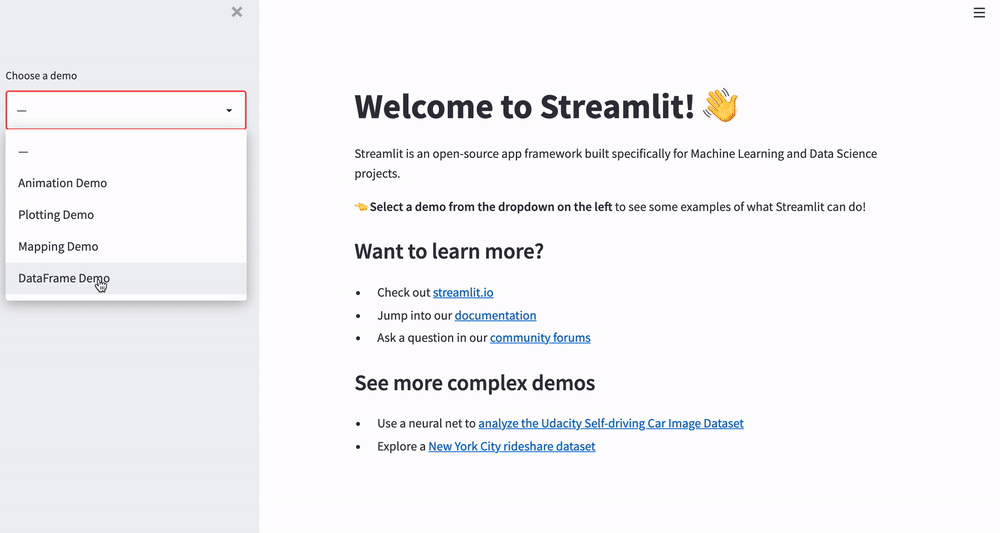<br />这些代码直接拷贝保存，就可以在本地直接通过如下命令直接运行
```bash
➜ streamlit run st-demo.py
```
<a name="hYUiK"></a>
## 2、Markdown 文本
导入 streamlit 后，就可以直接使用 `st.markdown()` 初始化，调用不同的方法，就可以往文档对象中填入内容

- `st.title()`：文章大标题
- `st.header()`：一级标题
- `st.subheader()`：二级标题
- `st.text()`：文本
- `st.code()`：代码，同时可设置代码的语言，显示的时候会高亮
- `st.latex()`：latex 公式
- `st.caption()`：小字体文本

如下一个小 Demo，供参考
```python
import streamlit as st

# markdown
st.markdown('Streamlit Demo')

# 设置网页标题
st.title('一个傻瓜式构建可视化 web的 Python 神器 -- streamlit')

# 展示一级标题
st.header('1. 安装')

st.text('和安装其他包一样，安装 streamlit 非常简单，一条命令即可')
code1 = '''pip3 install streamlit'''
st.code(code1, language='bash')


# 展示一级标题
st.header('2. 使用')

# 展示二级标题
st.subheader('2.1 生成 Markdown 文档')

# 纯文本
st.text('导入 streamlit 后，就可以直接使用 st.markdown() 初始化')

# 展示代码，有高亮效果
code2 = '''import streamlit as st
st.markdown('Streamlit Demo')'''
st.code(code2, language='python')
```
Streamlit 运行的方式 与普通的脚本 有所不同，应该使用 `streamlit run st-demo.py`<br />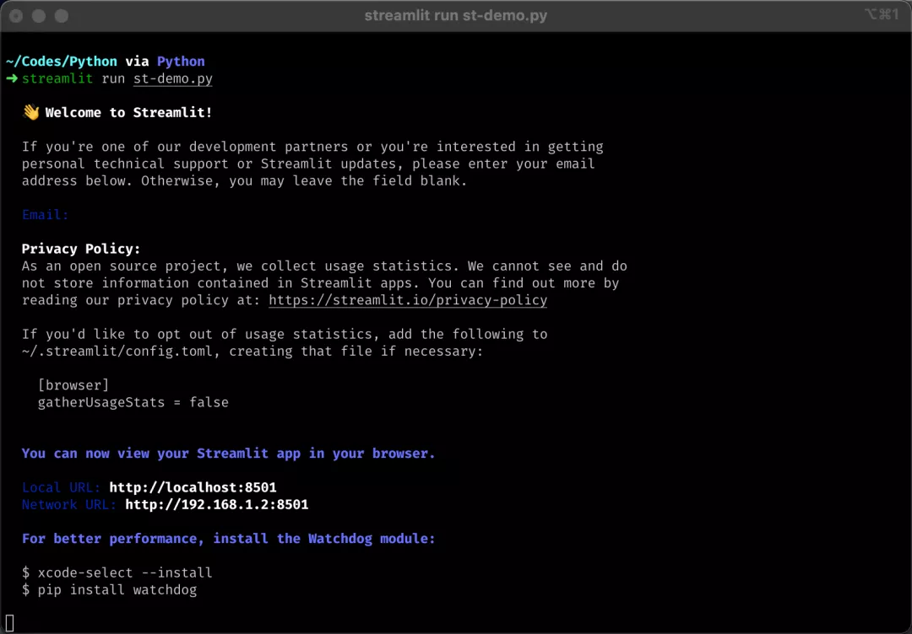<br />运行后就会自动打开浏览器加载这个页面，如果没有自动打开，也可以手动拷贝上图中的链接打开访问。<br />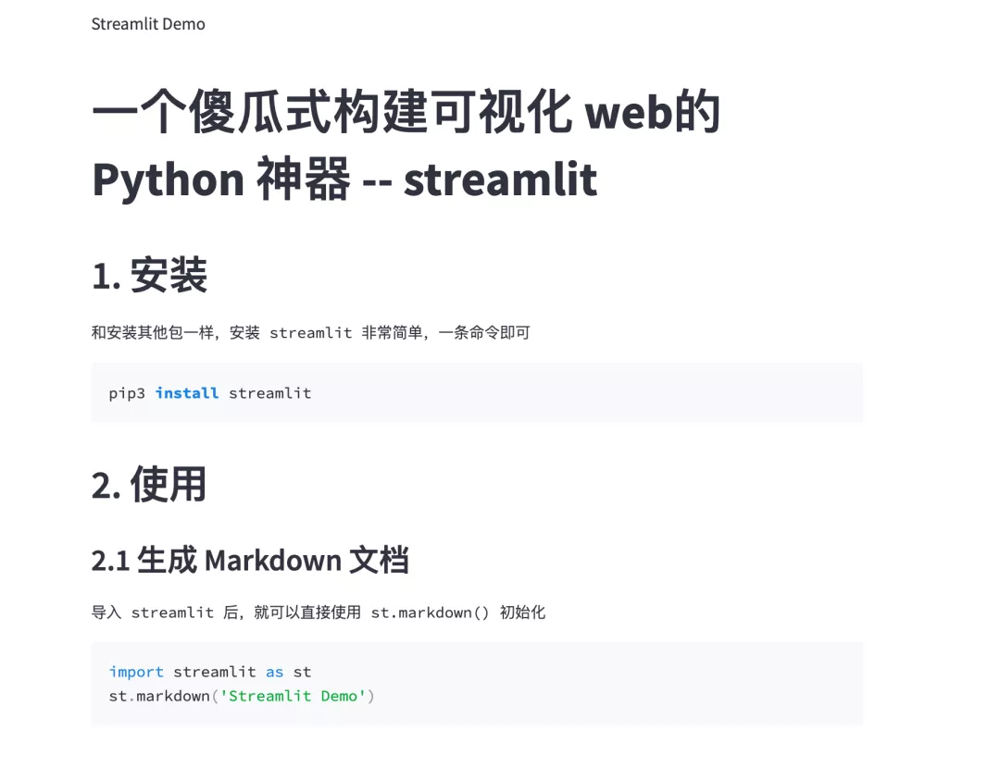
<a name="XfGdb"></a>
## 3、数据图表支持
<a name="wAH14"></a>
### 3.1 图表组件
关于数据的展示，streamlit 由两个组件进行支持

- table：普通的表格，用于静态数据的展示
- dataframe：高级的表格，可以进行数据的操作，比如排序

Table 的示例
```python
df = pd.DataFrame(
    np.random.randn(10, 5),
    columns=('第%d列' % (i+1) for i in range(5))
)

st.table(df)
```
效果如下<br />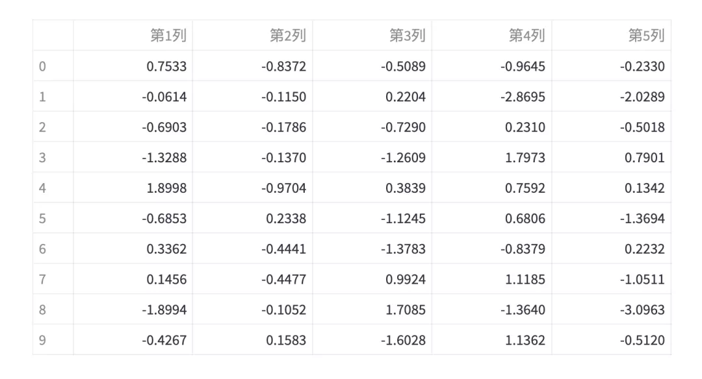<br />Datafram 的示例
```python
df = pd.DataFrame(
    np.random.randn(10, 5),
    columns=('第%d列' % (i+1) for i in range(5))
)

st.dataframe(df.style.highlight_max(axis=0))
```
效果如下，可以看到在图示外，有个向下的小箭头，点一下，就会进行排序<br />除此之外，还能看到对最大值进行了高亮显示，原因是传入的参数是 `df.style.highlight_max(axis=0)`<br />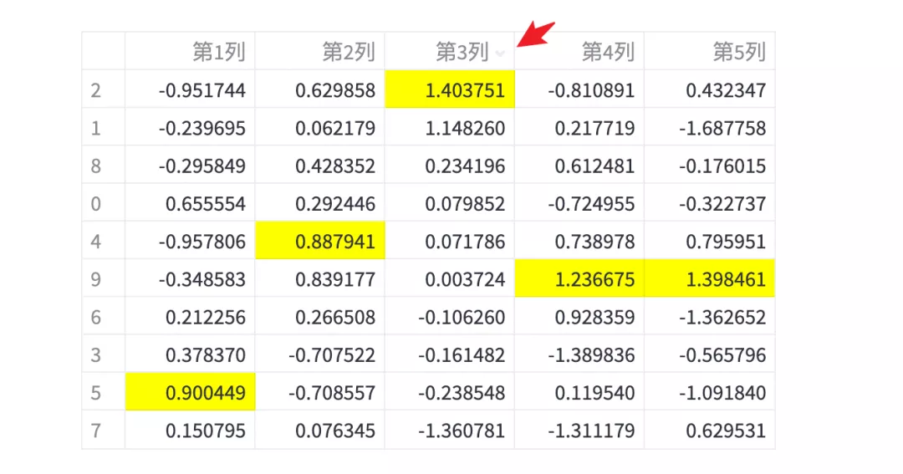<br />其实还有 n 多种样式，比如：

- `highlight_null`：空值高亮
- `highlight_min`：最小值高亮
- `highlight_max`：最大值高亮
- `highlight_between`：某区间内的值高亮
- `highlight_quantile`：暂没用过

这些都可以在源代码中找到示例
<a name="Kkrzw"></a>
### 3.2 监控组件
在采集到一些监控数据后，若需要做一个监控面板， streamlit 也提供的 metric 组件<br />如下代码创建 三个指标，并且填入对应的数据
```python
col1, col2, col3 = st.columns(3)
col1.metric("Temperature", "70 °F", "1.2 °F")
col2.metric("Wind", "9 mph", "-8%")
col3.metric("Humidity", "86%", "4%")
```
刷新页面，就能看到下面的效果<br />
<a name="ryLVR"></a>
### 3.3 原生图表组件
Streamlit 原生支持多种图表：

- `st.line_chart`：折线图
- `st.area_chart`：面积图
- `st.bar_chart`：柱状图
- `st.map`：地图

下面一一展示
<a name="DGpLG"></a>
#### 折线图
```python
chart_data = pd.DataFrame(
    np.random.randn(20, 3),
    columns=['a', 'b', 'c'])

st.line_chart(chart_data)
```

<a name="dlwaa"></a>
#### 面积图
```python
chart_data = pd.DataFrame(
    np.random.randn(20, 3),
    columns = ['a', 'b', 'c'])

st.area_chart(chart_data)
```
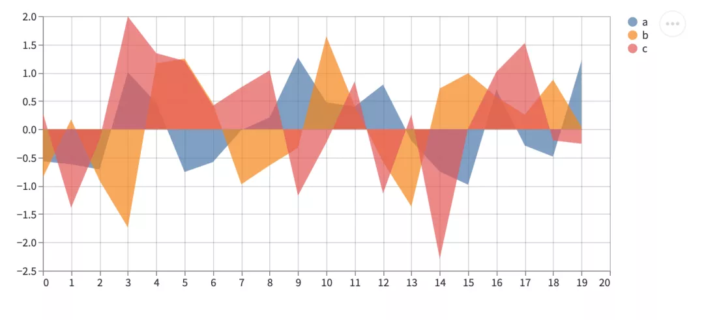
<a name="Ne3xg"></a>
#### 柱状图
```python
chart_data = pd.DataFrame(
    np.random.randn(50, 3),
    columns = ["a", "b", "c"])
st.bar_chart(chart_data)
```
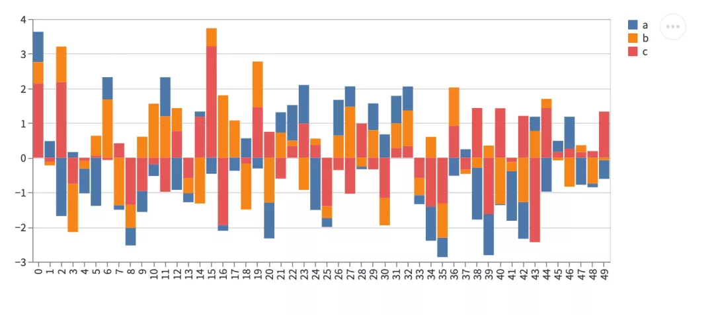
<a name="pjrhN"></a>
#### 地图
```python
df = pd.DataFrame(
    np.random.randn(1000, 2) / [50, 50] + [37.76, -122.4],
    columns=['lat', 'lon']
)
st.map(df)
```
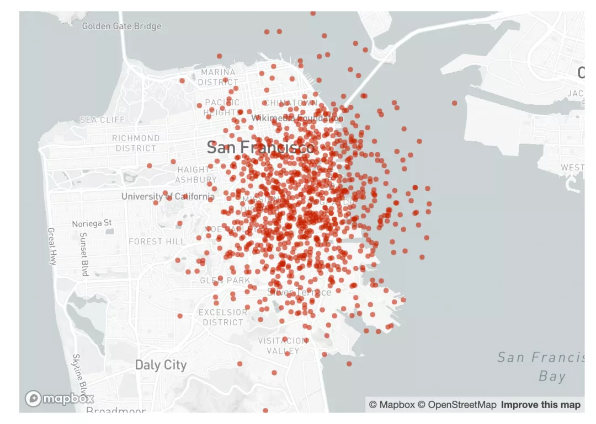
<a name="akwV3"></a>
### 3.4 外部图表组件
Streamlit 的一些原生图表组件，虽然做到了傻瓜式，但仅能输入数据、高度和宽度，如果想要更漂亮的图表，就像 matplotlib.pyplot、Altair、vega-lite、Plotly、Bokeh、PyDeck、Graphviz 那样，streamlit 也提供了支持：

- `st.pyplot`
- `st.bokeh_chart`
- `st.altair_chart`
- `st.altair_chart`
- `st.vega_lite_chart`
- `st.plotly_chart`
- `st.pydeck_chart`
- `st.graphviz_chart`

对于这部分，熟悉的同学自行尝试了，这里不再演示。<br />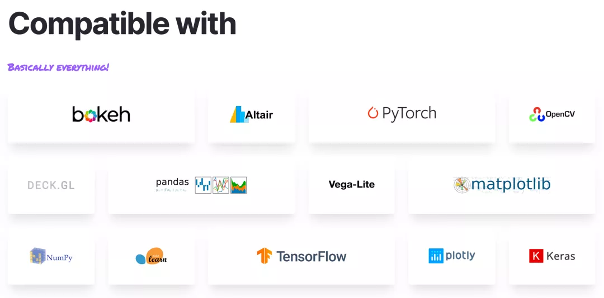
<a name="KL6bs"></a>
## 4、用户操作支持
前面 streamlit 都只是展示文本和数据，如果仅是如此，那 streamlit 也就 just so so<br />对于那些不会前端，并且平时有需要写一些简单的页面的人说，能写一些交互界面才是硬需求。<br />庆幸的是，平时在网页上、app 上能看到的交互组件，Streamlit 几乎都能支持。

- `button`：按钮
- `download_button`：文件下载
- `file_uploader`：文件上传
- `checkbox`：复选框
- `radio`：单选框
- `selectbox`：下拉单选框
- `multiselect`：下拉多选框
- `slider`：滑动条
- `select_slider`：选择条
- `text_input`：文本输入框
- `text_area`：文本展示框
- `number_input`：数字输入框，支持加减按钮
- `date_input`：日期选择框
- `time_input`：时间选择框
- `color_picker`：颜色选择器

这些内容非常多，也比较简单，直接去看 streamlit 源码里的注释即可。<br />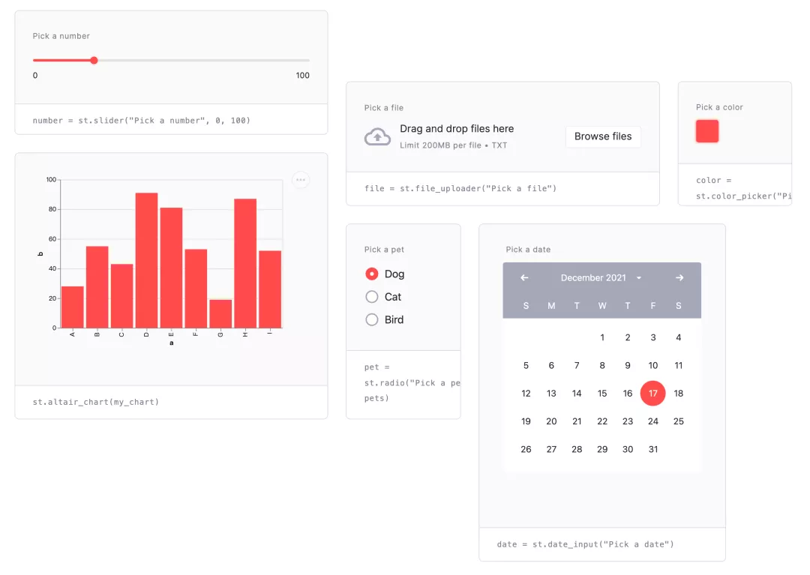
<a name="BLHOL"></a>
## 5、多媒体组件
想要在页面上播放图片、音频和视频，可以使用 streamlit 的这三个组件：

- `st.image`
- `st.audio`
- `st.video`

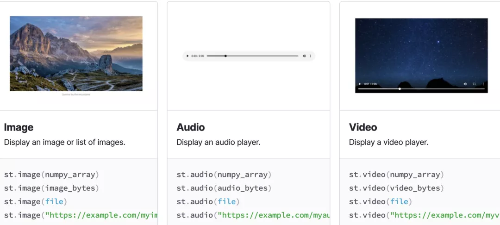
<a name="q9Ybx"></a>
## 6、状态组件
状态组件用来向用户展示当前程序的运行状态，包括：

- `progress`：进度条，如游戏加载进度
- `spinner`：等待提示
- `balloons`：页面底部飘气球，表示祝贺
- `error`：显示错误信息
- `warning`：显示报警信息
- `info`：显示常规信息
- `success`：显示成功信息
- `exception`：显示异常信息（代码错误栈）

效果如下：<br />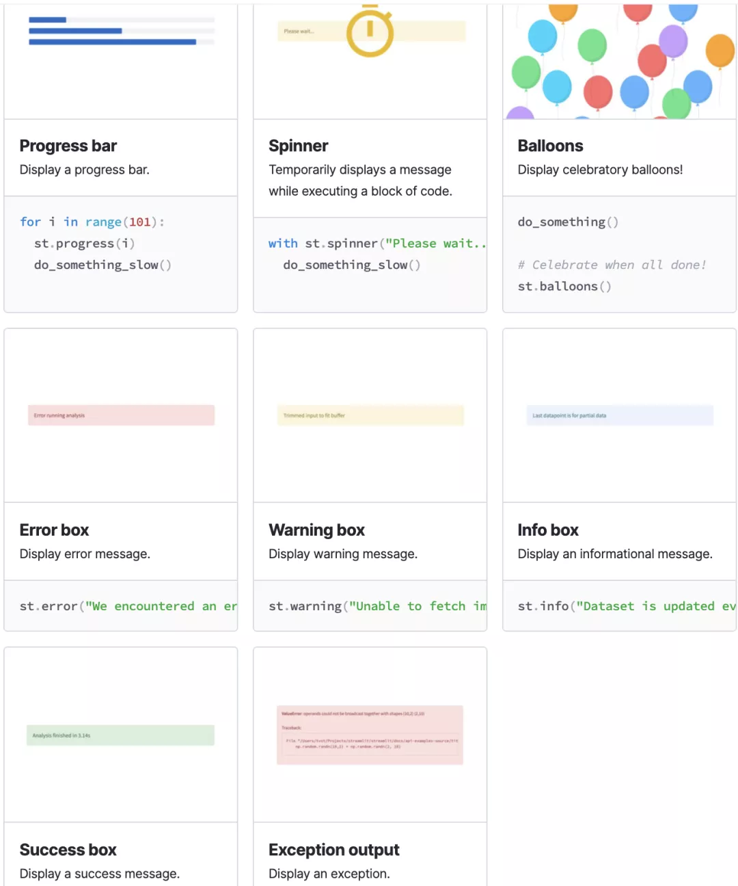
<a name="Bq1yl"></a>
## 7、页面布局
Streamlit 是自上而下渲染的，组件在页面上的排列顺序与代码的执行顺序一致。<br />一个精美的 web app ，只有上下单栏式的布局肯定是不够的。<br />实际上 streamlit 还提供了多种多样的布局：
<a name="BXQOa"></a>
### `st.sidebar`：侧边栏
侧边栏可以做一些用户操作控件<br /><br />`st.columns`：列容器，处在同一个 columns 内组件，按照从左至右顺序展示<br />`st.expander`：隐藏信息，点击后可展开展示详细内容，如：展示更多<br />`st.container`：包含多组件的容器<br />`st.empty`：包含单组件的容器
<a name="kkrWF"></a>
## 8、流程控制系统
Streamlit 是自上而下逐步渲染出来的，若应用场景需要对渲染做一些控制，streamlit 也有提供对应的方法

- `st.stop`：可以让 Streamlit 应用停止而不向下执行，如：验证码通过后，再向下运行展示后续内容。
- `st.form`：表单，Streamlit 在某个组件有交互后就会重新执行页面程序，而有时候需要等一组组件都完成交互后再刷新（如：登录填用户名和密码），这时候就需要将这些组件添加到 form 中
- `st.form_submit_button`：在 form 中使用，提交表单。
<a name="yrxtd"></a>
## 9、缓存特性提升速度
当用户在页面上做一些操作的时候，比如输入数据，都会触发整个 streamlit 应用代码的重新执行，如果其中有读取外部数据的步骤（数 GB 的数据），那这种性能损耗是非常可怕的。<br />但 streamlit 提供了一个缓存装饰器，当要重新执行代码渲染页面的时候，就会先去缓存里查一下，如果代码或者数据没有发生变化，就直接调用缓存的结果即可。<br />使用方法也简单，在需要缓存的函数加上 `@st.cache` 装饰器即可。
```python
DATE_COLUMN = 'date/time'
DATA_URL = ('https://s3-us-west-2.amazonaws.com/'
            'streamlit-demo-data/uber-raw-data-sep14.csv.gz')

@st.cache
def load_data(nrows):
    data = pd.read_csv(DATA_URL, nrows=nrows)
    lowercase = lambda x: str(x).lower()
    data.rename(lowercase, axis='columns', inplace=True)
    data[DATE_COLUMN] = pd.to_datetime(data[DATE_COLUMN])
    return data
```
<a name="pC6nq"></a>
## 10、部署上线
在本地编写的 streamlit 应用，运行起来后只能在本地访问。<br />如果需要让别人也能访问这个应用，那需要有一台服务器，这样才能通过公网ip进行访问<br />另外，还有一个选择，就是使用 Heroku （https://heroku.com）部署应用。<br />Heroku是一个支持多种编程语言的云平台即服务，只要注册一个帐号（听说网易和 QQ 邮箱不行，这里使用的 Gmail 注册的）<br /><br />然后创建自己的 app<br />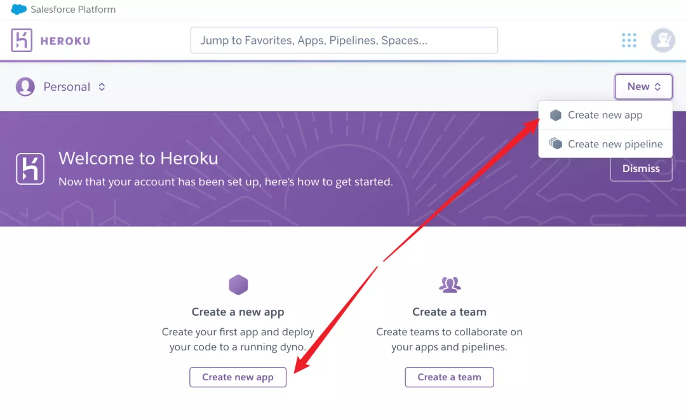<br />这个 App 名字好像是要全网唯一，本想取个 hello-streamlit 的，发现早有人取过了。<br /><br />然后为应用，创建几个 Heroku 规定的文件

- requirements.txt：依赖包文件
- setup.sh：安装脚本，主要是创建文件夹，写入配置文件
- Procfile：启动脚本，告诉 Heroku 如何安装并启动应用

这些文件的编码有固定的格式，这边编写好了一份模板下载地址 [streamlit-demo.zip](https://www.yuque.com/attachments/yuque/0/2021/zip/396745/1640406875319-16933122-e083-4c73-9bc4-ac2c5cea4cbf.zip?_lake_card=%7B%22src%22%3A%22https%3A%2F%2Fwww.yuque.com%2Fattachments%2Fyuque%2F0%2F2021%2Fzip%2F396745%2F1640406875319-16933122-e083-4c73-9bc4-ac2c5cea4cbf.zip%22%2C%22name%22%3A%22streamlit-demo.zip%22%2C%22size%22%3A1034%2C%22type%22%3A%22application%2Fx-zip-compressed%22%2C%22ext%22%3A%22zip%22%2C%22status%22%3A%22done%22%2C%22taskId%22%3A%22u2f05131a-ab02-44b1-9a3b-328ae7565a0%22%2C%22taskType%22%3A%22upload%22%2C%22id%22%3A%22u2e7e92a1%22%2C%22card%22%3A%22file%22%7D)<br /><br />拿到了这份模板后，就可以基于这份模板创建 git 仓库
```bash
git init
git add --all
git commit -m "init"
```
然后部署到 Heroku
```bash
heroku login
heroku create
git push heroku master
heroku ps:scale web=1
```
按照命令行输出的URL就可以访问应用了。<br />查看Heroku日志：
```bash
heroku logs --tail
```
要想使用自己域名，需要先通过Heroku验证。然后运行：
```bash
heroku domains:add hivecnstats.iswbm.com
```
使用 Heroku 唯一的缺点就是 Heroku 是需要梯子的，一般人访问不了，没条件的还是用服务器吧。
<a name="EkEBK"></a>
## 12、总结一下
Streamlit 一个开箱即用的工具集，它可以让一个普通的个人开发者免于学习繁杂的前端知识，就可以轻松、快速的构建一个简洁、优雅的 web app 应用，这是 streamlit 最吸引人的地方。<br />对于从事数据分析，机器学习领域的人来说，它绝对是开发神器，但即使不是这些领域的人，肯定也会有搭建一个 web app 需求的时候，streamlit 正是需要的。
