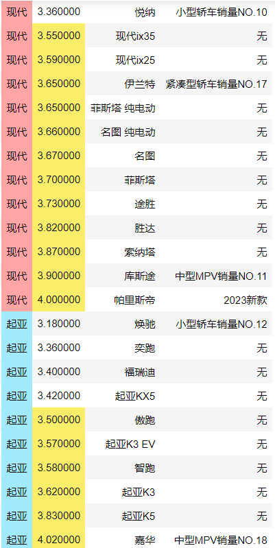
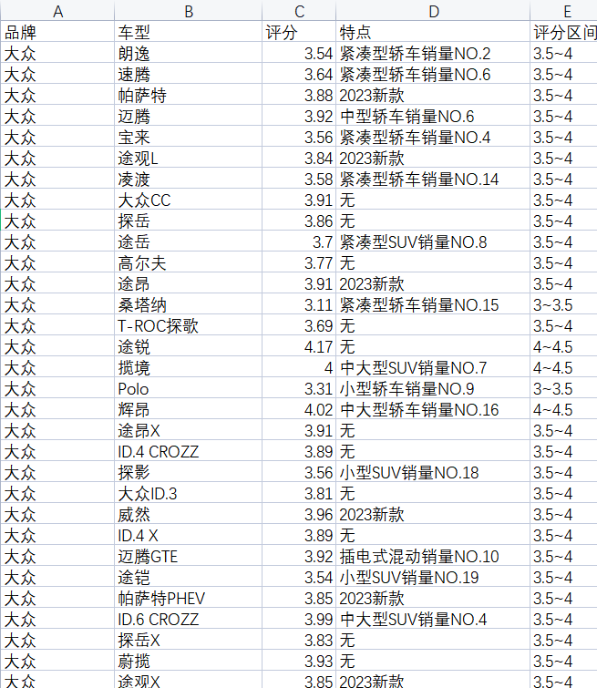
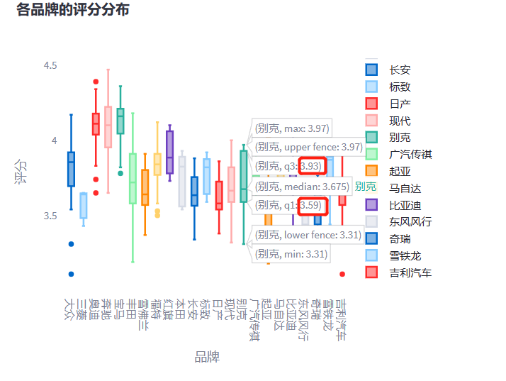
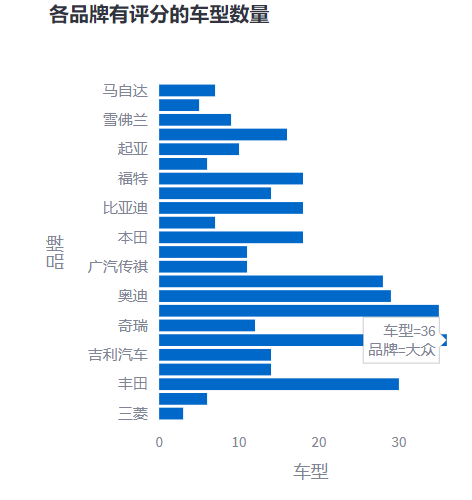
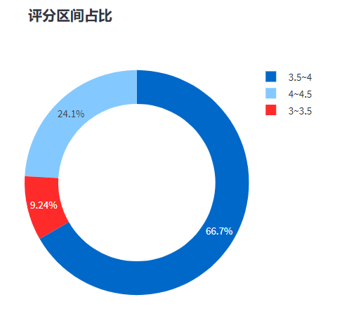
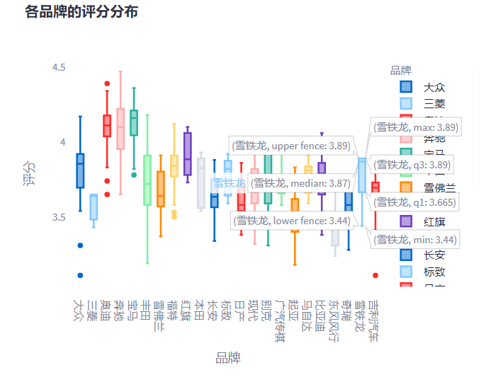
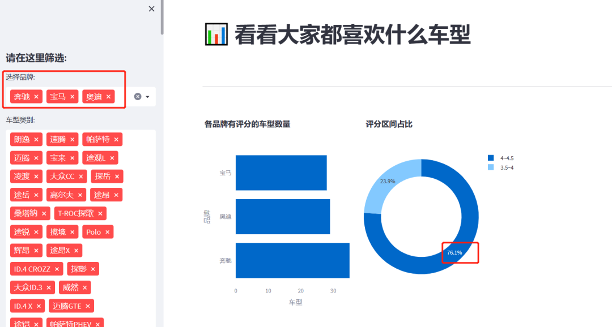
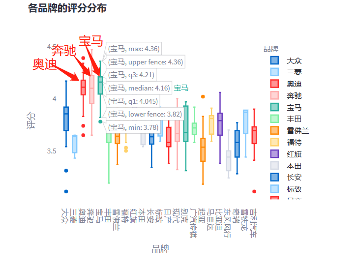

Python<br />爬取懂车帝的车型评分，3000条数据<br /><br />想要把这些数据分析的成果做成应用展示给其他人，怎么办？Streamlit作为数据可视化的Python框架，它能很好的达成想要的效果。关键是使用起来特别方便。
<a name="o0zjn"></a>
## 前提准备
python丰富的模块真赞，这里使用Pandas 处理Excel数据，Plotly 制作可视化图表，Streamlit 搭建可视化页面
<a name="NGF1E"></a>
### 数据准备
数据文件： [carx.xlsx](https://www.yuque.com/attachments/yuque/0/2023/xlsx/396745/1684715405840-6b18cf96-1c3f-4573-ba0a-f6e191936f62.xlsx?_lake_card=%7B%22src%22%3A%22https%3A%2F%2Fwww.yuque.com%2Fattachments%2Fyuque%2F0%2F2023%2Fxlsx%2F396745%2F1684715405840-6b18cf96-1c3f-4573-ba0a-f6e191936f62.xlsx%22%2C%22name%22%3A%22carx.xlsx%22%2C%22size%22%3A58093%2C%22ext%22%3A%22xlsx%22%2C%22source%22%3A%22%22%2C%22status%22%3A%22done%22%2C%22download%22%3Atrue%2C%22taskId%22%3A%22u8bb17d3c-b54b-495e-b63f-fb69dbdac30%22%2C%22taskType%22%3A%22upload%22%2C%22type%22%3A%22application%2Fvnd.openxmlformats-officedocument.spreadsheetml.sheet%22%2C%22__spacing%22%3A%22both%22%2C%22id%22%3A%22ua099b106%22%2C%22margin%22%3A%7B%22top%22%3Atrue%2C%22bottom%22%3Atrue%7D%2C%22card%22%3A%22file%22%7D)<br /><br />说明：原文件包含200多个品牌，这里截取部分数据，只选择了奥迪别克丰田等23个品牌，并且删除了没有评分的车型
<a name="fnMpF"></a>
### 安装依赖库
```python
pip install padans,plotly,streamlit,openpyxl
```
<a name="s2fqM"></a>
## 分析目的
可以作为数据看板，方便的分析数据。比如说，这份数据里如果从箱型图来看，合资品牌中评分口碑最差的就是日产，评分主要区间是几乎最低的，集中在3.54~ 3.72，远低于别克的3.59~ 3.93<br /><br />目标有3个：

1. 找出各品牌有评分的车型数量



2. 评分区间占比分析



3. 各品牌的评分区间分布


<a name="HU94p"></a>
## 代码思路
<a name="fQqCW"></a>
### 导入相关包
```python
import pandas as pd
import plotly.express as px
import streamlit as st
import plotly.graph_objs as go
# 设置网页
st.set_page_config(page_title="数据大屏", page_icon=":bar_chart:", layout="wide")
st.balloons()
```
<a name="m0gHb"></a>
### 读取数据
```python
# 读取数据
def get_data_from_excel():
    df = pd.read_excel(io="C:\drf2\drf2\carx.xlsx",engine="openpyxl",sheet_name="car")
    return df
df = get_data_from_excel()
```
<a name="hkPm0"></a>
### 设计左侧边栏和标题
```python
# 侧边栏
st.sidebar.header("请在这里筛选:")
brand = st.sidebar.multiselect(
    "选择品牌:",
    options=df["品牌"].unique(),
    default=df["品牌"].unique(),
)
category = st.sidebar.multiselect(
    "车型类别:",
    options=df["车型"].unique(),
    default=df["车型"].unique()
)

df_selection = df.query(
    "车型 == @category & 品牌 == @brand"
)

# 主页面标题
st.title(":bar_chart: 看看大家都喜欢什么车型")
st.markdown("##")
```
<a name="jit3Y"></a>
### 画可视化图
```python
# 横向条形图：各品牌有评分的车型数量
sales_by_product_line = (
    df_selection.groupby(by=["品牌"]).count()[["车型"]]
)

fig_product_sales = px.bar(
    sales_by_product_line,
    x="车型",
    y=sales_by_product_line.index,
    orientation="h",
    title="<b>各品牌有评分的车型数量</b>"
)
fig_product_sales.update_layout(
    plot_bgcolor="rgba(0,0,0,0)",
    xaxis=(dict(showgrid=False))
)
```
<br />从各品牌有评分的车型数量来看，大众第一，36款车型；排名第二的是奔驰，35款。
```python
# 圆环图:评分区间占比
las = df_selection.groupby(df_selection['评分区间']).size()
las.sort_values(ascending=True,inplace=True)
layout = go.Layout(
    title = '<b>评分区间占比</b>',
    barmode='stack'
)
fig_price_sales = go.Figure(data=[go.Pie(labels=las.index, hole =  0.7,values=las.values,hoverinfo = "label + percent")],layout=layout)
fig_price_sales.update_layout(
    xaxis=dict(tickmode="linear"),
    plot_bgcolor="rgba(0,0,0,0)",
    yaxis=(dict(showgrid=False)),
)

# 分隔符
st.markdown("""---""")
```
<br />三分之二的车型评分在3.5~4分，别小看这零点几的小分，3.5和3.9的区别很大的。3.9分的车型很接近豪华品牌了，要么就是某个品牌中的拳头产品，如丰田凯美瑞3.88（目前降到3.87了），福特蒙迪欧3.91。<br />最夸张的是BBA的车型，在面板上筛选这三个品牌<br /><br />它们四分之三的车型都在4分以上。也可以单独筛选某个品牌，4分以上的奔驰车型超过71%，宝马超过78%，奥迪超过79%，<br />这些评分是怎么分布的呢，比如最高分、最低分、平均分、分布区间等，使用箱线图
```python
# 箱线图：各品牌的评分分布
fig = px.box(df_selection, x="品牌", y="评分",color="品牌",
             title="<b>各品牌的评分分布</b>")

fig.update_layout(
    xaxis=dict(tickmode="linear"),
    plot_bgcolor="rgba(0,0,0,0)",
    yaxis=(dict(showgrid=False)),
)
```
<br />明显可以看出，BBA的评分集中在4分以上，位居水平线上游位置。此外，评分颇高的是红旗车型。<br />别克呢？评分口碑可以的，集中在3.59~ 3.93，比丰田高，比日产好很多（3.54~ 3.72）。这份数据里如果从箱型图来看，合资品牌中评分口碑最差的就是日产，评分主要区间是几乎最低的，给它一个差评！<br /><br />接下来，将图形显示到前端页面
```python
# 将图形显示到前端页面
left_column, right_column,r = st.columns(3)
right_column.plotly_chart(fig_price_sales, use_container_width=True)
left_column.plotly_chart(fig_product_sales, use_container_width=True)
st.markdown("""---""")
left, right = st.columns(2)
right.plotly_chart(fig, use_container_width=True)
# 隐藏streamlit默认格式信息
hide_st_style = """
            <style>
            #MainMenu {visibility: hidden;}
            footer {visibility: hidden;}
            header {visibility: hidden;}
            </style>
            """
st.markdown(hide_st_style, unsafe_allow_html=True)
```
```bash
streamlit run tmp.py
```
最后运行上面命令，这样一个关于车型评分的数据可视化看板，就搭建完成了！
