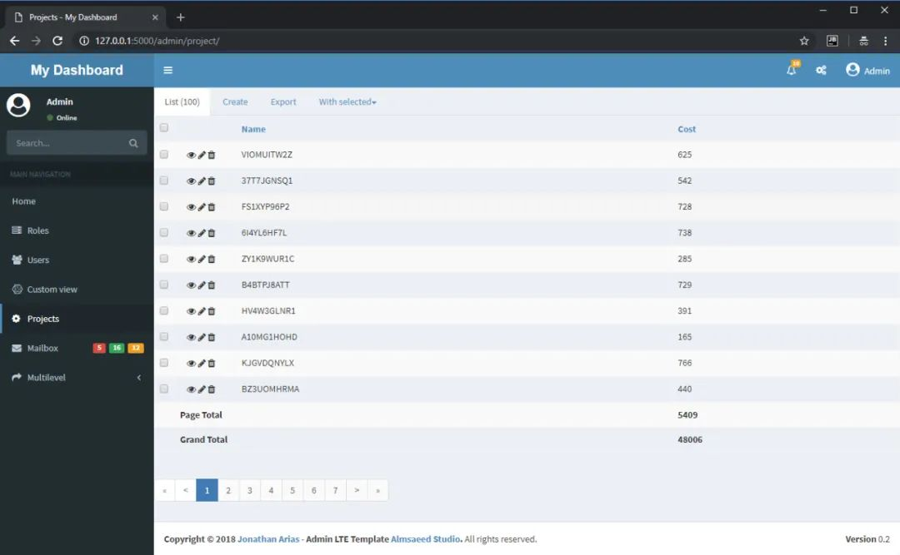
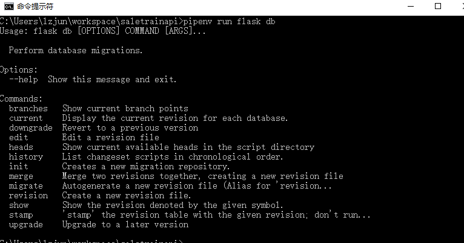
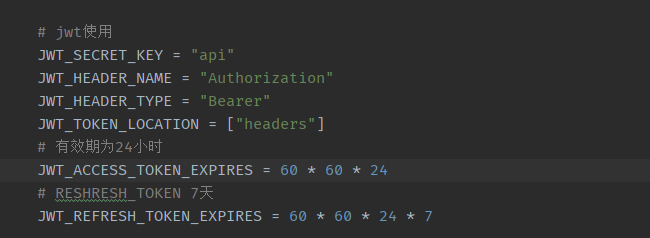

Python Flask
<a name="dMSJh"></a>
### 1、 Flask-Admin
Django中有个杀手锏的功能就是自带Admin面板，所有数据都可以通过Admin后台来操作， Flask-Admin 就是一个功能和Django-Admin非常类似的库，有了它再也不需要直接去数据库查数据改数据了。<br />Github地址：[https://github.com/flask-admin/flask-admin](https://github.com/flask-admin/flask-admin)<br />
<a name="YtY9v"></a>
### 2、Flask-SQLAlchemy
Flask-SQLAlchemy 直接在SQLAlchemy的基础上封装了一层，简化了配置以及SQLAlchemy库的导入路径
```python
# config.py
SQLALCHEMY_DATABASE_URI = ''


# app.py
def create_app(config_name=None, app_name=None):
    """使用工厂模式创建app"""
    if not app_name:
        app_name = __name__
    app = Flask(app_name)

    from flask_sqlalchemy import SQLAlchemy
    db = SQLAlchemy()
    db.init_app(app)

# model.py
class User(db.Model):
    id = db.Column(db.Integer, primary_key=True)
    username = db.Column(db.String, unique=True, nullable=False)
    email = db.Column(db.String, unique=True, nullable=False)


db.session.add(User(username="Flask", email="example@example.com"))
db.session.commit()
```
<a name="fhByo"></a>
### 3、 Flask-Migrate
Flask-migrate 是一个SQLAlchemy 数据库升级迁移工具，基于Alembic实现，它提供了一系列命进行数据库升级撤回操作。
```python
from flask_alembic import Alembic

alembic = Alembic()
alembic.init_app(app)  
```

<a name="eGsHm"></a>
### 4、Flask-JWT-Extended
前后端分离项目基本都是使用JWT来做用户认证，这是一个用来实现JWT功能的扩展，提供了很多配置参数，非常灵活，直接在config中配置就可以，省去很多造轮子的麻烦。


```python
from flask_jwt_extended import create_access_token
from flask_jwt_extended import get_jwt_identity
from flask_jwt_extended import jwt_required
from flask_jwt_extended import JWTManager
jwt = JWTManager(app)


# view.py
@app.route("/login", methods=["POST"])
def login():
    username = request.json.get("username", None)
    password = request.json.get("password", None)
    if username != "test" or password != "test":
        return jsonify({"msg": "Bad username or password"}), 401
    # 账号密码正确就创建token返回给前端
    access_token = create_access_token(identity=username)
    return jsonify(access_token=access_token)


@app.route("/users", methods=["GET"])
@jwt_required()
def users():
    # 这是一个需要用户登录后才可以访问的接口，直接装饰器jwt_required()修饰就可以，token校验不通过时会直接拦截。

    # 这里的identity返回的对象取决于前面创建token的方法传的参数identtiy是什么
    current_user = get_jwt_identity()
    return jsonify(logged_in_as=current_user), 200
```
还可以通过实现`user_loader_callback_loader`回调获得 `get_current_user` 对象
```python
@jwt_ext.user_loader_callback_loader
    def loader_user_callback(identity):
        return User.query.filter_by(username=identity).first()
```
特别是4.0还实现了白名单功能，可直接对用户进行登录限制。
<a name="PTkx9"></a>
### 5、Flask-Limiter
Flask-Limiter 用于做接口频率限制的，它可以灵活基于不同资源来限制请求的次数，例如可以对整个app做限制，页可以对某个blueprint限制，或者是对路由做限制，还支持自定义配置。
```python
from flask import Flask
from flask_limiter import Limiter
from flask_limiter.util import get_remote_address

app = Flask(__name__)
limiter = Limiter(
    app,
    key_func=get_remote_address,
    default_limits=["200 per day", "50 per hour"]
)
@app.route("/slow")
@limiter.limit("1 per day")
def slow():
    return ":("

@app.route("/medium")
@limiter.limit("1/second", override_defaults=False)
def medium():
    return ":|"
```
