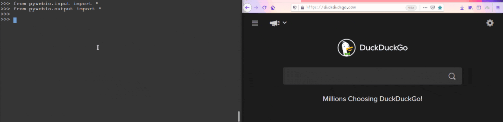
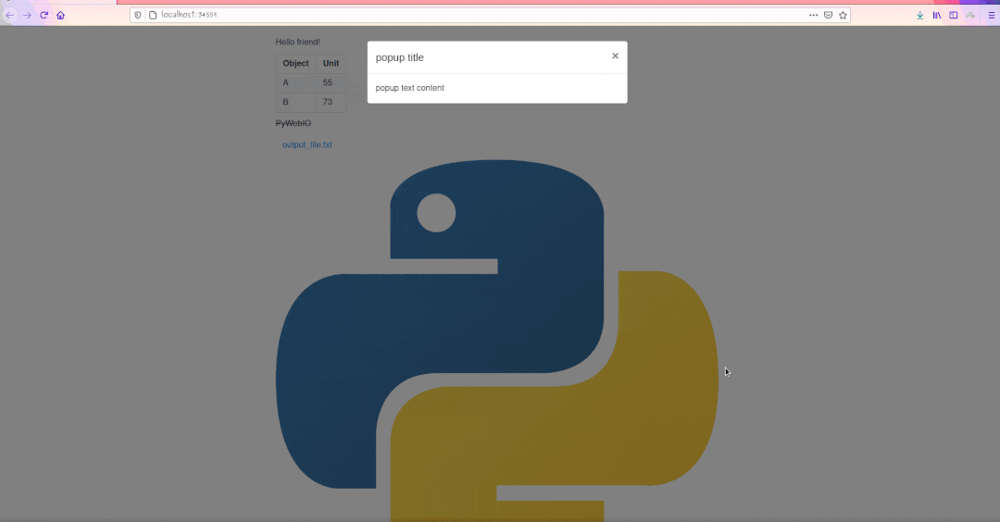
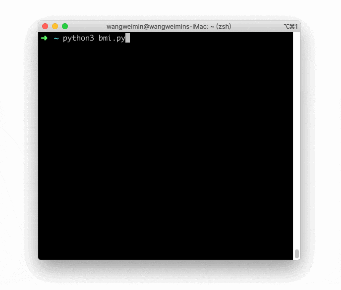

Python Web<br />交互式 Web app 超级简单的工具。不会 HTML，CSS，JAVASCRIPT 也没事。<br />交互式 Web app 非常实用，比如说做一个问卷调查页面、一个投票系统、一个信息收集表单，上传文件等等，因为网页是可视化的，因此还可以作为一个没有服务端的图片界面应用程序而使用。<br />如果有这样的开发需求，那用 Python 真的是太简单了。<br />借助于 PyWebIO（`pip install pywebio`），可以分分钟实现网页的信息录入，可以看下面的动图：<br /><br />上面的页面，也就仅仅用了这 6 行代码：
```python
from pywebio.input import *

input("This is a simple text input")
select("This is a drop down menu", ['Option1', 'Option2'])
checkbox("Multiple Choices!", options=["a",'b','c','d'])
radio("Select any one", options=['1', '2', '3'])
textarea('Text Area', rows=3, placeholder='Multiple line text input')
```
要让网页输出想要的信息也是非常简单，代码如下，函数功能已经做了相关注释，很容易看懂：
```python
from pywebio.output import *
from pywebio import session

# 网页上显示纯文本
put_text("Hello friend!")

# 网页上显示表格
put_table([
    ['Object', 'Unit'],
    ['A', '55'],
    ['B', '73'],
])

# 网页上显示 MarkDown
put_markdown('~~PyWebIO~~')

# 网页上显示下载文件的链接
put_file('output_file.txt', b'You can put anything here')

# 网页上显示图片
put_image(open('python_logo.png', 'rb').read())

# 网页上显示弹窗
popup('popup title', 'popup text content')

# 保持回话是打开状态，否则页面显示完毕程序退出
session.hold()
```
运行的效果如下：<br /><br />以上，几行代码就实现了一个带有输入输出的 Web 应用，是不是很神奇？
<a name="GEDav"></a>
## 构建基于浏览器的 GUI 程序
PyWebIO 提供了一系列命令式的交互函数来在浏览器上获取用户输入和进行输出，将浏览器变成了一个“富文本终端”，可以用于构建简单的 Web 应用或基于浏览器的 GUI 应用。<br />比如计算 BMI 指数的脚本：
```python
from pywebio import start_server
from pywebio.input import input, FLOAT
from pywebio.output import put_text

def bmi():
    height = input("请输入你的身高(cm)：", type=FLOAT)
    weight = input("请输入你的体重(kg)：", type=FLOAT)

    BMI = weight / (height / 100) ** 2

    top_status = [(14.9, '极瘦'), (18.4, '偏瘦'),
                  (22.9, '正常'), (27.5, '过重'),
                  (40.0, '肥胖'), (float('inf'), '非常肥胖')]

    for top, status in top_status:
        if BMI <= top:
            put_text('你的 BMI 值: %.1f，身体状态：%s' % (BMI, status))
            break

if __name__ == '__main__':
    start_server(bmi, port=80)
```
效果：<br /><br />更多示例：
<a name="aGPOI"></a>
### 基本 demo

- [聊天室](https://pywebio-demos.pywebio.online/chat_room)[1]: 和当前所有在线的人聊天 (不到 90 行代码实现)
- [Markdown 实时预览](https://pywebio-demos.pywebio.online/markdown_previewer)[2]: 可以实时预览的在线 Markdown 编辑器 (不到 40 行代码实现)
- [在线五子棋游戏](https://pywebio-demos.pywebio.online/gomoku_game)[3]: 多人协作对战的五子棋游戏 (不到 100 行代码实现)
- [输入演示](https://pywebio-demos.pywebio.online/input_usage)[4]: 演示 PyWebIO 输入模块的用法
- [输出演示](https://pywebio-demos.pywebio.online/output_usage)[5]: 演示 PyWebIO 输出模块的用法
<a name="J4S2p"></a>
### 数据可视化 demo
PyWebIO 还支持使用第三方库进行数据可视化

- [使用 bokeh 进行数据可视化](http://pywebio-charts.pywebio.online/?app=bokeh)[6]
- [使用 plotly 进行数据可视化](http://pywebio-charts.pywebio.online/?app=plotly)[7]
- [使用 pyecharts 创建基于 Echarts 的图表](http://pywebio-charts.pywebio.online/?app=pyecharts)[8]
- [使用 pyg2plot 创建基于 G2Plot 的图表](http://pywebio-charts.pywebio.online/?app=pyg2plot)[9]
- [使用 cutecharts.py 创建卡通风格图表](http://pywebio-charts.pywebio.online/?app=cutecharts)[10]

数据可视化效果图：<br />
<a name="xTF2L"></a>
## 与现有框架集成
PyWebIO 还可以方便地整合进现有的 Web 服务，不需要编写 HTML 和 JS 代码，就可以构建出具有良好可用性的应用。目前支持与 Flask、Django、Tornado、aiohttp、FastAPI 框架集成。<br />比如说与 Tornado 应用整合：
```python
import tornado.ioloop
import tornado.web
from pywebio.platform.tornado import webio_handler

class MainHandler(tornado.web.RequestHandler):
    def get(self):
        self.write("Hello, world")

if __name__ == "__main__":
    application = tornado.web.Application([
        (r"/", MainHandler),
        (r"/bmi", webio_handler(bmi)),  # bmi 即为上文计算BMI指数的函数
    ])
    application.listen(port=80, address='localhost')
    tornado.ioloop.IOLoop.current().start()
```
与 Django 整合：
```python
# urls.py

from django.urls import path
from pywebio.platform.django import webio_view

# `task_func` is PyWebIO task function
webio_view_func = webio_view(task_func)

urlpatterns = [
    path(r"tool", webio_view_func),
]
```
与更多框架的整合见[文档](https://pywebio.readthedocs.io/zh_CN/latest/advanced.html#integration-with-web-framework)
<a name="FGiO7"></a>
## 最后
PyWebIO 使用同步而不是基于回调的方式获取输入，代码编写逻辑更自然，非声明式布局，布局方式简单高效，代码侵入性小，旧脚本代码仅需修改输入输出逻辑便可改造为 Web 服务，还可以整合到现有的主流 Web 框架。同时支持基于线程的执行模型和基于协程的执行模型，支持结合第三方库实现数据可视化，更多知识请阅读[官方文档](https://pywebio.readthedocs.io/zh_CN/latest/)
<a name="gXQk1"></a>
### 参考资料
[1] 聊天室: [https://pywebio-demos.pywebio.online/chat_room](https://pywebio-demos.pywebio.online/chat_room)<br />[2] Markdown 实时预览: [https://pywebio-demos.pywebio.online/markdown_previewer](https://pywebio-demos.pywebio.online/markdown_previewer)<br />[3] 在线五子棋游戏: [https://pywebio-demos.pywebio.online/gomoku_game](https://pywebio-demos.pywebio.online/gomoku_game)<br />[4] 输入演示: [https://pywebio-demos.pywebio.online/input_usage](https://pywebio-demos.pywebio.online/input_usage)<br />[5] 输出演示: [https://pywebio-demos.pywebio.online/output_usage](https://pywebio-demos.pywebio.online/output_usage)<br />[6] 使用 bokeh 进行数据可视化: [http://pywebio-charts.pywebio.online/?app=bokeh](http://pywebio-charts.pywebio.online/?app=bokeh)<br />[7] 使用 plotly 进行数据可视化: [http://pywebio-charts.pywebio.online/?app=plotly](http://pywebio-charts.pywebio.online/?app=plotly)<br />[8] 使用 pyecharts 创建基于 Echarts 的图表: [http://pywebio-charts.pywebio.online/?app=pyecharts](http://pywebio-charts.pywebio.online/?app=pyecharts)<br />[9] 使用 pyg2plot 创建基于 G2Plot 的图表: [http://pywebio-charts.pywebio.online/?app=pyg2plot](http://pywebio-charts.pywebio.online/?app=pyg2plot)<br />[10] 使用 cutecharts.py 创建卡通风格图表: [http://pywebio-charts.pywebio.online/?app=cutecharts](http://pywebio-charts.pywebio.online/?app=cutecharts)<br />[11] 文档: [https://pywebio.readthedocs.io/zh_CN/latest/advanced.html#integration-with-web-framework](https://pywebio.readthedocs.io/zh_CN/latest/advanced.html#integration-with-web-framework)<br />[12] 官方文档: [https://pywebio.readthedocs.io/zh_CN/latest/](https://pywebio.readthedocs.io/zh_CN/latest/)
