PythonWeb
<a name="togqT"></a>
## 1、安装与基本流程
安装 PyWebIO 和其他的第三方库一样使用`pip install PyWebIO`就行，没有任何难度，此处不做多讲。<br />但是在正式讲解一些常见的操作之前，需要解释一下，为什么说用 PyWebIO 写页面就像数据分析一样。<br />回想一下使用Python进行数据分析的流程，启动 Jupyter Notebook 导入数据，进行数据预览、筛选、拆分合并等操作，得到自己满意的结果，最后保存方便查看，更重要的是一行代码一个结果，方便调试。<br />而使用 PyWebIO 开发页面流程也是类似，不用过分关心CSS、JS等文件，全程只需要操作一个py脚本。<br />也不用关心数据库配置、前后端交互，就像上面的数据分析一样，创建一个空白页面，然后一行代码添加一部分内容，内容可以实时编译输出，甚至可以在 ipython 中进行开发👇<br /><br />与其说是第一个第三方库，更愿意称它为一个 APP ，因为一行代码对应一个操作，例如可以调用 `put_text()` 、 `put_image()` 、 `put_table()` 等函数输出文本、图片、表格等内容到浏览器！<br />当然，之所以能这么便捷高效的开发页面，基于别人封装好的，高度精准定义好的功能，因此使用场景十分有限，例如问卷调查、表单填写、数据报告展示等简单的、个人使用的，且对样式、特效等不做太高要求的场景。
<a name="Q6Hvb"></a>
## 2、开发页面
使用 PyWebIO 开发页面中的一些常见操作。<br />从 0 实现下面的页面为最终目标进行讲解！<br />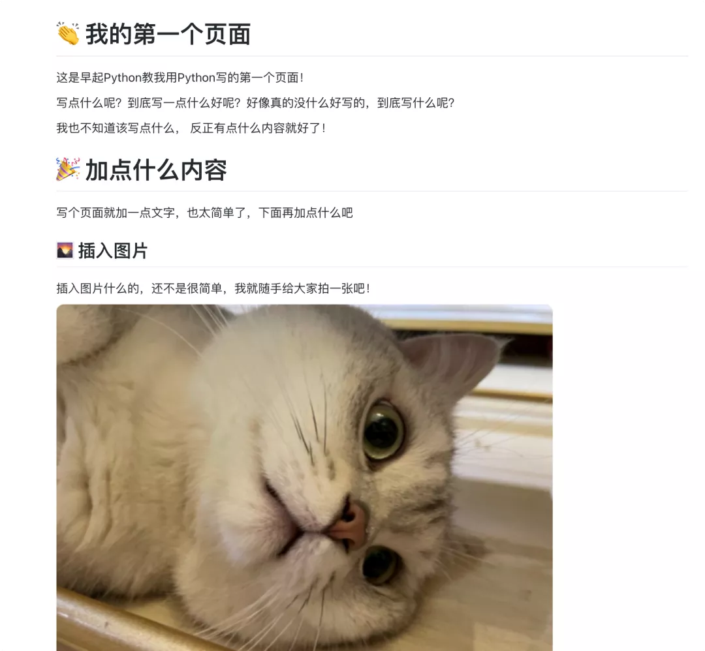<br />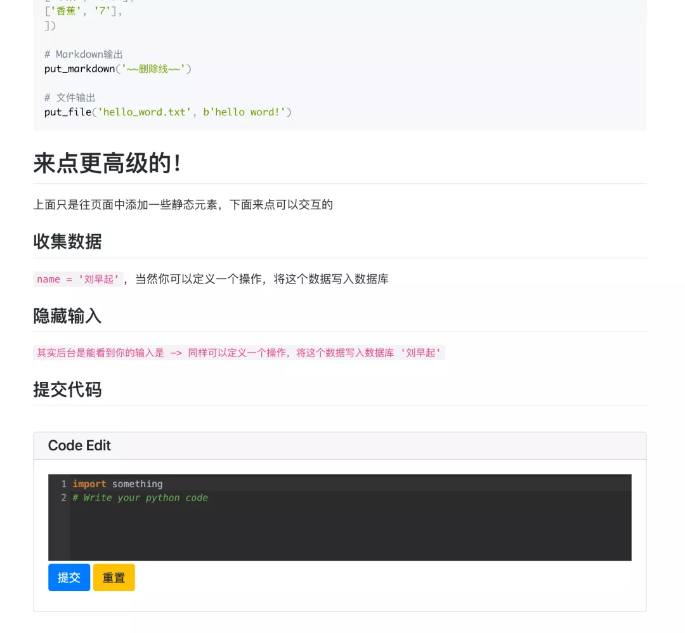<br />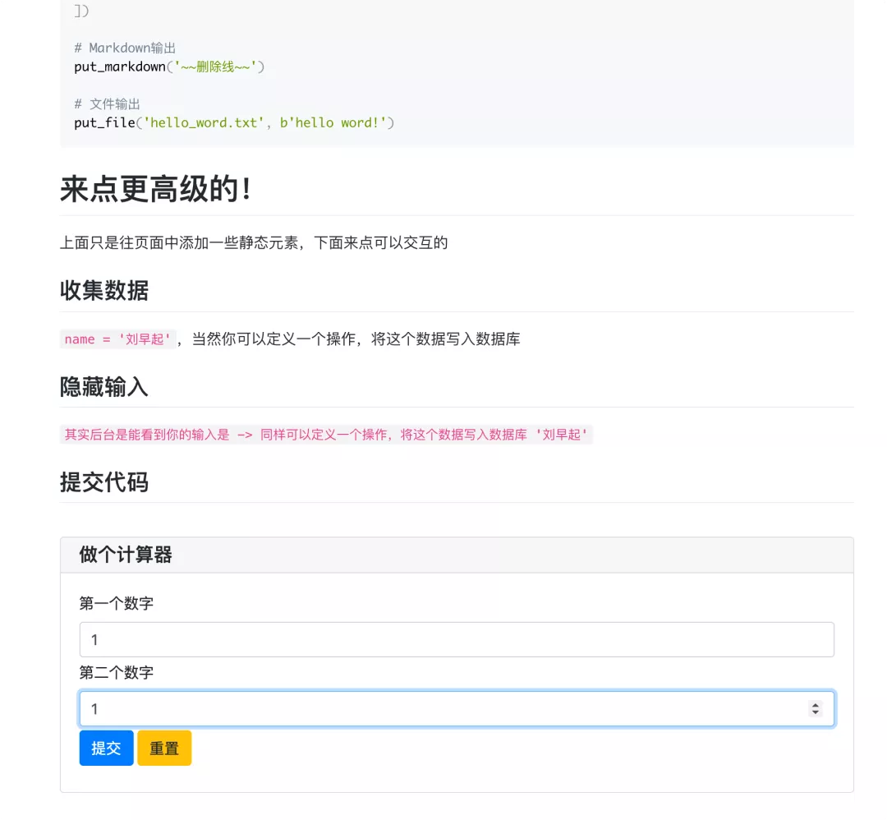
<a name="tY2hs"></a>
### 插入文字
平时写 html 会用类似`<h1>`标签来控制标题，用`<p><span>`这样的标签来输出文字。<br />在 PyWebIO 中可以使用 markdown 来实现类似效果，语法是`put_markdown()`，将markdown添加进去，就会自动渲染
```python
put_markdown(("""# 👏 我的第一个页面"""), lstrip=True)
```
<a name="dkeAK"></a>
### 插入图片
静态元素是一个网页的重要组成部分，使用 PyWebIO 插入也是很简单，使用 `put_image()` 可以插入图片，代码如下
```python
put_image(open('iShot2021-10-29 17.14.08.png', 'rb').read()) 
```
随手用手机拍了一张图片，效果如下👇<br />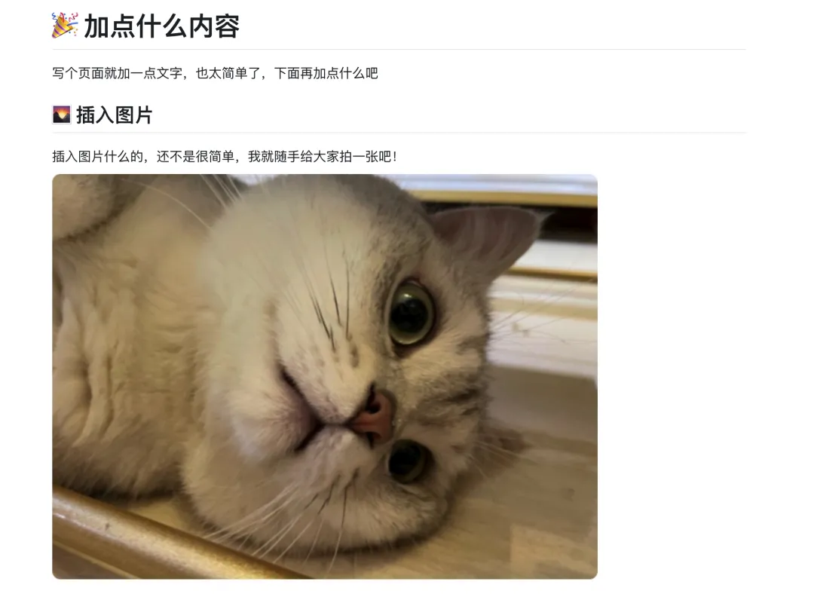
<a name="t4Tba"></a>
### 插入表格
传统html使用table插入表格，这里使用类似方法
```python
put_table([
    ['商品', '价格'],
    ['苹果', '5.5'],
    ['香蕉', '7'],
])
```
效果如下，后面如果表格内容需要变化，可以写个函数让他动态更新<br />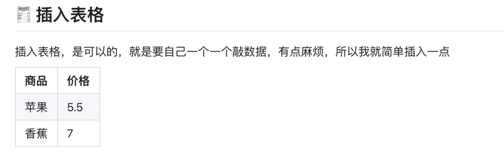
<a name="fPPUC"></a>
### 插入代码
插入代码也是没有问题的<br />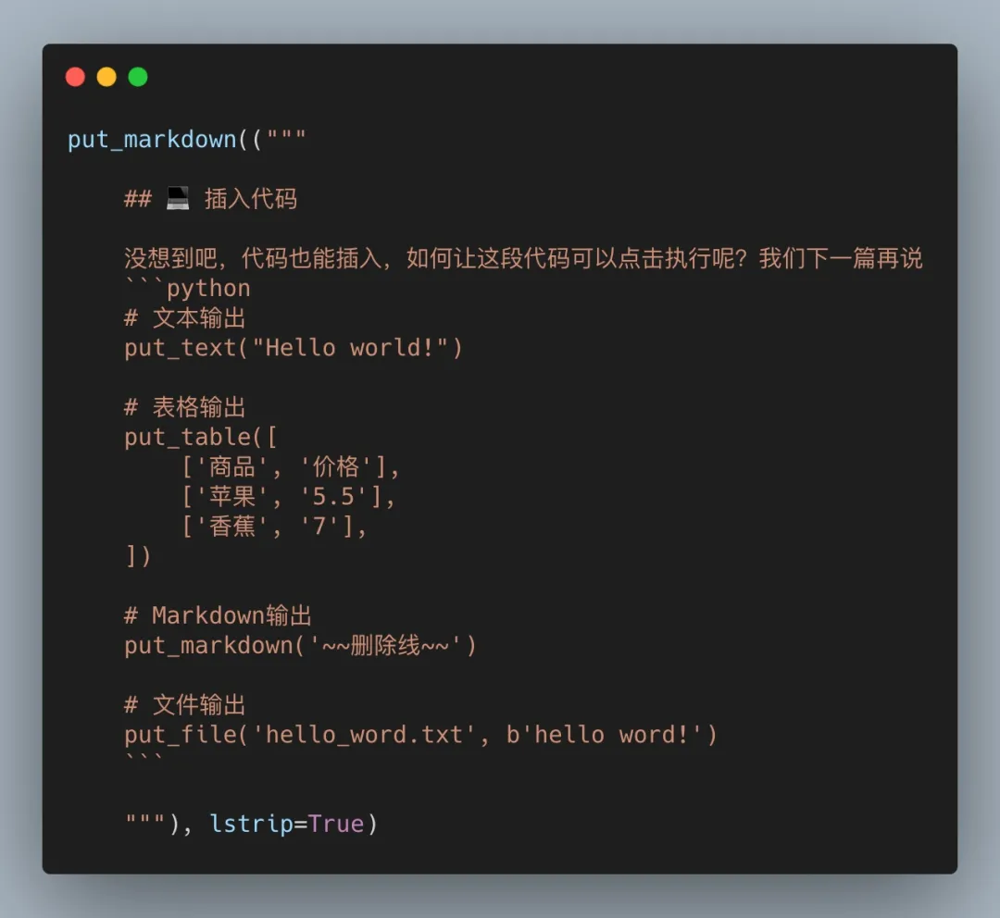<br />展示效果如下<br />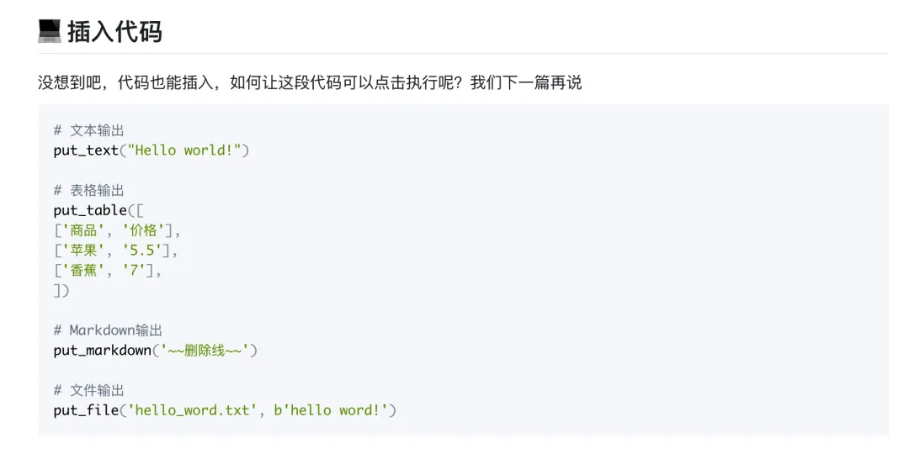
<a name="LV2VY"></a>
### 交互 - 收集信息
上面都是常规的静态元素添加，其他一些库也能做到，甚至手写原生html都行，下面来点更高级的！<br />首先是简单的交互式输入框，开发者已经写好了，调用命令也很简单
```python
name = input("你的名字是什么？?")
```
只用一行代码，效果如下，当然这也意味着样式什么的不支持修改<br />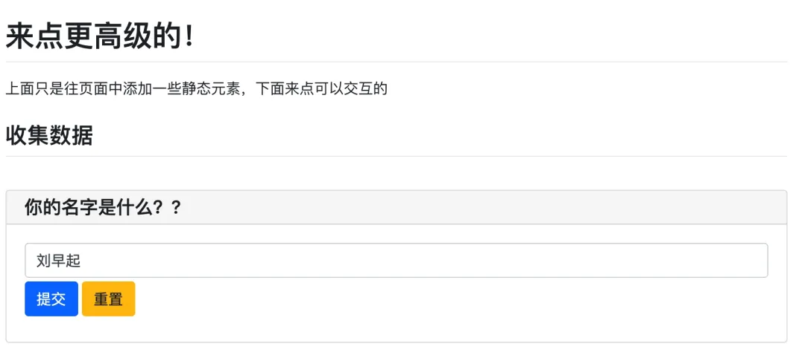<br />这里选择将接收到消息打印出来，当然也是可以写一个函数，将数据进行保存，这会在后面带大家开发问卷系统讲到<br />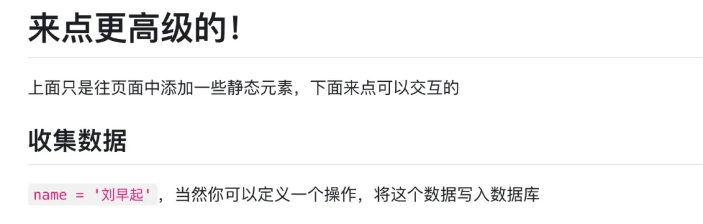
<a name="J3Ukj"></a>
### 交互 - 隐藏输入
如果在开发问卷系统，有些选项希望用户输入时可以隐藏输入，就像输入密码一样
```python
password = input("不想让别人看见你的输入？", type=PASSWORD)
```
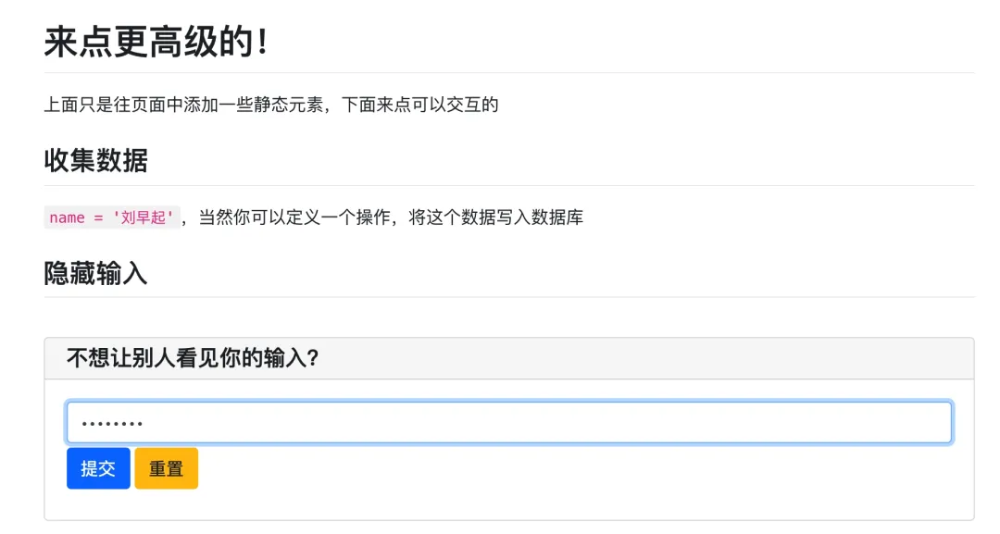
<a name="Mz9du"></a>
### 交互 - 输入代码
通过交互输入框接收代码也是可以的，后面讲介绍如何让代码执行，下面是可以实现的样式
```python
code = textarea('Code Edit', code={
    'mode': "python",  # code language
    'theme': 'darcula',  #  Codemirror theme
}, value='import something\n# Write your python code')
```
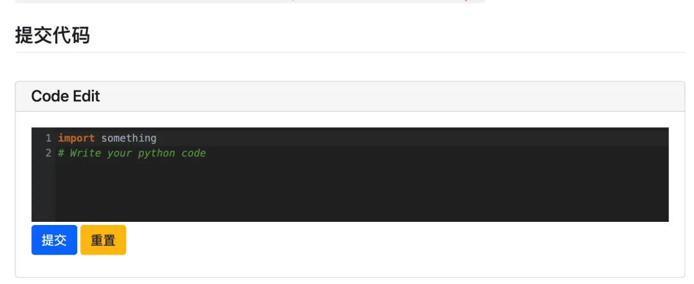
<a name="fUx9I"></a>
### 交互 - 按钮功能
其实上面说的存储数据也好，执行代码也好，本质上就是给这个提交按钮添加一个功能，来实现最简单的计算器。也就是点击提交，计算两数相加
```python
data = input_group("做个计算器", [
    input('第一个数字', name='num1', type=NUMBER),
    input('第二个数字', name='num2', type=NUMBER)
])
put_text(f"计算结果是{data['num1']} + {data['num2']} = {data['num1'] + data['num2']}  ")
```
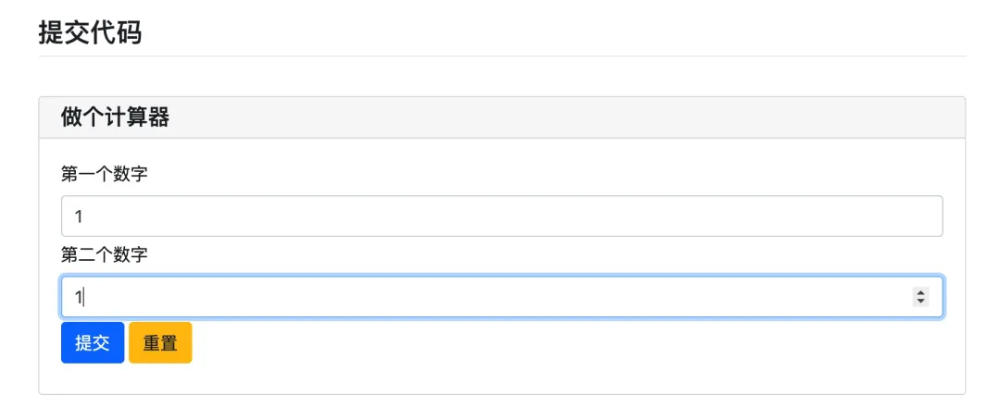<br />因为简单，连函数都不用定义，直接 `f-string` 就解决了，如果需要复杂的功能，就可以定义一个函数，点击按钮就执行这个函数
<a name="fz6jB"></a>
### 如何渲染页面
从上面的介绍不难看出，用 PyWebIO 就好比往一张白纸里面塞东西。<br />但还没说，如何创建一张白纸以及如何渲染页面，下面是一个本文用的最简单的框架
```python
from pywebio import *
from pywebio.input import *
from pywebio.output import *

def myfirstpage():

    something

if __name__ == '__main__':

    start_server(myfirstpage,port=8082,auto_open_webbrowser=True)
```
可以看到，只要定义一个函数，然后往里面塞各种内容，最后通过`start_server()`指定端口启动就行。
