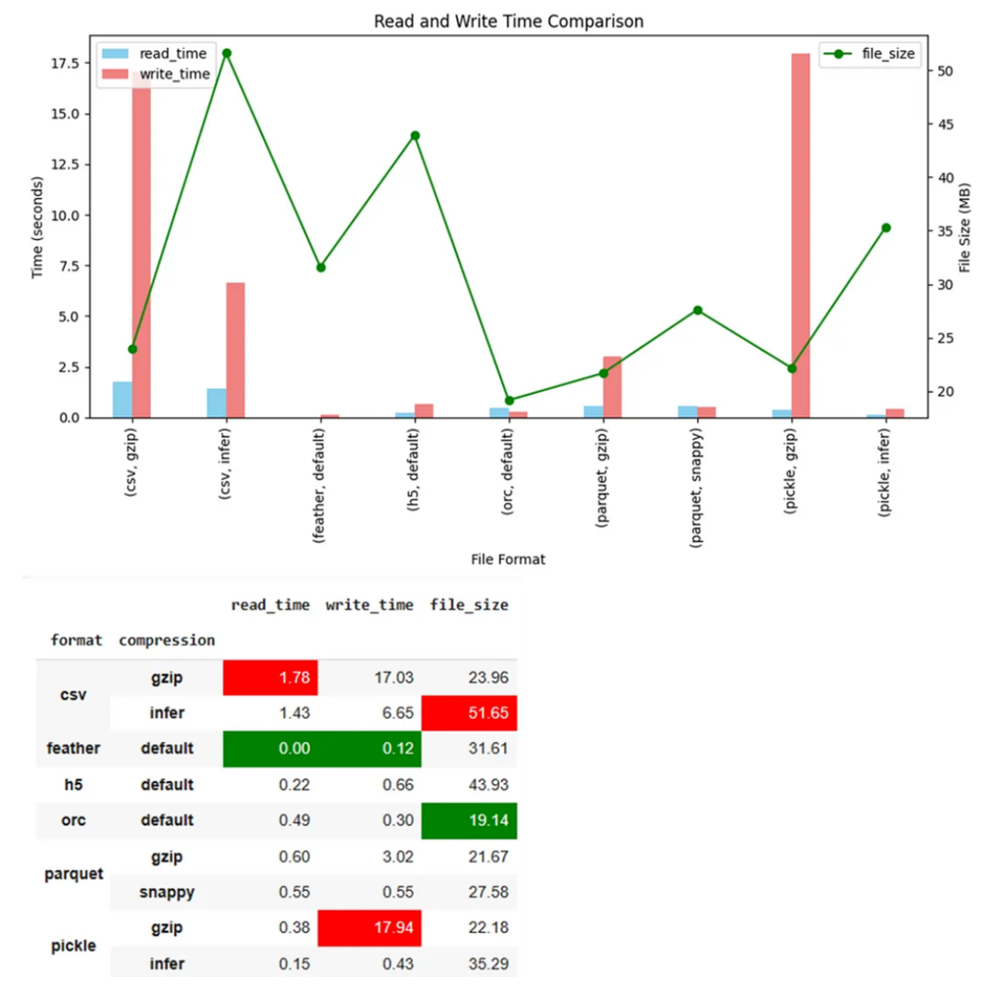

Pandas 支持多种存储格式，在本文中将对不同类型存储格式下的Pandas Dataframe的读取速度、写入速度和大小的进行测试对比。
<a name="RVmgW"></a>
## 创建测试Dataframe
首先创建一个包含不同类型数据的测试Pandas Dataframe。
```python
import pandas as pd
import random
import string
import numpy as np

# Config DF
df_length= 10**6
start_date= '2023-01-01'
all_string= list(string.ascii_letters + string.digits)
string_length= 10**1
min_number= 0
max_number= 10**3

# Create Columns
date_col= pd.date_range(start= start_date, periods= df_length, freq= 'H')
str_col= [''.join(np.random.choice(all_string, string_length)) for i in range(df_length)]
float_col= np.random.rand(df_length)
int_col= np.random.randint(min_number,max_number, size = df_length)

# Create DataFrame
df= pd.DataFrame({'date_col' : date_col,
                  'str_col' : str_col,
                  'float_col' : float_col,
                  'int_col' : int_col})
df.info()
df.head()
```
<a name="mLERB"></a>
### 以不同的格式存储
接下来创建测试函数，以不同的格式进行读写。
```python
import time
import os

def check_read_write_size(df, file_name, compression= None) :
    format= file_name.split('.')[-1]
    # Write
    begin= time.time()
    if file_name.endswith('.csv') : df.to_csv(file_name, index= False, compression= compression)
    elif file_name.endswith('.parquet') : df.to_parquet(file_name, compression= compression)
    elif file_name.endswith('.pickle') : df.to_pickle(file_name, compression= compression)
    elif file_name.endswith('.orc') : df.to_orc(file_name)
    elif file_name.endswith('.feather') : df.to_feather(file_name)
    elif file_name.endswith('.h5') : df.to_hdf(file_name, key= 'df')
    write_time= time.time() - begin
    # Read
    begin= time.time()
    if file_name.endswith('.csv') : pd.read_csv(file_name, compression= compression)
    elif file_name.endswith('.parquet') : pd.read_parquet(file_name)
    elif file_name.endswith('.pickle') : pd.read_pickle(file_name, compression= compression)
    elif file_name.endswith('.orc') : pd.read_orc(file_name)
    elif file_name.endswith('.h5') : pd.read_hdf(file_name)
    read_time= time.time() - begin
    # File Size
    file_size_mb = os.path.getsize(file_name) / (1024 * 1024)
    return [format, compression, read_time, write_time, file_size_mb]
```
然后运行该函数并将结果存储在另一个Pandas Dataframe中。
```python
test_case= [
    ['df.csv','infer'],
    ['df.csv','gzip'],
    ['df.pickle','infer'],
    ['df.pickle','gzip'],
    ['df.parquet','snappy'],
    ['df.parquet','gzip'],
    ['df.orc','default'],
    ['df.feather','default'],
    ['df.h5','default'],
]

result= []
for i in test_case :
    result.append(check_read_write_size(df, i[0], compression= i[1]))

result_df= pd.DataFrame(result, columns= ['format','compression','read_time','write_time','file_size'])
result_df
```
**测试结果**<br />下面的图表和表格是测试的结果。<br /><br />对测试的结果做一个简单的分析：<br />**CSV**

- 未压缩文件的大小最大
- 压缩后的尺寸很小，但不是最小的
- CSV的读取速度和写入速度是最慢的

**Pickle**

- 表现得很平均
- 但压缩写入速度是最慢的

**Feather**

- 最快的读写速度，文件的大小也是中等，非常的平均

**ORC**

- 所有格式中最小的
- 读写速度非常快，几乎是最快的

**Parquet**

- 总的来说，快速并且非常小，但是并不是最快也不是最小的
<a name="W7ydM"></a>
## 总结
从结果来看，应该使用ORC或Feather，而不再使用CSV了，是吗？<br />**这取决于需求。**<br />如果正在做一些单独的项目，那么使用最快或最小的格式肯定是有意义的。<br />但大多数时候，必须与他人合作。所以，除了速度和大小，还有更多的因素。<br />未压缩的CSV可能很慢，而且最大，但是当需要将数据发送到另一个系统时，它非常容易。<br />ORC作为传统的大数据处理格式（来自Hive）对于速度的和大小的优化是做的最好的，Parquet比ORC更大、更慢，但是它却是在速度和大小中取得了最佳的平衡，并且支持他的生态也多，**所以在需要处理大文件的时候可以优先选择Parquet。**
