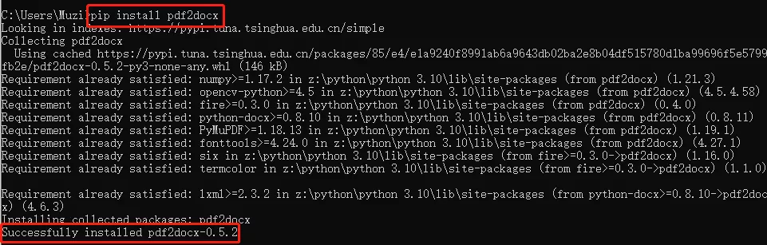
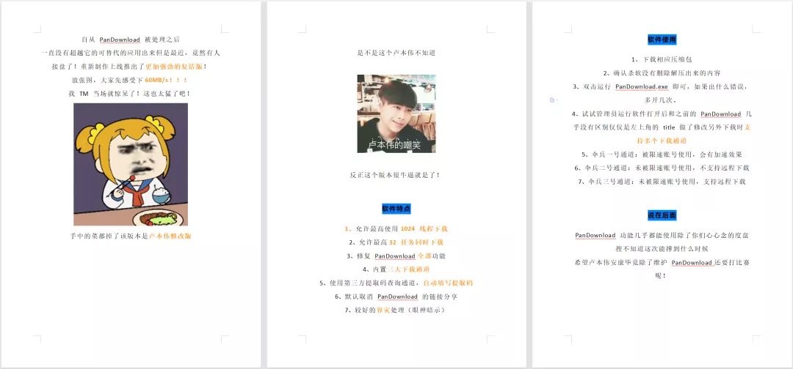
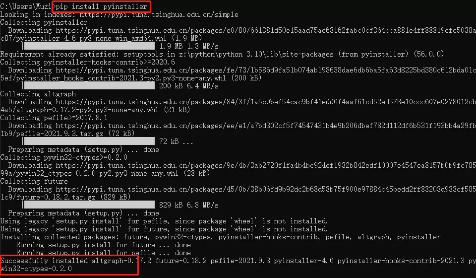
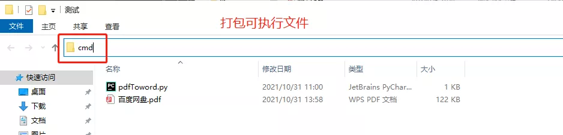
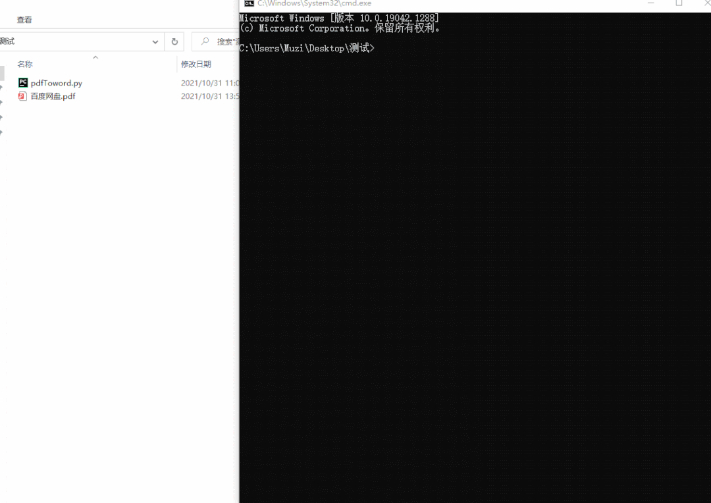
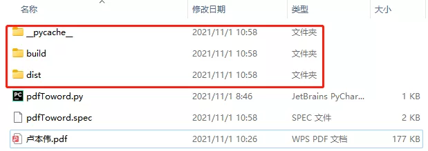
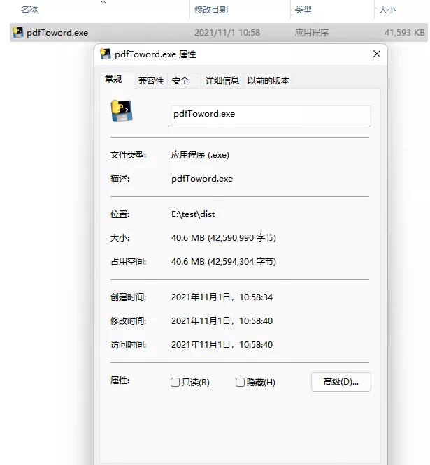
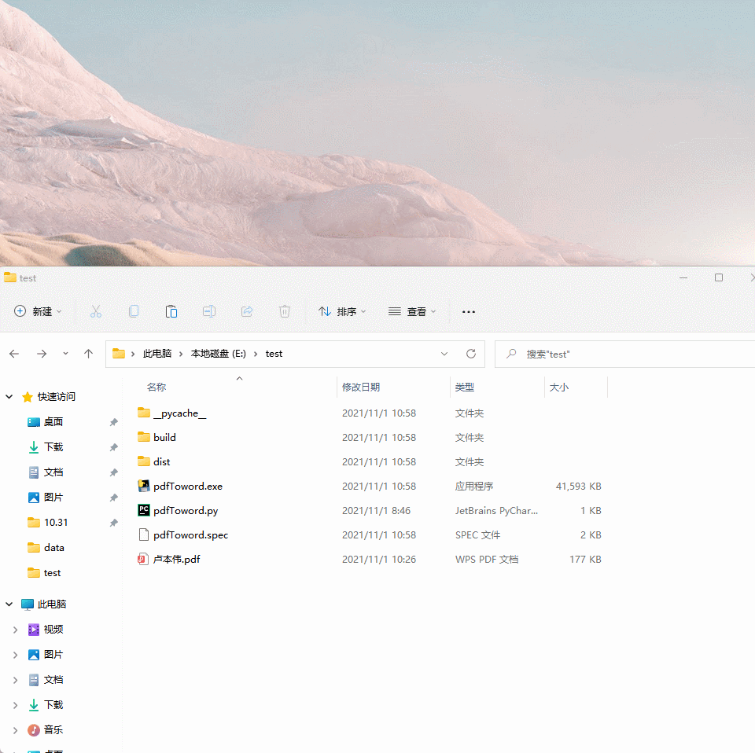

Python PDF Word<br />PDF文档遵循一定的规范，例如精确定位了每个字符出现在页面上的坐标、根据坐标绘制的各种形状（线、矩形、曲线等）。所以，用PDF格式传输和打印文档可以保证格式的一致性，不会像Word那样因为渲染引擎的不同而出现格式错乱、多页少页等问题。<br />Word文档则是一种流式布局，元素之间的相对距离决定了其呈现在页面上的最终位置。因此适合编辑内容，前文内容的修改自动促发后续文档布局的更新。<br />PDF转Word是一个古老的话题，其难点在于建立从PDF基于元素位置的格式到Word基于内容的格式的映射。<br />PDF文档实际并不存在段落、表格的概念，PDF转Word要做的就是将PDF文档中“横、竖线条围绕着文本”解析为Word的“表格”，将“文本及下方的一条横线”解析为“文本下划线”，等等。<br />pdf2docx支持Windows和Linux平台，要求Python版本>=3.6。<br />可将 PDF 转换成 docx 文件的 Python 库。该项目通过 PyMuPDF 库提取 PDF 文件中的数据，然后采用 python-docx 库解析内容的布局、段落、图片、表格等，最后自动生成 docx 文件。
<a name="SH5N2"></a>
## pdf2docx功能
<a name="rAhk9"></a>
### 解析和创建页面布局

- 页边距
- 章节和分栏 (目前最多支持两栏布局)
- 页眉和页脚 [TODO]
<a name="aZQHq"></a>
### 解析和创建段落

- OCR 文本 [TODO] 
- 水平（从左到右）或竖直（自底向上）方向文本
- 字体样式例如字体、字号、粗/斜体、颜色
- 文本样式例如高亮、下划线和删除线
- 列表样式 [TODO]
- 外部超链接
- 段落水平对齐方式 (左/右/居中/分散对齐)及前后间距
<a name="cuf0b"></a>
### 解析和创建图片

- 内联图片
- 灰度/RGB/CMYK等颜色空间图片
- 带有透明通道图片
- 浮动图片（衬于文字下方）
<a name="edvUu"></a>
### 解析和创建表格

- 边框样式例如宽度和颜色
- 单元格背景色
- 合并单元格
- 单元格垂直文本
- 隐藏部分边框线的表格
- 嵌套表格
<a name="EjGmo"></a>
### 支持多进程转换
_pdf2docx同时解析出了表格内容和样式，因此也可以作为一个表格内容提取工具。_
<a name="PRNTl"></a>
## 限制

- 目前暂不支持扫描PDF文字识别
- 仅支持从左向右书写的语言（因此不支持阿拉伯语）
- 不支持旋转的文字
- 基于规则的解析无法保证100%还原PDF样式
<a name="fXtlO"></a>
## pdf2docx安装方式
```bash
pip install pdf2docx
```

<a name="rMp7U"></a>
## pdf2docx使用
<a name="qC64c"></a>
### 导入
```python
from pdf2docx import Converter
```
<a name="G1ipn"></a>
### 简单使用
```python
from pdf2docx import Converter

cv = Converter(r"pdf文档的具体路径")
cv.convert("test.docx", start=0,end=None)
cv.close()
```
```python
from pdf2docx import parse

pdf_file = '/path/to/sample.pdf'
docx_file = 'path/to/sample.docx'

# convert pdf to docx
parse(pdf_file, docx_file)
```
如果是页面元素比较简单的文档，pdf2docx模块处理一下是完全够用了，但是有些时候PDF文档当中个别页面非常的花里胡哨，转换成Word格式的文档之后则会显得有点凌乱。<br />最后还能够针对指定的页数进行转换，例如只是针对文档当中的奇数页进行操作，代码如下
<a name="mcsup"></a>
### 针对指定的页数进行转换
```python
from pdf2docx import Converter

cv = Converter(r"pdf文档的具体路径")
cv.convert("test.docx", pages=[1, 3, 5, 7])
cv.close()
```
<a name="Foy99"></a>
### 对指定路径下的PDF进行批量转换
<a name="eyg3m"></a>
#### 思路如下

1. 获取pdf文件路径。
2. 过滤出当前文件夹中所有的pdf文件。
3. 提取pdf文件名和后缀名。
4. 文件名+'docx'拼接重组word文件(改变格式不变文件名)。
5. 使用pdf2docx进行文件转换。
<a name="I2sew"></a>
#### 源码
代码很简单，源码奉上，思路都在注释里已经说明
```python
import os
from pdf2docx import Converter

def pdf_docx():
    # 获取当前工作目录
    file_path = os.getcwd()

    # 遍历所有文件
    for file in os.listdir(file_path):
        # 获取文件后缀
        suff_name = os.path.splitext(file)[1]

        # 过滤非pdf格式文件
        if suff_name != '.pdf':
            continue
        # 获取文件名称
        file_name = os.path.splitext(file)[0]
        # pdf文件名称
        pdf_name = os.getcwd() + '\\' + file
        # 要转换的docx文件名称
        docx_name = os.getcwd() + '\\' + file_name + '.docx'
        # 加载pdf文档
        cv = Converter(pdf_name)
        cv.convert(docx_name)
        cv.close()
```
<a name="LtqS3"></a>
## 测试
准备的pdf文档有格式，有图片。先来进行测试<br /><br />控制台信息打印如下，0.17秒完成了3页pdf->docx文件的转换
```python
[INFO] Start to convert E:\Python\数据\卢本伟.pdf
[INFO] [1/4] Opening document...
[INFO] [2/4] Analyzing document...
[WARNING] Replace font "MicrosoftYaHeiUI" with "Times New Roman" due to lack of data.
Deprecation: 'getText' removed from class 'Page' after v1.19.0 - use 'get_text'.
Deprecation: 'getImageList' removed from class 'Page' after v1.19.0 - use 'get_images'.
Deprecation: 'getImageBbox' removed from class 'Page' after v1.19.0 - use 'get_image_bbox'.
Deprecation: 'getPNGData' removed from class 'Pixmap' after v1.19.0 - use 'tobytes'.
Deprecation: 'getDrawings' removed from class 'Page' after v1.19.0 - use 'get_drawings'.
Deprecation: 'getLinks' removed from class 'Page' after v1.19.0 - use 'get_links'.
Deprecation: 'getArea' removed from class 'Rect' after v1.19.0 - use 'get_area'.
[INFO] [3/4] Parsing pages...
[INFO] (1/3) Page 1
[INFO] (2/3) Page 2
[INFO] (3/3) Page 3
[INFO] [4/4] Creating pages...
[INFO] (1/3) Page 1
[INFO] (2/3) Page 2
[INFO] (3/3) Page 3
[INFO] Terminated in 0.17s.
```
转换完成后的docx文件格式如下：<br /><br />现在已经完成了pdf转word的操作，这样的局限性太大了，万一电脑没有Python环境怎么搞？<br />接下来对文件进行打包，可以随时随地可以转换文档<br />python 上常见的打包方式目是通过 pyinstaller 来实现的。
```bash
pip install pyinstaller 
```

<a name="QLhv3"></a>
## 打包详细步骤
pyinstaller 是一个命令行工具，下面是详细步骤
<a name="hZya1"></a>
### 1、cmd 切换到 python 文件的目录

<a name="mZo4U"></a>
### 2、执行命令 `pyinstall -F pdfToword.py`
<br />执行完毕会发现生成了 3 个文件夹<br /><br />其中 dist 文件夹就有已经打包完成的 exe 文件。<br />
<a name="Lo2pr"></a>
### 3、双击 exe 就可以运行成功了。一键抓换pdf-word

