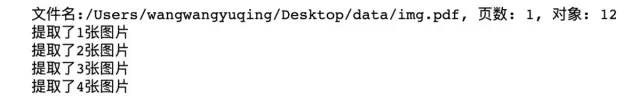

Python PDF
<a name="MpaLv"></a>
## 一、基于 fitz 库和正则搜索提取图片
fitz 库是 pymupdf 中的一个模块，用它来提取 pdf 里的图片非常方便。<br />安装命令
```bash
pip install fitz 
pip install pymupdf
```
<a name="OxUks"></a>
## 二、代码实现
<a name="ZPpsJ"></a>
### 导入相关包
```python
import fitz
import re
import os
```
<a name="bx1AB"></a>
### 读取 pdf 提取图片，并存储
```python
def save_pdf_img(path,save_path):
    '''
    path: pdf的路径
    save_path : 图片存储的路径
    '''
    # 使用正则表达式来查找图片
    checkXO = r"/Type(?= */XObject)" 
    checkIM = r"/Subtype(?= */Image)"  
    # 打开pdf
    doc = fitz.open(path)
    # 图片计数
    imgcount = 0
    # 获取对象数量长度
    lenXREF = doc.xref_length()

    # 打印PDF的信息
    print("文件名:{}, 页数: {}, 对象: {}".format(path, len(doc), lenXREF - 1))


    # 遍历每一个图片对象
    for i in range(1, lenXREF):
        # 定义对象字符串
        text = doc.xref_object(i)
#         print(i,text)
        isXObject = re.search(checkXO, text)
        # 使用正则表达式查看是否是图片
        isImage = re.search(checkIM, text)
        # 如果不是对象也不是图片，则continue
        if not isXObject or not isImage:
            continue
        imgcount += 1
        # 根据索引生成图像
        pix = fitz.Pixmap(doc, i)
        # 根据pdf的路径生成图片的名称
        new_name = path.replace('\\', '_') + "_img{}.png".format(imgcount)
        new_name = new_name.replace(':', '')
        # 如果pix.n<5,可以直接存为PNG
        if pix.n < 5:
            pix.writePNG(os.path.join(save_path, new_name))
        # 否则先转换CMYK
        else:
            pix0 = fitz.Pixmap(fitz.csRGB, pix)
            pix0.writePNG(os.path.join(save_path, new_name))
            pix0 = None
        # 释放资源
        pix = None
        print("提取了{}张图片".format(imgcount))
# pdf路径
path = r'/Users/wangwangyuqing/Desktop/data/img.pdf'
save_path = r'/Users/wangwangyuqing/Desktop/data'
save_pdf_img(path,save_path)
```
<a name="GlLLc"></a>
### 运行结果

<a name="Qfrfv"></a>
## 三、小结
Python 中 pdf2image 库也可以完成以上需求，它的好处是如果 pdf 页面较多时，pdf2image 可以启动多线程会大大加快转换速度，具体可参考 pdf2image 官方文档。<br />最后，可能会遇到提取的图片比原本少，或者提取出不想要的图片。可以通过检查图片格式，可能不是常见的格式，提取时再减少或添加过滤条件进行尝试。
