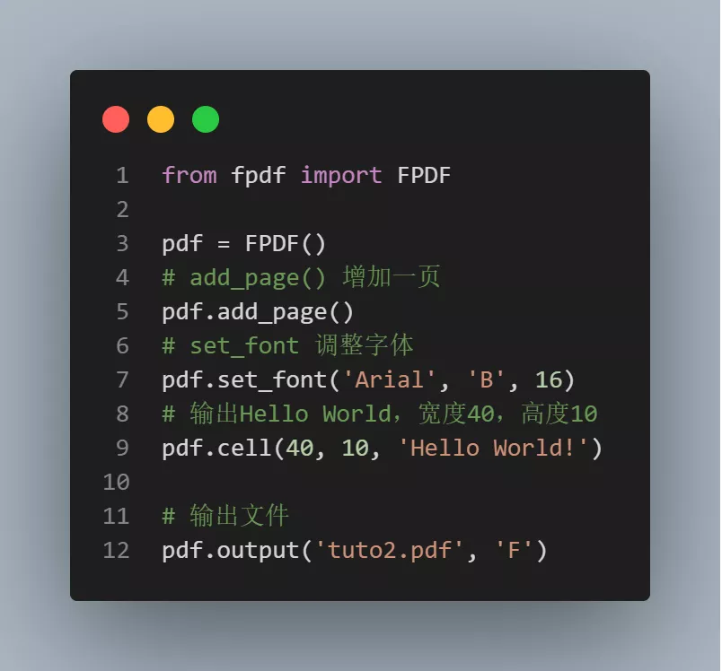
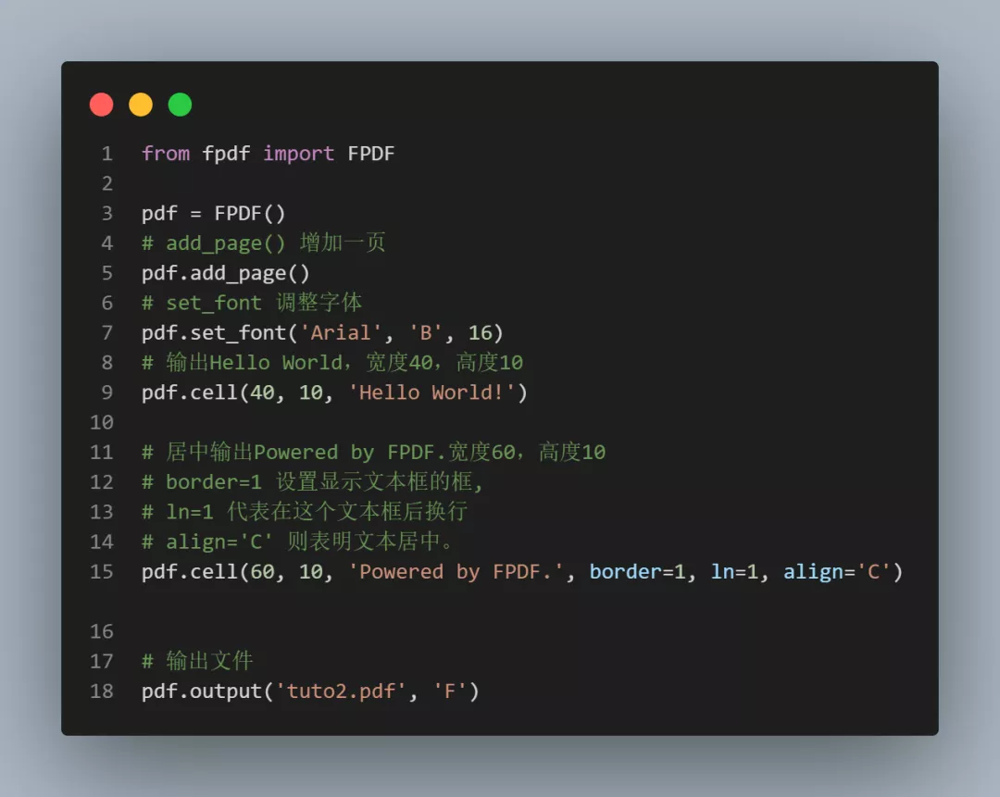
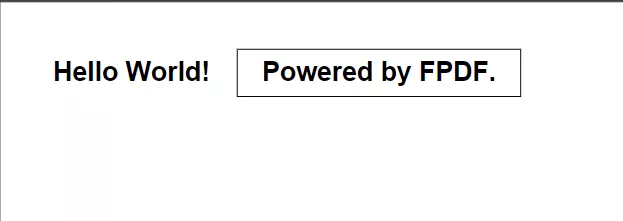
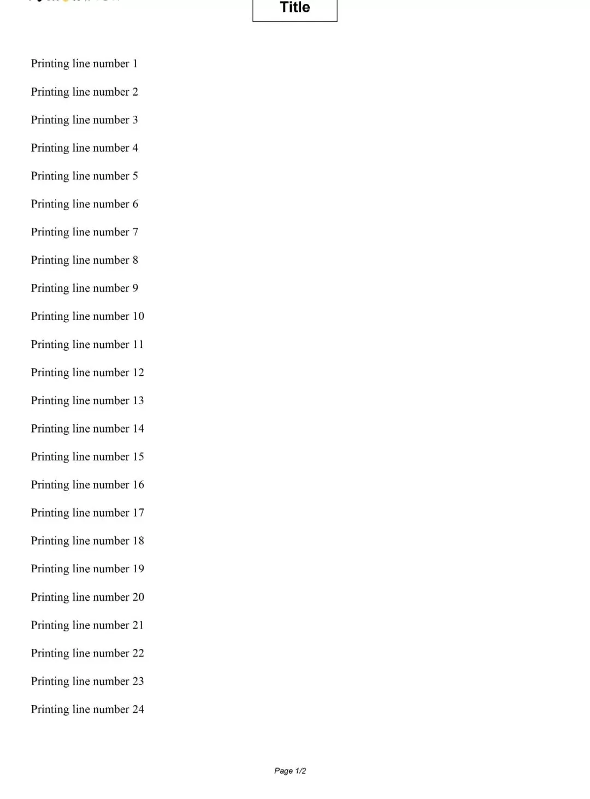
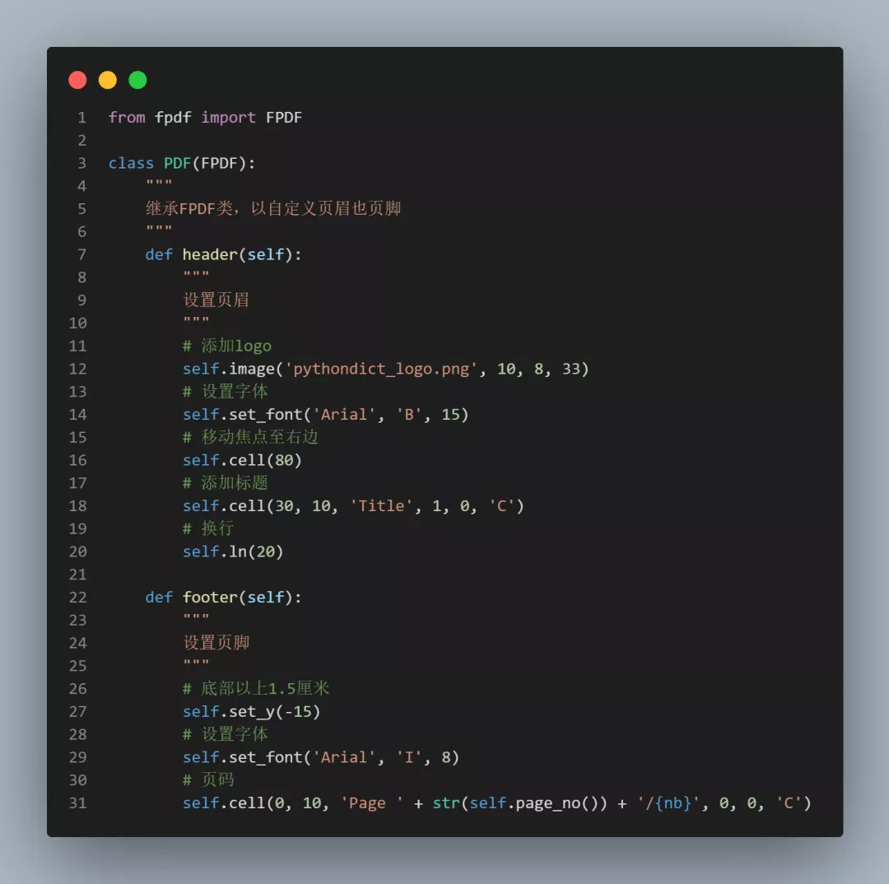
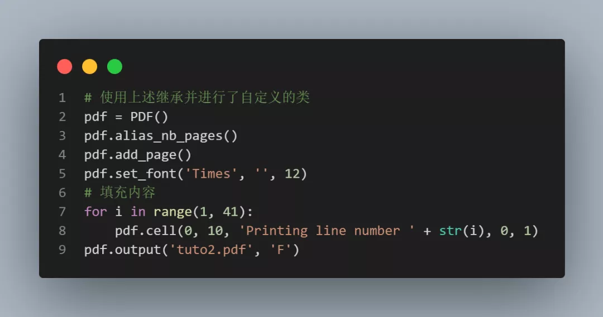
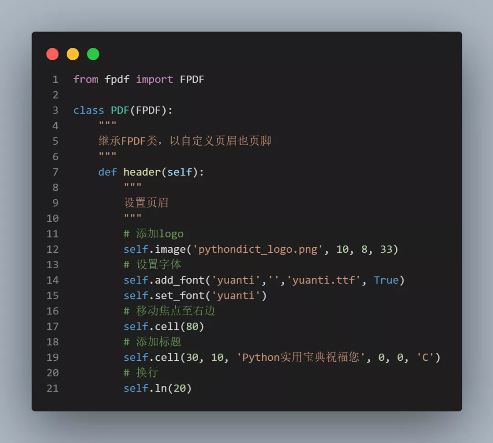
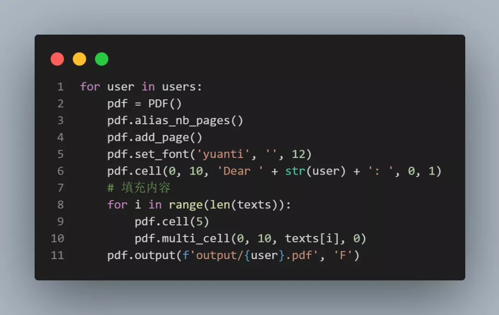

Python<br />日常办公中，经常会使用PDF文档，难免需要对PDF文档进行编辑，有时候PDF文档中的大部分内容都是一样的，只是发送对象不同。<br />这种模板套用的场景下，使用Python进行自动化就尤为方便，用最短的时间办最高效的事。<br />今天就给大家讲讲如何用Python自动套用模板批量生成下方这样的PDF文档。
<a name="GkljO"></a>
## 1、准备
在终端输入以下命令安装所需要的依赖模块:
```bash
pip install fpdf
```
看到 Successfully installed xxx 则说明安装成功。
<a name="HF22l"></a>
## 2、基本使用
PyPDF是从PHP移植到Python的第三方模块。其主要特点有：

1. 非常容易使用和扩展
2. 提供了许多简单示例
3. 没有外部依赖项
4. 不需要安装变异其他库(DLL)

它的基本功能有:

1. 调整PDF精度、页面格式、边距
2. 管理页眉、页脚
3. 自动分页符、自动换行和文本对齐
4. 支持图像、颜色、超链接文本
5. 支持压缩

一个最简单的生成示例：<br /><br />生成的效果如下，由于PDF空白处太多，这里只截字体部分：<br /><br />把生成的文本变复杂一点：<br /><br />注意cell的参数：<br />1. `border` 取值为0或1，代表是否显示边框。<br />2. `ln` 是指在生成该文本框之后焦点移动到的位置，0 代表到该文本框的右边，1 代表换行，2 代表文本框的正下方。<br />3. `align` 是指文本对齐格式，C为居中、L为左对齐、R为右对齐。<br />因此上述代码会生成类似这样的PDF文档：<br /><br />`cell` 还有2个参数：<br />1. `fill` 参数用于设置文本框的背景，TRUE时为白色，False为透明。<br />2. `link` 参数用于添加超链接<br />下面看一个比较复杂的例子，带图片LOGO作为页眉，带页数作为页脚的PDF文档：<br /><br />看看要怎么实现这个PDF文档的生成。<br />首先需要继承FPDF类，以用于自定义页眉和页脚。<br /><br />这样设置完页眉也页脚后，只要使用该类定义PDF文档，便会自动带上页眉页脚。<br /><br />真的是非常方便。
<a name="a38L1"></a>
## 3、批量生成PDF
接下来随机抽取了5位注册了账号的同学的ID批量制作祝福PDF文档。<br />这里可以复用咱刚自定义完成的页眉和页尾。不过，为了显示中文，需要在继承的类里面添加并设置字体为本地中文字体，如：<br /><br />注意，`add_font`第一个参数是该字体注册进FPDF的名字，之后`set_font`的时候都使用该名字。<br />然后将用户名都放到一个数组里，遍历该数组，填充用户名，循环批量生成PDF，完美～<br />
