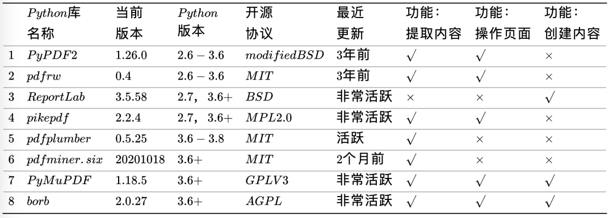
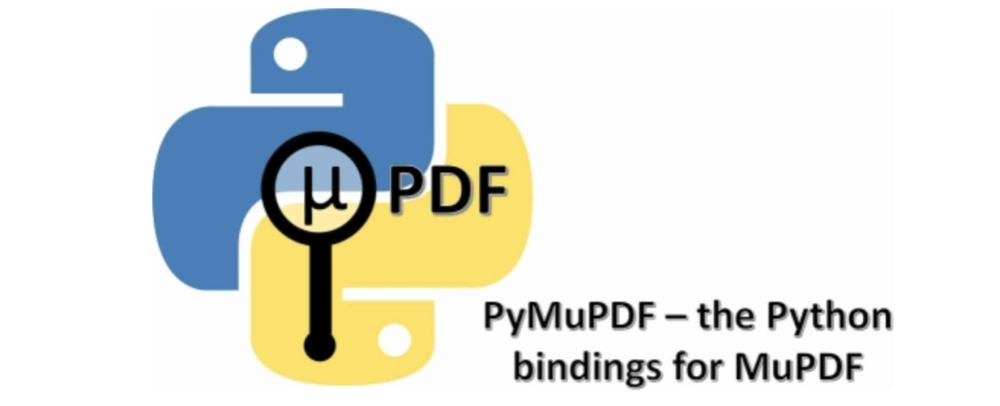

Python<br />**PDF（Portable Document Format）是一种便携文档格式，便于跨操作系统传播文档。PDF文档遵循标准格式，因此存在很多可以操作PDF文档的工具，Python自然也不例外。而Python 办公自动化中操作PDF也是非常重要的一项技能！**<br />并且Python中有很多用来操作PDF的优秀的库，下面简单比较下各个库的优缺点。<br /><br />PyPDF2系列、pdfrw及pikepdf专注对已经存在的PDF的操作（分割、合并、旋转等），前两者基本处于停止维护的状态。<br />pdfplumber及其依赖pdfminer.six专注PDF内容提取，例如文本（位置、字体及颜色等）和形状（矩形、直线、曲线），前者还有解析表格的功能。<br />ReportLab专注PDF页面内容（文本、图、表等）的创建。<br />PyMuPDF和borb同时支持读、写及PDF页面操作，功能最为全面。其中，PyMuPDF尤其以速度快著称，而borb是新开发并深得好评的库，潜力无穷。但是，二者同为GPL家族的开源协议，对商用不太友好。

- PyMuPDF 简介
   - 介绍
   - 功能
   - 安装
   - 关于命名`fitz`的说明
- 使用方法
   - 1、导入库，查看版本
   - 2、打开文档
   - 3、Document的方法和属性
   - 4、获取元数据
   - 5、获取目标大纲
   - 6、页面(`Page`)
   - 7、PDF操作
<a name="JTPwB"></a>
## PyMuPDF 简介
PyMuPDF是一个功能最为全面的python办公自动化工具！<br /><br />**Github地址**：[pymupdf/PyMuPDF: Python bindings for MuPDF’s rendering library](https://github.com/pymupdf/PyMuPDF)<br />**官方手册**：[PyMuPDF Documentation — PyMuPDF 1.18.17 documentation](https://pymupdf.readthedocs.io/en/latest/)
<a name="BIvXP"></a>
### **介绍**
在介绍PyMuPDF之前，先来了解一下MuPDF，从命名形式中就可以看出，PyMuPDF是MuPDF的Python接口形式。
<a name="P1wtQ"></a>
#### **MuPDF**
MuPDF 是一个轻量级的 PDF、XPS和电子书查看器。MuPDF 由软件库、命令行工具和各种平台的查看器组成。<br />MuPDF 中的渲染器专为高质量抗锯齿图形量身定制。它以精确到像素的几分之一内的度量和间距呈现文本，以在屏幕上再现打印页面的外观时获得最高保真度。<br />这个观察器很小，速度很快，但是很完整。它支持多种文档格式，如PDF、XPS、OpenXPS、CBZ、EPUB和FictionBook 2。可以使用移动查看器对PDF文档进行注释和填写表单(这个功能很快也将应用于桌面查看器)。<br />命令行工具允许注释、编辑文档，并将文档转换为其他格式，如HTML、SVG、PDF和CBZ。还可以使用Javascript编写脚本来操作文档。
<a name="eKPnp"></a>
#### **PyMuPDF**
PyMuPDF(当前版本1.18.17)是支持MuPDF(当前版本1.18.*)的Python绑定。<br />使用PyMuPDF，可以访问扩展名为“.pdf”、“.xps”、“.oxps”、“.cbz”、“.fb2”或“.epub”。此外，大约10种流行的图像格式也可以像文档一样处理:“.png”，“.jpg”，“.bmp”，“.tiff”等。
<a name="fnB3Q"></a>
### **功能**
对于所有支持的文档类型可以：

- **解密文件**
- **访问元信息、链接和书签**
- **以栅格格式（PNG和其他格式）或矢量格式SVG呈现页面**
- **搜索文本**
- **提取文本和图像**
- **转换为其他格式：PDF, (X)HTML, XML, JSON, text**

对于PDF文档，存在大量的附加功能:它们可以**创建、合并或拆分**。页面可以通过多种方式**插入、删除、重新排列或修改**(包括注释和表单字段)。

- **可以提取或插入图像和字体**
- **完全支持嵌入式文件**
- **pdf文件可以重新格式化，以支持双面打印，色调分离，应用标志或水印**
- **完全支持密码保护:解密、加密、加密方法选择、权限级别和用户/所有者密码设置**
- **支持图像、文本和绘图的 PDF 可选内容概念**
- **可以访问和修改低级 PDF 结构**
- **命令行模块"**`**python -m fitz…**`**"具有以下特性的多功能实用程序**
   - **加密/解密/优化**
   - **创建子文档**
   - **文档连接**
   - **图像/字体提取**
   - **完全支持嵌入式文件**
   - **保存布局的文本提取(所有文档)**
<a name="ZehWF"></a>
### **安装**
PyMuPDF可以从源码安装，也可以从wheels安装。<br />对于Windows，Linux和Mac OSX平台，在PyPI的下载部分有wheels。这包括Python 64位版本3.6到3.9。Windows版本也有32位版本。从最近开始，Linux ARM架构也出现了一些问题——查找平台标签manylinux2014_aarch64。<br />除了标准库，它没有强制性的外部依赖项。只有在安装了某些包时，才会有一些不错的方法:

- **Pillow：当使用**`**Pixmap.pil_save()**`**和 **`**Pixmap.pil_tobytes()**`**时需要**
- **fontTools：当使用**`**Document.subset_fonts()**`**时需要**
- **pymupdf-fonts 是一个不错的字体选择，可以用于文本输出方法**

**使用pip安装命令**：
```bash
pip install PyMuPDF
```
**导入库：**
```python
import fitz
```
<a name="nMd36"></a>
### **关于命名fitz的说明**
这个库的标准Python导入语句是`import fitz`。这是有历史原因的:<br />MuPDF的原始渲染库被称为Libart。<br />在Artifex软件获得MuPDF项目后，开发的重点转移到编写一种新的现代图形图书馆称为“Fitz”。Fitz最初是作为一个研发项目，以取代老化的Ghostscript图形库，但却成为了MuPDF的渲染引擎(引用自维基百科)。
<a name="UjSHW"></a>
## 使用方法
<a name="n8HGb"></a>
### **1、导入库，查看版本**
```python
import fitz
print(fitz.__doc__)
PyMuPDF 1.18.16: Python bindings for the MuPDF 1.18.0 library.
Version date: 2021-08-05 00:00:01.
Built for Python 3.8 on linux (64-bit).
```
<a name="fNRHI"></a>
### **2、打开文档**
```python
doc = fitz.open(filename)
```
这将创建Document对象doc。文件名必须是一个已经存在的文件的python字符串。<br />也可以从**内存数据**打开文档，或创建新的空PDF。还可以将文档用作上下文管理器。
<a name="t7s0Y"></a>
### **3、Document的方法和属性**
| **方法/属性** | **描述** |
| --- | --- |
| `Document.page_count` | 页数 (int) |
| `Document.metadata` | 元数据 (dict) |
| `Document.get_toc()` | 获取目录 (list) |
| `Document.load_page()` | 读取页面 |

示例：
```python
>>> doc.count_page
1
>>> doc.metadata
{'format': 'PDF 1.7',
 'title': '',
 'author': '',
 'subject': '',
 'keywords': '',
 'creator': '',
 'producer': '福昕阅读器PDF打印机 版本 10.0.130.3456',
 'creationDate': "D:20210810173328+08'00'",
 'modDate': "D:20210810173328+08'00'",
 'trapped': '',
 'encryption': None}
```
<a name="hpBAW"></a>
### **4、获取元数据**
PyMuPDF完全支持标准元数据。`Document.metadata`是一个具有以下键的**Python字典**。<br />它适用于所有文档类型，但并非所有条目都始终包含数据。元数据字段为字符串，如果未另行指示，则为无。还要注意的是，并非所有数据都始终包含有意义的数据——即使它们不是一个都没有。

| **Key** | **Value** |
| --- | --- |
| producer | producer (producing software) |
| format | format: ‘PDF-1.4’, ‘EPUB’, etc. |
| encryption | encryption method used if any |
| author | author |
| modDate | date of last modification |
| keywords | keywords |
| title | title |
| creationDate | date of creation |
| creator | creating application |
| subject | subject |

<a name="jSPT6"></a>
### **5、获取目标大纲**
```python
toc = doc.get_toc()
```
<a name="GlSCa"></a>
### **6、页面(Page)**
页面处理是MuPDF功能的核心。<br />• 可以将页面呈现为光栅或矢量（SVG）图像，可以选择缩放、旋转、移动或剪切页面。<br />• 可以提取**多种格式**的页面文本和图像，并搜索文本字符串。<br />• 对于PDF文档，可以使用更多的方法向页面添加文本或图像。<br />首先，必须创建一个页面Page。这是Document的一种方法：
```python
page = doc.load_page(pno) # loads page number 'pno' of the document (0-based)
page = doc[pno] # the short form
```
这里可以使用任何整数`-inf<pno<page_count`。负数从末尾开始倒数，所以`doc[-1]`是最后一页，就像Python序列一样。<br />更高级的方法是将文档用作页面的迭代器：
```python
for page in doc:
    # do something with 'page'
    
# ... or read backwards
for page in reversed(doc):
    # do something with 'page'
    
# ... or even use 'slicing'
for page in doc.pages(start, stop, step):
    # do something with 'page'
```

---

接下来，主要介绍Page的常用操作！
<a name="DurgQ"></a>
#### **a、检查页面的链接、批注或表单字段**
使用某些查看器软件显示文档时，链接显示为==“热点区域”==。如果在光标显示**手形符号**时单击，通常会被带到该热点区域中编码的标记。以下是如何获取所有链接：
```python
# get all links on a page
links = page.get_links()
```
links是一个Python**字典**列表。<br />还可以作为迭代器使用：
```python
for link in page.links():
    # do something with 'link'
```
如果处理PDF文档页面，还可能存在注释（Annot）或表单字段（Widget），每个字段都有自己的迭代器：
```python
for annot in page.annots():
    # do something with 'annot'
    
for field in page.widgets():
    # do something with 'field'
```
<a name="Wl6ZP"></a>
#### **b、呈现页面**
此示例创建页面内容的光栅图像：
```python
pix = page.get_pixmap()
```
pix是一个Pixmap对象，它（在本例中）包含页面的RGB图像，可用于多种用途。<br />方法`Page.get_pixmap()`提供了许多用于控制图像的变体：分辨率、颜色空间（例如，生成灰度图像或具有减色方案的图像）、透明度、旋转、镜像、移位、剪切等。<br />例如：创建RGBA图像（即，包含alpha通道），指定`pix=page.get_pixmap(alpha=True)`。\<br />Pixmap包含以下引用的许多方法和属性。其中包括整数**宽度**、**高度**（每个像素）和**跨距**（一个水平图像行的字节数）。属性示例表示表示图像数据的**矩形字节区域**（Python字节对象）。<br />还可以使用`page.get_svg_image()`创建页面的矢量图像。
<a name="APc99"></a>
#### **c、将页面图像保存到文件中**
可以简单地将图像存储在PNG文件中：
```python
pix.save("page-%i.png" % page.number)
```
<a name="L40dW"></a>
#### **d、提取文本和图像**
还可以以多种不同的形式和细节级别提取页面的所有文本、图像和其他信息：
```python
text = page.get_text(opt)
```
对opt使用以下字符串之一以获取不同的格式：

- **"text"：（默认）带换行符的纯文本。无格式、无文字位置详细信息、无图像**
- **"blocks"：生成文本块（段落）的列表**
- **"words"：生成单词列表（不包含空格的字符串）**
- **"html"：创建页面的完整视觉版本，包括任何图像。这可以通过internet浏览器显示**
- **"dict"/"json"：与HTML相同的信息级别，但作为Python字典或resp.JSON字符串。**
- **"rawdict"/"rawjson"："dict"/"json"的超级集合。它还提供诸如XML之类的字符详细信息。**
- **"xhtml"：文本信息级别与文本版本相同，但包含图像。**
- **"xml"：不包含图像，但包含每个文本字符的完整位置和字体信息。使用XML模块进行解释。**
<a name="WNmdS"></a>
#### **e、搜索文本**
可以找到某个文本字符串在页面上的确切位置：
```python
areas = page.search_for("mupdf")
```
这将提供一个**矩形列表**，每个矩形都包含一个字符串“mupdf”（不区分大小写）。可以使用此信息来突出显示这些区域（仅限PDF）或创建文档的交叉引用。
<a name="bnM77"></a>
### **7、PDF操作**
PDF是唯一可以使用PyMuPDF**修改**的文档类型。其他文件类型是只读的。<br />但是，可以将任何文档（包括图像）**转换为PDF**，然后将所有PyMuPDF功能应用于转换结果，`Document.convert_to_pdf()`。<br />`Document.save()`始终将PDF以其当前（可能已修改）状态存储在磁盘上。<br />通常，可以选择是保存到新文件，还是仅将修改附加到现有文件（“增量保存”），这通常要快得多。<br />下面介绍如何操作PDF文档。
<a name="XMP0X"></a>
#### **a、修改、创建、重新排列和删除页面**
有几种方法可以操作所谓页面树（描述所有页面的结构）：

- **PDF：**`**Document.delete_page()**`**和**`**Document.delete_pages()**`**删除页面**
- `**Document.copy_page()**`**、**`**Document.fullcopy_page()**`**和**`**Document.move_page()**`**将页面复制或移动到同一文档中的其他位置。**
- `**Document.select()**`**将PDF压缩到选定页面，参数是要保留的页码序列。这些整数都必须在**`**0<=i<page_ count**`**范围内。执行时，此列表中缺少的所有页面都将被删除。剩余的页面将按顺序出现，次数相同（！）正如所指定的那样。**

因此，可以轻松地使用创建新的PDF：

- **第一页或最后10页**
- **仅奇数页或偶数页（用于双面打印）**
- **包含或不包含给定文本的页**
- **颠倒页面顺序**

保存的新文档将包含仍然有效的链接、注释和书签（i.a.w.指向所选页面或某些外部资源）。

- `**Document.insert_page()**`**和**`**Document.new_page()**`**插入新页面。<br />此外，页面本身可以通过一系列方法进行修改（例如页面旋转、注释和链接维护、文本和图像插入）。**
<a name="X1Xbp"></a>
#### **b、连接和拆分PDF文档**
方法`Document.insert_pdf()`在不同的pdf文档之间复制页面。下面是一个简单的joiner示例（doc1和doc2在PDF中打开）：
```python
# append complete doc2 to the end of doc1
doc1.insert_pdf(doc2)
```
下面是一个**拆分doc1**的片段。它将创建第一页和最后10页的新文档：
```python
doc2 = fitz.open() # new empty PDF
doc2.insert_pdf(doc1, to_page = 9) # first 10 pages
doc2.insert_pdf(doc1, from_page = len(doc1) - 10) # last 10 pages
doc2.save("first-and-last-10.pdf")
```
<a name="nlcdl"></a>
#### **c、保存**
`Document.save()`将始终以当前状态保存文档。<br />可以通过指定选项`incremental=True`将更改写回原始PDF。这个过程（通常）非常快，因为更改会**附加**到原始文件，而不会完全重写它。
<a name="uSVZI"></a>
#### **d、关闭**
在程序继续运行时，通常需要“关闭”文档以将底层文件的控制权交给操作系统。<br />这可以通过`Document.close()`方法实现。除了关闭基础文件外，还将释放与文档关联的缓冲区。
