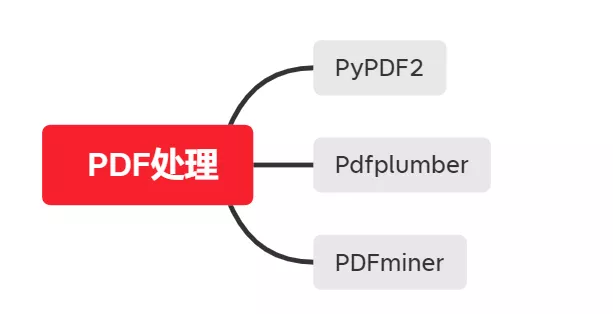
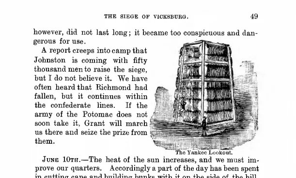
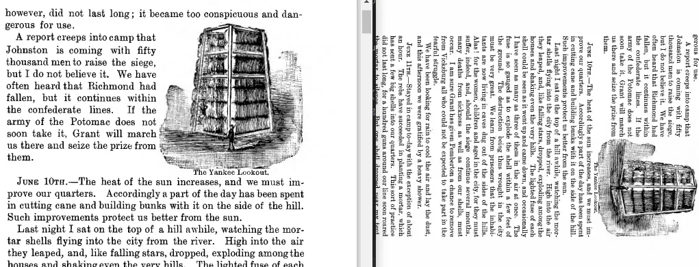
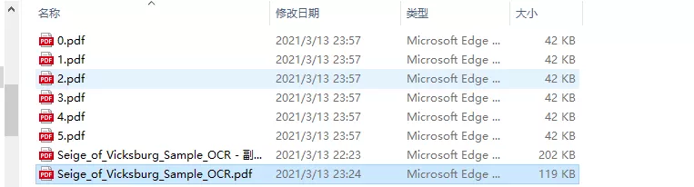
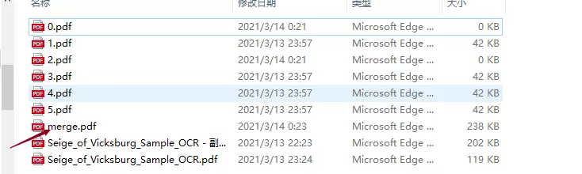
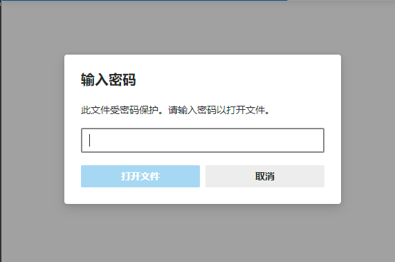

Python PDF PyPDF2<br />Python 库中处理 PDF 比较不错的有三个，分别是 PyPDF2，Pdfplumer 和 PDFminer；<br /><br />借助PyPDF2对 PDF 实现以下基本操作。<br />1、将单个 PDF 拆分为多个 PDF 文件 ；<br />2、将多个 PDF 合并为一个 PDF 文件 ；<br />3、将 PDF 中某页进行旋转 ；<br />4、对 PDF 添加水印 ;<br />5、对 PDF 加密 ；<br />6、对 PDF 进行解密；<br />7、获取 PDF 基本信息，例如作者、标题、页数等；
<a name="ptGjg"></a>
## PyPDF2 历史
PyPDF 的前身是 PyPDf 在2005年发布，该包的最后一个版本发布于2010年，后来大约经过一年左右， 名为 Phasit 的公司赞助 PyPdf 的一个分支后命名为 PyPDF2，两个版本功能都基本一样，最大区别就是 PyPDF2 中 加入了支持 Python3 特性；<br />PyPDF2 近期也没有再更新了，最近一个版本发布在2016年，但使用热度依然没有消退；虽然后面又出现了 PyPDF3、PyPDF4 等不同版本，但这些包并没有对 PyPDF2 功能向后完全兼容，用户受欢迎程度当然也不如 PyPDF2。
<a name="0Povh"></a>
## PyPDF2 安装
与其它Python 库一样，安装可通过 pip 或 conda 工具。
```bash
pip install pypdf2
```
<a name="MlBIW"></a>
## PDF 信息提取
使用 PyPDF2 可以从 PDF 中提取到一些元数据和文本信息，对 PDF 有个大致了解。<br />用 PyPDF2 能够提取的数据如下：

- 作者；
- 创建者；
- 制作者；
- Subject；
- 标题；
- 页数；

这里下载了官网提供的 PDF 样本《Seige_of_Vicksburg_Sample_OCR》一共六页，作为测试数据。<br />
```python
from  PyPDF2 import PdfFileReader
# # pdf 文档
pdf_path = "D:/Data/自动化办公/PDF/Seige_of_Vicksburg_Sample_OCR.pdf"
with open(pdf_path,'rb') as f:
    pdf = PdfFileReader(f)
    infomation = pdf.getDocumentInfo()
    number_of_pages = pdf.getNumPages()
    txt = f'''{pdf_path} information:
    Author : {infomation.author},
    Creator : {infomation.creator},
    Producer : {infomation.producer},
    Subject : {infomation.subject},
    Title : {infomation.title},
    Number of pages : {number_of_pages}
    '''
    print(txt)
```
下面为打印结果
```
D:/Data/自动化办公/PDF/Seige_of_Vicksburg_Sample_OCR.pdf information:
    Author : DSI,
    Creator : LuraDocument PDF Compressor Server 5.5.46.38,
    Producer : LuraDocument PDF v2.38,
    Subject : None,
    Title : Binder1.pdf,
    Number of pages : 6
```
在上面例子中用到了  PdfFileReader 类，用于与 pdf 文件交互；调用该类中的 `getDocumentInfo()` 方法返回一个 DocumentInformation  的实例，该实例中存储着需要的信息；对 `reader` 对象调用 `getNumPages` 方法也可以返回文档页数；这里面的 **页数** 当批量统计时该方法很适用。
<a name="JxlRL"></a>
## PDF 页面旋转
PyPDF2 中 pdf 每一页都是以 page 对象存在，返回某一页的实例可通过 reader 对象中的 `get_Page(page_index)` 方法，其中 page_index 表示索引。<br />对某一页旋转，有两种方式

- `rotateClockwise(90)`，顺时针旋转90度；
- `rotateCounterClockwise(90)`，逆时针旋转 90 度；

下面代码表示将目标 PDF 中第一页顺时针方向旋转 90 度，第二页以逆时针方向旋转 90 度，其它页位置角度不变；
```python
from PyPDF2 import PdfFileReader,PdfFileWriter
pdf_writer = PdfFileWriter()
pdf_reader = PdfFileReader(pdf_path)
# Rotate page 90 degrees to the right
page_1 = pdf_reader.getPage(0).rotateClockwise(90)
pdf_writer.addPage(page_1)
# Rotate page 90 degrees to the left
page_2 = pdf_reader.getPage(1).rotateCounterClockwise(90)
pdf_writer.addPage(page_2)
# 之后的正常写出
for i in range(2,pdf_reader.getNumPages()):
    pdf_writer.addPage(pdf_reader.getPage(i))
with open(pdf_path, 'wb') as fh:
     pdf_writer.write(fh)
```
结果如下<br /><br />代码中同时用到了`PdfFileReader,PdfFileWriter` 这两个类，页面旋转并不是在原有 PDF 基础上进行操作而是在内存处创建了一个新的PDF流对象，将操作后的每一页通过 `addPage()` 方法加入到这个对象中，之后将内存中的这个对象写入到文件中。
<a name="zFywZ"></a>
## 单个 PDF 拆分成多个PDF
```python
from  PyPDF2 import PdfFileReader,PdfFileWriter
# # pdf 文档
pdf_path = "D:/Data/自动化办公/PDF/Seige_of_Vicksburg_Sample_OCR.pdf"
save_path = 'D:/Data/自动化办公/PDF/'
# Split Pages of PDF
pdf_reader = PdfFileReader(pdf_path)
for i in range(0,pdf_reader.getNumPages()):
    pdf_writer = PdfFileWriter()
    pdf_writer.addPage(pdf_reader.getPage(i))
    # Every page write to a path
    with open(save_path+'{}.pdf'.format(str(i)), 'wb') as fh:
         pdf_writer.write(fh)
    print('{} Save Sucessfully !\n'.format(str(i)))
```
代码将 PDF 原文件中的每一页拆分到每一个PDF文件，其中文件名用页索引来命名；<br /><br />通过拆分也可以提取到 pdf 文件中固定页码范围，例如只想提取 pdf 中的 2-5 页，其它部分不要，那么代码将写成下面形式。
```python
pdf_writer = PdfFileWriter()
pdf_reader = PdfFileReader(pdf_path)
for i in range(1,5):
    # pdf_writer = PdfFileWriter()
    pdf_writer.addPage(pdf_reader.getPage(i))
    # Every page write to a path
with open(save_path+'2_5.pdf', 'wb') as fh:
        pdf_writer.write(fh)
```
<a name="kq77A"></a>
## 多个 PDF 文件合并为单个
pdf 拆分与合并方向虽然相反，但用到的类、原理都是一样的。<br />`PdfFileReader`读取每个pdf，并递归获取每一页page 对象， `PdfFileWrite` 新建一个流对象，把前面内存中读取到的 page 对象按顺序写入到这个流对象中，最后写入到磁盘文件。
```python
from  PyPDF2 import PdfFileReader,PdfFileWriter
p1_pdf = "D:/Data/自动化办公/PDF/Seige_of_Vicksburg_Sample_OCR.pdf"
p2_pdf = "D:/Data/自动化办公/PDF/Seige_of_Vicksburg_Sample_OCR.pdf"
merge_pdf = 'D:/Data/自动化办公/PDF/merge.pdf'
p1_reader = PdfFileReader(p1_pdf)
p2_reader = PdfFileReader(p2_pdf)
merge = PdfFileWriter()
# Write p1
for i in range(0,p1_reader.getNumPages()):
    merge.addPage(p1_reader.getPage(i))
# Write p2
for j in range(0,p2_reader.getNumPages()):
    merge.addPage(p2_reader.getPage(j))
# Write out
with open(merge_pdf,'wb') as f:
    merge.write(f)
```
运行结果如下<br />
<a name="htAHE"></a>
## PDF 添加水印
批量添加水印主要用到 page 对象中的 `margePage()` 方法，通过将两个页面合并来达到添加水印的效果。<br />因为 PyPDF2 只能操作 pdf 对象，因此在添加水印之前，需要将准备添加的水印存放到一个 pdf 文件中。
```python
from  PyPDF2 import PdfFileReader,PdfFileWriter
watermark = 'D:/Data/自动化办公/PDF/watermark.pdf'
input_pdf = 'D:/Data/自动化办公/PDF/merge.pdf'
output = 'D:/Data/自动化办公/PDF/merge_watermark.pdf'
watermark_obj = PdfFileReader(watermark)
watermark_page = watermark_obj.getPage(0)
pdf_reader = PdfFileReader(input_pdf)
pdf_writer = PdfFileWriter()
# Watermark all the pages
for page in range(pdf_reader.getNumPages()):
    page = pdf_reader.getPage(page)
    page.mergePage(watermark_page)
    pdf_writer.addPage(page)
with open(output, 'wb') as out:
    pdf_writer.write(out)
```
用以上代码添加水印的好处是，可以对 pdf 指定页田间水印，比如说只对奇数页添加偶数页不管，不但灵活性强而且高效，当然也可以对多个文件进行批量操作。
<a name="XHtaj"></a>
## PDF加密解密
<a name="VBp4s"></a>
### pdf加密
对一份 pdf 文件，如果不想让其他人能够读取里面的内容，可以通过 pypdf2 对它设置密码，如果只是单个文件的话，建议最好找个工具受手动操作一下会高效一点，但若是多个文件，非常建议用下面方法。
```python
watermark = 'D:/Data/自动化办公/PDF/Seige_of_Vicksburg_Sample_OCR.pdf'
input_pdf = 'D:/Data/自动化办公/PDF/merge.pdf'
output = 'D:/Data/自动化办公/PDF/merge_watermark1.pdf'
watermark_obj = PdfFileReader(watermark)
watermark_page = watermark_obj.getPage(0)
pdf_reader = PdfFileReader(input_pdf)
pdf_writer = PdfFileWriter()
# Watermark all the pages
for page in range(pdf_reader.getNumPages()):
    page = pdf_reader.getPage(page)
    page.mergePage(watermark_page)
    pdf_writer.addPage(page)
pdf_writer.encrypt(user_pwd='123456',
                       use_128bit=True)
with open(output, 'wb') as out:
    pdf_writer.write(out)
```
<br />主要用到 encrypt　函数，需要注意三个参数

- user_pwd，str，用户密码，用来限制打开读取文件；
- owner_pwd，str，比用户密码更高一级，提供时可让打开文件不受任何限制，不指定时默认owner_pwd 与 user_pwd 相同；
- use_128bit　布尔值，用来表示是否使用128位作为密码，False 时代表用 40 位密码，默认为True；
<a name="vpyKH"></a>
### pdf解密
解密是在读取文件时用的，用到 `decrypt()` 函数。
```python
rom PyPDF2 import PdfFileWriter, PdfFileReader
input_pdf='reportlab-encrypted.pdf'
output_pdf='reportlab.pdf'
password='twofish'
pdf_writer = PdfFileWriter()
pdf_reader = PdfFileReader(input_pdf)
pdf_reader = pdf_reader.decrypt(password)
for page in range(pdf_reader.getNumPages()):
     pdf_writer.addPage(pdf_reader.getPage(page))
with open(output_pdf, 'wb') as fh:
      pdf_writer.write(fh)
```
上面例子中解密原理是 通过将一个加密文件进行读取，并写入到一个非加密 pdf 中。
