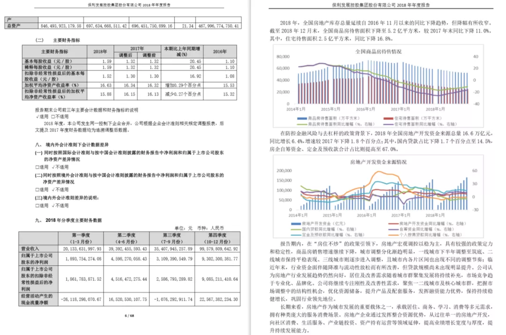
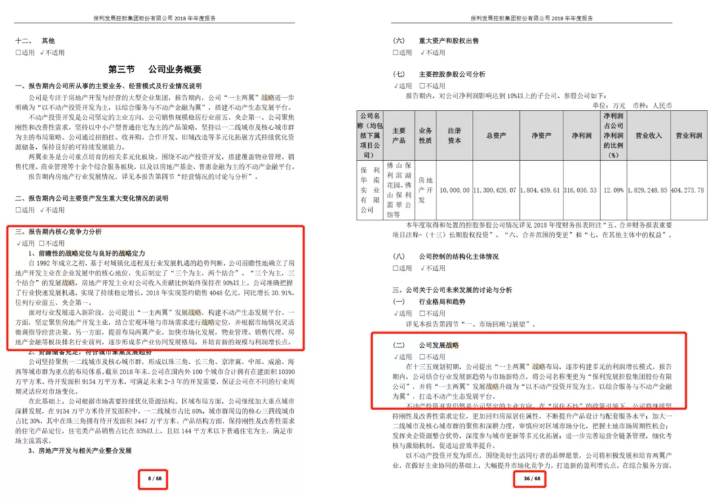
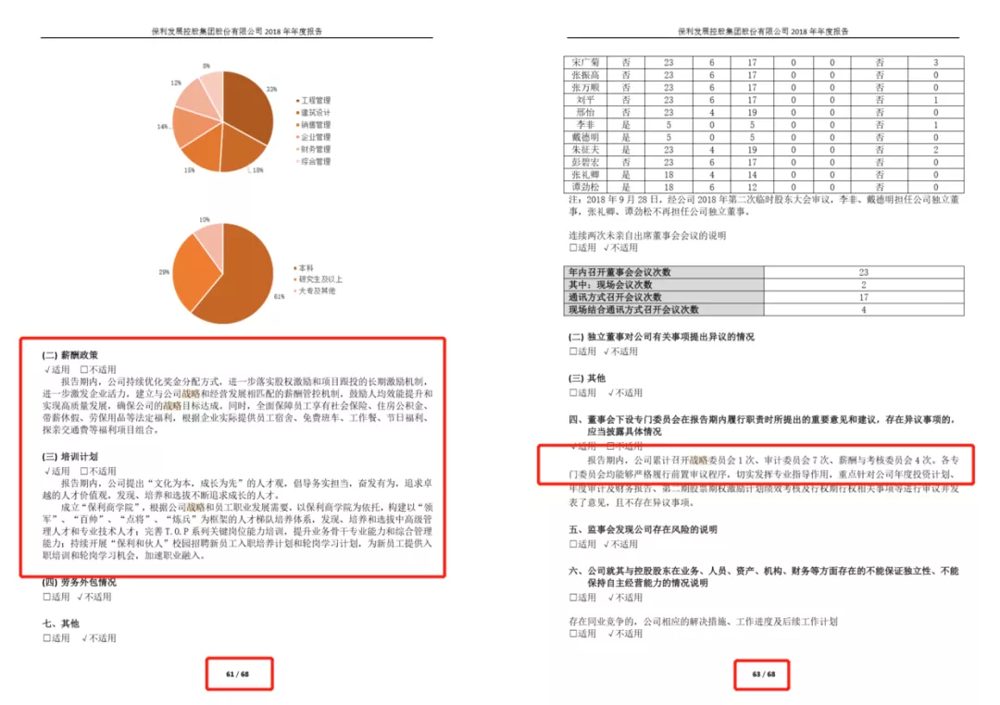
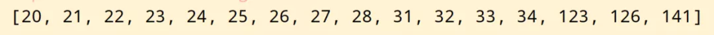

Python PDF<br />很多时候，希望将PDF中包含指定内容的页面提取合并为新PDF，这里以两个真实需求为例进行讲解。
<a name="Ma86a"></a>
## 1、需求描述
数据是一份有286页的上市公司公开年报PDF，大致如下<br />现在需要利用 Python 完成以下两个需求<br />需求一：提取所有包含 战略 二字的页面并合并新PDF<br />需求二：提取所有包含图片的页面，并分别保存为 PDF 文件
<a name="fsTEU"></a>
## 2、前置知识和逻辑梳理
<a name="zzDrE"></a>
### 2.1 PyPDF2 模块实现合并
PyPDF2 导入模块的代码常常是：
```python
from PyPDF2 import PdfFileReader, PdfFileWriter
```
这里导入了两个方法：

1. `PdfFileReader` 可以理解为读取器
2. `PdfFileWriter` 可以理解为写入器

利用 PyPDF2 实现合并运用的一下逻辑：

1. 读取器将所有pdf读取一遍
2. 读取器将读取的内容交给写入器
3. 写入器统一输出到一个新pdf

隐含知识点：读取器只能将读取的内容一页一页交给写入器
<a name="RWjRm"></a>
### 2.2 获取与添加页面

1. `.getPage` 获取特定页
2. `.addPage` 添加特定页
<a name="tE1g2"></a>
### 2.3 图片和文字的处理
要实现本文的需求还要做到很重要的一个判断：确定页面中有无包含的文字或图片<br />判断是否包含特定的文字比较简单，遍历每一页的时候都将包含的文本抽提出，做字符串层面的判断即可，代码思路：

1. 利用 `pdfplumber` 打开PDF 文件
2. 获取指定的页，或者遍历每一页
3. 利用 `.extract_text()` 方法提取当前页的文字
4. 判断 “战略” 是否在提取的文字中

判断是否包含图片，思路和上面是类似的，但方法不同。图片考虑用正则的方法识别，用 `fitz` 和 `re` 配合。
<a name="owhQK"></a>
## 3、代码实现
<a name="rISV8"></a>
### 3.1 需求一的实现
首先来完成需求一的任务，导入需要用到的库：读取写入PDF文件的 `PyPDF2` 以及抽提文本的 `pdfplumber`
```python
from PyPDF2 import PdfFileReader, PdfFileWriter
import pdfplumber
```
指定文件所在的路径，同时初始化写入器，将文件交给读取器：
```python
path = r'C:\xxxxxx'
pdf_writer = PdfFileWriter()
pdf_reader = PdfFileReader(path + r'\公司年报.PDF')
```
以上下文管理器形式通过 `pdfplumber` 打开文件，同时用 `.getNumPages` 获取读取器的最大页利于遍历每一页来抽提文字：
```python
with pdfplumber.open(path + r'\公司年报.PDF') as pdf:
    for i in range(pdf_reader.getNumPages()):
        page = pdf.pages[i]
        print(page.extract_text())
```
抽提文字的目的是用来判断，将符合要求的页码作为读取器 `.getPage` 的参数，最后用 `.addPage` 交给写入器：
```python
with pdfplumber.open(path + r'\公司年报.PDF') as pdf:
    for i in range(pdf_reader.getNumPages()):
        page = pdf.pages[i]
        print(page.extract_text())
        if '战略' in page.extract_text():
            pdf_writer.addPage(pdf_reader.getPage(i))
            print(i + 1, page.extract_text())
```
完成识别后让写入器输出为需要的文件名：
```python
with open(path + r'\new_公司年报.pdf', 'wb') as out:
    pdf_writer.write(out)
```
至此，就完成了包含特定文字内容页面的提取，并整合成一个PDF。所有的页面均包含“战略”二字：<br /><br />需求一完整代码如下，感兴趣的可以自行研究
```python
from PyPDF2 import PdfFileReader, PdfFileWriter
import pdfplumber

path = r'C:\xxx'
pdf_writer = PdfFileWriter()
pdf_reader = PdfFileReader(path + r'\公司年报.PDF')

with pdfplumber.open(path + r'\公司年报.PDF') as pdf:
    for i in range(pdf_reader.getNumPages()):
        page = pdf.pages[i]
        print(page.extract_text())
        if '战略' in page.extract_text():
            pdf_writer.addPage(pdf_reader.getPage(i))
            print(i + 1, page.extract_text())

with open(path + r'\new_公司年报1.pdf', 'wb') as out:
    pdf_writer.write(out)
```
<a name="aSGgK"></a>
### 3.2 需求二的实现
接下来完成需求二的任务。首先导入需要的库：
```python
from PyPDF2 import PdfFileReader, PdfFileWriter
import fitz
import re
import os
```
指定文件所在的路径：
```python
path = r'C:\xxxxxx'
```
正则识别图片直接看代码：
```python
page_lst = []
checkImg = r"/Subtype(?= */Image)"
pdf = fitz.open(path + r'\公司年报.PDF')
lenXREF = pdf._getXrefLength()

for i in range(lenXREF):
    text = pdf._getXrefString(i)
    isImage = re.search(checkImg, text)
    if isImage:
        page_lst.append(i)

print(page_lst)
```
<br />获取到所有包含图片的页面后，再结合读取器和写入器的配合就能完成新 PDF 的产生。注意本需求是所有图片单独输出，因此获取到页面后交给写入器直接输出成文件：
```python
pdf_reader = PdfFileReader(path + r'\公司年报.PDF')
for page in page_lst:
    pdf_writer = PdfFileWriter()
    pdf_writer.addPage(pdf_reader.getPage(page))
    with open(path + r'\公司年报_{}.pdf'.format(page + 1), 'wb') as out:
        pdf_writer.write(out)
```
至此也完成了第二个需求。需要说明的是目前没有非常完美提取PDF图片的方法，本案例介绍的方法识别图片也并不稳定。可以利用自己的数据多做尝试。完整代码如下：
```python
from PyPDF2 import PdfFileReader, PdfFileWriter
import fitz
import re
import os

path = r'C:\xxx'

page_lst = []
checkImg = r"/Subtype(?= */Image)"
pdf = fitz.open(path + r'\公司年报.PDF')
lenXREF = pdf._getXrefLength()
for i in range(lenXREF):
    text = pdf._getXrefString(i)
    isImage = re.search(checkImg, text)
    if isImage:
        page_lst.append(i)

print(page_lst)

pdf_reader = PdfFileReader(path + r'\公司年报.PDF')
for page in page_lst:
    pdf_writer = PdfFileWriter()
    pdf_writer.addPage(pdf_reader.getPage(page))
    with open(path + r'\公司年报_{}.pdf'.format(page + 1), 'wb') as out:
        pdf_writer.write(out)
```
实现这两个单个需求后，就可以将相关代码封装并结合os等模块实现批量操作，解放双手。
