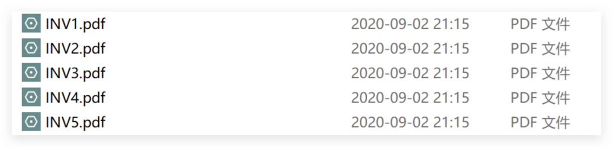
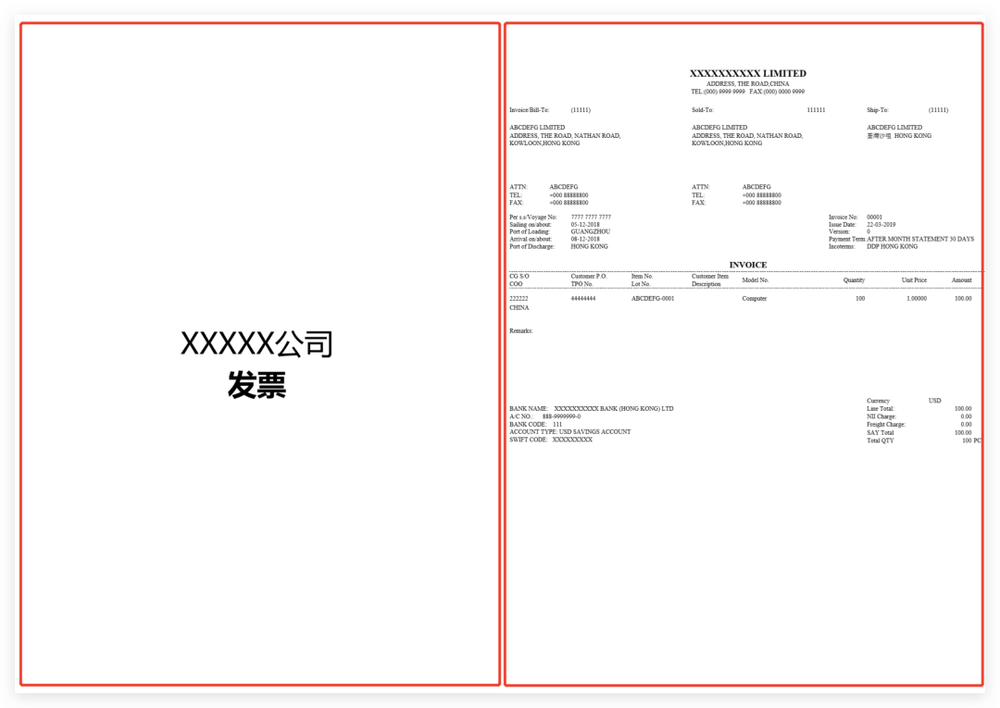
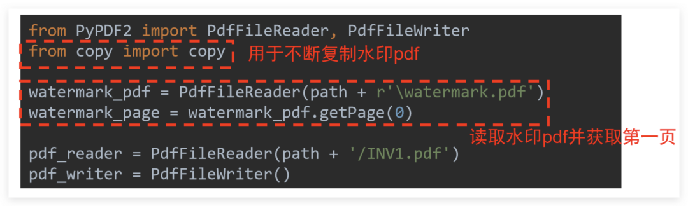
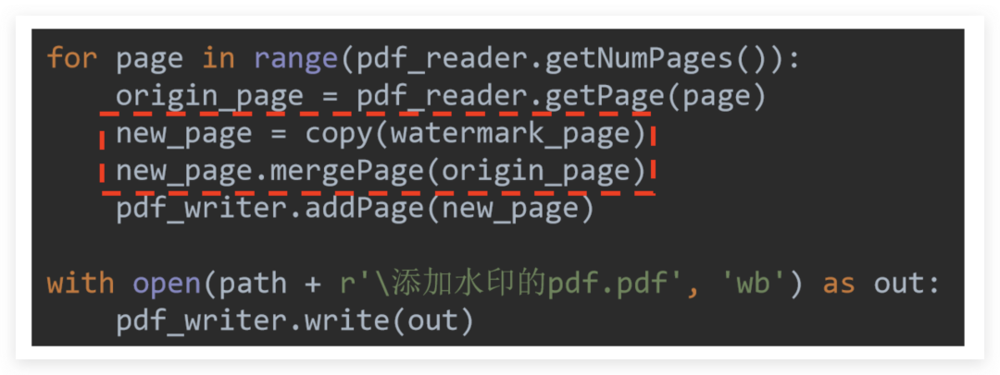
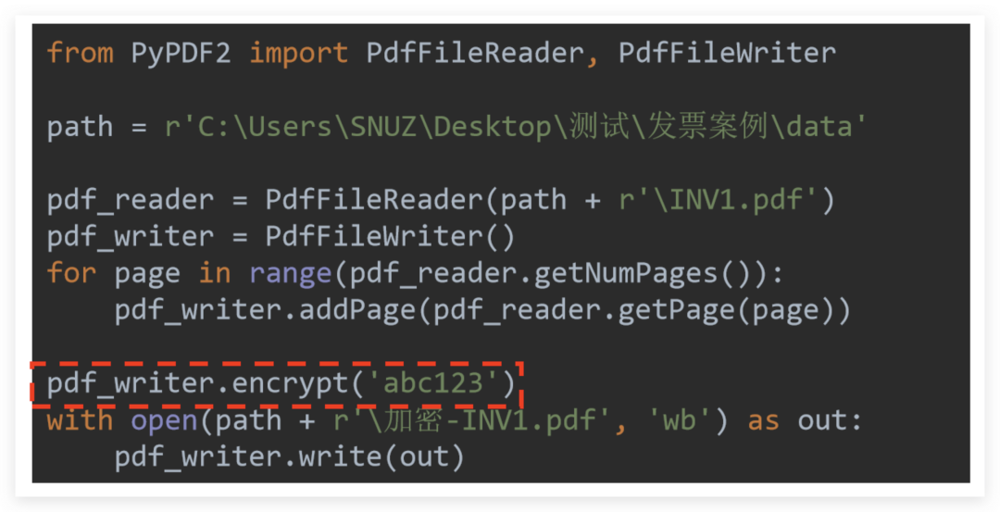
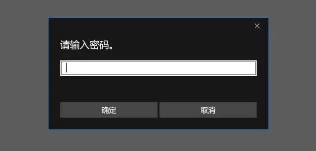
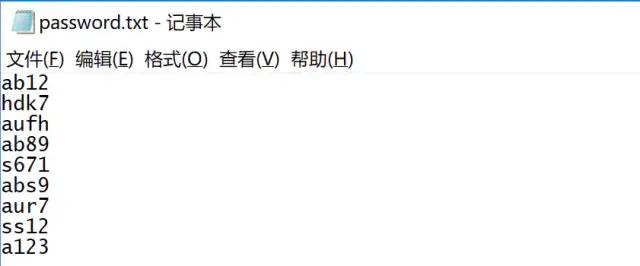
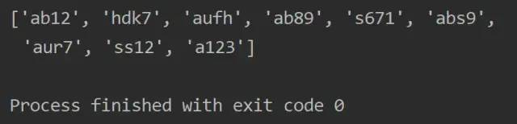
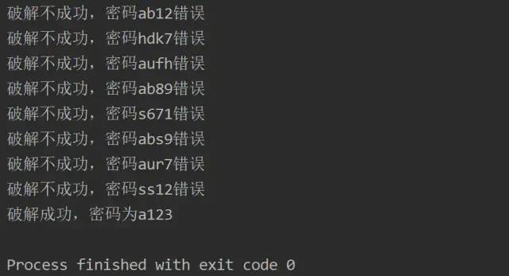
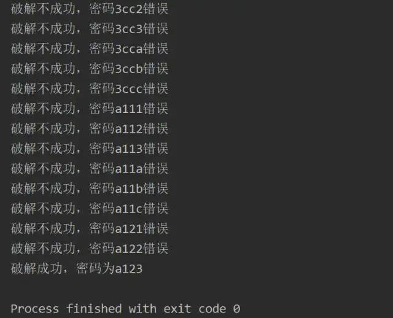

Python PDF
<a name="JfmSt"></a>
## 一、前言
Python处理PDF有一个很实用的模块——PyPDF2。
<a name="FBrGi"></a>
## 二、基本操作
PyPDF2 导入模块的代码常常是：
```python
from PyPDF2 import PdfFileReader, PdfFileWriter
```
这里导入了两个方法：

- `PdfFileReader`可以理解为读取器
- `PdfFileWriter`可以理解为写入器

接下来通过几个案例进一步认识这两个工具的奇妙之处，用到的示例文件是5个发票的pdf<br /><br />每个发票的PDF都由两页组成：<br />
<a name="vwNt0"></a>
## 三、合并
第一个工作是将5个发票pdf合并成10页。这里读取器和写入器应该怎么配合呢？<br />逻辑如下：

1. 读取器将所有pdf读取一遍
2. 读取器将读取的内容交给写入器
3. 写入器统一输出到一个新pdf

这里还有一个重要的知识点：读取器只能将读取的内容一页一页交给写入器。<br />因此，逻辑中第1步和第2步实际上不是彼此独立的步骤，而是读取器读取完一个pdf后，就将这个pdf全部页循环一遍，挨页交给写入器。最后等读取工作全部结束后再输出。<br />看一下代码可以让思路更清楚：
```python
from PyPDF2 import PdfFileReader, PdfFileWriter

path = r'C:\Users\xxxxxx'
pdf_writer = PdfFileWriter()

for i in range(1, 6):
    pdf_reader = PdfFileReader(path + '/INV{}.pdf'.format(i))
    for page in range(pdf_reader.getNumPages()):
        pdf_writer.addPage(pdf_reader.getPage(page))

with open(path + r'\合并PDF\merge.pdf', 'wb') as out:
    pdf_writer.write(out)
```
由于全部内容都需要交给同一个写入器最后一起输出，所以写入器的初始化一定是在循环体之外的.<br />如果在循环体内则会变成每次访问读取一个pdf就生成一个新的写入器，这样每一个读取器交给写入器的内容就会被反复覆盖，无法实现合并需求!<br />循环体开头的代码：
```python
for i in range(1, 6):
    pdf_reader = PdfFileReader(path + '/INV{}.pdf'.format(i))
```
目的就是每次循环读取一个新的pdf文件交给读取器进行后续操作。实际上这种写法不是很提倡，由于各pdf命名恰好很规则，所以可以直接人为指定数字进行循环。更好的方法是用glob模块：
```python
import glob
for file in glob.glob(path + '/*.pdf'):
    pdf_reader = PdfFileReader(path)
```
代码中`pdf_reader.getNumPages()`: 能够获取读取器的页数，配合`range`就能遍历读取器的所有页。<br />`pdf_writer.addPage(pdf_reader.getPage(page))`能够将当前页交给写入器。<br />最后，用`with`新建一个pdf并由写入器的`pdf_writer.write(out)`方法输出即可
<a name="BfmSj"></a>
## 四、拆分
如果明白了合并操作中读取器和写入器的配合，那么拆分就很好理解了，这里以拆分INV1.pdf为2个单独的pdf文档为例，同样也先来分析逻辑：

1. 读取器读取PDF文档
2. 读取器一页一页交给写入器
3. 写入器每获取一页就立即输出

通过这个代码逻辑也可以明白，写入器初始化和输出的位置一定都在读取PDF循环每一页的循环体内，而不是在循环体外<br />代码很简单：
```python
from PyPDF2 import PdfFileReader, PdfFileWriter
path = r'C:\Users\xxx'
pdf_reader = PdfFileReader(path + '\INV1.pdf')

for page in range(pdf_reader.getNumPages()):
    # 遍历到每一页挨个生成写入器
    pdf_writer = PdfFileWriter()
    pdf_writer.addPage(pdf_reader.getPage(page))
    # 写入器被添加一页后立即输出产生pdf
    with open(path + '\INV1-{}.pdf'.format(page + 1), 'wb') as out:
        pdf_writer.write(out)
```
<a name="mIotT"></a>
## 五、水印
将下图作为水印添加到INV1.pdf中<br /><br />首先是准备工作，将需要作为水印的图片插入word中调整合适位置后保存为PDF文件。然后就可以码代码了，需要额外用到`copy`模块，具体解释见下图：<br /><br />就是把读取器和写入器初始化，并且把水印PDF页先读取好备用,核心代码稍微比较难理解：<br /><br />加水印本质上就是把水印PDF页和需要加水印的每一页都合并一遍<br />由于需要加水印的PDF可能有很多页，而水印PDF只有一页，因此如果直接把水印PDF拿来合并，可以抽象理解成加完第一页，水印PDF页就没有了。<br />因此不能直接拿来合并，而要把水印PDF页不断`copy`出来成新的一页备用`new_page`，再运用`.mergePage`方法完成跟每一页合并，把合并后的页交给写入器待最后统一输出!<br />关于`.mergePage`的使用：出现在下面的页`.mergePage`(出现在上面的页)，最后效果如图：<br />
<a name="lPKKS"></a>
## 六、加密
加密很简单，只需要记住：「加密是针对写入器加密」<br />因此只需要在相关操作完成后调用`pdf_writer.encrypt(密码)`<br />以单个PDF的加密为例：<br /><br />先随意拿一个PDF 文件试一下：
```python
from PyPDF2 import PdfFileWriter, PdfFileReader
path = r'C:\xxx' # 这里填写目标 PDF 所在的路径

pdf_reader = PdfFileReader(path + r'\test.pdf')
pdf_writer = PdfFileWriter()

for page in range(pdf_reader.getNumPages()):
    pdf_writer.addPage(pdf_reader.getPage(page))
pdf_writer.encrypt('a123') # 设置密码为 a123
with open(path + r'\test.pdf', 'wb') as out:
    pdf_writer.write(out)
```
上面代码的运行逻辑是：实例化一个 PDF 写入器和读取器，读取器读取完目标 PDF 文件后，一页一页交给写入器，然后对写入器设置密码并输出。看一下运行结果：<br /><br />可见这个 PDF 文件成功设置上了密码，如果有多个PDF需要加密，可以写一个简单的循环利用上述脚本批量处理，此处不再展开说明。
<a name="GYUQF"></a>
## 七、解密
<a name="W31Zh"></a>
### PDF 已知密码解密
如果知道密码的情况下，想直接取消 PDF 的加密，可以用`.decrypt`，解密的过程需要读取器和写入器共同配合。但区别于加密`.encrypt`，`.decrypt` 是针对读取器进行解密的，而不是写入器
```python
from PyPDF2 import PdfFileWriter, PdfFileReader
path = r'C:\xxx'

pdf_reader = PdfFileReader(path + r'\test.pdf')
pdf_reader.decrypt('a123') #
pdf_writer = PdfFileWriter()

for page in range(pdf_reader.getNumPages()):
    pdf_writer.addPage(pdf_reader.getPage(page))
with open(path + r'\test.pdf', 'wb') as out:
    pdf_writer.write(out)
```
上面代码的运行逻辑是：首先用读取器读取加密文件，然后直接在读取器上使用`.decrypt`进行解密，逐页传到刚实例化的写入器后统一输出，就完成了解密
<a name="MSFh1"></a>
### PDF 暴力解密
暴力破解，其实就是通过手上已经有的密码库，或者完全通过数字、字母、符号的穷举，将可能的密码都放进去，逐个尝试直到成功。<br />「目前暴力破解只适用于已知密码位数少，由简单的数字、字母构成」<br />假设要破解的密码就是a123，已知密码 4 位且由数字和小写字母组成。破解又分为两种情况：
<a name="dIMeK"></a>
#### 1. 手上有密码本
第一种情况，知道大概密码，可以整理成一个password.txt，保证可能的密码一定在其中：<br /><br />首先读取.txt文件获取其中所有密码（示例文件只有 9 个密码）：
```python
passw = []
path = r'C:\Scientific Research\Python'
file = open(path + r'\password.txt')
for line in file.readlines():
    passw.append(line.strip())
print(passw)
file.close()
```
<br />然后就可以用密码本的密码做暴力破解：
```python
from PyPDF2 import PdfFileReader

passw = []
path = r'C:\xxx'
file = open(path + r'\password.txt')
for line in file.readlines():
    passw.append(line.strip())
file.close()

path = r'C:\xxx'
pdf_reader = PdfFileReader(path + r'\test).pdf')

for i in passw:
    if pdf_reader.decrypt(i):
        print(f'破解成功，密码为{i}')
    else:
        print(f'破解不成功，密码{i}错误')
```

<a name="bf3sq"></a>
#### 2. 手术无密码本，完全穷举
首先介绍`itertools`，可以构建含需要组合的生成器供后续迭代：
```python
import itertools
mylist = ("".join(x) for x in itertools.product("0123456789abcdef", repeat=4))
print(next(mylist))
```
利用这个方法就可以用`while`循环尝试暴力破解（为了减少时间，生成器用"abc123"生成组合）：
```python
import itertools
from PyPDF2 import PdfFileReader

mylist = ("".join(x) for x in itertools.product("123abc", repeat=4))
path = r'C:\xxx'
pdf_reader = PdfFileReader(path + r'\test.pdf')

while True:
    i = next(mylist)
    if pdf_reader.decrypt(i):
        print(f'破解成功，密码为{i}')
        break
    else:
        print(f'破解不成功，密码{i}错误')
```
<br />可以看到最后也成功破解了，但需要注意：但即使是这么简单的组合也耗费了一点时间，如果复杂的密码破解难度和破解时间就指数级增长了，暴力的穷举法就不一定适用，可以根据需求具体调整规则，缩小范围再进行尝试。
<a name="jM6Cv"></a>
## Python办公自动化｜批量合并PDF
将代码中PDF的路径和文件名修改即可使用
```python
import os
from PyPDF2 import PdfFileReader, PdfFileWriter

def GetFileName(dir_path):
    file_list = [os.path.join(dirpath, filesname) \
                 for dirpath, dirs, files in os.walk(dir_path) \
                 for filesname in files]
    return file_list

def MergePDF(dir_path, file_name):
    output = PdfFileWriter()
    outputPages = 0
    file_list = GetFileName(dir_path)
    for pdf_file in file_list:
        print("文件：%s" % pdf_file.split('\\')[-1], end=' ')
        # 读取PDF文件
        input = PdfFileReader(open(pdf_file, "rb"))
        # 获得源PDF文件中页面总数
        pageCount = input.getNumPages()
        outputPages += pageCount
        print("页数：%d" % pageCount)
        # 分别将page添加到输出output中
        for iPage in range(pageCount):
            output.addPage(input.getPage(iPage))
    print("\n合并后的总页数:%d" % outputPages)
    # 写入到目标PDF文件
    print("PDF文件正在合并，请稍等......")
    with open(os.path.join(dir_path, file_name), "wb") as outputfile:
        # 注意这里的写法和正常的上下文文件写入是相反的
        output.write(outputfile)
    print("PDF文件合并完成")

if __name__ == '__main__':
    # 设置存放多个pdf文件的文件夹
    dir_path = r'C:\Scientific Research\Knowladge\Ophthalmology\Chinese Ophthalmology'
    # 目标文件的名字
    file_name = "中华眼科学（第3版）合并版.pdf"
    MergePDF(dir_path, file_name)
```
