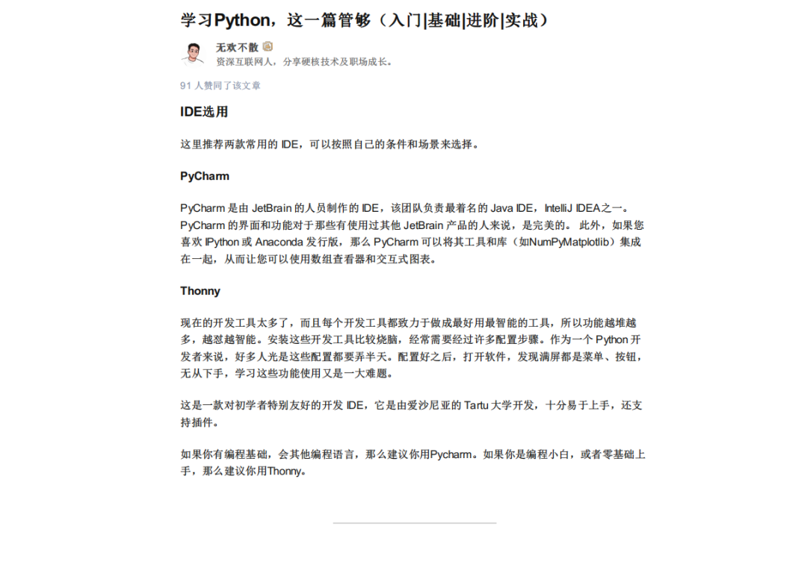
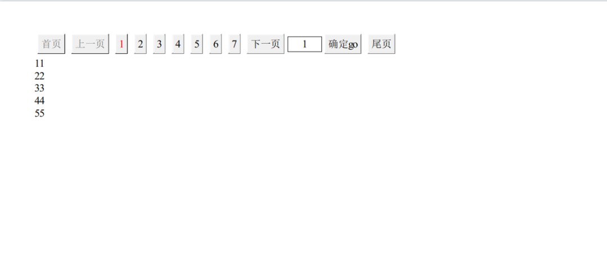

Python
<a name="Pt8Ym"></a>
### pdfkit 是什么
pdfkit 是把 HTML+CSS 格式的文件转换成 PDF 的一种工具，它是 wkhtmltopdf 这个工具包的 python 封装。所以，使用 pdfkit 之前要先安装 wkhtmltopdf 。<br />[网页转PDF](https://www.yuque.com/fcant/app/gvxtgy?view=doc_embed&inner=gOsYx)
<a name="XDW2g"></a>
### pdfkit 安装
安装完 wkhtmltopdf 之后，再来安装 pdfkit：
```bash
pip install pdfkit
```
跟安装其他 python 包一样，只需要使用 pip 安装就行。
<a name="tV7N9"></a>
### pdfkit 应用
pdfkit 是基于 wkhtmltopdf 的封装，所以功能肯定也是基于 wkhtmltopdf 的。
<a name="O13g4"></a>
#### URL 对应网页转 PDF
先来看一个例子：
```python
path_wkthmltopdf = r'C:\Program Files\wkhtmltopdf\bin\wkhtmltopdf.exe'
config = pdfkit.configuration(wkhtmltopdf=path_wkthmltopdf)
pdfkit.from_url(r"https://zhuanlan.zhihu.com/p/421726412", "studypython.pdf", configuration=config)
```
例子很简单，就三行代码。<br />第一行是 wkhtmltopdf 软件安装目录的 bin 目录地址；<br />第二行是将这个目录地址传入 pdfkit 的配置中；<br />第三行就是传入网页 URL 和生成文件的目标地址，传入配置信息，然后就可以生成 PDF 了。<br />运行之后，生成的 PDF 文件是这样的：<br />
<a name="i3Tzt"></a>
#### HTML 文件转 PDF
这个方法也很简单，跟上一个类似，只需要将 pdfkit 调用的函数改一下即可：
```python
path_wkthmltopdf = r'C:\Program Files\wkhtmltopdf\bin\wkhtmltopdf.exe'
config = pdfkit.configuration(wkhtmltopdf=path_wkthmltopdf)
pdfkit.from_file(r'C:\Users\xxx\Downloads\ttest\test.html','html.pdf', configuration=config)
```
可以看到，前两行一样，第三行用了 `from_file` 函数。这里传入的是一个简单的分页页面，生成的 PDF 文件如下：<br />
<a name="mcdM6"></a>
#### 字符串转 PDF
如果手中有大量的文档需要转 PDF 文件，比如说下载了很多部小说。这时候可以使用 pdfkit 的字符串转 PDF 功能，批量操作，进行转化。
```python
path_wkthmltopdf = r'C:\Program Files\wkhtmltopdf\bin\wkhtmltopdf.exe'
config = pdfkit.configuration(wkhtmltopdf=path_wkthmltopdf)
pdfkit.from_string('talk is cheap, show me your code!','str.pdf', configuration=config)
```
运行这段代码，生成 PDF 文件如下：<br />
<a name="dALf6"></a>
### 总结
介绍了一款轻量级的三方包——pdfkit，可以将 URL 对应的网页、HTML 文件和字符串转成 PDF 文件。
