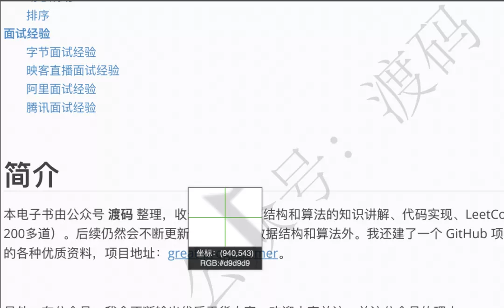
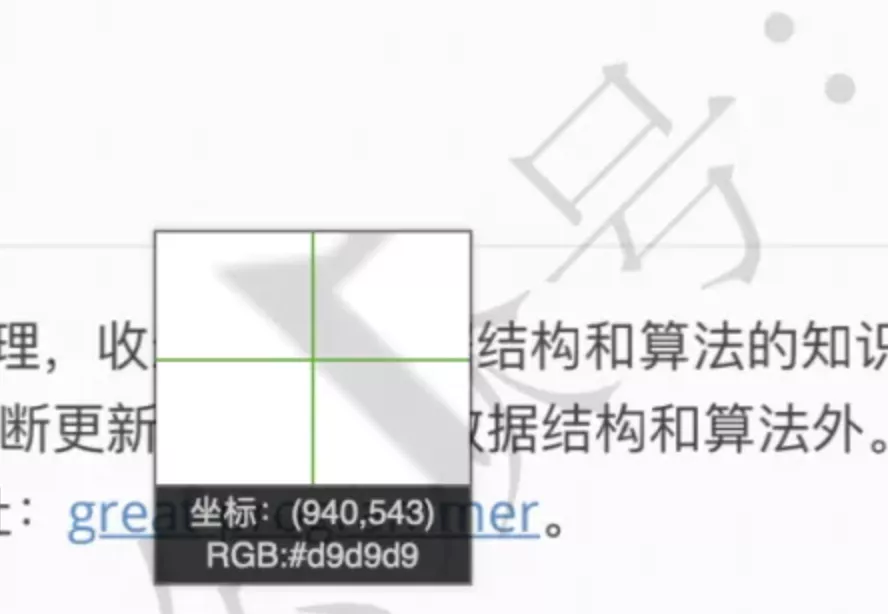

Python PDF<br />用 Python 去除 PDF （图片）的水印。思路很简单，代码也很简洁。<br />首先考虑 Python 去除图片的水印，然后再将思路复用到 PDF 上面。<br /><br />从上图可以明显看到，为了不影响阅读正文，水印颜色一般比较浅。因此，可以利用颜色差这个特征来去掉水印。即：用 Python 读取图片的颜色，并将浅颜色部分变白。<br />Python 标准库 PIL 可以获取图片的颜色，Python2 是系统自带的，Python3 需要自己安装，这里用的 Python 3.8，需要执行以下命令安装
```bash
pip install pillow
```
安装完成，读取图片，并获取图片的尺寸（宽度和高度）
```python
from PIL import Image

img = Image.open('watermark_pic.png')
width, height = img.size
```
进行下一步之前，先简单介绍下计算机里关于颜色的知识。光学三原色是红绿蓝（RGB），也就是说它们是不可分解的三种基本颜色，其他颜色都可以通过这三种颜色混合而成，三种颜色等比例混合就是白色，没有光就是黑色。<br />在计算机中，可以用三个字节表示 RGB 颜色，1个字节能表示的最大数值是 255， 所以，`(255, 0, 0)`代表红色，`(0, 255, 0)`代表绿色，`(0, 0, 255)`代表蓝色。相应地，`(255, 255, 255)`代表白色，`(0, 0, 0)`代表黑色。从`(0, 0, 0)` ~ `(255, 255, 255)` 之间的任意组合都可以代表一个不同的颜色。<br />接下来可以通过下面代码读取图片的 RGB
```python
for i in range(width):
    for j in range(height):
        pos = (i, j)
        print(img.getpixel(pos)[:3])
```
图片每个位置颜色由四元组表示，前三位分别是 RGB，第四位是 Alpha 通道，不需要关心。<br />有了 RGB ，就可以对其修改。<br /><br />从图中可以发现，水印的 RGB 是 #d9d9d9，这里是用十六进制表示的，其实就是(217, 217, 217)。<br />这三个颜色值都越靠近 255，颜色就越淡，当它们都变成 255，也就成了白色。所以只要 RGB 都大于 217 的位置，都可以给它填成白色。即：RGB 三位数之和大于等于 651。
```python
if sum(img.getpixel(pos)[:3]) >= 651:
    img.putpixel(pos, (255, 255, 255))
```
完整代码如下：
```python
from PIL import Image

img = Image.open('watermark_pic.png')
width, height = img.size

for i in range(width):
    for j in range(height):
        pos = (i, j)
        if sum(img.getpixel(pos)[:3]) >= 651:
            img.putpixel(pos, (255, 255, 255))

img.save('watermark_removed_pic.png')
```
有了上面的基础，去除 PDF 的水印就简单了，思路是将每页 PDF 转成图片，然后修改水印的 RGB，最后输出图片即可。<br />安装 pymupdf 库，用来来操作 PDF
```bash
pip install pymupdf
```
读取 PDF，并转图片
```python
import fitz


doc = fitz.open("001.pdf")

for page in doc:
    pix = page.get_pixmap()
```
该 PDF 共 480 页，所以需要遍历每一页，并获取每一页对应的图片`pix`。`pix`对象类似于上面看到的`img`对象，可以读取、修改它的 RGB。<br />`page.get_pixmap()` 这个操作是不可逆的，即能够实现从 PDF 到图片的转换，但修改图片 RGB 后无法应用到 PDF 上，只能输出为图片。<br />修改水印 RGB 跟刚才一样，区别是这里的 RGB 是一个三元组，没有 Alpha 通道，代码如下：
```python
from itertools import product

for pos in product(range(pix.width), range(pix.height)):
    if sum(pix.pixel(pos[0], pos[1])) >= 651:
        pix.set_pixel(pos[0], pos[1], (255, 255, 255))
```
完整代码如下：
```python
from itertools import product
import fitz


doc = fitz.open("001.pdf")

page_no = 0
for page in doc:
    pix = page.get_pixmap()

    for pos in product(range(pix.width), range(pix.height)):
        if sum(pix.pixel(pos[0], pos[1])) >= 651:
            pix.set_pixel(pos[0], pos[1], (255, 255, 255))

    pix.pil_save(f"pdf_pics/page_{page_no}.png", dpi=(30000, 30000))

    print(f'第 {page_no} 页去除完成')
    page_no += 1
```
这种方案是有缺点的，第一，输出并非 PDF 格式；第二，输出的图片比较模糊，后续还有待优化，最好是能直接修改 PDF。
