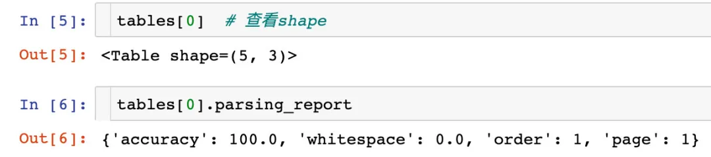

Python<br />在很多情况下，都需要处理PDF格式的文件。尤其当遇到PDF表格数据需要进行提取，真的是一个令人头疼的问题。<br />因为PDF文件不能像Word那样直接复制，即使复制了再黏贴也可能会出现格式排版错乱甚至乱码问题。如何从一个PDF文件提取出表格数据？本文提供两个解决方案：

- camelot
- tabula
<a name="mtbze"></a>
## 神器1：camelot
首先提供的一种方法是从文字 PDF 中提取表格信息的工具：Camelot，它能够直接将大部分表格转换为 Pandas 的 DataFrame。<br />更多的详细信息，请参考项目地址：[https://github.com/camelot-dev/camelot](https://github.com/camelot-dev/camelot)
<a name="iNqvf"></a>
### 安装camelot
camelot的安装有多种方式。如果有报错，网上一般有解决方式：
<a name="GqGLo"></a>
#### 1、通过conda安装
```bash
conda install -c conda-forge camelot-py
```
<a name="ZpwCm"></a>
#### 2、使用pip进行安装
```bash
pip install "camelot-py[base]"
```
<a name="n6WrO"></a>
#### 3、通过GitHub进行安装
首先将项目复制到本地：
```bash
git clone https://www.github.com/camelot-dev/camelot
```
然后进入文件中进行安装：
```bash
cd camelot

pip install ".[base]"
```
<a name="hgjoU"></a>
### 使用案例
下面通过一个案例来讲解如何使用camelot。假设现在有一个只有一页的PDF文件test.pdf（下面是截图展示的数据）<br />
<a name="YfTUr"></a>
#### 1、先读取文件
```python
tables = camelot.read_pdf("test.pdf")
tables
```
<br />导出成csv格式的数据（方式1）
```python
tables.export('test.csv',   # 导出文件名
              f='csv',   # 导出格式
              compress=True # 文件压缩
             )
```
查看tables的相关信息：<br /><br />导出方式2：
```python
tables[0].to_csv("test1.csv")
```
将数据转换成DataFrame：<br />
<a name="mIJuC"></a>
## 神器2：tabula
tabula的功能比camelot更加强大，可以同时对多个表格数据进行提取。项目的具体地址请参考：[https://github.com/chezou/tabula-py](https://github.com/chezou/tabula-py)
<a name="FHYz3"></a>
### 安装
tabula的安装是非常简单的：
```bash
pip install tabula-py  # 安装python扩展
```
<br />安装之后检验这个库是否安装成功：<br />
<a name="k9VdK"></a>
### 读取PDF文件
通过tabula这个库来读取PDF文件：
```python
df1 = tabula.read_pdf("test.pdf",pages="all")
```
<br />然后可以发现列表中唯一的一个元素就是dataframe：<br /><br />
<a name="nsmRX"></a>
### 输出成csv文件
将读取到的数据输出成CSV格式的文件：
```python
# 方式1：间接输出成csv格式
df2.to_csv("test2.csv")

# 方式2：直接输出成csv格式
tabula.convert_into("test.pdf","test3.csv",output_format="csv",pages='all')
```
<br />上面读取的PDF文件是比较简单的，只有一页，而且刚好是一个很标准的表格形式的数据，下面看一个比较复杂的例子：

1. PDF文件总共有3页
2. 每页的表格数据格式有差异

下面是第一页，第一列可以看成是索引：<br /><br />在第二页中有两份表格，而且中间有很多的空白行：<br /><br />第三页的数据比较标准：<br /><br />这3页是在同一个PDF文件中，这3页是在同一个PDF文件中，这3页是在同一个PDF文件中
<a name="CIIKG"></a>
### 读取第一个表格
```python
tab1 = tabula.read_pdf("data.pdf",stream=True)
len(tab1)
```
<br />上面的红色提示中可以看到：当没有指定`pages`参数的时候，只会默认读取第一页的数据，所以列表的长度为1。<br />转成dataframe后将原来的索引变成新的一列（部分数据）<br />
<a name="bpoYu"></a>
### 读取PDF全部数据
通过pages来读取全部数据：
```python
tab2 = tabula.read_pdf("data.pdf",pages="all")   # 获取全部数据all
len(tab2)
```
<br />通过指定`pages="all"`：

1. 获取到了4个表格的数据，列表长度为4
2. 第一个表格转成了dataframe数据后原来的行索引不存在，这个是和上面（没有pages参数）不同的地方
<a name="d80X2"></a>
### 获取指定页面的数据
```python
tab3 = tabula.read_pdf("data.pdf", 
                       pages=3,   # 表示第3页的数据
                       stream=True)
tab3[0]
```
<br />同时获取两个表格的数据：
```python
tab4 = tabula.read_pdf("data.pdf", 
                       pages="1,3",  # 同时2个表格数据
                       stream=True)
len(tab4)  # 长度为2
```
<br />
<a name="pJE7Q"></a>
### 读取指定位置（面积）的数据
通过area参数来指定：<br />
<a name="aakr7"></a>
### 删除不需要的信息
删除在读取的表格中不需要的字段信息<br /><br />
<a name="ffDdG"></a>
### 输出不同格式文件
可以将得到的数据输出成不同格式的文件，以json格式为例：
```python
tabula.convert_into("data.pdf",  # 源文件
                    "test4.json",   # 输出文件名
                    output_format="json")  # 文件格式
```
