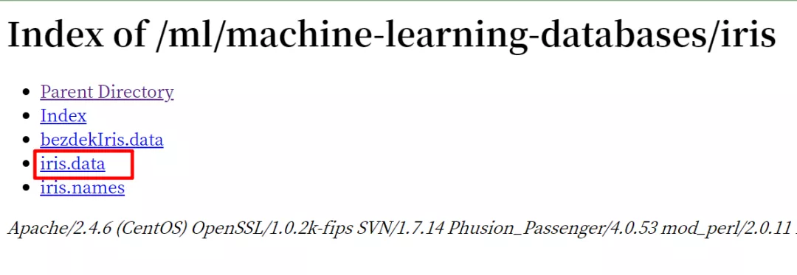
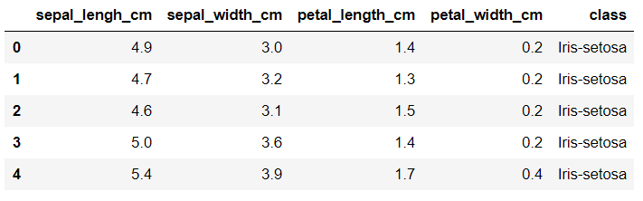

Python 
<a name="qrPRy"></a>
## 读取文本文档
<a name="2fXrx"></a>
### `with` 语句读取部分内容
Python最基本的文件读取是采用`open()`函数，但需要`close()`来关闭文件，否则会报错，所以建议使用`with`语句来读取一般的txt文件。
```python
with open('file.txt',encoding='utf-8',sep='\n') as f:
   alltxt = f.read()
```
如果要将其中一部分读取出来，怎么办呢？<br />有两种方法可以解决问题。
<a name="HVO8p"></a>
#### 方法一：`.find()`定位下标法
使用`.find()`查找目标文字的下标，然后利用此下标进行字符串切片。
```python
s = alltxt.find('这是这部分开头。')
e = alltxt.find('这是这部分结尾。')
alltxt[s:e]
```
<a name="Pt4LP"></a>
#### 方法二：`.index()`索引法
`index()`索引法和`find()`方法基本一致。
```python
s_txt = '这是这部分开头。'
e_txt= '这是这部分结尾。'
alltxt[alltxt.index(s_txt):alltxt.index(e_txt)+len(e_txt)]
```
`find(substr, beg=0, end=len(string))`<br />在`[beg, end]`范围内查找`substring`，找到返回`substr`的起始下标，否则返回 -1。<br />`index(substr，beg=0，end=len(string))`<br /> 同`find()`类似，不同的是，如果未找到`substr`，则返回一个异常 `ValueError: substring not found`。<br />如果需要读取的文件是`.csv`和`.data`文件，这类文件类似表格，`with`语句的读取方式就相对复杂，因此需要采用`pandas`库来读取。
<a name="lUAab"></a>
### pandas读取.data文件
机器学习在使用最初的数据集的时候，需要与UCI的机器“机器学习仓库：学习和智能系统中心”（Machine Learning Repository：Center for Machine Learning and Intelligent Systems）的数据集打交道。<br />如果是使用库自带的数据集还好，直接`load_iris()`，如果需要下载这个网站的最新数据集，则要下载此类文件

<br />可以发现，这里的鸢尾花数据集是.data格式。要想读取`.data`文件，就需要使用pandas。如下所示——
```python
import pandas as pd
data=pd.read_csv('iris.data',names=['sepal_lengh_cm','sepal_width_cm','petal_length_cm','petal_width_cm','class'],sep=",",skiprows=1)
data.head(5)
```
<br />`pd.read_csv()`既可以读取`csv`文件，还可以读取`.data`和`.txt`文件，非常好用。但是，需要注意设定`sep=','`根据数据需要调整分隔符。
<a name="k4kob"></a>
## 读取doc文档
在日常工作中，经常会遇到，给定一个.doc文档，要求从中提取一部分文字存起来。<br />但是，`.doc`格式比较老，Python中没有库读写`.doc`，所以就需要一个系统工具的库（这里是`win32com`）来打开word应用，将`.doc`转存为另存为`.docx`，再使用python-docx进行读写，以完成自动化操作。<br />首先，导入必要的库。这里需要os库获取当前路径和电脑绝对路径，以此找到word应用并打开doc文件。
```python
# 将.doc文件转成.docx
import os
import time
import win32com
from win32com.client import Dispatch
```
然后，构造另存函数。主要流程为<br />**打开word应用——找到目标文件——打开目标文件——另存目标文件——退出。**
```python
def doc2docx(path):
    w = win32com.client.Dispatch('Word.Application')
    w.Visible = 0
    w.DisplayAlerts = 0
    doc = w.Documents.Open(path)
    # 这里必须要绝对地址,保持和doc路径一致
    newpath = allpath+'\目标读取文档.docx'
    time.sleep(3)# 暂停3s，否则会出现-2147352567,错误
    doc.SaveAs(newpath,12,False,"",True,"",False,False,False,False)
    # doc.Close() 开启则会删掉原来的doc
    w.Quit()# 退出
    return newpath
allpath = os.getcwd()
print(allpath)
doc2docx(allpath+'\目标读取文档.doc')
```
<a name="0qT3u"></a>
## 读取docx文档部分内容
导入python-docx库，注意这里写`import docx`即可。<br />但是，pip下载第三方库的时候要下载python-docx,否则会出错。<br />docx是按照段落读取的，所以需要`列表解析式+.join()`来形成一个长字符串，以便进行上文所示的字符串切片，从而读取部分内容。
```python
import docx
fn = r'目标读取文档.docx'
doc = docx.Document(fn)
pa = [p.text for p in doc.paragraphs]
pa1 = ''.join(pa)
```
使用上文中的`str.index`索引法读取部分内容——
```python
start_txt = 'A'
final_txt = 'B'
pa2 = pa1[pa1.index(start_txt):pa1.index(final_txt)+len(final_txt)]
pa2
```

