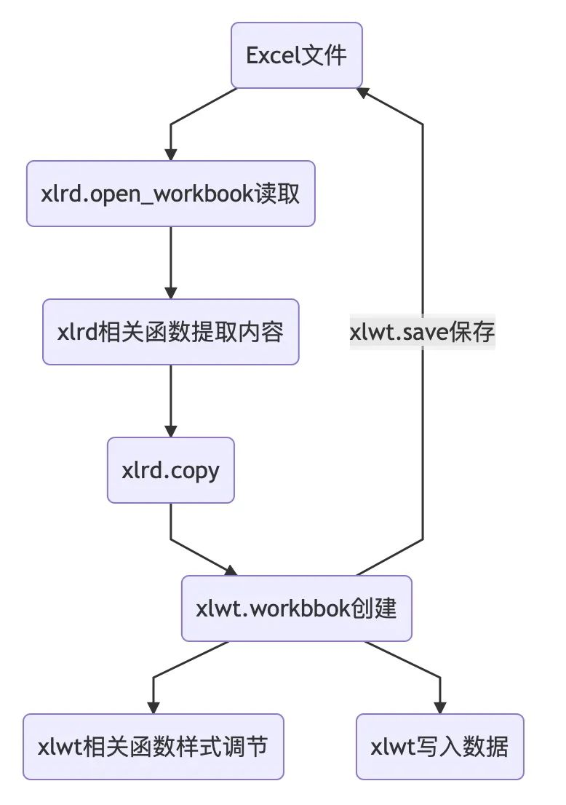
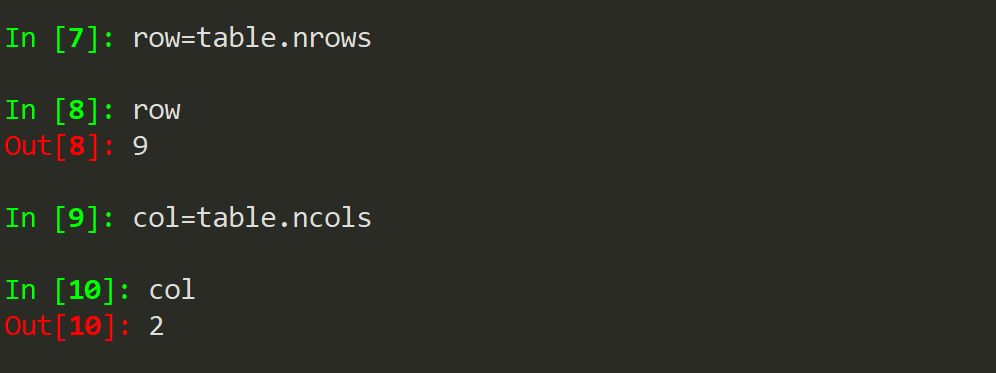
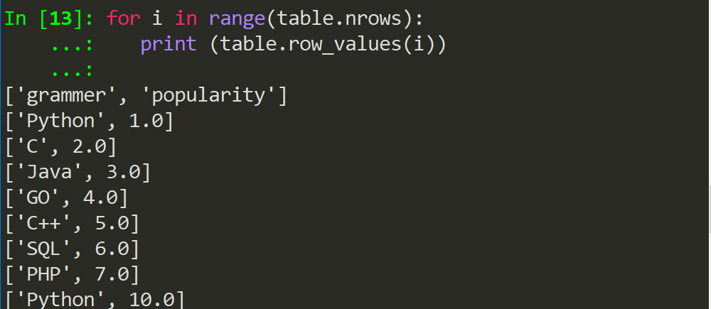

Python Excel

- `openyxl`：可以对xlsx、xlsm文件进行读、写操作，主要对Excel2007年之后的版本(.xlsx)
- `xlrd`：可以对xlsx、xls、xlsm文件进行读操作且效率高
- `xlwt`：主要对xls文件进行写操作且效率高，但是不能执行xlsx文件

通过对比，可以看到在效率上而言，`xlrd`&`xlwt`比`openyxl`要高效得多。而写入数据方面上而言，`openyxl`又比较贴近日常所需，所以两种方式来处理Excel各有千秋。
<a name="m6OkZ"></a>
## 一、简介
`xlrd`是用来从Excel中读写数据的，但通常只用它进行读操作，写操作会相对于专门写入的模块麻烦一些。其实，后面的rd可以看出是reader的缩小。<br />类比于`xlrd`的reader，那么`xlwt`就相对于writer，而且很纯正的一点就是它只能对Excel进行写操作。xlwt和xlrd不光名字像，连很多函数和操作格式也是完全相同。
<a name="IKpvh"></a>
## 二、安装与使用
安装很简单，直接在命令行或者终端中使用pip安装
```bash
pip install xlrd
pip install xlwt
```
而使用`xlrd`&`xlwt`操作Excel的大致过程如下图所示<br />
<a name="BpSol"></a>
## 三、`xlrd`常用操作详解
现在讲解`xlrd`操作Excel部分常用操作，先准备一份Excel文件。<br />用xlrd进行读取比较方便，流程和平常手动操作Excel一样，打开工作簿(Workbook)，选择工作表(sheets)，然后操作单元格(cell)。接下来先介绍一下基本操作在举个例子。
<a name="VvPY9"></a>
### 3.1 打开Excel文件
```python
import xlrd
df = xlrd.open_workbook(name) 
```
先导入模块而后使用`open_workbook()`函数来读取指定的一个工作簿对象。这里的参数name是Excel文件的名字，一般使用的是相对路径的名字，结果如下<br />
<a name="R8Fn4"></a>
### 3.2 查看工作簿中所有sheet
```python
df.sheet_names()
```
读取上述文件，便可以得到以列表形式嵌字符串的值。
<a name="aWJm4"></a>
### 3.3 选择某一个工作表
先看代码
```python
table=df.sheets()[0]  #列表是从0开始计数
table=df.sheet_by_index(0)
table=df.sheet_by_name('name')
```
第一行代码是获取第一个工作表的意思，写法是根据内置的列表格式来选取的。<br />第二行代码顾名思义是通过索引获取第一个工作表，这里的索引与`pandas`中`DataFrame`的`index`索引类似，只不过对象换成了工作表。<br />第三行代码是通过表的名称选择工作表，如果工作表是有自己的名字的，那么这个读取方式是最方便的。<br />打印table，可以得到类似下图的结果<br />
<a name="HAf0U"></a>
### 3.4 获取表格的行数和列数
:::tips
注意，这里不需要在函数后面加小括号，否则可能debug时都头痛于错在哪。
:::
```python
row=table.nrows
col=table.ncols
```
打印row和col，可以发现是和原表格一样的行列数。<br />
<a name="elGIZ"></a>
### 3.5 获取整行和整列的值
这里需要注意两个参数：num1和num2
```python
table.row_values(num1)
table.column_values(num2)
```
num1在`row_values()`中，指的是选取的行数是多少，例如选取第一行所有字段名称数据，那么这个num1就是0。<br />同理，`column_values()`的参数就是第几列的意思。<br />它出来的值是一个列表的形式。调用第一行代码，可以得到如下结果。<br />
<a name="ZIj22"></a>
### 3.6 通过循环读取表格的所有行
在第五步实现了读取单行单列的数据，那么就用循环来将所有行打印出来。
```python
for i in range(table.nrows):
 print (table.row_values(i))
```
效果如下<br />
<a name="bYb07"></a>
### 3.7 获取单元格的值
代码很简单，有点像VBA
```python
cell1=table.row(0)[0].value
cell1=table.cell(0,0).value
cell1=table.col(0)[0].value
```
第一行获取单元格值的方式是通过调取指定行数据进行筛选。<br />第二行是以二维的形式获取，即(第i行，第j列)形式。<br />第三行与第一行类似是通过列索引调用。<br />
<a name="uIp7K"></a>
### 3.8 例子
最后来举一个完整的例子
```python
df=xlrd.open_workbook('data.xlsx')  
table=df.sheet_by_name('Python')
data_list=[] 
data_list.append(table.row_values(1))
for i in data_list:
    print(i)
```
这里目的是选取上述讲解过的语法，将第三行所有数据放到`data_list`列表中并用`for`循环将它打印出来。
<a name="yPAcC"></a>
## 四、`xlwt`常用操作详解
<a name="p9iBo"></a>
### 4.1 新建一个Excel文件
直接使用`.Workbook()`即可
```python
import xlwt
df2 = xlwt.Workbook()
```
<a name="yWW59"></a>
### 4.2 新建一个工作表
这里的name是工作表的名称
```python
table2=df2.add_sheet('name')
```
<a name="YlbKP"></a>
### 4.3 写入数据到指定单元格
这里有三个参数，前两个参数对应(第i行,第j列)，代表的是单元格的位置。第三个参数是要写的值(可以是字符串、数字)
```python
table2.write(0,0,'Python')
```
需要注意的是，如果是对同一个单元格重复操作，会让Python报错(多次输入错误)，所以如果想要取消这个功能，则添加这个参数在新建工作表的代码里面。
```python
table2=df2.add_sheet('name',cell_overwrite_ok=True)
```
<a name="rnHQl"></a>
### 4.4 保存文件
上面提示过，`xlwt`仅支持`.xls`的文件格式输出，常用的`xlsx`是不行的。这也是这个模块的一种缺陷。
```python
df2.save('data2.xls')
```
<a name="Mqazf"></a>
### 4.5 改变样式
调整样式也是可以的，先看几行代码
```python
style=xlwt.XFStyle()

font=xlwt.Font()

font.name='name Times New Roman'

font.bold=True

style.font=font

sheet.write(0,1,'Python',style)
```
第一行代码是初始化样式，可以认为是一个类似于父类的东西。<br />第二行代码是为样式创建字体<br />第三行代码是指定字体的名字，这里用到的是`name Times New Roman`这个类型。<br />第四行代码是字体加粗，以布尔值的形式的设定。<br />第五行代码是将font设定为style的字体<br />第六行代码是写入文件单元格时怎么运用这个格式。
<a name="bpyeU"></a>
### 4.6 例子
最后，结合两个模块进行读写操作。<br />目标是将已经准备好的data文件进行读取，并将其内容进行倒序排序，最终以转置形式输出。先思考一下如何使用代码实现👇
> 对于`xlwt`写入部分，先创建一个工作表。并将提取的数据列表data_list1用列表的倒叙来排序。最后用`pop()`函数把两个字段名称（grammer和popularity）放在首位。最后结合写入部分讲解的内容进行保存。
> 在`xlrd`读取部分稍有不同的是，for循环用在了提取所有数据这一步骤，而不再是循环输出列表值。

所以完整代码如下
```python
import xlrd
df=xlrd.open_workbook('data.xlsx')  
table=df.sheet_by_name('Python')
data_list=[] 
for i in range(table.nrows):
    data_list.append(table.row_values(i))
data_list1 = []
data_list1 = data_list[::-1]
item = data_list1.pop(-1)
data_list1.insert(0,item)
import xlwt
df2 = xlwt.Workbook()
table2=df2.add_sheet('Python')
for i in range(2):
    for j in range(9):
        table2.write(i,j,data_list1[j][i])
df2.save('data2.xls')
```
