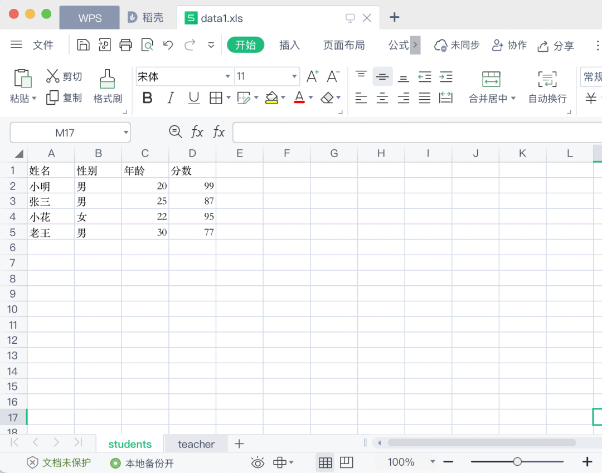
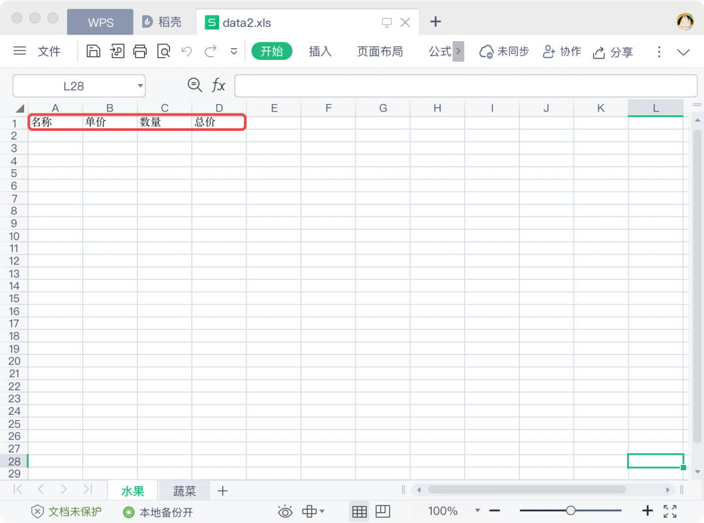

Python<br />Python操作Excel的模块有很多，并且各有优劣，不同模块支持的操作和文件类型也有不同。下面是各个模块的支持情况：

| <br /> | **.xls** | **.xlsx** | **获取文件内容** | **写入数据** | **修改文件内容** | **保存** | **样式调整** | **插入图片** |
| --- | --- | --- | --- | --- | --- | --- | --- | --- |
| xlrd | √ | √ | √ | x | x | × | x | x |
| xlwt | √ | x | x | √ | x | √ | √ | √ |
| xlutils | √ | x | x | √ | √ | √ | x | x |
| xlwings | √ | √ | √ | √ | √ | √ | √ | √ |
| openpyxl | x | √ | √ | √ | √ | √ | √ | √ |
| pandas | √ | √ | √ | √ | x | √ | x | x |

对比会发现，其中xlwings的功能是最全最强大的，其实它的执行效率也是最高的。但是xlwings的学习难度相对比较大，而且里面的很多的概念和操作方式和平时操作Excel的时候不一样。openpyxl 的问题是不能操作老版本的excel文件(.xls)，以及在操作数据的时候必须以单元格为单位操作，无法直接以行或者列的方式操作文件内容。xlrd、xlwt和xlutils三个模块配合使用可以很方便的对excel文件进行读、写和修改操作，也可以更方便的以行列的方式操作Excel文件，但是缺点是无法对.xlsx文件进行写和修改操作。在解决实际问题的时候读者可以根据自己的实际需求选择使用合适的工具。<br />下面主要介绍xlrd、xlwt模块如何实现对.xls和.xlsx文件进行读写操作。
<a name="EZ24J"></a>
## 1、xlrd获取Excel文件内容
xlrd用来读取Excel文件内容非常方便，操作步骤和通过Excel软件操作Excel文件一样方便。
<a name="mMrV1"></a>
### **1、安装**
```bash
pip install xlrd
```
<a name="bV1Vh"></a>
### **2、使用**
在使用xlrd获取Excel文件内容之前，需要先准备好一个Excel文件，为了演示效果，将按照下面这个内容作为演示文件内容：<br /><br />使用xlrd对Excel进行读操作的流程和手动操作Excel文件一样：打开工作簿(Workbook) --> 选择工作表(sheet) --> 操作单元格(cell)
<a name="bBYOS"></a>
#### **2.1 打开工作簿**

- `xlrd.open_workbook(excel文件路径)` - 打开指定路径对应的excel文件，返回excel文件对应的工作簿对象。
```python
import xlrd
wb = xlrd.open_workbook('files/data1.xls')
```
<a name="G8OR3"></a>
#### 2.2 选择工作表
一个工作簿中可能包含多个工作表，上面给的案例文件 data1.xls 文件是一个工作簿，里面包含了两个工作表，分别是：students 和 teacher。获取excel文件内容的时候需要先确定，需要获取的数据来源于哪个工作表。

- `工作簿对象.sheet_names()` - 获取工作簿中所有工作表的表名
```python
s_names = wb.sheet_names()
print(s_names)
```
执行结果：
```
['students', 'teacher']
```

- `工作簿对象.sheets()` - 获取工作簿中所有工作表对应的工作表对象
- `工作簿对象.sheet_by_index(下标)` - 获取指定下标对应的工作表对象
- `工作簿对象.sheet_by_name(表名)` - 获取指定表名对应的工作表对象
```python
all_sheet = wb.sheets()
print(all_sheet)
print(all_sheet[0])

teacher_s = df.sheet_by_index(1)
print(teacher_s) 

students_s = df.sheet_by_name('students')
print(students_s)
```
执行结果：
```
[Sheet  0:<students>, Sheet  1:<teacher>]
Sheet  0:<students>
Sheet  1:<teacher>
Sheet  0:<students>
```
<a name="euh6H"></a>
#### **2.3 获取行列信息**

- `工作表对象.nrows` - 获取工作表中的行数
- `工作表对象.ncols` - 获取工作表中的列数
```python
print(students_s.nrows)
print(students_s.ncols)
```
执行结果：
```
5
4
```

- `工作表对象.row_values(行下标)` - 获取指定下标对应的行中所有的数据，结果以列表的形式返回
- `工作表对象.col_values(列下标)` - 获取指定下标对应的列中所有的数据，结果以列表的形式返回(下标从0开始)
```python
print(students_s.row_values(1))
print(students_s.col_values(0))
```
执行结果：
```
['小明', '男', 20.0, 99.0]
['姓名', '小明', '张三', '小花', '老王']
```
根据之前获取行数结合获取整行的方法，可以通过循环一行一行的将整个excel：
```python
for x in range(students_s.nrows):
    print(students_s.row_values(x))
```
执行结果：
```
['姓名', '性别', '年龄', '分数']
['小明', '男', 20.0, 99.0]
['张三', '男', 25.0, 87.0]
['小花', '女', 22.0, 95.0]
['老王', '男', 30.0, 77.0]
```
<a name="c8sJ6"></a>
#### **2.4 操作单元格**

- `工作表对象.row(行下标)` - 获取指定下标对应的行中所有的单元格。结果是一个列表，列表中的元素是单元格对象（注意不是单元格内容）
- `工作表对象.col(列下标)` - 获取指定下标对象的列中所有的单元格。
- `工作表对象.cell(行下标, 列下标)` - 获取指定行下标和列下标对应的单元格对象。
- `单元格对象.value` - 获取指定单元格中的值
```
print(students_s.row(1))
print(students_s.col(1))
print(students_s.cell(3, 0))
print(students_s.row(1)[0].value)
print(students_s.col(1)[2].value)
print(students_s.cell(3, 0).value)
```
执行结果：
```
[text:'小明', text:'男', number:20.0, number:99.0]
[text:'性别', text:'男', text:'男', text:'女', text:'男']
text:'小花'
小明
男
小花
```
以上就是xlrd获取Excel文件内容的所有相关操作，总的来说比较简单，相比openpyxl，xlrd可以以行为单位或者以列为单位获取工作表中的内容真的特别方便。
<a name="E3DRm"></a>
## 2、xlwt对Excel文件进行写操作
<a name="WW86M"></a>
### **1、安装**
```bash
pip install xlwt
```
<a name="Hq1oZ"></a>
### **2、使用**
xlwt对Excel文件进行写操作的时候，只能对通过xlwt新建的Excel文件进行写操作，无法直接对已经存在的Excel文件进行写操作。如果想要对已经存在的Excel文件进行写操作需要使用后面的xlutils模块。
<a name="vAFUq"></a>
#### **2.1 新建工作簿和工作表**
新建工作簿其实就是新建一个Excel文件。和手动通过Excel软件创建Excel文件不同，xlwt新建工作簿的时候不会自动创建工作表，所以在创建完工作簿以后还需要创建至少一个工作表。

- `xlwt.Workbook()` - 新建一个工作簿对象并且返回
- `工作簿对象.add_sheet(表名)` - 在工作簿中新建一个工作表
- `工作簿对象.save(文件路径)` - 将工作簿对象对应的Excel文件保存到指定位置(文件必须保存成xls格式的)
```python
import xlwt

wb = xlwt.Workbook()
fruits_s = wb.add_sheet('水果')
vegetable_s = wb.add_sheet('蔬菜')
wb.save('files/data2.xls')
```
执行结果：<br />
<a name="QB4gJ"></a>
#### **2.2 写入数据到指定单元格**

- `工作表对象.write(行下标, 列下标, 内容)` - 将指定内容写入到指定单元格(通过行下标和列下标可以确定一个唯一单元格)
```python
fruits_s.write(0, 0, '名称')
fruits_s.write(0, 1, '单价')
fruits_s.write(0, 2, '数量')
fruits_s.write(0, 3, '总价')

wb.save('files/data2.xls')  # 注意：所有写操作完成后必须保存
```
执行结果：<br /><br />这个地方有个需要特别注意的是，默认情况下同一个单元格不能重复进行写操作，如果需要对同一个单元格重复进行写操作，在创建工作表的时候必须将参数 `cell_overwrite_ok` 的值设置为 True。
```python
fruits_s = fruits_s = wb.add_sheet('水果')
fruits_s.write(0, 0, '名称')
fruits_s.write(0, 1, '单价')
fruits_s.write(0, 2, '数量')
fruits_s.write(0, 3, '总价')
fruits_s.write(0, 3, '总计')  # 对0、3这个位置的单元格重复进行写操作
wb.save('files/data2.xls')
```
执行结果：
```
Exception: Attempt to overwrite cell: sheetname='水果' rowx=0 colx=3
```
如果创建工作表的时候设置 `cell_overwrite_ok` 为True，对同一个单元格写多次不会报错：
```python
fruits_s = wb.add_sheet('水果', cell_overwrite_ok=True)
fruits_s.write(0, 0, '名称')
fruits_s.write(0, 1, '单价')
fruits_s.write(0, 2, '数量')
fruits_s.write(0, 3, '总价')
fruits_s.write(0, 3, '总计')  # 对0、3这个位置的单元格重复进行写操作
wb.save('files/data2.xls')
```
执行结果：<br />
