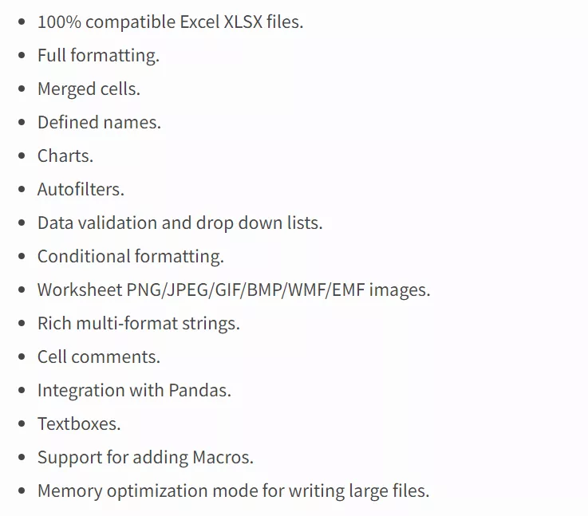
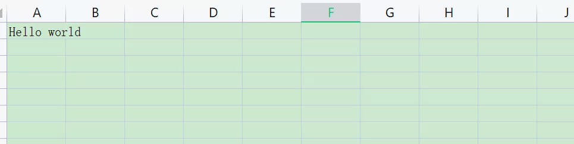
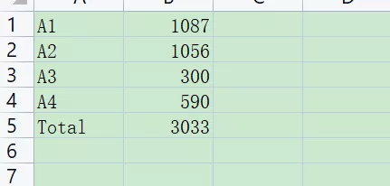
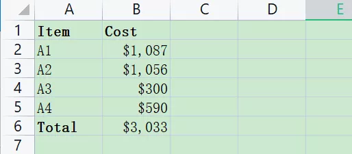
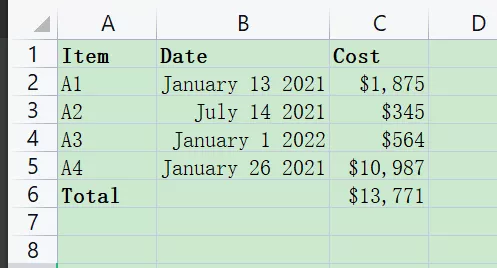

Python xlsxwriter<br />Xlsxwriter 是一个用于编写 Excel 文件格式文件的 Python 模块，xlsxwriter 可以用来写文本，数字，公式和超链接到多个工作表，它支持的功能也有很多，譬如格式化、单元格合并、图标功能等，具体功能如下:<br /><br />另外它还支持Python 3.4+和PyPy3，并且只使用标准库。但值得注意的是它不支持读或者改现有的excel文件。<br />xlsxwriter 同样也使用 pip 安装，安装语句如下：`pip install xlsxwriter`
<a name="xqMqT"></a>
### 简单使用
以下是关于 xlsxwriter
```python
import xlsxwriter

workbook = xlsxwriter.Workbook('demo.xlsx') # 建立文件

worksheet = workbook.add_worksheet() # 建立sheet， 可以使用work.add_worksheet('employee')来指定sheet名，如果命名中文名会报UnicodeDecodeErro的错误

worksheet.write('A1', 'Hello world') # 向A1写入文字

workbook.close()
```

<a name="iwbCG"></a>
### 实例
下面简单看一个实例，新增一个表格，再在表格中添加文字、数据以及图片，最后将工作表保存在当前工作空间中，详细实例如下：
```python
import xlsxwriter

def simple_example():

    # 创建一个新的Excel文件并添加一个工作表
    workbook = xlsxwriter.Workbook('demo.xlsx')
    worksheet = workbook.add_worksheet()

    # 确定第一栏，使文字更清楚
    worksheet.set_column('A:A', 20)

    # 添加粗体格式以突出显示单元格
    bold = workbook.add_format({'bold': True})

    # 简单的写一些文字
    worksheet.write('A1', 'Hello')

    # 另起一行写入文字并加粗
    worksheet.write('A2', 'World', bold)

    # 用行/列表示法写一些数字
    worksheet.write(2, 0, 123)
    worksheet.write(3, 0, 13.432)

    # 插入一张图片.
    worksheet.insert_image('B5', 'logo.jpeg')

    workbook.close()

if __name__ == '__main__':
    simple_example()
```
实例结果图：<br />
<a name="RBkmK"></a>
### 表格数据求和
下面的实例讲解新建表格添加相应数据求和。
```python
def sum_data():
    workbook = xlsxwriter.Workbook('demo.xlsx')  # 建立文件
    worksheet = workbook.add_worksheet()
    add_data = (
        ['A1', 1087],
        ['A2', 1056],
        ['A3', 300],
        ['A4', 590],
    )
    # 按标号写入是从0开始的，按绝对位置'A1'写入是从1开始的
    row = 0
    col = 0

    # 遍历数据并逐行写出它
    for item, cost in (add_data):
        worksheet.write(row, col, item)
        worksheet.write(row, col + 1, cost)
        row += 1

    # 用公式写出总数
    worksheet.write(row, 0, 'Total')
    worksheet.write(row, 1, '=SUM(B1:B4)')  # 调用excel的公式表达式

    workbook.close()
```
求和结果如下：<br />
<a name="TMt7b"></a>
### 自定义格式
使用`workbook.add_format()`函数进行自定义新增和运算后的输出结果，详细步骤如下：
```python
def self_define_format():
    # 建文件及sheet.
    workbook = xlsxwriter.Workbook('demo2.xlsx')
    worksheet = workbook.add_worksheet()

    # Add a bold format to use to highlight cells. 设置粗体，默认是False
    bold = workbook.add_format({'bold': True})

    # 定义数字格式
    money = workbook.add_format({'num_format': '$#,##0'})

    # Write some data headers. 带自定义粗体blod格式写表头
    worksheet.write('A1', 'Item', bold)
    worksheet.write('B1', 'Cost', bold)

    # Some data we want to write to the worksheet.
    add_data = (
        ['A1', 1087],
        ['A2', 1056],
        ['A3', 300],
        ['A4', 590],
    )

    # Start from the first cell below the headers.
    row = 1
    col = 0

    # Iterate over the data and write it out row by row.
    for item, cost in (add_data):
        worksheet.write(row, col, item)  # 带默认格式写入
        worksheet.write(row, col + 1, cost, money)  # 带自定义money格式写入
        row += 1

    # Write a total using a formula.
    worksheet.write(row, 0, 'Total', bold)
    worksheet.write(row, 1, '=SUM(B2:B5)', money)

    workbook.close()
```
输出结果如下：<br />
<a name="OVIyb"></a>
### 写入日期格式
在单元格输出结果中加入日期格式：
```python
def write_date():

    from datetime import datetime
    workbook = xlsxwriter.Workbook('demo3.xlsx')
    worksheet = workbook.add_worksheet()

    # 添加粗体格式以突出显示单元格.
    bold = workbook.add_format({'bold': 1})

    # 为带钱的单元格添加数字格式.
    money_format = workbook.add_format({'num_format': '$#,##0'})

    # 添加Excel日期格式.
    date_format = workbook.add_format({'num_format': 'mmmm d yyyy'})

    # 调整列的宽度
    worksheet.set_column(1, 1, 15)

    # 写入数据表头
    worksheet.write('A1', 'Item', bold)
    worksheet.write('B1', 'Date', bold)
    worksheet.write('C1', 'Cost', bold)

    # 将数据写入工作表
    add_data = (
        ['A1', '2013-01-13', 1875],
        ['A2', '2013-01-14', 345],
        ['A3', '2013-01-16', 564],
        ['A4', '2013-01-20', 10987],
    )

    # 从标题下面的第一个单元格开始.
    row = 1
    col = 0

    for item, date_str, cost in (add_data):
        # 将日期字符串转换为datetime对象
        date = datetime.strptime(date_str, "%Y-%m-%d")

        worksheet.write_string(row, col, item)
        worksheet.write_datetime(row, col + 1, date, date_format)
        worksheet.write_number(row, col + 2, cost, money_format)
        row += 1

    # 用公式写出总数
    worksheet.write(row, 0, 'Total', bold)
    worksheet.write(row, 2, '=SUM(C2:C5)', money_format)

    workbook.close()
```
输出结果如下：<br />
<a name="TLYkM"></a>
### 参考
[https://pypi.org/project/XlsxWriter/](https://pypi.org/project/XlsxWriter/)
