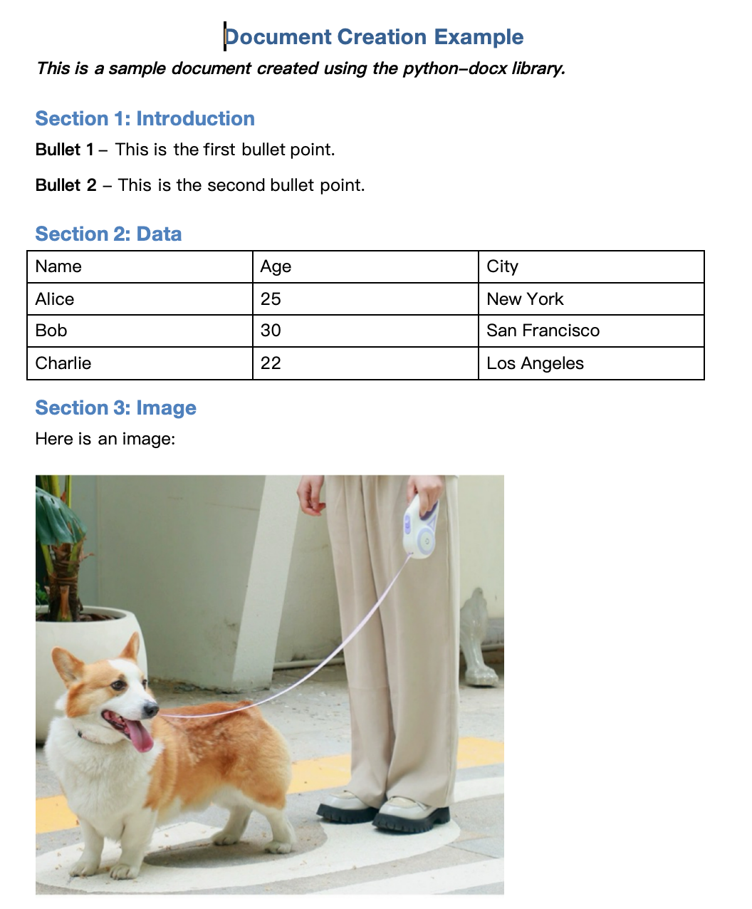

在处理文档时，经常需要一个能够自动化处理Word文档的工具，特别是当涉及到批量生成、修改或分析大量文档时。在Python的丰富生态系统中，python-docx模块应运而生，提供了一个强大的接口来创建和修改Word文档。这个库使得使用Python编程语言进行Word文档处理变得既简单又高效。<br />在本文中，将深入探索python-docx的核心功能，介绍如何安装和配置这个库，以及通过实际示例演示其在文档处理中的强大能力。无论是数据科学家、软件开发人员还是办公自动化爱好者，python-docx都将是你工具箱中不可或缺的一部分。
<a name="O2Gsg"></a>
## 安装模块
python-docx可以通过Python的包管理器pip轻松安装。为了安装它，只需要在命令行或终端中运行以下命令：
```bash
pip install python-docx
```
这个命令会从Python的包索引PyPI下载python-docx并安装到您的Python环境中。确保Python环境已经配置好，并且pip是最新版本。
<a name="rRW7m"></a>
## 验证安装
安装完成后，可以通过简单的Python脚本来验证python-docx是否正确安装。在Python解释器或编程环境中运行以下代码：
```python
import docx

# 尝试创建一个文档对象
doc = docx.Document()
doc.add_paragraph("Hello, python-docx!")
doc.save("test.docx")

print("python-docx is installed and working!")
```
如果一切正常，这段代码将创建一个名为test.docx的Word文档，其中包含一段文本“Hello, python-docx!”。
<a name="NIxWr"></a>
## 编辑文档
为了更好地理解python-docx的能力和灵活性，来看一个具体的例子。以下的Python代码展示了如何使用python-docx库来创建一个包含标题、加粗斜体文本、列表、表格和图片的Word文档。
```python
#!/user/bin/env python3
# -*- coding: utf-8 -*-

from docx import Document
from docx.shared import Pt
from docx.enum.text import WD_ALIGN_PARAGRAPH

# Create a new document
doc = Document()

# 增加标题
title = doc.add_heading('Document Creation Example', level=1)
title.alignment = WD_ALIGN_PARAGRAPH.CENTER

# 添加加粗和斜体的段落
paragraph = doc.add_paragraph('This is a sample document created using the python-docx library.')
run = paragraph.runs[0]
run.bold = True
run.italic = True

# 添加标题
doc.add_heading('Section 1: Introduction', level=2)

# 添加编号列表
list_paragraph = doc.add_paragraph()
list_paragraph.add_run('Bullet 1').bold = True
list_paragraph.add_run(' - This is the first bullet point.')
list_paragraph.add_run('\n')
list_paragraph.add_run('Bullet 2').bold = True
list_paragraph.add_run(' - This is the second bullet point.')

# 添加表格
doc.add_heading('Section 2: Data', level=2)
table = doc.add_table(rows=4, cols=3)
table.style = 'Table Grid'
table.autofit = False
table.allow_autofit = False

for row in table.rows:
    for cell in row.cells:
        cell.width = Pt(100)

table.cell(0, 0).text = 'Name'
table.cell(0, 1).text = 'Age'
table.cell(0, 2).text = 'City'

for i, data in enumerate([('Alice', '25', 'New York'), ('Bob', '30', 'San Francisco'), ('Charlie', '22', 'Los Angeles')], start=1):
    table.cell(i, 0).text = data[0]
    table.cell(i, 1).text = data[1]
    table.cell(i, 2).text = data[2]

# 添加图片
doc.add_heading('Section 3: Image', level=2)
doc.add_paragraph('Here is an image:')
doc.add_picture('dogs.jpg', width=Pt(300))

# 保存
doc.save('example_document.docx')
```
出来的结果如下图所示<br /><br />来对上述的代码做一个简单的剖析，包括了以下元素：

- 标题：使用`add_heading`方法添加了一个居中的标题。
- 加粗斜体段落：添加了一个普通段落，并通过`runs`对象设置了文本样式为加粗和斜体。
- 子标题和列表：创建了一个新的小节标题，并添加了一个包含两个项目的简单列表。
- 表格：使用`add_table`方法创建了一个具有特定单元格宽度的表格，并填充了一些数据。
- 图片：在文档中插入了一张图片，图片路径为dogs.jpg，并设置了图片的宽度。
- 最后，使用`save`方法将这个文档保存为example_document.docx。
<a name="P12sF"></a>
## 修改文档
在接下来的部分，将探讨如何使用python-docx来修改现有的Word文档。这是一个常见的应用场景，特别是在需要批量更新文档内容或格式时。以下是一个示例代码，它展示了如何打开一个已有的文档，修改文本、格式，并添加新的内容
```python
from docx import Document
from docx.shared import Pt
from docx.enum.text import WD_ALIGN_PARAGRAPH

# Open an existing document
doc = Document('example_document.docx')

# Access the first paragraph and modify its text and formatting
first_paragraph = doc.paragraphs[0]
first_paragraph.text = 'Updated Text'
run = first_paragraph.runs[0]
run.bold = True
run.italic = True
run.font.size = Pt(16)
first_paragraph.alignment = WD_ALIGN_PARAGRAPH.CENTER

# Add a new heading
doc.add_heading('New Section', level=1)

# Add a new table
doc.add_heading('Table Section', level=2)
table = doc.add_table(rows=4, cols=4)
table.style = 'Table Grid'
table.autofit = False
table.allow_autofit = False

for row in table.rows:
    for cell in row.cells:
        cell.width = Pt(100)
table.cell(0, 0).text = 'Name'
table.cell(0, 1).text = 'Age'
table.cell(0, 2).text = 'City'
for i, data in enumerate([('David', '28', 'London'), ('Emma', '35', 'New York'), ('John', '22', 'Los Angeles')], start=1):
    table.cell(i, 0).text = data[0]
    table.cell(i, 1).text = data[1]
    table.cell(i, 2).text = data[2]

# Save the modified document
doc.save('modified_document.docx')
```
那么这段代码所包含的步骤包括了：

- 打开现有文档：使用Document类打开一个已存在的文档'example_document.docx'。
- 修改第一段内容和格式：获取文档的第一个段落，并更改其文本内容。通过runs对象，将该段落的文本设置为加粗、斜体，并调整字体大小为16点。
- 添加新标题和表格：在文档中加入一个新的一级标题和一个新的表格。这个表格被设定为4行4列，并对其单元格进行了格式化。
- 填充表格内容：在表格中填充了标题行和其他数据行，展示了如何在表格中插入文本。
- 最后，这个修改过的文档被保存为新文件'modified_document.docx'。
