Python<br />最近需要批量出500个**Word文档**，按照1个Word文档耗时1分钟来算也需要8.33小时足足有1天工时。来了解一下用Python读写Word文档。<br />**目录：**

1. 安装模块
2. 读取Word文档
3. 写入Word文档
<a name="ZzfTi"></a>
## 1、安装模块
这里用到的是python-docx模块，读写Word文档的操作均有它完成！
```bash
# 安装该模块，在命令行键入以下命令
pip install python-docx
```
在进行后续介绍前，先简单了解一下Word文档。和纯文本（比如txt）相比， .docx文件有很多种结构，这些结构在python-docx中用3种不同的类型来表示：最高一层是Document对象表示文档，每个Document对象包含一个Paragraph 对象也就是段落组成的列表，而每个Paragraph对象则包含一个Run对象的列表，至于Run对象大家可以通过下面的段落Paragraph来了解。<br />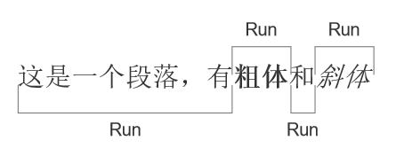<br />**Word**里的文本包含有很多格式，比如字体、字号、粗体/斜体、颜色等等。一个Run对象是**具有相同格式的文本**，当发生变化的时候就需要一个新的Run对象，这也就是上图中1个Paragraph对象有4个Run对象的原因。<br />理解以上知识后，再来了解读与写吧。
<a name="r9lHm"></a>
## 2、读取Word文档
本地创建一个案例文档，用于演示读取Word，案例文档内容如下：<br />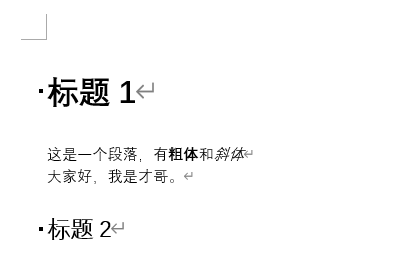<br />可以看到文档一共有四行，两行标题以及两行正文。
```python
import docx
# 读取Word文档
doc = docx.Document(r'案例.docx')
```
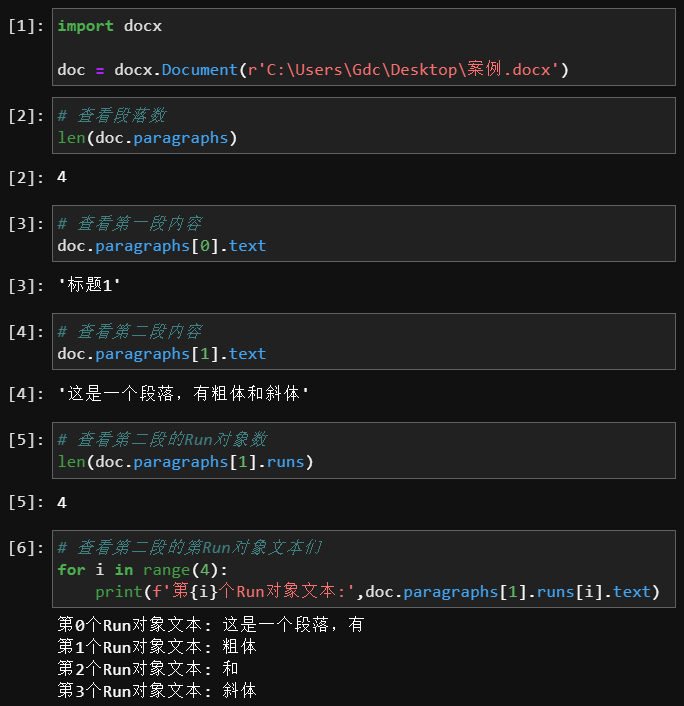<br />知道了读取Word每个paragraph段落和Run，那么如何读取完整的Word文本内容呢？这里，自定义一个函数将全部的paragraph段落内容存起来，每个paragraph段落之间用换行符`\n`隔开即可。
```python
import docx

def getText(fileName):
    doc = docx.Document(fileName)
    TextList = []
    for paragraph in doc.paragraphs:
        TextList.append(paragraph.text)
    
    return '\n'.join(TextList)
```
调用该函数，可以得到：
```python
fileName = r'案例.docx'
print(getText(fileName))

标题1
这是一个段落，有粗体和斜体
大家好，我是才哥。
标题2
```
当然了，这里读取后输出显示的文本不带有格式属性。
<a name="p7C5b"></a>
## 3、写入Word文档
在写入Word之前，先简单了解下Word的一些格式规则。<br />毫不夸张的讲，把全局样式玩的明白的人蛮少的。这方面主要是正文样式与标题样式，如果玩得明白的话，其实设置好了之后几乎不需要再进行啥调整，**全局格式都能自动设置与更新**。<br />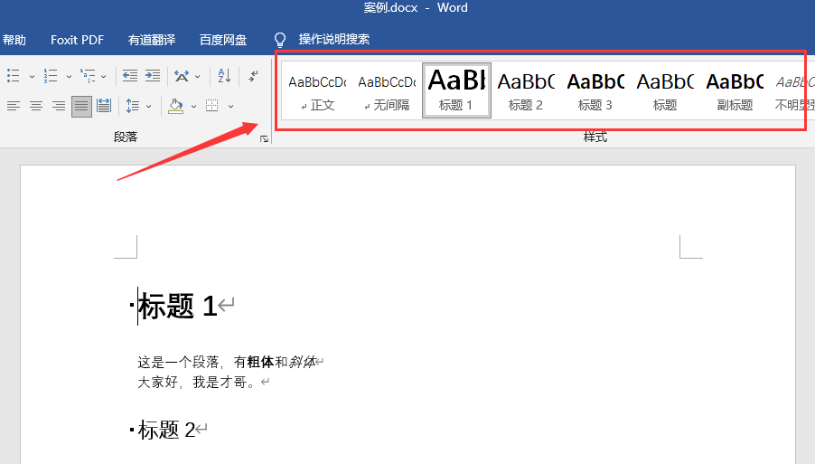<br />比如，可以设置正文样式为 微软雅黑字体，字号12，缩进，间距等等；设置标题样式为 微软雅黑字体，字号14，删除段落后间距等等。<br />在Python处理Word的时候，段落样式可以应用于 Paragraph 对象，字符样式可以应用于 Run 对象，链接的样式可以应用于这两种对象。可以将 Paragraph 和Run 对象的 style 属性设置为一个字符串，从而设置样式。这个字符串应该是一种样式的名称。如果 style 被设置为 None，就没有样式与 Paragraph 或 Run 对象关联。<br />当然，这里不展开介绍，就简单介绍Run对象上的**字符属性**。<br />对于Run对象的字符text属性，都有3个状态：True（启用）、False（禁用）和None（默认）。<br />text**属性**有哪些？看下表：

| 属性 | 描述 |
| --- | --- |
| bold | 文本以粗体出现 |
| italic | 文本以斜体出现 |
| underline | 文本带下划线 |
| strike | 文本带删除线 |
| double_strike | 文本带双删除线 |
| all_caps | 文本以大写首字母出现 |
| small_caps | 文本以大写首字母出现，小写字母小两个点 |
| shadow | 文本带阴影 |
| outline | 文本以轮廓线出现，而不是实心 |
| rtl | 文本从右至左书写 |
| imprint | 文本以刻入页面的方式出现 |
| emboss | 文本以凸出页面的方式出现 |

演示一下：<br />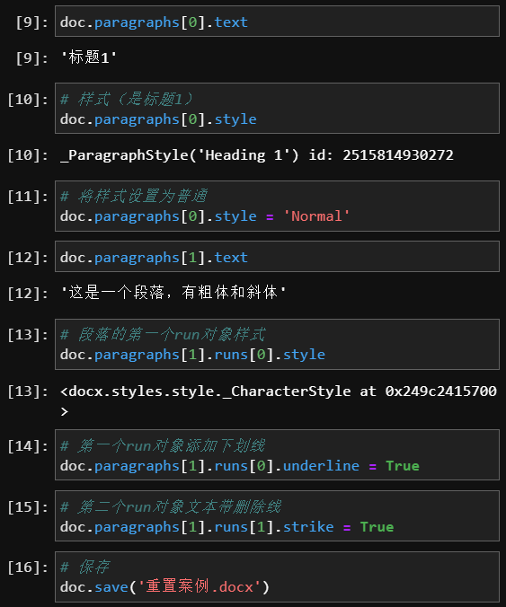<br />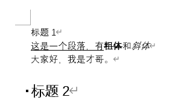<br />以上就是对段落的一些简单介绍及演示，接下来，来看看怎么**创建并写入Word**。<br />要创建自己的.docx 文件，就调用 `docx.Document()`，返回一个新的、空白的 Word Document 对象  。Document 对象的 `add_paragraph()`方法将一段新文本添加到文档中，并返回添加的 Paragraph 对象的引用。在添加完文本之后，向 Document 对象的 `save()`方法传入一个文件名字符串，将 Document 对象保存到文件。
```python
import docx

doc = docx.Document()
doc.add_paragraph('这是一个段落')
doc.save('写入word.docx')
```
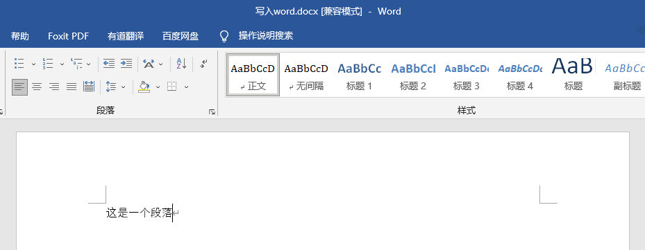<br />可以**添加段落、设置段落文本样式**等等，比如：
```python
import docx

doc = docx.Document()
p1 = doc.add_paragraph('这是一个段落')
p1.add_run('加粗的一句话').bold = True
doc.add_paragraph('这是第二个段落')
doc.save('多段落.docx')
```
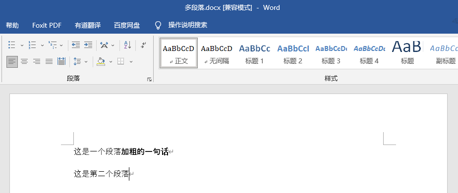<br />还可以添加一个段位，这个段落为**标题样式**，这里需要用到`add_heading()`。它有两个参数，字符串表示文本内容，后面数字是标题层级。
```python
import docx

doc = docx.Document()
doc.add_heading('标题',0)
doc.add_heading('标题1',1)
doc.add_heading('标题2',2)
doc.add_heading('标题3',3)
doc.add_heading('标题4',4)
doc.save('标题.docx')
```
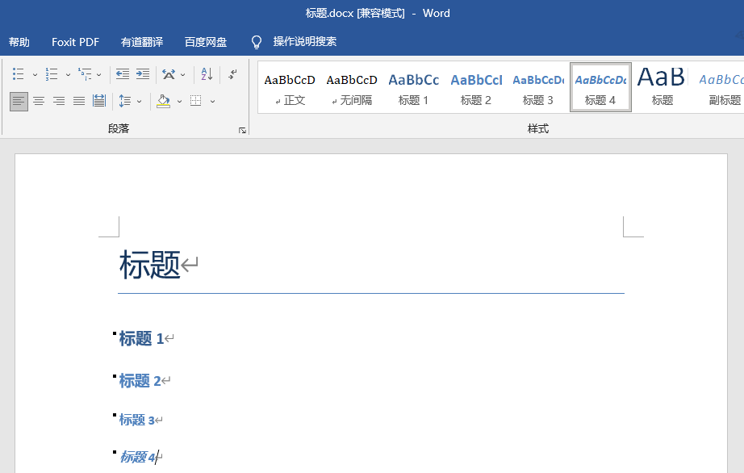<br />同样，还可**换行与换页**操作。<br />要添加换行符（而不是开始一个新的段落），可以在 Run 对象上调用 `add_break()`方法，换行符将出现在它后面。如果希望添加换页符，可以将 `docx.text.WD_BREAK.PAGE`作为唯一的参数，传递给 `add_break()`  。
```python
import docx

doc = docx.Document()
p1 = doc.add_paragraph('这是一个段落')
p1.add_run('加粗的一句话').bold = True
# 换行
doc.paragraphs[0].runs[0].add_break()
doc.save('换行.docx')
```
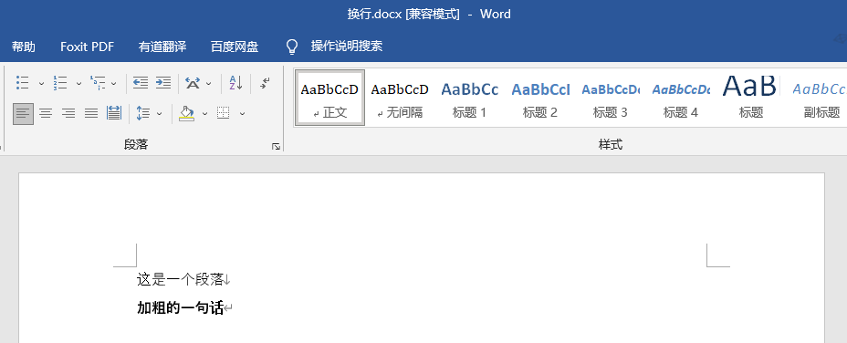<br />有人会说，一般word里还有图片，当然咱们也能搞定**添加图片**。<br />有一个 `add_picture()`方法，可以在段落末尾添加图像 。
```python
import docx

doc = docx.Document()
doc.add_paragraph('这是一个段落，后面带图片')
doc.add_picture('图片.png', 
                width=docx.shared.Inches(3),
                height=docx.shared.Cm(4))
doc.add_paragraph('这是第二个段落')
doc.save('图片.docx')
```
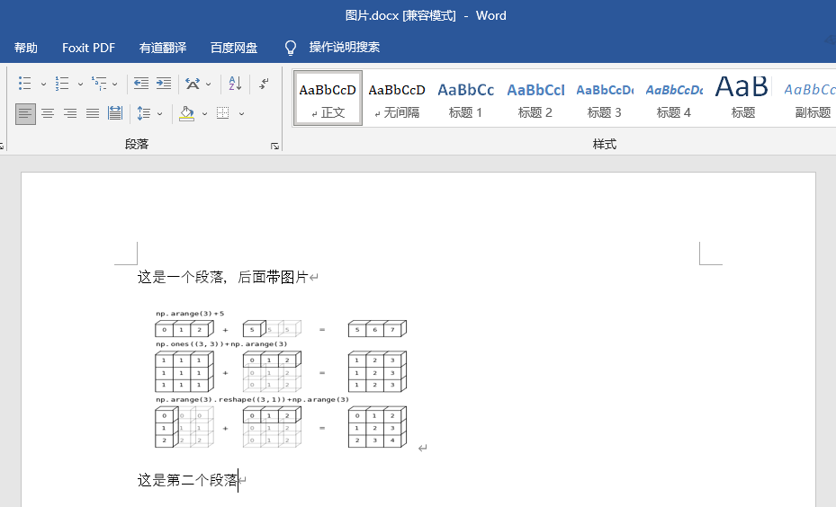<br />以上就是本次的简单入门介绍。<br />其实Word文档各种样式设置，数据类型展示等等非常丰富，而Python-docx这个模块其实也能进行大多数的处理。
