<a name="aDdH5"></a>
## 1、PPT自动化能干什么？有什么优势？
- 它可以代替你自动制作PPT
- 它可以减少你调整用于调整PPT格式的时间
- 它可以让数据报告风格一致
- 总之就是：它能提高你的工作效率！让你有更多时间去做其他事情！
<a name="gDRSZ"></a>
## 2、使用win32com操作ppt
官方文档：[https://docs.microsoft.com/zh-cn/office/vba/api/powerpoint.shape.copy](https://docs.microsoft.com/zh-cn/office/vba/api/powerpoint.shape.copy)
<a name="Ht5eq"></a>
### 2.1 pip安装win32com
```bash
pip install pypiwin32
```
由于已经安装过了，这里提示已经安装<br />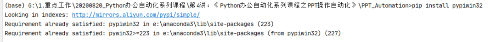
<a name="D4iyz"></a>
### 2.2 win32com复制ppt模板
有时候需要对ppt的模板进行复制，然后再添加相应内容，由于python-pptx对复制模板也没有很好的支持，所以用win32com对模板页进行复制，然后再用python-pptx增加ppt内容。<br />参考官方文档：[https://docs.microsoft.com/zh-cn/office/vba/api/powerpoint.slide.copy](https://docs.microsoft.com/zh-cn/office/vba/api/powerpoint.slide.copy)<br />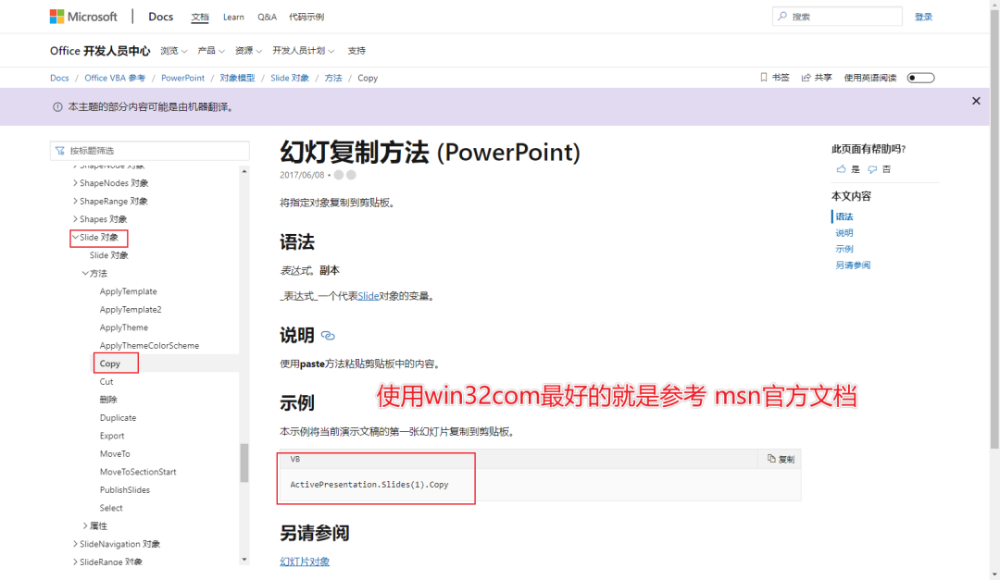<br />**先准备好一张模板：** 2.2 win32 ppt测试.pptx<br />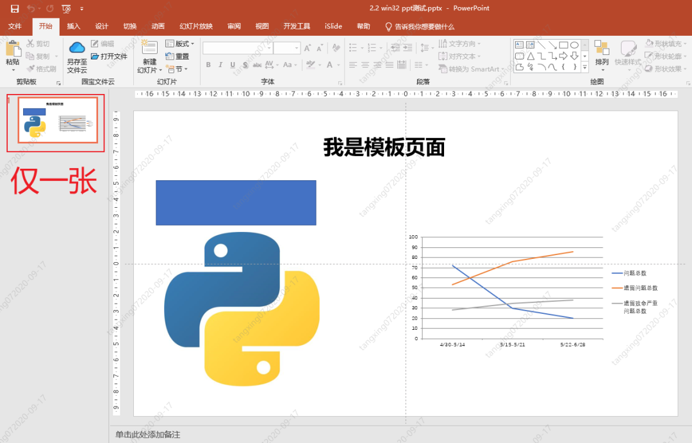<br />**示例代码：**
```python
import win32com
from win32com.client import Dispatch
import os

ppt = Dispatch('PowerPoint.Application')
# 或者使用下面的方法，使用启动独立的进程：
# ppt = DispatchEx('PowerPoint.Application')

# 如果不声明以下属性，运行的时候会显示的打开word
ppt.Visible = 1  # 后台运行
ppt.DisplayAlerts = 0  # 不显示，不警告

# 创建新的PowerPoint文档
# pptSel = ppt.Presentations.Add() 
# 打开一个已有的PowerPoint文档
pptSel = ppt.Presentations.Open(os.getcwd() + "\\" + "2.2 win32 ppt测试.pptx")

# 复制模板页
pptSel.Slides(1).Copy()
#设置需要复制的模板页数
pageNums = 10
# 粘贴模板页
for i in range(pageNums):
    pptSel.Slides.Paste()

# pptSel.Save()  # 保存
pptSel.SaveAs(os.getcwd() + "\\" + "win32_copy模板.pptx")  # 另存为
pptSel.Close()  # 关闭 PowerPoint 文档
ppt.Quit()  # 关闭 office
```
**效果如下：**<br />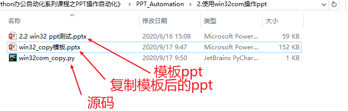<br />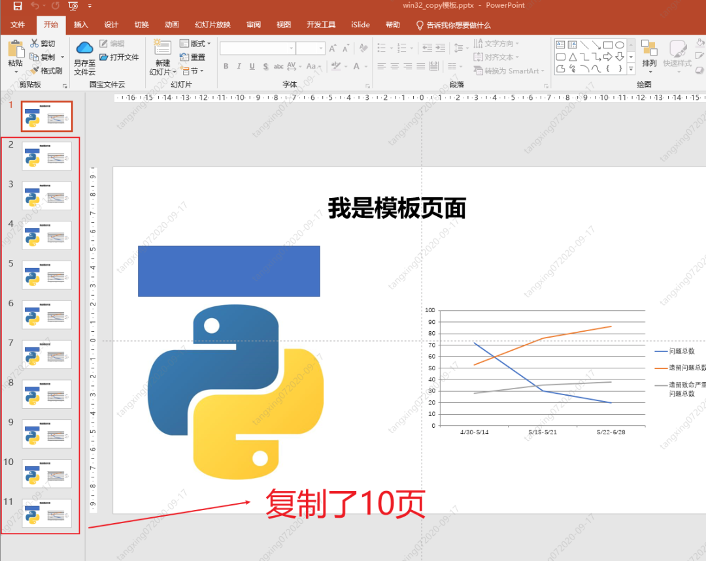
<a name="ArcnB"></a>
## 3、python-pptx 创建PPT、复制页面
官方文档：[https://python-pptx.readthedocs.io/en/latest/](https://python-pptx.readthedocs.io/en/latest/)
<a name="t9Ad1"></a>
### 3.1 pip安装python-pptx
安装方法：
```bash
pip install python-pptx
```
已经安装过了，故提示已经安装<br />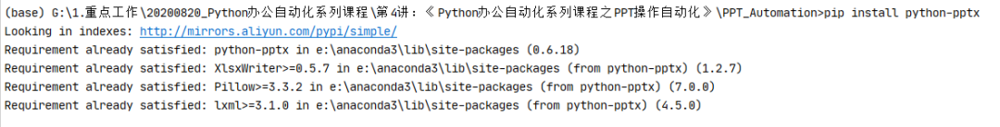
<a name="GbW1e"></a>
### 3.2 python-pptx 复制页面
使用python-pptx进行复制没有找到合适的方法，有以下两种解决办法：

1. 使用win32com对ppt模板进行复制
2. 增加模板ppt数量，然后使用python-pptx对不需要的模板页进行删减操作
<a name="iG7Zy"></a>
### 3.3 python-pptx 删除页面
**python-pptx 多页待删除模板.pptx：**<br />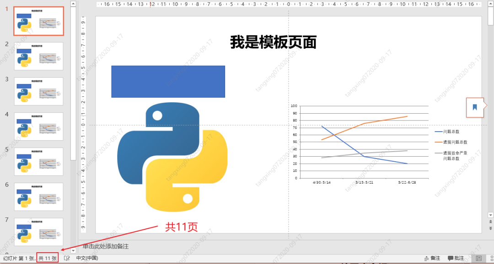<br />**示例代码：**
```python
from pptx import Presentation

# 删除某一页ppt
def del_slide(prs,index):
    slides = list(prs.slides._sldIdLst)
    prs.slides._sldIdLst.remove(slides[index])

# 3.3 python-pptx 删除页面
def fun3_3():
    # 打开ppt
    ppt = Presentation('python-pptx 多页待删除模板.pptx')

    # 获取所有页
    slides = ppt.slides
    number_pages = len(slides)
    print("删除前ppt一共",number_pages,"页面")

    # 设置需要删除的页面数量
    delPageNums = 3
    # 进行删除操作（每次都删除第一张ppt）
    for index in range(delPageNums):
        del_slide(ppt,0)

    # 再次获取所有页
    slides = ppt.slides
    number_pages = len(slides)
    print("删除后ppt一共",number_pages,"页面")

    ppt.save('python-pptx 多页已删除模板.pptx')
    print('生成完毕')

if __name__ == '__main__':
    fun3_3()
```
**执行效果：**<br />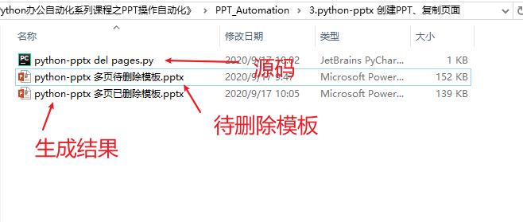<br />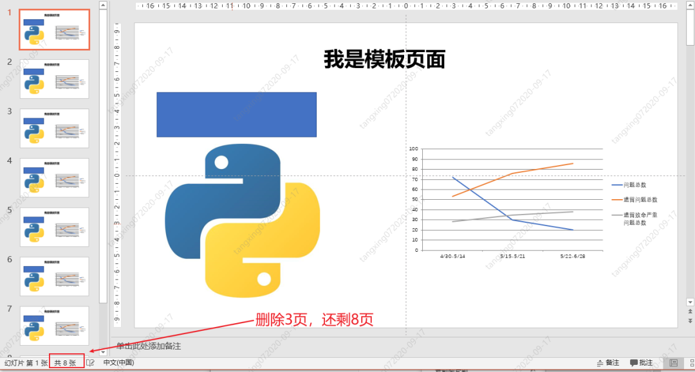
<a name="vR62i"></a>
### 3.4 新建页面
**示例代码：**
```python
from pptx import Presentation

# 新建ppt
ppt = Presentation()

# 新建页面
slide = ppt.slides.add_slide(ppt.slide_layouts[0])

# 保存ppt
ppt.save('新建ppt.pptx')
```
**效果如下：**<br />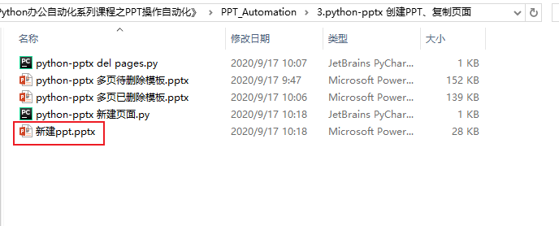<br />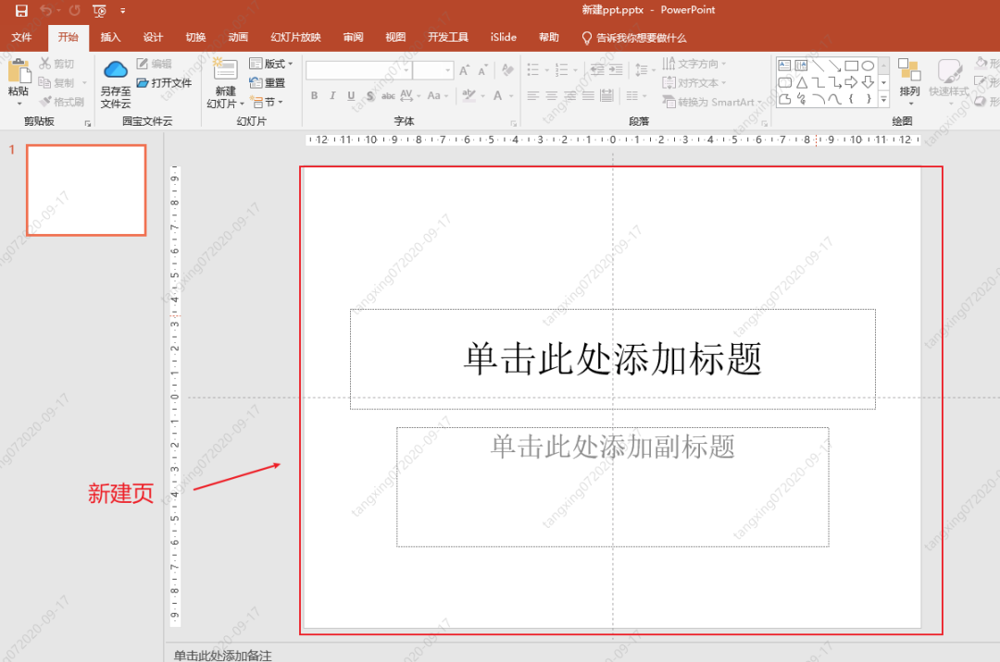
<a name="dkerr"></a>
## 4、python-pptx 插入文字、表格、形状并设置样式
**模板ppt：**<br />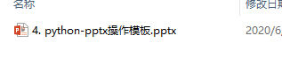<br />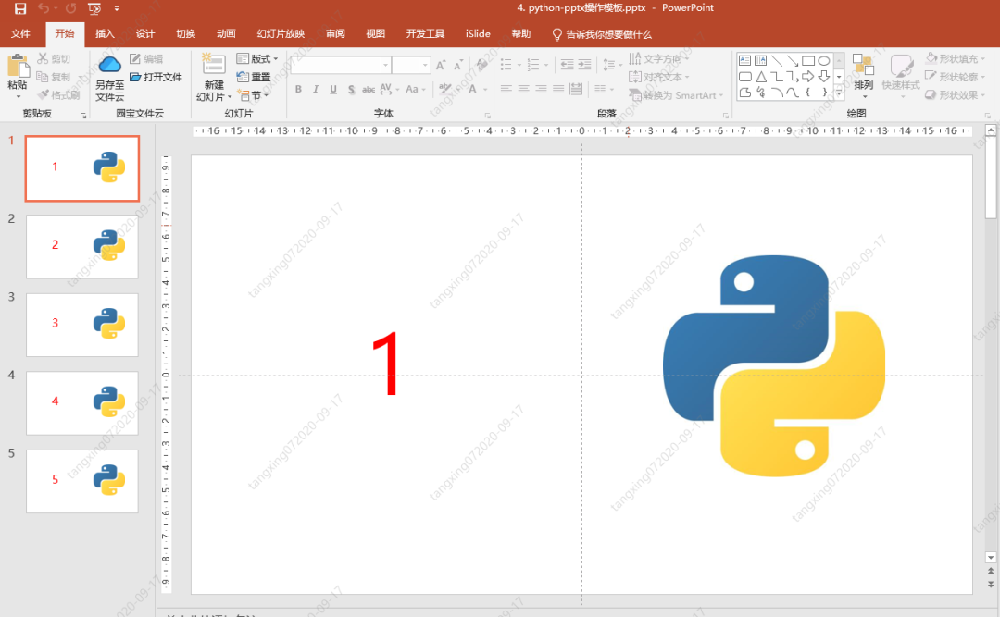<br />接下来，就在此模板上进行操作演示
<a name="KjA47"></a>
### 4.1 python-pptx 添加文字并设置样式
<a name="NwIbZ"></a>
#### 4.1.1 添加单行文字与多行文字
**示例代码：**
```python
from pptx import Presentation
from pptx.util import Pt,Cm

# 打开已存在ppt
ppt = Presentation('4. python-pptx操作模板.pptx')

# 设置添加到当前ppt哪一页
n_page = 0
singleLineContent = "我是单行内容"
multiLineContent = \
"""我是多行内容1
我是多行内容2
我是多行内容3
"""

# 获取需要添加文字的页面对象
slide = ppt.slides[n_page]

# 添加单行内容

# 设置添加文字框的位置以及大小
left, top, width, height = Cm(16.9), Cm(1), Cm(12), Cm(1.2)
# 添加文字段落
new_paragraph1 = slide.shapes.add_textbox(left=left, top=top, width=width, height=height).text_frame
# 设置段落内容
new_paragraph1.paragraphs[0].text = singleLineContent
# 设置文字大小
new_paragraph1.paragraphs[0].font.size = Pt(15)


# 添加多行

# 设置添加文字框的位置以及大小
left, top, width, height = Cm(16.9), Cm(3), Cm(12), Cm(3.6)
# 添加文字段落
new_paragraph2 = slide.shapes.add_textbox(left=left, top=top, width=width, height=height).text_frame
# 设置段落内容
new_paragraph2.paragraphs[0].text = multiLineContent
# 设置文字大小
new_paragraph2.paragraphs[0].font.size = Pt(15)


# 保存ppt
ppt.save('4.1 添加文字.pptx')
```
**效果如下：**<br />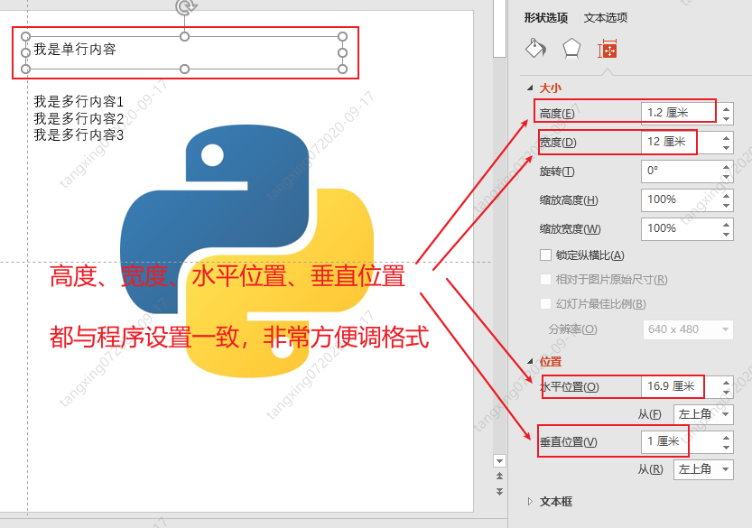
<a name="YhuE1"></a>
#### 4.1.2 设置文字框样式与文字样式
**示例代码：**
```python
from pptx import Presentation
from pptx.util import Pt,Cm
from pptx.dml.color import RGBColor
from pptx.enum.text import MSO_VERTICAL_ANCHOR, PP_PARAGRAPH_ALIGNMENT
from pptx.enum.text import PP_ALIGN


# 打开已存在ppt
ppt = Presentation('4. python-pptx操作模板.pptx')

# 获取需要添加文字的页面对象
slide = ppt.slides[0]

# 设置添加文字框的位置以及大小
left, top, width, height = Cm(16.9), Cm(1), Cm(12), Cm(1.2)
# 添加文字框 slide.shapes.add_textbox(距离左边，距离顶端，宽度，高度)
textBox = slide.shapes.add_textbox(left=left, top=top, width=width, height=height)

# 调整文本框背景颜色
textBoxFill = textBox.fill
textBoxFill.solid()  # 纯色填充
textBoxFill.fore_color.rgb = RGBColor(187, 255, 255)

# 文本框边框样式调整
line = textBox.line
line.color.rgb = RGBColor(0, 255, 0)
line.width = Cm(0.1)

# 获取文本框对象
tf = textBox.text_frame

# 文本框样式调整
tf.margin_bottom = Cm(0.1)  # 下边距
tf.margin_left = 0  # 左边距
tf.vertical_anchor = MSO_VERTICAL_ANCHOR.BOTTOM  # 对齐文本方式：底端对齐
tf.word_wrap = True  # 文本框的文字自动对齐

# 设置内容
tf.paragraphs[0].text = '这是一段文本框里的文字'

# 字体样式调整
tf.paragraphs[0].alignment = PP_ALIGN.CENTER  # 对齐方式
tf.paragraphs[0].font.name = '微软雅黑'  # 字体名称
tf.paragraphs[0].font.bold = True  # 是否加粗
tf.paragraphs[0].font.italic = True  # 是否斜体
tf.paragraphs[0].font.color.rgb = RGBColor(255, 0, 0)  # 字体颜色
tf.paragraphs[0].font.size = Pt(20)  # 字体大小

# 保存ppt
ppt.save('4.1.2 设置文字框与字体样式.pptx')
```
**效果如下：**<br />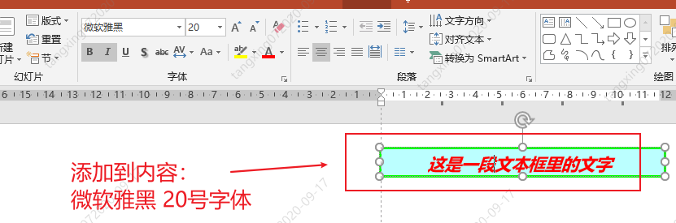<br />**代码详解**

- 添加文本框
```python
# 添加文字框 slide.shapes.add_textbox(距离左边，距离顶端，宽度，高度)
textBox = slide.shapes.add_textbox(left=left, top=top, width=width, height=height)
```

- 设置文本框背景
```python
# 调整文本框背景颜色
textBoxFill = textBox.fill
textBoxFill.solid()  # 纯色填充
textBoxFill.fore_color.rgb = RGBColor(187, 255, 255)
```
RGB颜色参考：[http://www.wahart.com.hk/rgb.htm](http://www.wahart.com.hk/rgb.htm)

- 设置文本框边框样式
```python
# 文本框边框样式调整
line = textBox.line
line.color.rgb = RGBColor(0, 255, 0)
line.width = Cm(0.1)
```

- 设置文本框文字样式
```python
# 获取文本框文字对象
tf = textBox.text_frame

# 文本框样式调整
tf.margin_bottom = Cm(0.1)  # 下边距
tf.margin_left = 0  # 左边距
tf.vertical_anchor = MSO_VERTICAL_ANCHOR.BOTTOM  # 垂直方式：底端对齐
tf.word_wrap = True  # 文本框的文字自动对齐
```
“指定文本在文本框架中的垂直对齐方式。与`TextFrame对象的.vertical_anchor`属性一起使用。请注意，`vertical_anchor`属性也可以具有值None，表示没有直接指定的垂直锚设置，并且其有效值是从占位符继承的（如果有一个或从主题继承）。也可以不指定任何内容来删除明确指定的垂直锚设置。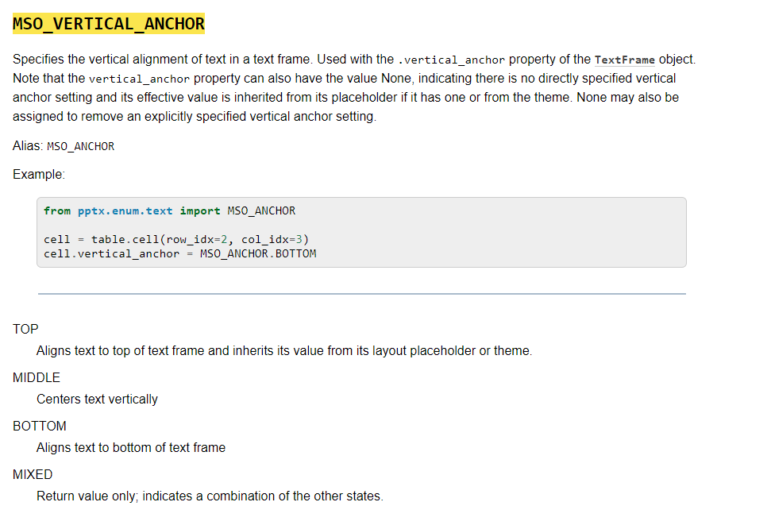

   - 垂直对齐
- 设置文本框内容
```python
# 设置内容
tf.paragraphs[0].text = '这是一段文本框里的文字'
```

- 字体样式调整
```python
# 字体样式调整
tf.paragraphs[0].alignment = PP_ALIGN.CENTER  # 对齐方式
tf.paragraphs[0].font.name = '微软雅黑'  # 字体名称
tf.paragraphs[0].font.bold = True  # 是否加粗
tf.paragraphs[0].font.italic = True  # 是否斜体
tf.paragraphs[0].font.color.rgb = RGBColor(255, 0, 0)  # 字体颜色
tf.paragraphs[0].font.size = Pt(20)  # 字体大小
```
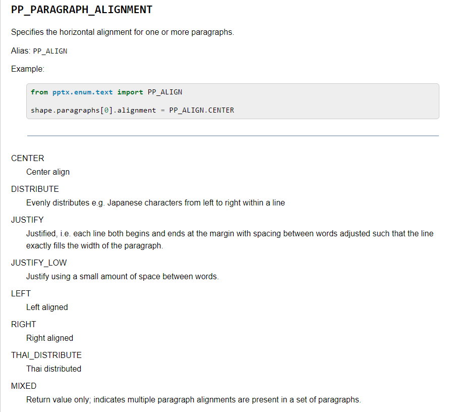

   - 文字对齐
```
CENTER
  	Center align
  DISTRIBUTE
  	Evenly distributes e.g. Japanese characters from left to right within a line
  JUSTIFY
  	Justified, i.e. each line both begins and ends at the margin with spacing between words adjusted such that the line exactly fills the width of the paragraph.
  JUSTIFY_LOW
  	Justify using a small amount of space between words.
  LEFT
  	Left aligned
  RIGHT
  	Right aligned
  THAI_DISTRIBUTE
  	Thai distributed
  MIXED
  	Return value only; indicates multiple paragraph alignments are present in a set of paragraphs.
```

- 保存ppt
```python
# 保存ppt
ppt.save('4.1.2 设置文字框与字体样式.pptx')
```
<a name="vyfuJ"></a>
### 4.2 python-pptx 添加表格并设置样式
**示例代码：**
```python
from pptx import Presentation
from pptx.util import Pt,Cm
from pptx.dml.color import RGBColor
from pptx.enum.text import MSO_ANCHOR
from pptx.enum.text import PP_ALIGN


# 设置需要添加到哪一页
n_page = 0

# 打开已存在ppt
ppt = Presentation('4. python-pptx操作模板.pptx')

# 获取slide对象
slide = ppt.slides[n_page]

# 设置表格位置和大小
left, top, width, height = Cm(6), Cm(12), Cm(13.6), Cm(5)
# 表格行列数，和大小
shape = slide.shapes.add_table(6, 7, left, top, width, height)
# 获取table对象
table = shape.table

# 设置列宽
table.columns[0].width = Cm(3)
table.columns[1].width = Cm(2.3)
table.columns[2].width = Cm(2.3)
table.columns[3].width = Cm(1.3)
table.columns[4].width = Cm(1.3)
table.columns[5].width = Cm(1.3)
table.columns[6].width = Cm(2.1)

# 设置行高
table.rows[0].height = Cm(1)

# 合并首行
table.cell(0, 0).merge(table.cell(0, 6))

# 填写标题
table.cell(1, 0).text = "时间"
table.cell(1, 1).text = "阶段"
table.cell(1, 2).text = "执行用例"
table.cell(1, 3).text = "新增问题"
table.cell(1, 4).text = "问题总数"
table.cell(1, 5).text = "遗留问题"
table.cell(1, 6).text = "遗留致命/" \
"严重问题"

# 填写变量内容
table.cell(0, 0).text = "产品1"
content_arr = [["4/30-5/14", "DVT1", "20", "12", "22", "25", "5"],
               ["5/15-5/21", "DVT1", "25", "32", "42", "30", "8"],
               ["5/22-6/28", "DVT1", "1", "27", "37", "56", "12"],
               ["5/22-6/28", "DVT1", "1", "27", "37", "56", "12"]]

# 修改表格样式
for rows in range(6):
    for cols in range(7):
        # Write column titles
        if rows == 0:
            # 设置文字大小
            table.cell(rows, cols).text_frame.paragraphs[0].font.size = Pt(15)
            # 设置字体
            table.cell(rows, cols).text_frame.paragraphs[0].font.name = '微软雅黑'
            # 设置文字颜色
            table.cell(rows, cols).text_frame.paragraphs[0].font.color.rgb = RGBColor(255, 255, 255)
            # 设置文字左右对齐
            table.cell(rows, cols).text_frame.paragraphs[0].alignment = PP_ALIGN.CENTER
            # 设置文字上下对齐
            table.cell(rows, cols).vertical_anchor = MSO_ANCHOR.MIDDLE
            # 设置背景为填充
            table.cell(rows, cols).fill.solid()
            # 设置背景颜色
            table.cell(rows, cols).fill.fore_color.rgb = RGBColor(34, 134, 165)
        elif rows == 1:
            table.cell(rows, cols).text_frame.paragraphs[0].font.size = Pt(10)
            table.cell(rows, cols).text_frame.paragraphs[0].font.name = '微软雅黑'  # 字体名称
            table.cell(rows, cols).text_frame.paragraphs[0].font.color.rgb = RGBColor(0, 0, 0)
            table.cell(rows, cols).text_frame.paragraphs[0].alignment = PP_ALIGN.CENTER
            table.cell(rows, cols).vertical_anchor = MSO_ANCHOR.MIDDLE
            table.cell(rows, cols).fill.solid()
            table.cell(rows, cols).fill.fore_color.rgb = RGBColor(204, 217, 225)
        else:
            table.cell(rows, cols).text = content_arr[rows - 2][cols]
            table.cell(rows, cols).text_frame.paragraphs[0].font.size = Pt(10)
            table.cell(rows, cols).text_frame.paragraphs[0].font.name = '微软雅黑'  # 字体名称
            table.cell(rows, cols).text_frame.paragraphs[0].font.color.rgb = RGBColor(0, 0, 0)
            table.cell(rows, cols).text_frame.paragraphs[0].alignment = PP_ALIGN.CENTER
            table.cell(rows, cols).vertical_anchor = MSO_ANCHOR.MIDDLE
            table.cell(rows, cols).fill.solid()
            table.cell(rows, cols).fill.fore_color.rgb = RGBColor(204, 217, 225)

            ppt.save('4.2 python-pptx 添加表格并设置样式.pptx')
```
**效果如下：**<br />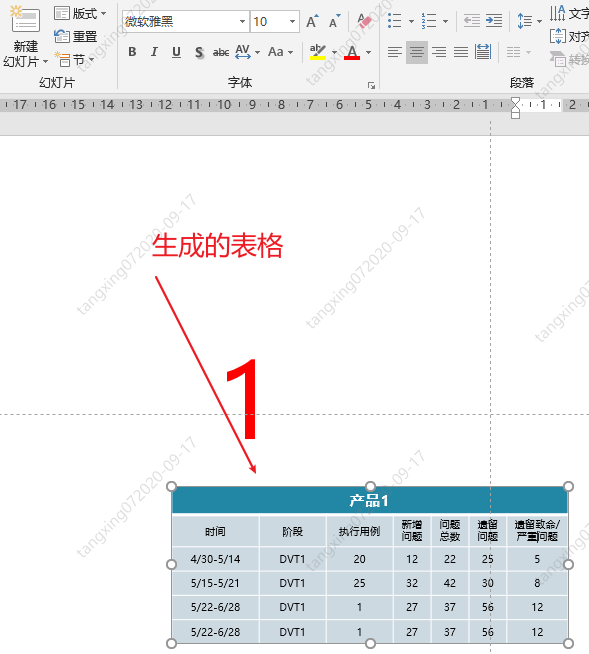
<a name="oiFaf"></a>
### 4.3 python-pptx 添加图表并设置样式
**示例代码：**
```python
from pptx import Presentation
from pptx.util import Pt,Cm
from pptx.chart.data import ChartData
from pptx.enum.chart import XL_CHART_TYPE


# 设置需要添加到哪一页
n_page = 0

# 打开已存在ppt
ppt = Presentation('4. python-pptx操作模板.pptx')

# 获取slide对象
slide = ppt.slides[n_page]

# 初始化图表
chart_data = ChartData()

# 填充需要添加的内容
content_arr = [["4/30-5/14", "DVT1", "20", "12", "22", "25", "5"],
               ["5/15-5/21", "DVT1", "25", "32", "42", "30", "8"],
               ["5/22-6/28", "DVT1", "1", "27", "37", "56", "12"],
               ["5/22-6/28", "DVT1", "1", "27", "37", "56", "12"]]

# 填充图表
chart_data.categories = [content_arr[0][0], content_arr[1][0], content_arr[2][0], content_arr[3][0]]
chart_data.add_series("问题总数", (content_arr[0][4], content_arr[1][4], content_arr[2][4], content_arr[3][4]))
chart_data.add_series("遗留问题总数", (content_arr[0][5], content_arr[1][5], content_arr[2][5], content_arr[3][5]))
chart_data.add_series("遗留致命严重\n问题总数", (content_arr[0][6], content_arr[1][6], content_arr[2][6], content_arr[3][6]))

# 设置位置
left, top, width, height = Cm(6), Cm(10), Cm(16.1), Cm(7.5)
# 添加图表
chart = slide.shapes.add_chart(
    XL_CHART_TYPE.LINE, left, top, width, height, chart_data
).chart


chart.has_legend = True
chart.legend.include_in_layout = False
# chart.series[0].smooth = True # 是否平滑
# chart.series[1].smooth = True
# chart.series[2].smooth = True
chart.font.size = Pt(10)  # 文字大小

ppt.save('4.3 python-pptx 添加图表并设置样式.pptx')
print('折线图添加完成')
```
**效果如下：**<br />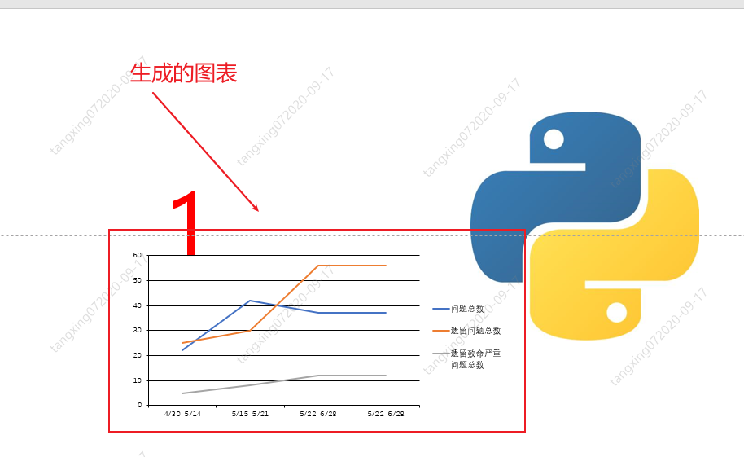
<a name="DqVk9"></a>
### 4.4 python-pptx 添加形状并设置样式
**这里的形状可以是这些：**<br />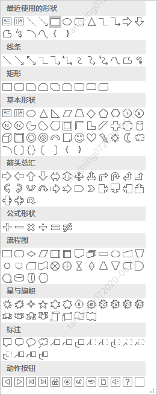<br />**形状别名可以再这里查看：**<br />[https://docs.microsoft.com/zh-cn/office/vba/api/Office.MsoAutoShapeType](https://docs.microsoft.com/zh-cn/office/vba/api/Office.MsoAutoShapeType)<br />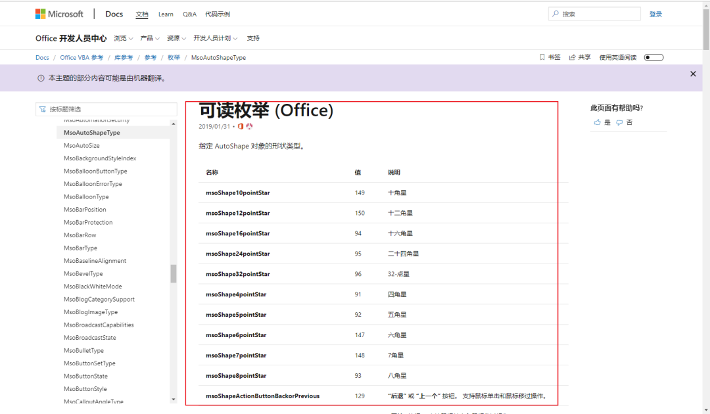<br />**并对应这里，找到正确的枚举名：**<br />[https://python-pptx.readthedocs.io/en/latest/api/enum/MsoAutoShapeType.html#msoautoshapetype](https://python-pptx.readthedocs.io/en/latest/api/enum/MsoAutoShapeType.html#msoautoshapetype)<br />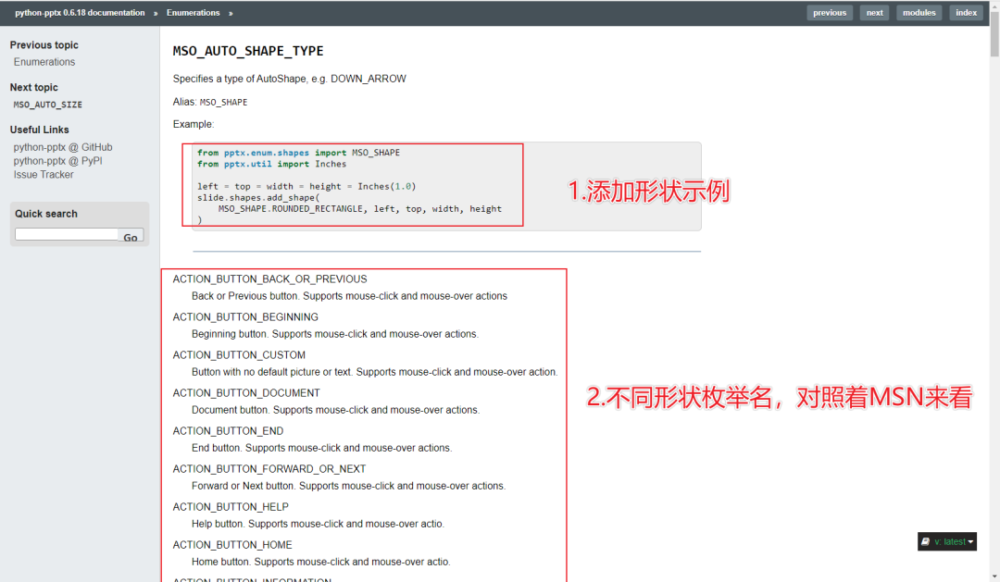<br />**程序示例：**
```python
from pptx import Presentation
from pptx.util import Pt,Cm
from pptx.dml.color import RGBColor
from pptx.enum.text import PP_ALIGN
from pptx.enum.shapes import MSO_SHAPE


# 设置需要添加到哪一页
n_page = 0

# 打开已存在ppt
ppt = Presentation('4. python-pptx操作模板.pptx')

# 获取slide对象
slide = ppt.slides[n_page]

# 添加矩形
# 设置位置以及大小
left, top, width, height = Cm(2.5), Cm(4.5), Cm(30), Cm(0.5)
# 添加形状
rectangle = slide.shapes.add_shape(MSO_SHAPE.RECTANGLE, left, top, width, height)
# 设置背景填充
rectangle.fill.solid()
# 设置背景颜色
rectangle.fill.fore_color.rgb = RGBColor(34, 134, 165)
# 设置边框颜色
rectangle.line.color.rgb = RGBColor(34, 134, 165)

# 添加正三角+文字(正常)
left, top, width, height = Cm(3), Cm(5.1), Cm(0.5), Cm(0.4)
slide.shapes.add_shape(MSO_SHAPE.FLOWCHART_EXTRACT, left, top, width, height)
new_paragraph = slide.shapes.add_textbox(left=left - Cm(0.95), top=top + Cm(0.4), width=Cm(2.4),height=Cm(1.1)).text_frame
content = """2020/01/05
内容1"""
new_paragraph.paragraphs[0].text = content
new_paragraph.paragraphs[0].font.size = Pt(10)  # 文字大小
new_paragraph.paragraphs[0].alignment = PP_ALIGN.CENTER

# 添加正三角+文字(延期)
left, top, width, height = Cm(9), Cm(5.1), Cm(0.5), Cm(0.4)
extract = slide.shapes.add_shape(MSO_SHAPE.FLOWCHART_EXTRACT, left, top, width, height)
extract.fill.solid()
extract.fill.fore_color.rgb = RGBColor(255, 0, 0)
extract.line.color.rgb = RGBColor(255, 0, 0)

new_paragraph = slide.shapes.add_textbox(left=left - Cm(0.95), top=top + Cm(0.4), width=Cm(2.4),height=Cm(1.1)).text_frame
content = """2020/01/05
内容2"""
new_paragraph.paragraphs[0].text = content  # 文字内容
new_paragraph.paragraphs[0].font.size = Pt(10)  # 文字大小
new_paragraph.paragraphs[0].font.color.rgb = RGBColor(255, 0, 0)    # 文字颜色
new_paragraph.paragraphs[0].alignment = PP_ALIGN.CENTER # 文字水平对齐方式

# 添加倒三角+间隔条+文字
left, top, width, height = Cm(5), Cm(4), Cm(0.5), Cm(0.4)
slide.shapes.add_shape(MSO_SHAPE.FLOWCHART_MERGE, left, top, width, height)
gap = slide.shapes.add_shape(MSO_SHAPE.RECTANGLE, left + Cm(0.2), top + Cm(0.5), Cm(0.05), Cm(0.5))
gap.fill.solid()
gap.fill.fore_color.rgb = RGBColor(255, 255, 255)
gap.line.color.rgb = RGBColor(255, 255, 255)

new_paragraph = slide.shapes.add_textbox(left=left - Cm(0.95), top=top - Cm(1), width=Cm(2.4),height=Cm(1.1)).text_frame
content = """2020/01/05
内容3"""
new_paragraph.paragraphs[0].text = content
new_paragraph.paragraphs[0].font.size = Pt(10)  # 文字大小
new_paragraph.paragraphs[0].alignment = PP_ALIGN.CENTER

# 添加当前时间图形
left, top, width, height = Cm(7), Cm(4), Cm(0.5), Cm(0.4)
now = slide.shapes.add_shape(MSO_SHAPE.DOWN_ARROW, left, top, width, height)
now.fill.solid()
now.fill.fore_color.rgb = RGBColor(254, 152, 47)
now.line.color.rgb = RGBColor(254, 152, 47)

ppt.save('4.4 python-pptx 添加形状并设置样式.pptx')
print('进度条添加完成')
```
**效果如下：**<br />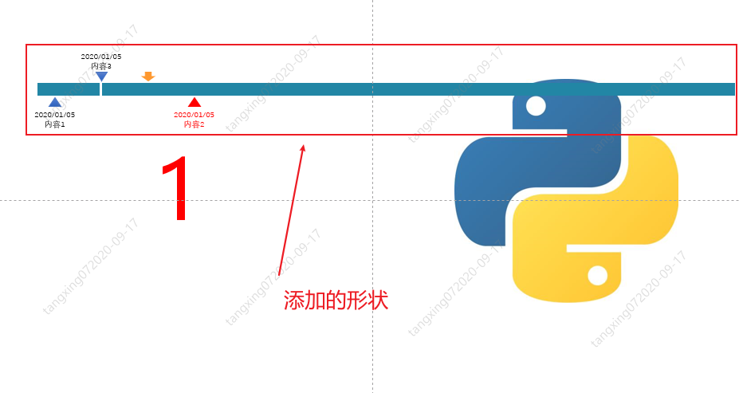
<a name="ffVqd"></a>
## 5、seaborn绘图库介绍与使用
官方网址：[http://seaborn.pydata.org/](http://seaborn.pydata.org/)<br />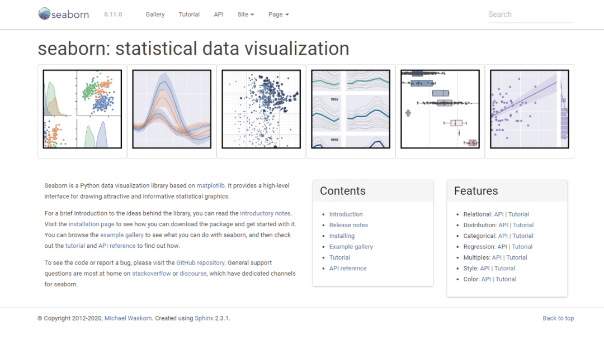

- seaborn是基于Matplotlib的Python数据可视化库。它提供了一个高级界面，用于绘制引人入胜且内容丰富的统计图形
- 只是在Matplotlib上进行了更高级的API封装，从而使作图更加容易
- seaborn是针对统计绘图的，能满足数据分析90%的绘图需求，需要复杂的自定义图形还需要使用到Matplotlib
<a name="dJ7by"></a>
### 5.1 pip安装seaborn
```bash
pip install seaborn
```
效果如下（这里显示已安装）：<br />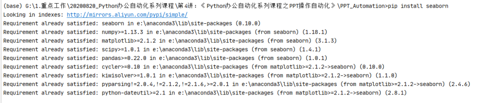<br />使用：
```python
import seaborn as sns 
# 或者
import seaborn
```
**使用数据集：**
```python
import seaborn as sns

tips = sns.load_dataset("tips")
```
无法连接：<br />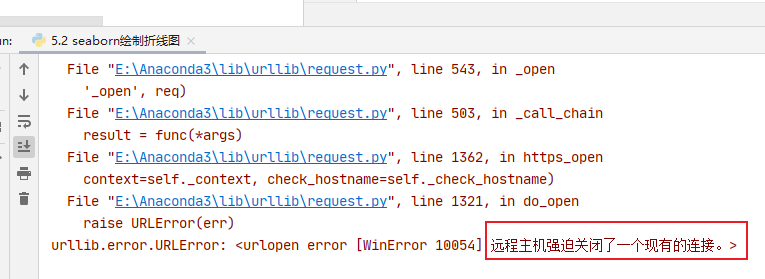<br />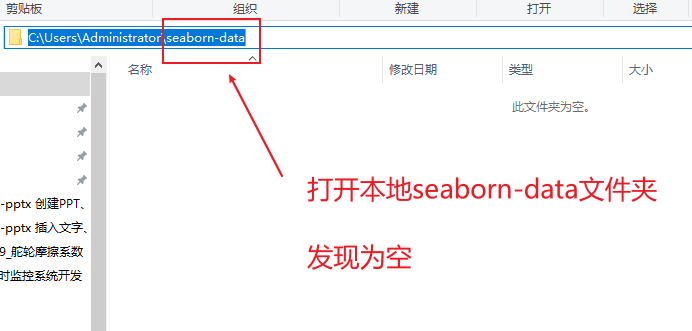<br />**下载数据集：**[https://github.com/mwaskom/seaborn-data](https://github.com/mwaskom/seaborn-data)<br />**放到本地：**<br />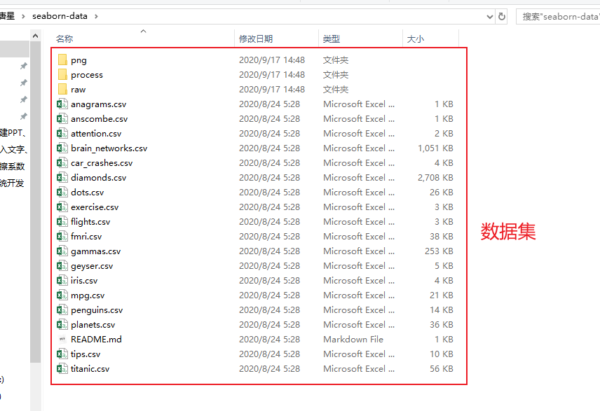<br />**运行程序：**
```python
import seaborn as sns

tips = sns.load_dataset("tips")

print("tips:",tips)
print("ype(tips):",type(tips))
```
**效果如下:**<br />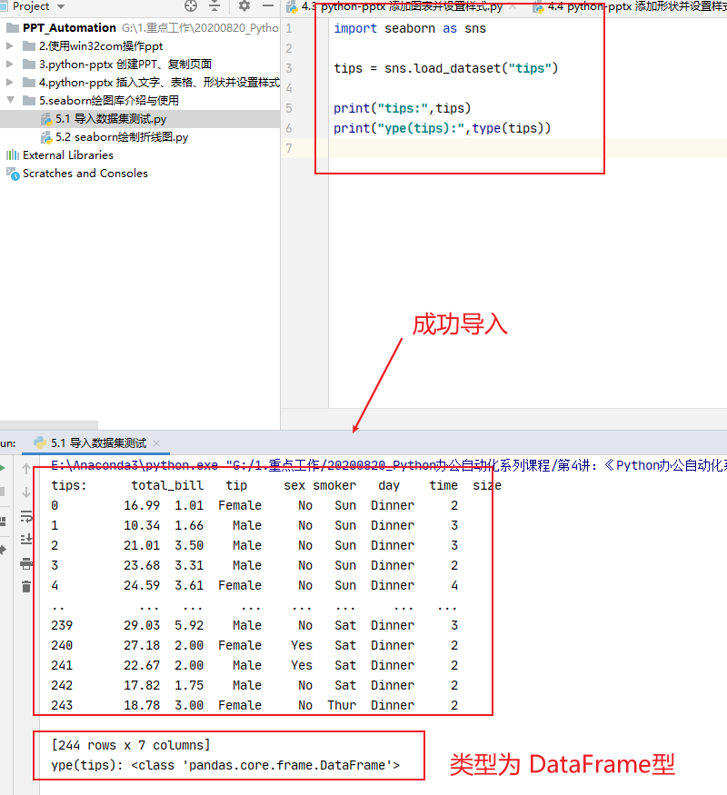
<a name="VKuld"></a>
### 5.2 seaborn绘制折线图
<a name="SWYOT"></a>
#### 5.2.1 通过relplot来实现
**示例代码：**
```
import matplotlib.pyplot as plt
import seaborn as sns

# 数据集
data = sns.load_dataset("fmri")
print(data.head())
# 绘画折线图
sns.relplot(x="timepoint", y="signal", kind="line", data=data, ci=None)
# 显示
plt.show()
```
**效果如下：**<br />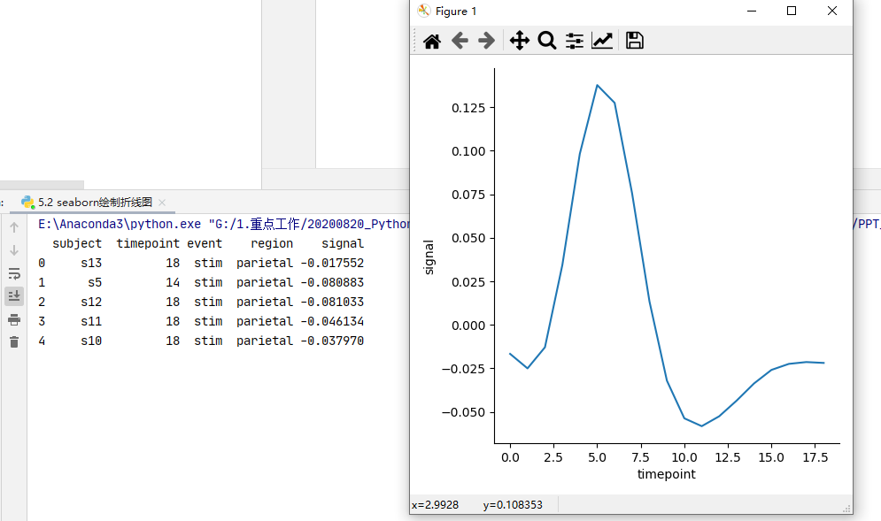
<a name="SePsR"></a>
#### 5.2.2 通过`lineplot()`函数来实现
**示例代码：**
```python
import matplotlib.pyplot as plt
import seaborn as sns

# 数据集
data = sns.load_dataset("fmri")
print(data.head())
# 绘画折线图：
sns.lineplot(x="timepoint", y="signal", data=data, ci=95)
# 显示
plt.show()
```
**效果如下：**<br />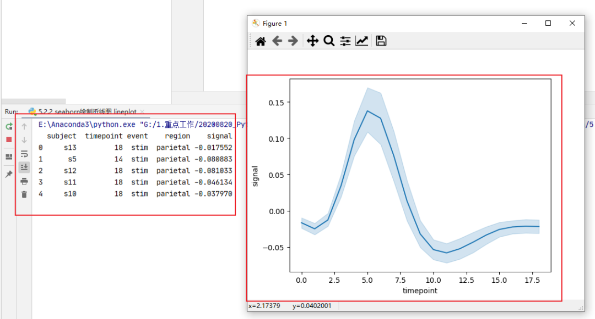
<a name="AkjGt"></a>
#### 5.2.3 多坐标效果
**示例代码：**
```python
import matplotlib.pyplot as plt
import seaborn as sns

# 数据集
data = sns.load_dataset("fmri")
print(data.head())

# 绘画折线图
f, axes = plt.subplots(nrows=1, ncols=2, figsize=(14, 6))

sns.lineplot(x="timepoint", y="signal", data=data, ci=None, ax=axes[0])
sns.lineplot(x="timepoint", y="signal", hue="region", style="event", data=data, ci=None, ax=axes[1])
plt.show()
```
**效果如下：**<br />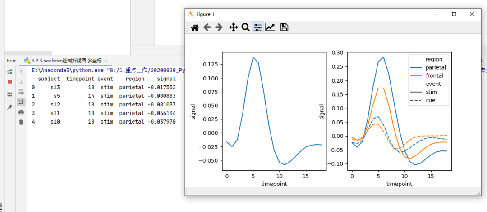
<a name="dhWY1"></a>
#### 5.2.4 保存生成的图片
注意：需要在`plt.show()`之前调用`savefig`，不然保存的图片就是一片空白
```python
plt.savefig('seaborn生成的图片.png')

plt.show()
```
**效果如下：**<br />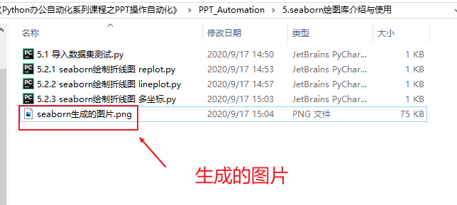<br />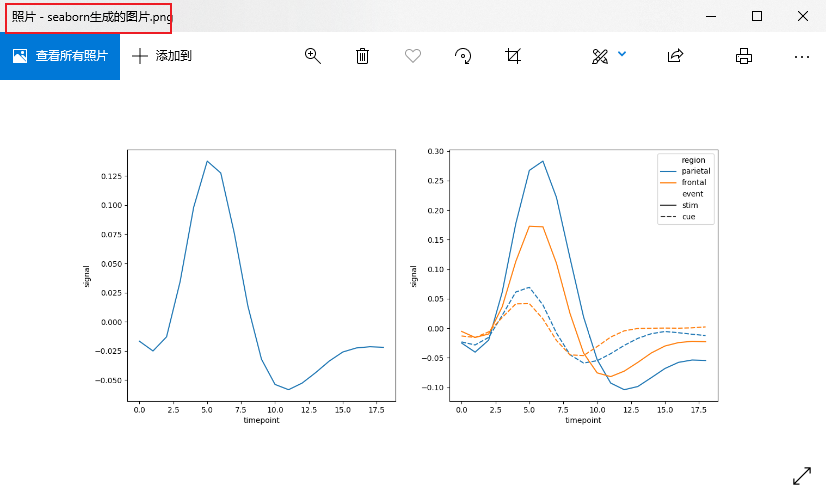
<a name="kiWoo"></a>
### 5.3 seaborn replot 绘制散点图
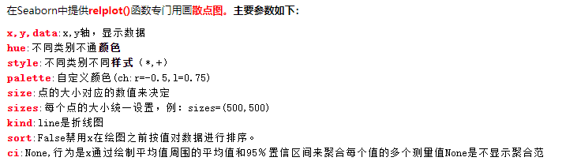<br />**示例代码：**
```python
import matplotlib.pyplot as plt
import seaborn as sns

# 准备数据：自带数据集
tips = sns.load_dataset("tips")
print(tips.head())

# 绘画散点图
sns.relplot(x="total_bill", y="tip", data=tips, hue="sex", style="smoker", size="size")
sns.relplot(x="total_bill", y="tip", data=tips, hue="sex", style="smoker", size="size", sizes=(100, 100))
# 显示
plt.show()
```
**效果如下：**<br />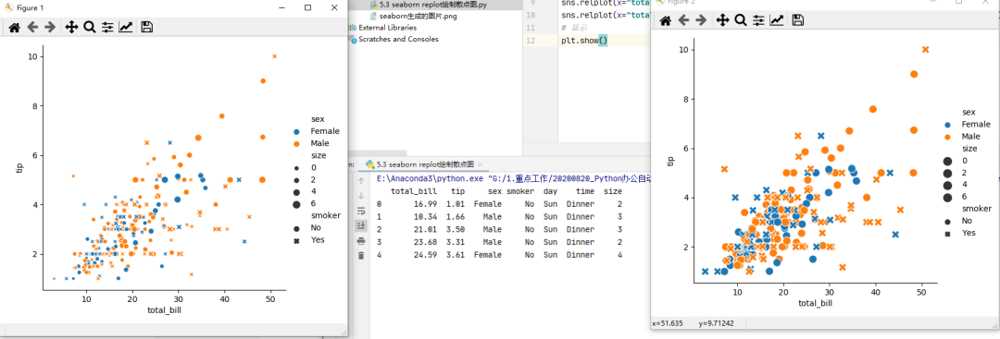
<a name="phAoH"></a>
### 5.4 seaborn barplot绘制柱状图

- 垂直

**示例代码：**
```python
import matplotlib.pyplot as plt
import seaborn as sns

# 显示正负号与中文不显示问题
plt.rcParams['axes.unicode_minus'] = False
sns.set_style('darkgrid', {'font.sans-serif':['SimHei', 'Arial']})

# 去除部分warning
import warnings
warnings.filterwarnings('ignore')

plt.figure(dpi=150)
x = ['金融','农业','制造业','新能源']
y = [164, 86, 126, 53]
sns.barplot(x, y)

plt.show()
```
**效果如下：**<br />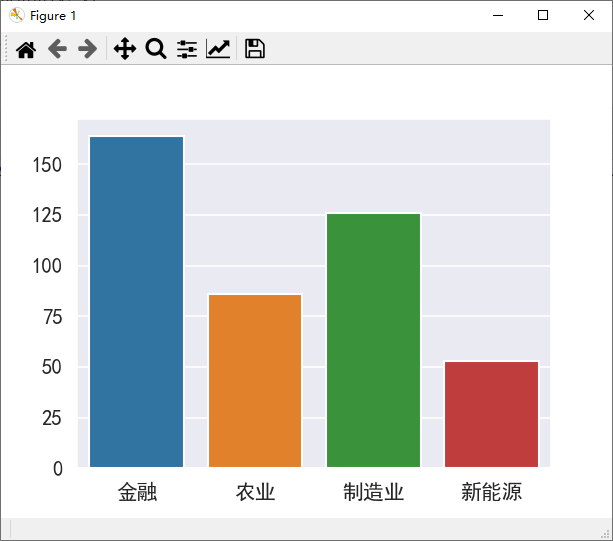

- 水平

调换横纵坐标位置即可
```python
plt.figure(dpi=150)
x = ['金融','农业','制造业','新能源']
y = [164, 86, 126, 53]
sns.barplot(y,x )
plt.show()
```
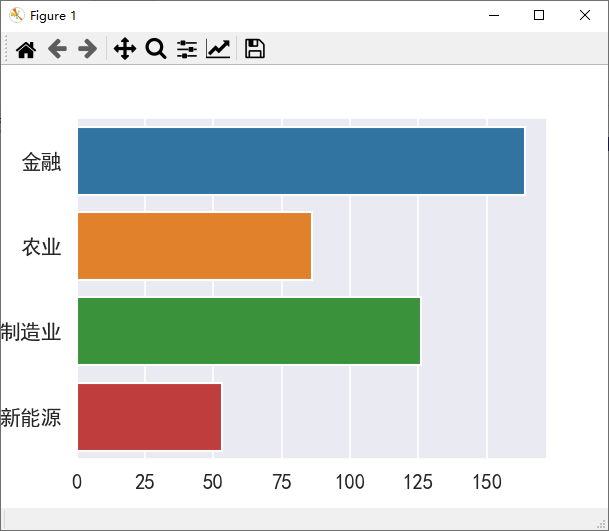
<a name="MwOoK"></a>
## 6、python-pptx 插入图片
**前提条件：**<br />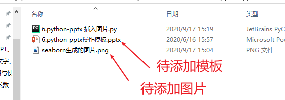<br />**示例代码：**
```python
from pptx import Presentation
from pptx.util import Pt,Cm

# 打开已存在ppt
ppt = Presentation('6.python-pptx操作模板.pptx')

# 设置添加到当前ppt哪一页
n_page = 0

# 获取需要添加文字的页面对象
slide = ppt.slides[n_page]

# 设置待添加的图片
img_name  = 'seaborn生成的图片.png'
# 设置位置
left, top, width, height = Cm(6), Cm(6), Cm(20), Cm(9)
# 进行添加
slide.shapes.add_picture(image_file=img_name,left=left,top=top,width=width,height=height)

# 保存ppt
ppt.save('6.python-pptx 插入图片.pptx')
```
**效果如下：**<br />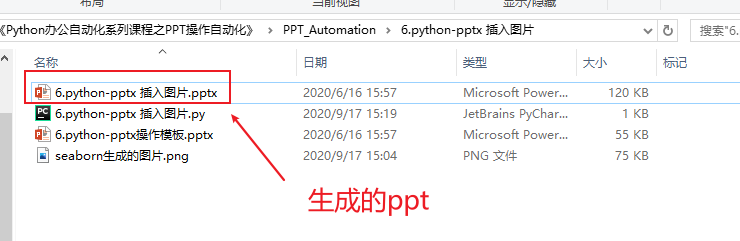<br />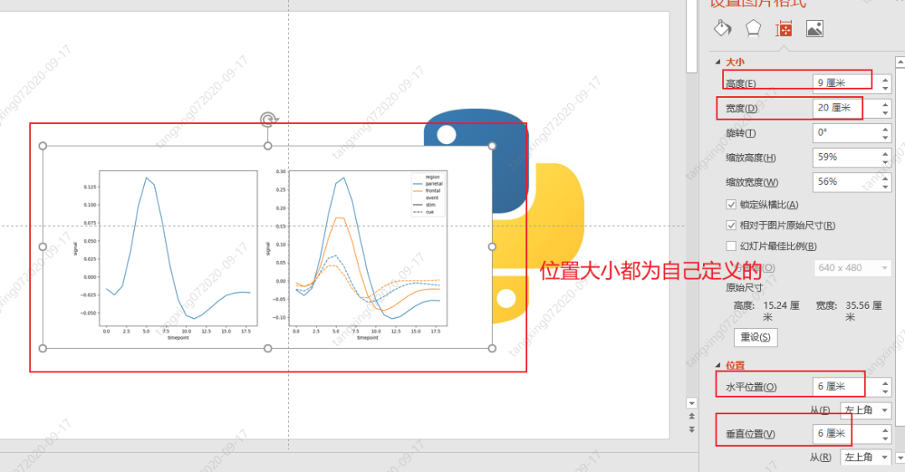
<a name="fpCbD"></a>
## 7、python-pptx 读取数据
**前提条件：**<br />准备好一张有内容的ppt<br />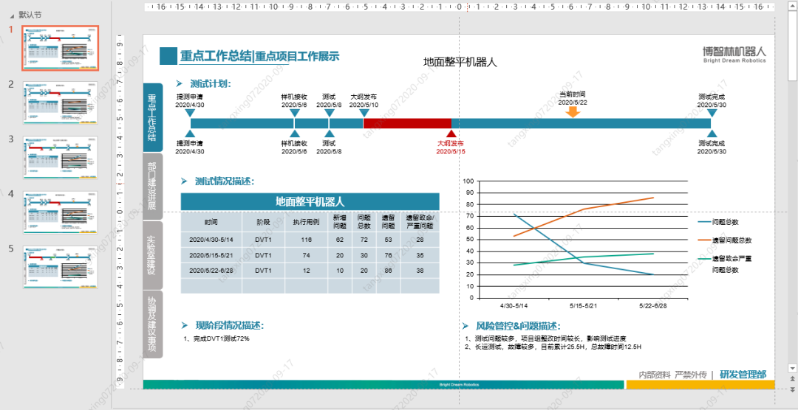<br />**示例代码：**
```python
from pptx import Presentation
from pptx.enum.shapes import MSO_SHAPE_TYPE

# 打开待读取的ppt文件
ppt = Presentation('研发管理部检测部周报2020-09-17.pptx')

# 获取第0张
slide0 = ppt.slides[0]

# 遍历所有内容
for shape in slide0.shapes:
    # 打印shape名称
    print(shape.shape_type)
    # 判断是否为表格
    if shape.shape_type == MSO_SHAPE_TYPE.TABLE:
        #获取表格行
        for row in shape.table.rows:
            for cell in row.cells:
                print(cell.text_frame.text)
```
**效果如下：**<br />将当前幻灯片页面中的对象名称和表格内容全部打印出来了，反之，对其进行复制，就是写操作。<br />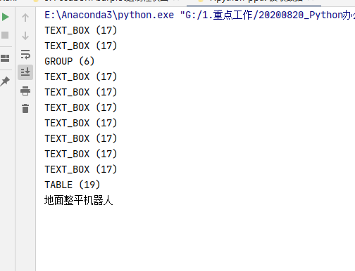<br />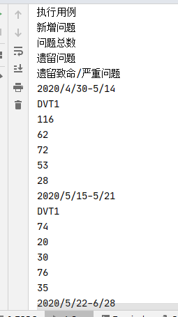
