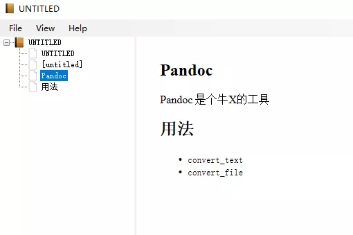

Python
<a name="n9oDr"></a>
## 安装
```bash
pip install pypandoc
```
安装成功之后，可以测试一下：
```python
>>> import pypandoc
>>> print(pypandoc.get_pandoc_version())
2.14.2
```
这里安装的版本是: 2.14.2<br />pandoc 是一个常用的软件，很多操作系统比如 Windows 可能已经内置<br />另外也可以单独安装，使用它的命令行工具，更多的 Pandoc 安装方式 和用法可以参考 [pypandoc 说明](https://github.com/NicklasTegner/pypandoc) 和 [Pandoc 文档](https://pandoc.org/index.html)
<a name="iRWI5"></a>
## 用法示例
翻看 pypandoc 说明，有个 `convert_text` 方法，可以用字符串的方式提供待转化的文本。<br />那先写一段 markdown 试试：
```python
import pypandoc

input = "**Hello World!**"
output = pypandoc.convert_text(input, 'html', format='md')

print(output)
```
显示结果如下：
```html
<p><strong>Hello World!</strong></p>
```
将 **Hello World!** 转化成了一段 html 代码了。<br />再试点复杂的：
```python
import pypandoc

input = """
# Pandoc

Pandoc 是个牛X的工具

## 用法

- `convert_text`
- `convert_file`
"""
output = pypandoc.convert_text(input, 'html', format='md')
print(output)
```
看看输出：
```html
<h1 id="pandoc">Pandoc</h1>
<p>Pandoc 是个牛X的工具</p>
<h2 id="用法">用法</h2>
<ul>
    <li><code>convert_text</code></li>
    <li><code>convert_file</code></li>
</ul>
```
换一种输出格式呢？
```python
output = pypandoc.convert_text(input, 'rst', format='md')
```
看看输出：
```
Pandoc
======

Pandoc 是个牛X的工具

用法
----

-  ``convert_text``
-  ``convert_file``
```
最好试试转化为 ePub 格式<br />ePub 格式无法输出为字符串，需要存入文件，所以需要用 加入 `outputfile` 参数<br />代码如下：
```python
convert_test(input, 'epub', format='md', outputfile='test.epub')
```
用 EPUB File Reader 打开看看效果：<br /><br />epub
<a name="WKLkn"></a>
## 生成电子书
测试了没问题后，就转化一个 Markdown 文件试试。<br />对于文件，需要用 `convert_file` 方法：
```python
import pypandoc

convert_file('everyone-can-use-english.md', 'epub', 'md', outputfile='人人都能用英语.epub')
```
很快就能生成一个 epub 格式的电子书。<br />这里需要注意的是：引用的图片<br />如果是网络上的，需要将图片地址换成全网址，如果是相对的，需要保持目录结构，并提前准备好图片。<br />不然将无法生成图片，使电子书失去一定的可读性。<br />生成好了之后，可以将 人人都能用英语.epub 发送到手机上，用多看打开。<br />看看效果：<br /><br />多看<br />之后就可以在书架里看到了：<br /><br />多看书架
<a name="AKQNW"></a>
## 参考资料
pypandoc 说明：[https://github.com/NicklasTegner/pypandoc](https://github.com/NicklasTegner/pypandoc)<br />Pandoc 文档：[https://pandoc.org/index.html](https://pandoc.org/index.html)
