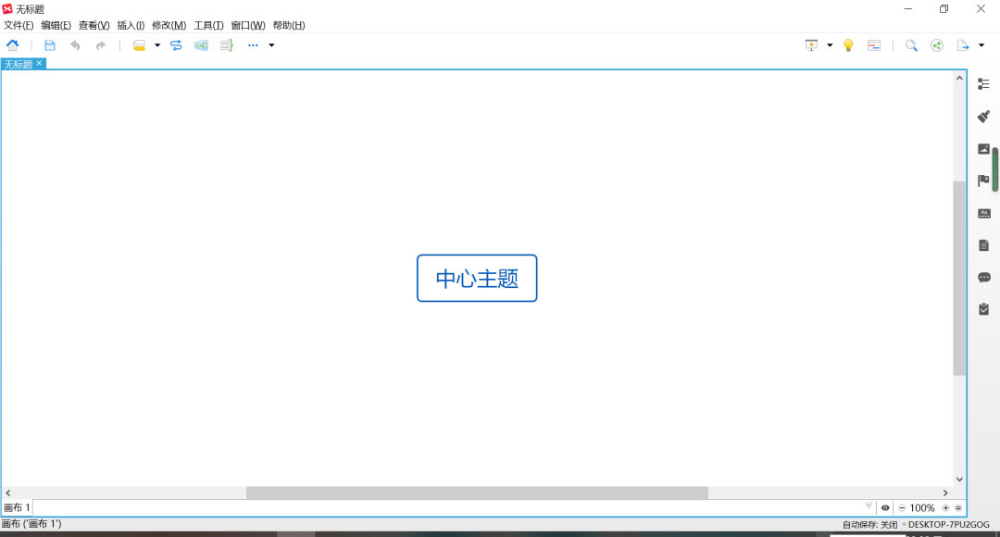
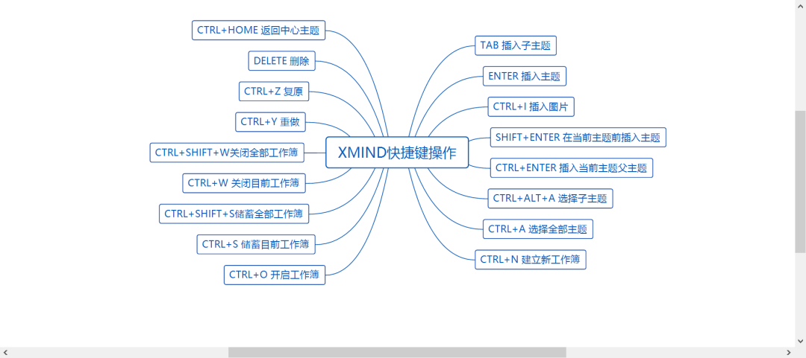
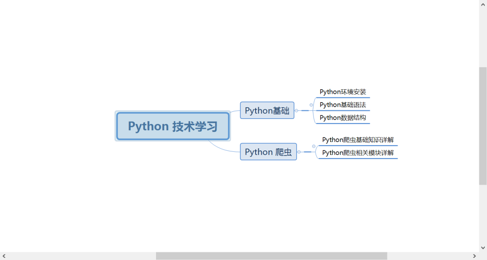

Python<br />在平时的工作中要总结一些知识的时候就需要一款工具来画画流程图，这里推荐 XMind 软件,用 Xmind 绘制的思维导图看起来思路清晰，那么今天的文章介绍关于思维导图的相关知识以及用 Python 如何操作 Xmind 绘制思维导图。
<a name="Qrb68"></a>
## 思维导图
思维导图：思维导图又叫心智导图是表达发散性思维的有效的图形思维工具，它简单却又很有效，是一种革命性的思维工具。思维导图运用图文并重的技巧，把各级主题的关系用相互隶属与相关的层级图表现出来，把主题关键词与图像、颜色等建立记忆链接。思维导图充分运用左右脑的机能，利用记忆、阅读、思维的规律，协助人们在科学与艺术、逻辑与想象之间平衡发展，从而开启人类大脑的无限潜能。思维导图因此具有人类思维的强大功能。<br />思维导图是一种将思维形象化的方法。简单来讲：思维导图就是能有层次感的展示想法的思维工具。
<a name="UMm4y"></a>
## 思维导图功能
无论是在工作还是生活中，都希望达成一个关键目标——提高学习、记忆和记录信息的能力。思维导图就是让人的大脑对知识有一个层次性的放射性记忆，从而得到一张清晰准确的图形。让想法可以很快而且非常深刻地生发出来，同时又能清晰地集中于中心主题。这种制作技巧能让人们最大限度地利用自己潜在的智力资源。<br />简单来讲，思维导图可以帮助思考问题解决问题，促进思维可视化，最大限度的开发大脑潜能。
<a name="OfcxH"></a>
## 使用软件
画思维导图的工具有很多，这里小编推荐使用 Xmind 工具，下载官网下载后直接安装即可。<br />安装好以后进入 Xmind 工具操作界面，界面如下：<br /><br />Xmind 操作很简单，只要思路对了，只需要常用的快捷键就可以快速操作，以下是 Xmind 操作的相关快捷键。<br />
<a name="ptQxE"></a>
## Python3 操作 xmind 工具画思维导图
<a name="xOZ3i"></a>
### 基础知识详解
首先安装 xmind 模块，安装代码如下：`pip install xmind`<br />安装成功后导入包后即可操作，具体操作函数如下：
```python
import xmind    #加载包
w = xmind.load("test.xmind") # 加载，如果不存在，创建新的工作布
s1=w.getPrimarySheet() # 得到第一页
s1.setTitle("first sheet") # 给第一页命名
    
r1=s1.getRootTopic() # 创建根节点
r1.setTitle("根") # 给根节点命名

r2=r1.addSubTopic()#创建二级节点
r2.setTitle("枝叶")#命名
xmind.save("test2.xmind") ##保存文件
```
<a name="JqVQJ"></a>
### 画思维导图实例
以下就是 Python 操作 Xmind 绘制脑图整体实例，详细操作如下：
```python
import xmind

w = xmind.load("test.xmind")
s1 = w.getPrimarySheet()  # 获取此工作表
s1.setTitle("first sheet")  # 设置标题
a = {"h1": 'Python 技术学习', 'h2': ['Python基础', 'Python 爬虫'],
	 'h3': [['Python环境安装', 'Python基础语法', 'Python数据结构'], ['Python爬虫基础知识详解', 'Python爬虫相关模块详解']]}
r1 = s1.getRootTopic()  # 获取此工作表的根主题
r1.setTitle(a['h1'])  # 设置标题
c = a['h2']
c2 = a['h3']
for i, val in enumerate(c):
	print(i, val)
	a = 'b' + str(i)
	a = r1.addSubTopic()
	a.setTitle(val)  # 设置标题
	for i2, val2 in enumerate(c2):
		if i == i2:
			a2 = 'b2' + str(i)
			a2 = a.addSubTopic()
			#        if isinstance(val, list):
			for i3, val3 in enumerate(val2):
				a3 = 'b3' + str(i3)
				a3 = a2.addSubTopic()
				a3.setTitle(val3)
				
xmind.save(w, "Python_detail.xmind")
```
绘制的脑图显示如下：<br />
<a name="JwqAX"></a>
## 总结
脑图是一个很好的学习和工作工具，它在日常工作中起了很重要的作用。
