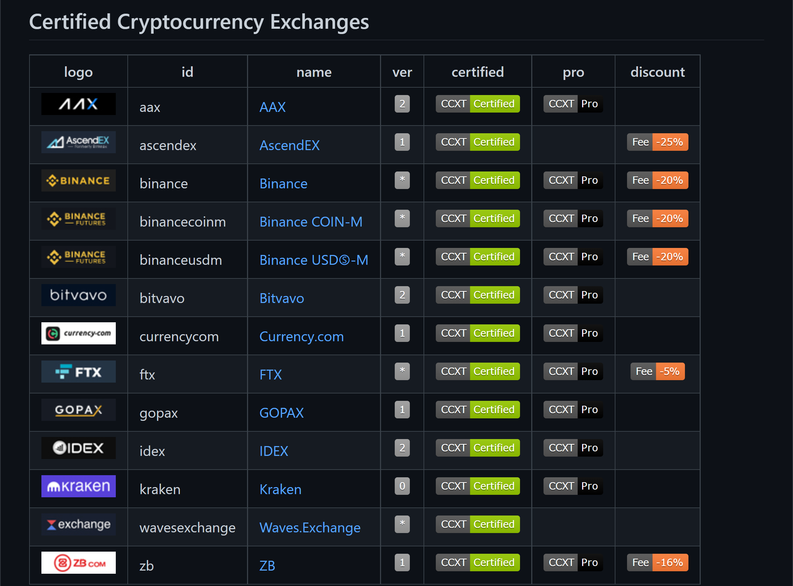

# Python 加密货币

CCXT框架 是一个Python/Javascript/PHP的一个交易API框架，对接超过130多个交易所。可用于世界各地的加密货币交易所的连接和交易，以及转账支付处理，可用于存储数据，分析，可视化，指标开发，算法交易，是一个非常容易集成的开箱即用的统一API。

CCXT框架Github地址：[https://github.com/ccxt/ccxt](https://github.com/ccxt/ccxt)

CCTXT官方文档：https://docs.ccxt.com/#/

当前功能列表：

- 支持许多交易市场，甚至即将推出的
- 为所有交易提供完整的公共和私人API
- 所有货币，山寨币和标记，价格，订单，交易，代码等…
- 提供用于交叉交换或跨货币分析和套利的可选标准化数据
- 开箱即用的统一的一体化API，非常易于集成
- 适用于Node7.6+，Python2和3，PHP5.4+，Web浏览器


## 认证交易所


## 支持的加密货币交易所
ccxt库目前支持以下131个加密货币交易所和交易API，可以在github查看。上面的列表经常更新，新的加密市场，山寨币交换，错误修复，API端点定期引入和添加。有关详细信息可以参阅手册，如果没有在上面的列表中找到加密货币交易市场和/或想要添加其他交易所，请通过GitHub或通过电子邮件在此处发布问题来发布或发送链接。<br />该库受到MIT许可，这意味着任何开发人员都可以完全免费构建商业和开源软件，但使用它需要自担风险且无需担保。

## 安装
安装ccxt库的最简单方法是使用内置包管理器：

- NPM中的ccxt（JavaScript/Node v7.6+）
- PyPI中的ccxt（Python 2和3.5.3+）
- Packagist/Composer中的ccxt（PHP 5.4+）

该库作为一体化模块实现提供，具有最小的依赖性和要求：

- js/在JavaScript中
- python/在Python中（从JS生成）
- PHP/ PHP（从JS生成）

也可以从ccxt GitHub存储库将其克隆到项目目录中：
```bash
git clone https://github.com/ccxt/ccxt.git
```
将此库安装到代码中的另一种方法是将单个文件手动复制到工作目录中，并使用适合环境的语言扩展名。
```bash
pip install ccxt
```

## 常用接口
```python
# 初始化交易所
binance_exchange = ccxt.binance({
'timeout': 15000,
'enableRateLimit': True
})


# 获取单个交易对ticker数据
binance_exchange.fetchTicker(symbol)


# 获取多个交易对ticker数据
tickers_data = binance_exchange.fetchTickers(['BTC/USDT', 'ETH/USDT'])


# 交易委托账本数据获取
binance_exchange.fetch_order_book(symbol)


# K线数据数据获取
binance_exchange.fetch_ohlcv(symbol, timeframe='1d')
```


### 使用
CCXT里面的交易所都集成来自Exchange的基类，然后每个交易所实现了一些统一的api接口，另外也实现自己交易所特有的api方法。统一的api方法分为不需要权限就能访问的，比如loadmarkets(加载市场的交易对)、 fetchticker（获取ticker）等，需要权限访问的方法如fetchbalance(获取张账户资金)、createorder(生成订单)等。CCXT的方法名称有两种实现方式，一种是驼峰法，另外一种是下划线命名法，在Python中，推荐使用下划线方法来调用。

### 公共API包括

- 市场数据
- 交易对
- 交易手续费
- 订单薄/深度数据
- 交易历史
- 行情/Tickers
- 用以制图的 OHLC(V)/K线
- 其他公共接口

### 私有API包括

- 管理个人账户信息
- 查询账户余额
- 通过市价单和限价单进行交易
- 存入和提取法币和加密货币
- 查询个人订单
- 获取交易明细/历史
- 在账户之间转移资金
- 使用商业服务

此库为所有交换实现完整的公共和私有REST API。即将推出JavaScript，PHP，Python和其他语言的WebSocket和FIX实现。ccxt库支持 camelcase表示法（在JavaScript中是首选）和下划线表示法（在Python和PHP中首选），因此所有方法都可以用任何语言的符号或编码方式调用。
```javascript
// both of these notations work in JavaScript/Python/PHP
exchange.methodName ()  // camelcase pseudocode
exchange.method_name () // underscore pseudocode
```

## Python
```python
# coding=utf-8
import ccxt

hitbtc = ccxt.hitbtc({'verbose': True})
bitmex = ccxt.bitmex()
huobi  = ccxt.huobi()
exmo   = ccxt.exmo({
    'apiKey': 'YOUR_PUBLIC_API_KEY',
    'secret': 'YOUR_SECRET_PRIVATE_KEY',
})
kraken = ccxt.kraken({
    'apiKey': 'YOUR_PUBLIC_API_KEY',
    'secret': 'YOUR_SECRET_PRIVATE_KEY',
})


exchange_id = 'binance'
exchange_class = getattr(ccxt, exchange_id)
exchange = exchange_class({
    'apiKey': 'YOUR_API_KEY',
    'secret': 'YOUR_SECRET',
    'timeout': 30000,
    'enableRateLimit': True,
})

hitbtc_markets = hitbtc.load_markets()


print(hitbtc.id, hitbtc_markets)
print(bitmex.id, bitmex.load_markets())
print(huobi.id, huobi.load_markets())


print(hitbtc.fetch_order_book(hitbtc.symbols[0]))
print(bitmex.fetch_ticker('BTC/USD'))
print(huobi.fetch_trades('LTC/CNY'))

print(exmo.fetch_balance())

# sell one ฿ for market price and receive $ right now
print(exmo.id, exmo.create_market_sell_order('BTC/USD', 1))


# limit buy BTC/EUR, you pay €2500 and receive ฿1  when the order is closed
print(exmo.id, exmo.create_limit_buy_order('BTC/EUR', 1, 2500.00))

# pass/redefine custom exchange-specific order params: type, amount, price, flags, etc...
kraken.create_market_buy_order('BTC/USD', 1, {'trading_agreement': 'agree'})
```
