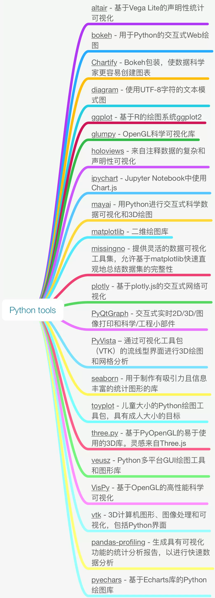

Python

## Python 绘图包

- altair - 基于Vega Lite的声明性统计可视化
- bokeh - 用于Python的交互式Web绘图
- Chartify - Bokeh包装，使数据科学家更容易创建图表
- diagram - 使用UTF-8字符的文本模式图
- ggplot - 基于R的绘图系统ggplot2
- glumpy - OpenGL科学可视化库
- holoviews - 来自注释数据的复杂和声明性可视化
- ipychart - Jupyter Notebook中使用Chart.js
- mayai - 用Python进行交互式科学数据可视化和3D绘图
- matplotlib - 二维绘图库
- missingno - 提供灵活的数据可视化工具集，允许基于matplotlib快速直观地总结数据集的完整性
- plotly - 基于plotly.js的交互式网络可视化
- PyQtGraph - 交互式实时2D/3D/图像打印和科学/工程小部件。
- PyVista – 通过可视化工具包（VTK）的流线型界面进行3D绘图和网格分析
- seaborn - 用于制作有吸引力且信息丰富的统计图形的库
- toyplot - 儿童大小的Python绘图工具包，具有成人大小的目标
- three.py - 基于PyOpenGL的易于使用的3D库。灵感来自Three.js
- veusz - Python多平台GUI绘图工具和图形库
- VisPy - 基于OpenGL的高性能科学可视化
- vtk - 3D计算机图形、图像处理和可视化，包括Python界面
- pandas-profiling - 生成具有可视化功能的统计分析报告，以进行快速数据分析
- pyechars - 基于Echarts库的Python绘图库

## 22个绘图包的思维导图

