Python 可视化<br />用 Python 创建图形的方法有很多，但是哪种方法是最好的呢？做可视化之前，要先明确一些关于图像目标的问题：是想初步了解数据的分布情况？想展示时给人们留下深刻印象？也许想给某人展示一个内在的形象，一个中庸的形象？<br />介绍一些常用的 Python 可视化包，包括这些包的优缺点以及分别适用于什么样的场景。
<a name="qAdga"></a>
## Matplotlib、Seaborn 和 Pandas
把这三个包放在一起有几个原因：首先 Seaborn 和 Pandas 是建立在 Matplotlib 之上的，当在用 Seaborn 或 Pandas 中的 `df.plot()` 时，用的其实是别人用 Matplotlib 写的代码。因此，这些图在美化方面是相似的，自定义图时用的语法也都非常相似。<br />当提到这些可视化工具时，想到三个词：探索（Exploratory）、数据（Data）、分析（Analysis）。这些包都很适合第一次探索数据，但要做演示时用这些包就不够了。<br />Matplotlib 是比较低级的库，但它所支持的自定义程度令人难以置信（所以不要简单地将其排除在演示所用的包之外！），但还有其它更适合做展示的工具。<br />Matplotlib 还可以选择样式（style selection），它模拟了像 ggplot2 和 xkcd 等很流行的美化工具。下面是用 Matplotlib 及相关工具所做的示例图：<br />在处理篮球队薪资数据时，想找出薪资中位数最高的团队。为了展示结果，将每个球队的工资用颜色标成条形图，来说明球员加入哪一支球队才能获得更好的待遇。
```python
import seaborn as sns
import matplotlib.pyplot as plt

color_order = ['xkcd:cerulean', 'xkcd:ocean',
                'xkcd:black','xkcd:royal purple',
                'xkcd:royal purple', 'xkcd:navy blue',
                'xkcd:powder blue', 'xkcd:light maroon', 
                'xkcd:lightish blue','xkcd:navy']

sns.barplot(x=top10.Team,
            y=top10.Salary,
            palette=color_order).set_title('Teams with Highest Median Salary')

plt.ticklabel_format(style='sci', axis='y', scilimits=(0,0))
```
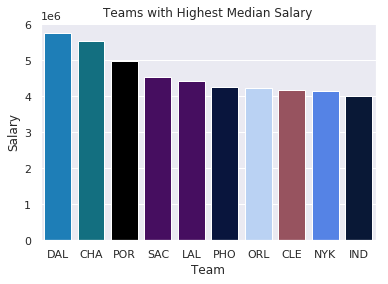<br />第二个图是回归实验残差的 Q-Q 图。这张图的主要目的是展示如何用尽量少的线条做出一张有用的图，当然也许它可能不那么美观。
```python
import matplotlib.pyplot as plt
import scipy.stats as stats

#model2 is a regression model
log_resid = model2.predict(X_test)-y_test
stats.probplot(log_resid, dist="norm", plot=plt)
plt.title("Normal Q-Q plot")
plt.show()
```
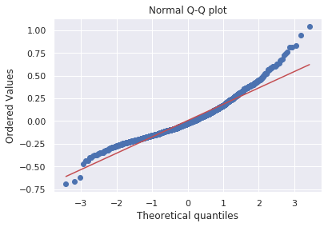<br />最终证明，Matplotlib 及其相关工具的效率很高，但就演示而言它们并不是最好的工具。
<a name="jdbQt"></a>
## ggplot(2)
它的一切都和 ggplot2 很像，但这个包的好处是它依赖于 Pandas Python 包。不过 Pandas Python 包最近弃用了一些方法，导致 Python 版本不兼容。<br />如果想在 R 中用真正的 ggplot（除了依赖关系外，它们的外观、感觉以及语法都是一样的）。<br />也就是说，如果一定要在 Python 中用 ggplot，那就必须要安装 0.19.2 版的 Pandas，但建议最好不要为了使用较低级的绘图包而降低 Pandas 的版本。<br />ggplot2（也包括 Python 的 ggplot）举足轻重的原因是它们用「图形语法」来构建图片。基本前提是可以实例化图，然后分别添加不同的特征；也就是说，可以分别对标题、坐标轴、数据点以及趋势线等进行美化。<br />下面是 ggplot 代码的简单示例。先用 ggplot 实例化图，设置美化属性和数据，然后添加点、主题以及坐标轴和标题标签。
```python
#All Salaries
ggplot(data=df, aes(x=season_start, y=salary, colour=team)) +
  geom_point() +
  theme(legend.position="none") +
  labs(title = 'Salary Over Time', x='Year', y='Salary ($)')
```
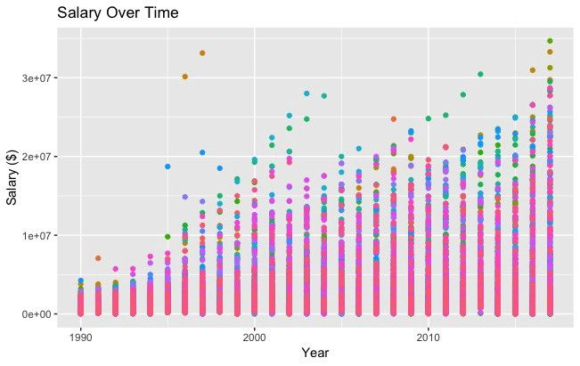
<a name="d4K5C"></a>
## Bokeh
Bokeh 很美。从概念上讲，Bokeh 类似于 ggplot，它们都是用图形语法来构建图片，但 Bokeh 具备可以做出专业图形和商业报表且便于使用的界面。为了说明这一点，根据 538 Masculinity Survey 数据集写了制作直方图的代码：
```python
import pandas as pd
from bokeh.plotting import figure
from bokeh.io import show

# is_masc is a one-hot encoded dataframe of responses to the question:
# "Do you identify as masculine?"

#Dataframe Prep
counts = is_masc.sum()
resps = is_masc.columns

#Bokeh
p2 = figure(title='Do You View Yourself As Masculine?',
          x_axis_label='Response',
          y_axis_label='Count',
          x_range=list(resps))
p2.vbar(x=resps, top=counts, width=0.6, fill_color='red', line_color='black')
show(p2)

#Pandas
counts.plot(kind='bar')
```
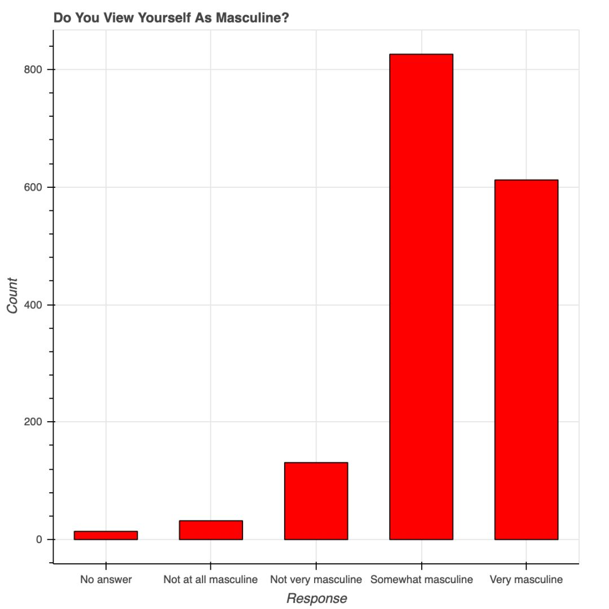<br />用 Bokeh 表示调查结果<br />红色的条形图表示 538 个人关于「你认为自己有男子汉气概吗？」这一问题的答案。9~14 行的 Bokeh 代码构建了优雅且专业的响应计数直方图——字体大小、y 轴刻度和格式等都很合理。<br />在制作美观且表现力强的图片时，更倾向于使用 Bokeh——它已经完成了大量美化工作。<br />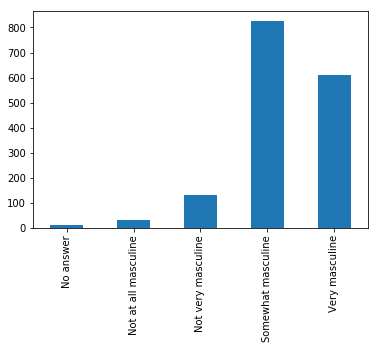<br />用 Pandas 表示相同的数据<br />蓝色的图是上面的第 17 行代码。这两个直方图的值是一样的，但目的不同。在探索性设置中，用 Pandas 写一行代码查看数据很方便，但 Bokeh 的美化功能非常强大。<br />Bokeh 提供的所有便利都要在 matplotlib 中自定义，包括 x 轴标签的角度、背景线、y 轴刻度以及字体（大小、斜体、粗体）等。下图展示了一些随机趋势，其自定义程度更高：使用了图例和不同的颜色和线条。<br />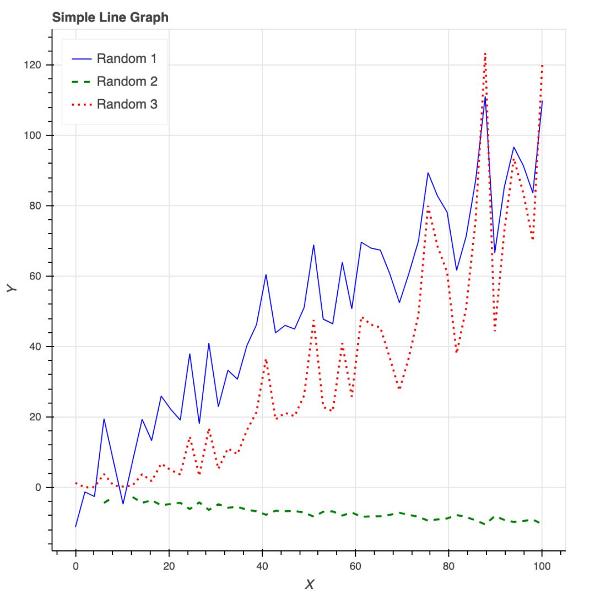<br />Bokeh 还是制作交互式商业报表的绝佳工具。
<a name="aiGNn"></a>
## Plotly
Plotly 非常强大，但用它设置和创建图形都要花费大量时间，而且都不直观。Ploty 入门时有一些要注意的点：

- 安装时要有 API 秘钥，还要注册，不是只用 pip 安装就可以；
- Plotly 所绘制的数据和布局对象是独一无二的，但并不直观；

但它也有优点，而且设置中的所有缺点都有相应的解决方法：

- 可以在 Plotly 网站和 Python 环境中编辑图片；
- 支持交互式图片和商业报表；
- Plotly 与 Mapbox 合作，可以自定义地图；
- 很有潜力绘制优秀图形。

以下是针对这个包编写的代码：
```python
#plot 1 - barplot
# **note** - the layout lines do nothing and trip no errors
data = [go.Bar(x=team_ave_df.team,
              y=team_ave_df.turnovers_per_mp)]

layout = go.Layout(

    title=go.layout.Title(
        text='Turnovers per Minute by Team',
        xref='paper',
        x=0
    ),

    xaxis=go.layout.XAxis(
        title = go.layout.xaxis.Title(
            text='Team',
            font=dict(
                    family='Courier New, monospace',
                    size=18,
                    color='#7f7f7f'
                )
        )
    ),

    yaxis=go.layout.YAxis(
        title = go.layout.yaxis.Title(
            text='Average Turnovers/Minute',
            font=dict(
                    family='Courier New, monospace',
                    size=18,
                    color='#7f7f7f'
                )
        )
    ),

    autosize=True,
    hovermode='closest')

py.iplot(figure_or_data=data, layout=layout, filename='jupyter-plot', sharing='public', fileopt='overwrite')


#plot 2 - attempt at a scatterplot
data = [go.Scatter(x=player_year.minutes_played,
                  y=player_year.salary,
                  marker=go.scatter.Marker(color='red',
                                          size=3))]

layout = go.Layout(title="test",
                xaxis=dict(title='why'),
                yaxis=dict(title='plotly'))

py.iplot(figure_or_data=data, layout=layout, filename='jupyter-plot2', sharing='public')

[Image: image.png]
```
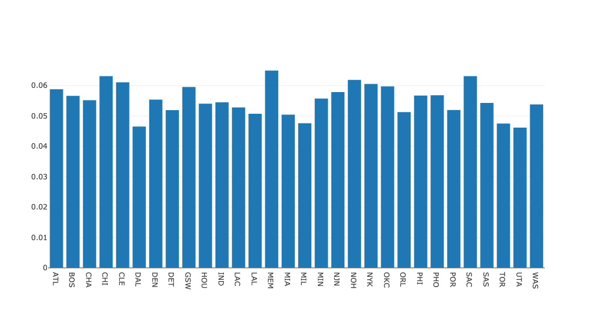<br />表示不同 NBA 球队每分钟平均失误数的条形图。<br />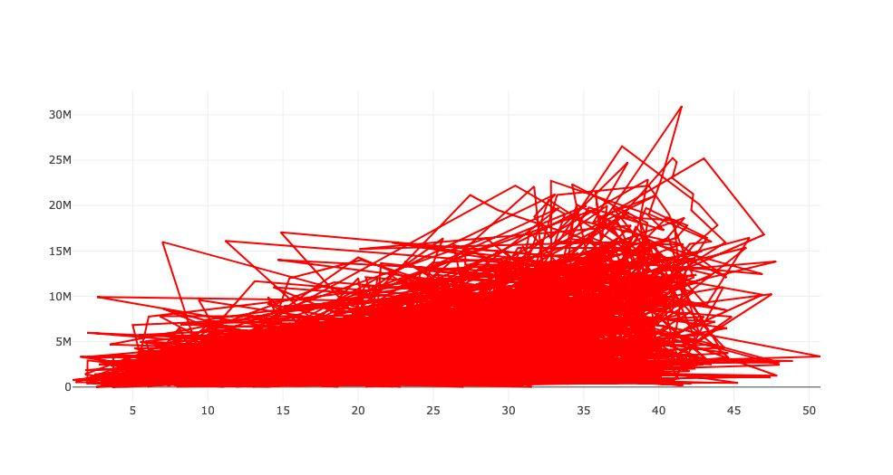<br />表示薪水和在 NBA 的打球时间之间关系的散点图<br />总体来说，开箱即用的美化工具看起来很好，多次尝试逐字复制文档和修改坐标轴标签时却失败了。但下面的图展示了 Plotly 的潜力：<br />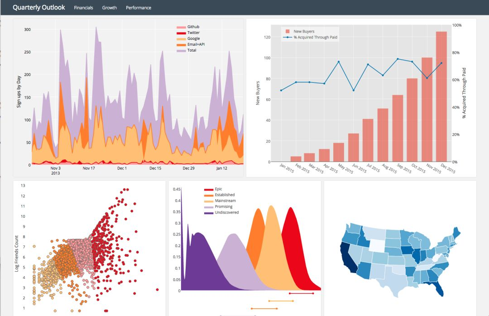<br />Plotly 页面上的一些示例图
<a name="QzR4I"></a>
## Pygal
Pygal 的名气就不那么大了，和其它常用的绘图包一样，它也是用图形框架语法来构建图像的。由于绘图目标比较简单，因此这是一个相对简单的绘图包。使用 Pygal 非常简单：

- 实例化图片；
- 用图片目标属性格式化；
- 用 `figure.add()` 将数据添加到图片中。

在使用 Pygal 的过程中遇到的主要问题在于图片渲染。必须要用 render_to_file 选项，然后在 web 浏览器中打开文件，才能看见刚刚构建的东西。<br />最终看来这是值得的，因为图片是交互式的，有令人满意而且便于自定义的美化功能。总而言之，这个包看起来不错，但在文件的创建和渲染部分比较麻烦。<br />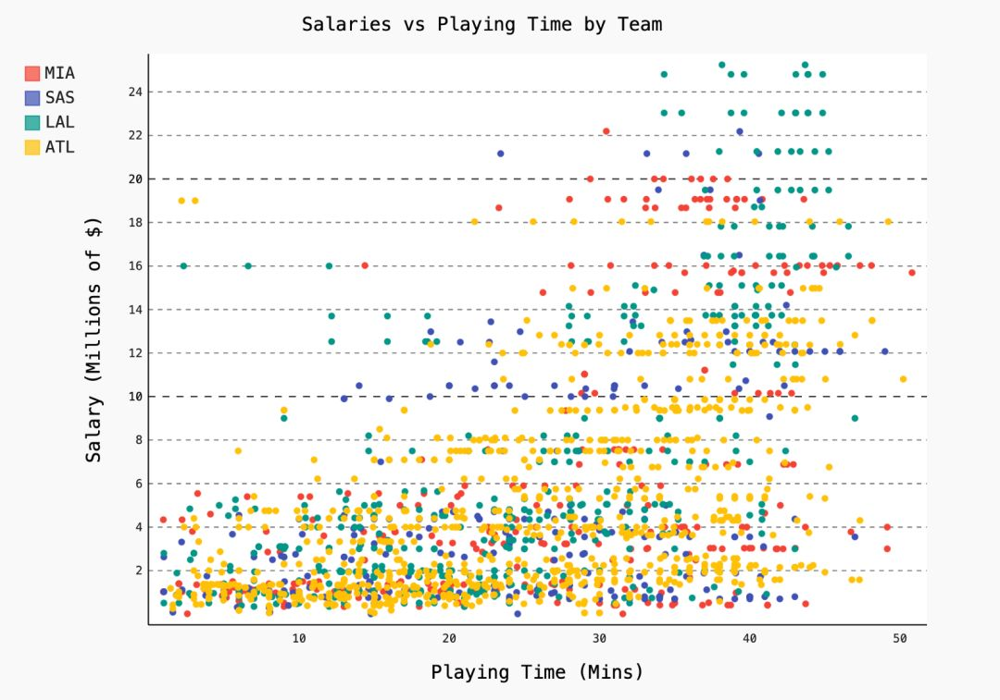
<a name="WbFEn"></a>
## Networkx
虽然 Networkx 是基于 matplotlib 的，但它仍是图形分析和可视化的绝佳解决方案。Networkx 可以快速简便地用图形表示网络之间的连接。以下是针对一个简单图形构建的不同的表示，以及一些从斯坦福 SNAP 下载的代码（关于绘制小型 Facebook 网络）。<br />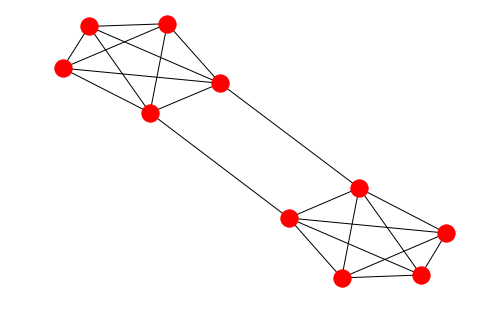<br />按编号（1~10）用颜色编码了每个节点，代码如下：
```python
options = {
    'node_color' : range(len(G)),
    'node_size' : 300,
    'width' : 1,
    'with_labels' : False,
    'cmap' : plt.cm.coolwarm
}
nx.draw(G, **options)
```
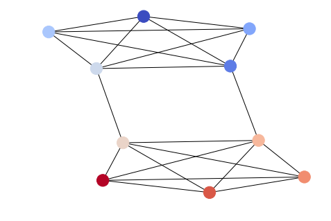<br />用于可视化上面提到的稀疏 Facebook 图形的代码如下：
```python
import itertools
import networkx as nx
import matplotlib.pyplot as plt

f = open('data/facebook/1684.circles', 'r')
circles = [line.split() for line in f]
f.close()

network = []
for circ in circles:
    cleaned = [int(val) for val in circ[1:]]
    network.append(cleaned)

G = nx.Graph()
for v in network:
    G.add_nodes_from(v)

edges = [itertools.combinations(net,2) for net in network]

for edge_group in edges:
    G.add_edges_from(edge_group)

options = {
    'node_color' : 'lime',
    'node_size' : 3,
    'width' : 1,
    'with_labels' : False,
}
nx.draw(G, **options)
```
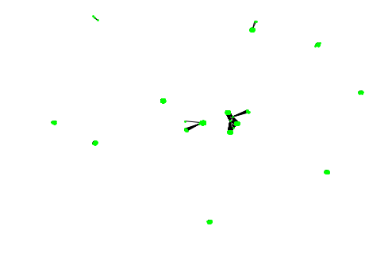<br />这个图形非常稀疏，Networkx 通过最大化每个集群的间隔展现了这种稀疏化。<br />有很多数据可视化的包，但没法说哪个是最好的。
