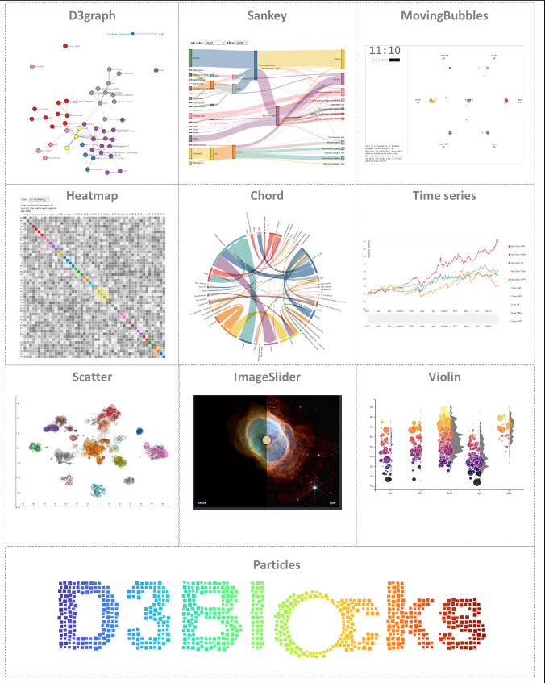
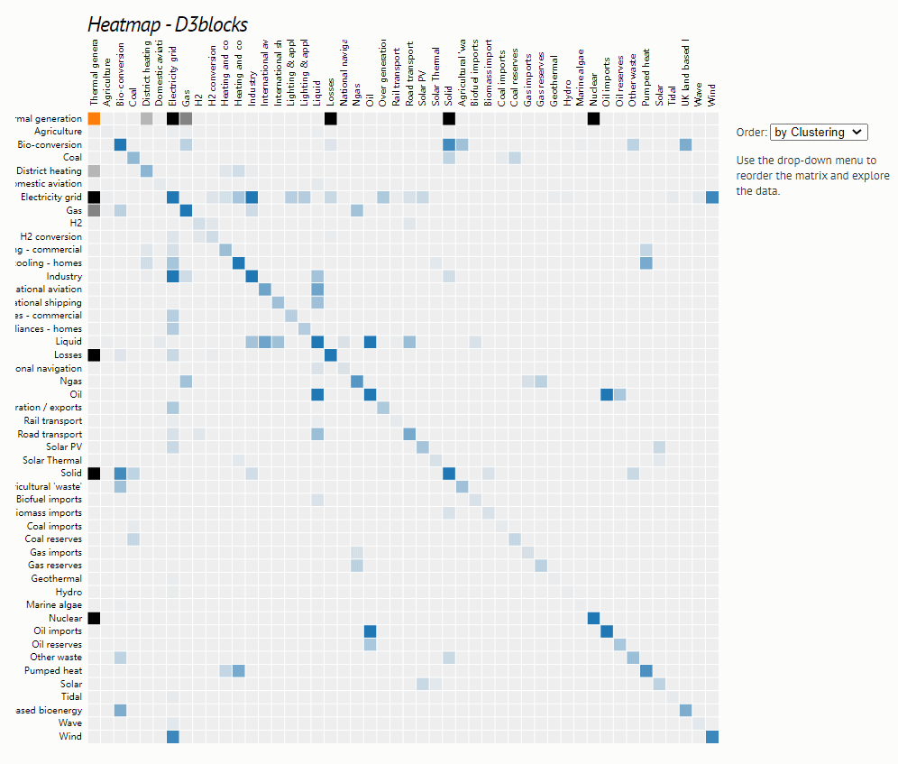
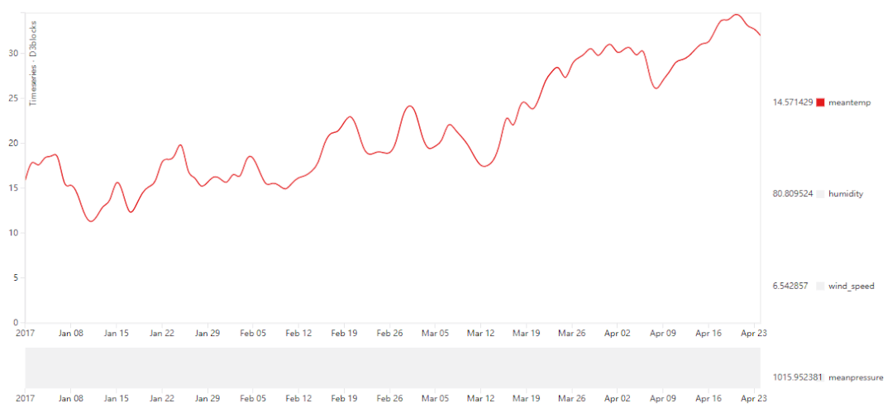
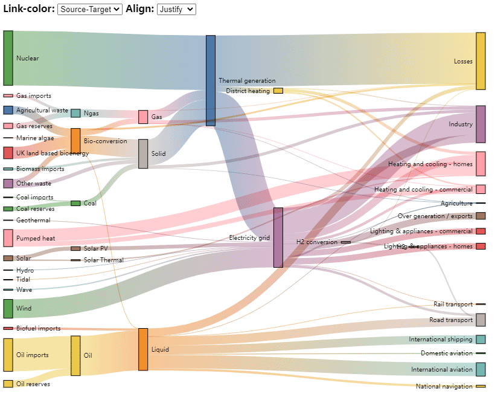
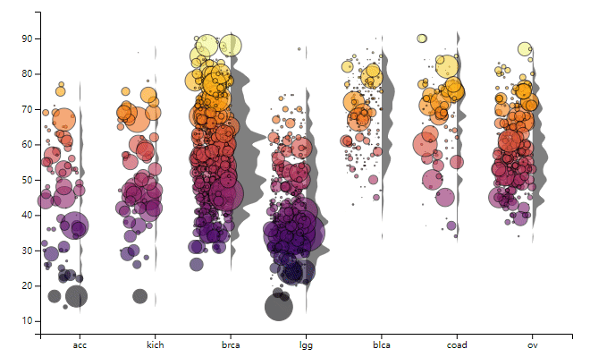
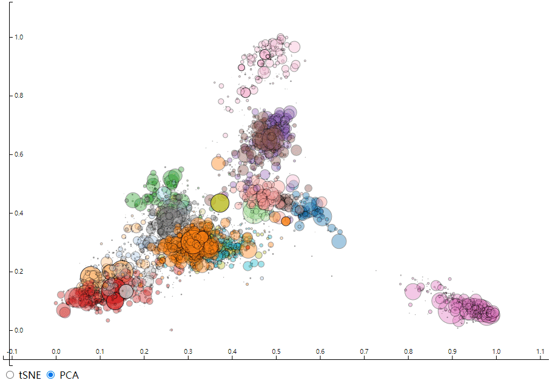
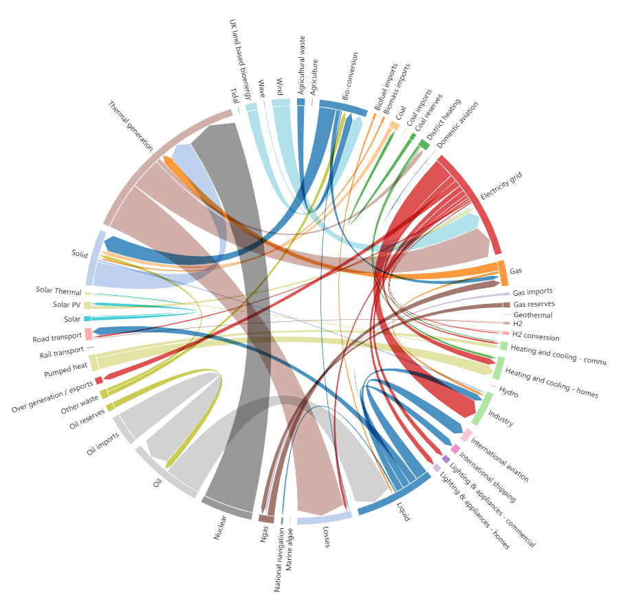
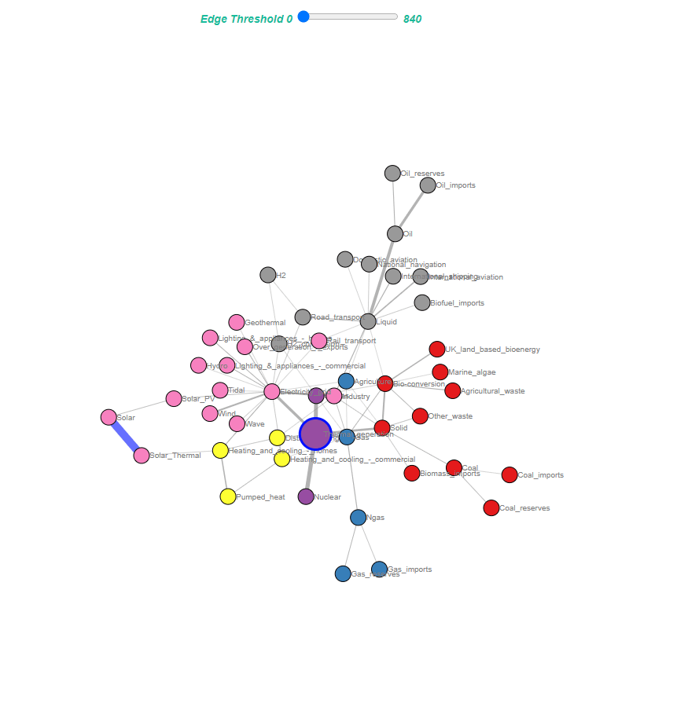

Python<br />D3Blocks，不仅可以用来绘制可动态交互的图表，并且导出的图表可以是HTML格式，方便在浏览器上面呈现。<br />
<a name="ahwHQ"></a>
## 热力图
热力图是一种通过对色块着色来显示数据的统计图表。绘图时需要指定颜色映射的规则。例如较大的值由较深的颜色表示，而较小的值由较浅的颜色表示等等。热力图适用于查看总体的情况，发现异常值、显示多个变量之间的差异，以及检测它们之间是否存在任何相关性。<br />这里来尝试绘制一张简单的热力图，代码如下
```python
from d3blocks import D3Blocks

# 初始化
d3 = D3Blocks()

# 导入数据集
df = d3.import_example('energy')

# 绘制热力图
d3.heatmap(df, showfig=True, stroke='red', vmax=10, figsize=(700,700))
```
output<br />
<a name="alcDj"></a>
## 粒子图
在D3Blocks模块当的`particles()`方法可以方便将任何字体转换成带有动态效果的粒子图，跟随着鼠标的移动，图表中的元素也会动态的起伏飞舞，代码如下
```python
# 导入模块
from d3blocks import D3Blocks

# 初始化
d3 = D3Blocks()

# 绘制粒子图
d3.particles('D3Blocks', collision=0.05, spacing=10, figsize=[1200, 500])
```
output<br />
<a name="Nx4et"></a>
## 时间序列图
时间序列的折线图，又被称为是趋势图，是以时间为横轴，观察变量为纵轴，用来反映时间与数量之间的关系，这里调用的是`timeseries()`方法，代码如下
```python
# 导入模块
from d3blocks import D3Blocks

# 初始化
d3 = D3Blocks()

# 导入数据集
df = d3.import_example('climate')

# 打印出前面5行
print(df.head())

# 绘制图表
d3.timeseries(df, datetime='date', dt_format='%Y-%m-%d %H:%M:%S', fontsize=10)
```
output<br />
<a name="qFZ1Q"></a>
## 桑基图
桑基图是用于描述一组值到另一组值的流向的图表。在图表的内部，不同的线条代表了不同的流量分流情况，线条的宽度代表此分值所代表的数据大小。通常用于能源、材料成分、金融等数据的可视化分析。这里调用的是`sankey()`方法来实现，代码如下
```python
from d3blocks import D3Blocks

# 初始化
d3 = D3Blocks()

# 导入数据集
df = d3.import_example('energy')

# 绘制图表
d3.sankey(df, link={"color": "source-target"})
```
output<br />
<a name="uakrD"></a>
## 小提琴图
小提琴图可以用来绘制数据的分布以及其概率密度，针对的是数值型的变量，这种图表结合了箱型图和密度图的特征，主要用来显示数据的分布形状。这里调用`violin()`方法来实现，代码如下
```python
# 导入模块
from d3blocks import D3Blocks

# 初始化
d3 = D3Blocks()

# 导入数据集
df = d3.import_example('cancer')

# 显示的格式
tooltip = df['labels'].values + ' <br /> Survival: ' + df['survival_months'].astype(str).values

# 可视化图表
d3.violin(x=df['labels'].values, # X轴上的值
          y=df['age'].values,    # 年龄
          tooltip=tooltip,       # 显示的格式
          bins=50,               # bins的大小
          size=df['survival_months'].values/10, # 点状的大小
          x_order=['acc', 'kich', 'brca', 'lgg', 'blca', 'coad', 'ov'], # X轴的上的值
          figsize=[None, None],                                    # 图表的大小
          filepath='violine_demo.html')
```
output<br />
<a name="Mj2VQ"></a>
## 散点图
散点图通常用于查看X轴与Y轴之间是否有关联，它的绘制，这里调用的是`scatter()`方法，代码如下
```python
# 导入模块
from d3blocks import D3Blocks

# 初始化
d3 = D3Blocks()

# 导入数据集
df = d3.import_example('cancer')

# 显示数据的格式
tooltip=df['labels'].values + ' <br /> Survival: ' + df['survival_months'].astype(str).str[0:4].values
# 散点的大小
size = df['survival_months'].fillna(1).values / 10

# 绘制图表
d3.scatter(df['x'].values,               
           df['y'].values,            
           x1=df['PC1'].values,         
           y1=df['PC2'].values,         
           scale=True,                  
           label_radio=['tSNE', 'PCA'], # 不同标签的种类
           size=size,                   
           color=df['labels'].values,   
           stroke='#000000',            
           opacity=0.4,                 # 透明度
           tooltip=tooltip,             # 显示的格式
           cmap='tab20',                # 颜色
           filepath='c://temp//scatter_demo.html')
```
output<br />
<a name="Amjkq"></a>
## 弦图
弦图是一种显示数据矩阵中内部数据之间相互关系的图形可视化方法。在弦图内，数据围绕一个圆呈放射状排列，数据点之间的关系通常绘制为连接数据的圆弧。这里调用`chord()`方法来实现，代码如下
```python
from d3blocks import D3Blocks

# 初始化
d3 = D3Blocks()

# 导入数据集
df = d3.import_example('energy')

# 绘制图表
d3.chord(df, filepath='chord_demo.html')
```
output<br />
<a name="R3RRt"></a>
## 网络图
除了上面这几种图表之外，D3Blocks模块还可以来绘制社交网络图，这里用到的是`d3graph()`方法，代码如下
```python
from d3blocks import D3Blocks

# 初始化
d3 = D3Blocks()

# 导入数据集
df = d3.import_example('energy')

# 打印出前5行数据
print(df)

# 初始化网络图
d3.d3graph(df, showfig=False)

# 每个节点打上颜色
d3.D3graph.set_node_properties(color='cluster')

# 调整每个节点的位置
d3.D3graph.node_properties['Thermal_generation']['size']=20
d3.D3graph.node_properties['Thermal_generation']['edge_color']='#000fff' # 蓝色的节点
d3.D3graph.node_properties['Thermal_generation']['edge_size']=3 # Node-edge Size

# 调整每个连线的位置
d3.D3graph.edge_properties['Solar', 'Solar_Thermal']['color']='#000fff'
d3.D3graph.edge_properties['Solar', 'Solar_Thermal']['weight_scaled']=10

# 绘制图表
d3.D3graph.show()
```
output<br />
