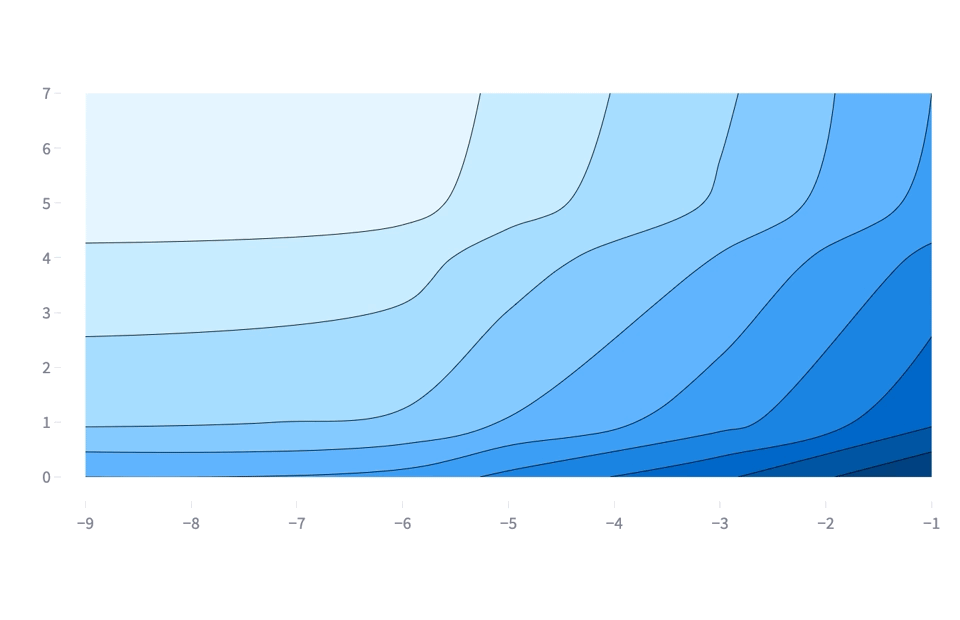
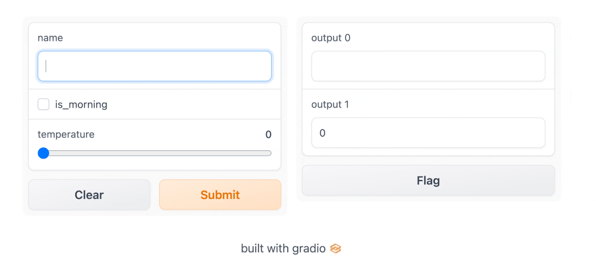
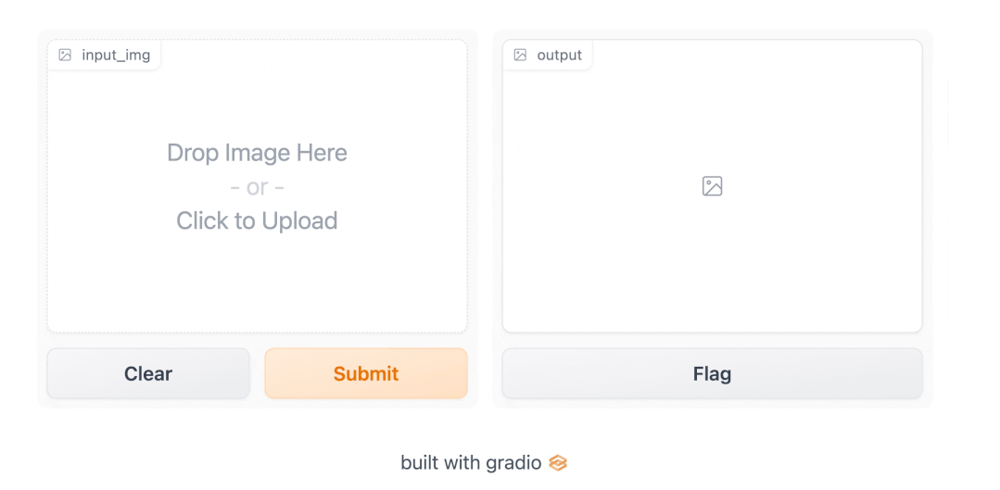
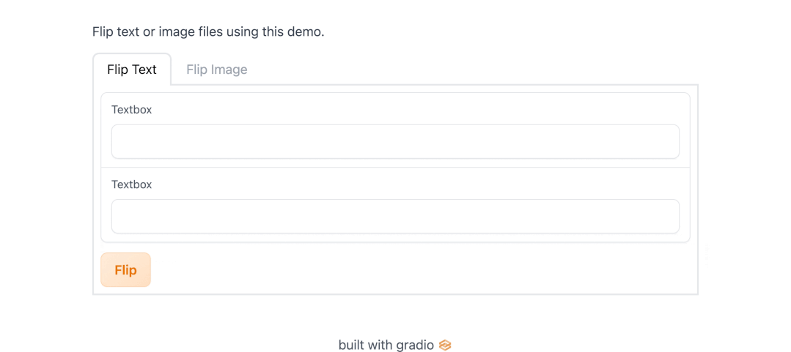
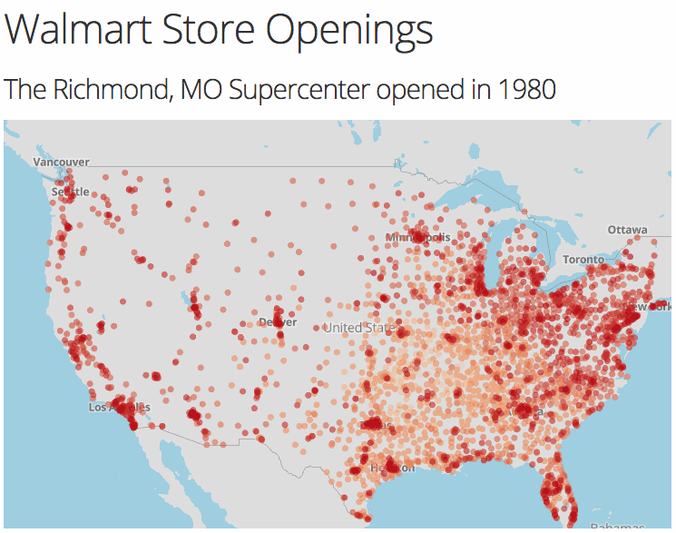
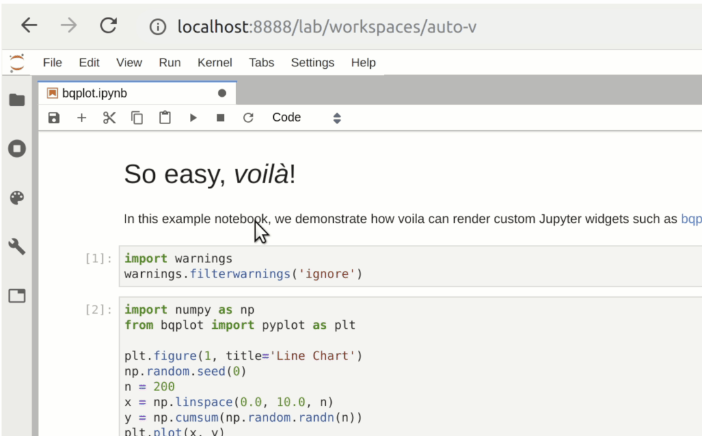
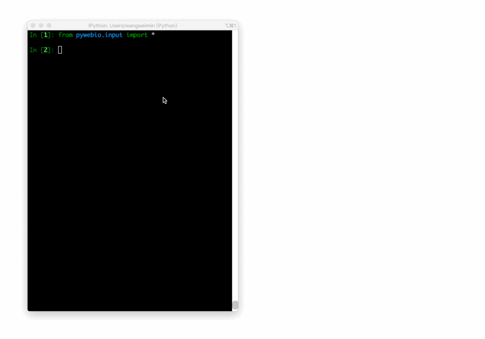

Python 分享几个实用的纯python构建可视化界面服务，比如日常写了脚本但是不希望给别人代码，可以利用这些包快速构建好看的界面作为服务提供他人使用。有关于库的最新更新时间和当前star数量。

## streamlit (23.3k)
Streamlit 可在数分钟而不是数周内将数据脚本转变为可共享的 Web 应用程序。这一切都是Python、开源和免费的！创建应用程序后，可以使用社区云平台来部署、管理和共享您的应用程序。 

## Gradio（13.9k）
Gradio 是一个开源 Python 库，用于构建机器学习和数据科学演示以及 Web 应用程序。使用 Gradio，您可以围绕您的机器学习模型或数据科学工作流程快速创建一个漂亮的用户界面，并让人们通过拖放自己的图像、粘贴文本、录制自己的声音以及与您的演示，全部通过浏览器。   

## Dash （18.3k）
Dash 是用于构建 ML 和数据科学 Web 应用程序的下载次数最多、最值得信赖的 Python 框架。Dash建立在Plotly.js、React和Flask之上，将下拉菜单、滑块和图形等现代 UI 元素直接与您的分析 Python 代码联系起来。 

## Voila（4.6k）
Voila是一个Jupyter Notebook的扩展，用于将Notebook转换为交互式Web应用程序。它提供了一个简单易用的界面，使您可以快速构建数据可视化和机器学习应用程序。 

## PyWebIO（3.7k）
PyWebIO是一个用于构建Web应用程序的Python库。它提供了一个简单易用的API，使您可以在浏览器中构建交互式数据可视化和机器学习应用程序。 
